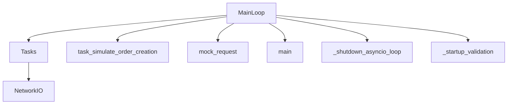

# 1. Executive Summary
- **Total Async Functions Found**: 238 (excluding 398 async test functions)
- **Top Risks**: Potential unawaited coroutines, missing timeouts on I/O, swallowing `CancelledError`, missing task group management.
- **Conclusion**: Умовно безпечна, але потребує впровадження жорсткіших політик для таймаутів і cancellation (Fail-Closed).

# 2. Repo Async Inventory
| ID | File:Lines | Signature | Role | IO | Timeouts | Cancel | Score |
|---|---|---|---|---|---|---|---|
| `audit_simulation.py::task_simulate_order_creation::36` | `audit_simulation.py:36` | `async def task_simulate_order_creation` | Logic | Sleep | ❌ | OK | 5/5 |
| `audit_simulation.py::mock_request::79` | `audit_simulation.py:79` | `async def mock_request` | Logic | HTTP | ❌ | OK | 2/5 |
| `audit_simulation.py::main::189` | `audit_simulation.py:189` | `async def main` | Logic | CPU/Mem | ❌ | OK | 5/5 |
| `apps/reference/main.py::_shutdown_asyncio_loop::890` | `apps/reference/main.py:890` | `async def _shutdown_asyncio_loop` | Logic | CPU/Mem | ❌ | OK | 5/5 |
| `apps/reference/main.py::_startup_validation::961` | `apps/reference/main.py:961` | `async def _startup_validation` | Logic | CPU/Mem | ❌ | ⚠️ Swallowed | 3/5 |
| `apps/reference/adapters/binance_adapter.py::_coerce_json::38` | `apps/reference/adapters/binance_adapter.py:38` | `async def _coerce_json` | Logic | CPU/Mem | ❌ | OK | 5/5 |
| `apps/reference/adapters/binance_adapter.py::__aenter__::195` | `apps/reference/adapters/binance_adapter.py:195` | `async def __aenter__` | Logic | CPU/Mem | ❌ | OK | 4/5 |
| `apps/reference/adapters/binance_adapter.py::__aexit__::198` | `apps/reference/adapters/binance_adapter.py:198` | `async def __aexit__` | Logic | CPU/Mem | ❌ | OK | 5/5 |
| `apps/reference/adapters/binance_adapter.py::aclose::201` | `apps/reference/adapters/binance_adapter.py:201` | `async def aclose` | Logic | CPU/Mem | ❌ | ⚠️ Swallowed | 3/5 |
| `apps/reference/adapters/binance_adapter.py::start::207` | `apps/reference/adapters/binance_adapter.py:207` | `async def start` | Logic | CPU/Mem | ❌ | OK | 4/5 |
| `apps/reference/adapters/binance_adapter.py::stop::217` | `apps/reference/adapters/binance_adapter.py:217` | `async def stop` | Logic | CPU/Mem | ❌ | OK | 4/5 |
| `apps/reference/adapters/binance_adapter.py::register_clientorderid::236` | `apps/reference/adapters/binance_adapter.py:236` | `async def register_clientorderid` | Logic | CPU/Mem | ❌ | OK | 4/5 |
| `apps/reference/adapters/binance_adapter.py::_check_clientorderid_reuse_unsafe::248` | `apps/reference/adapters/binance_adapter.py:248` | `async def _check_clientorderid_reuse_unsafe` | Logic | CPU/Mem | ❌ | OK | 4/5 |
| `apps/reference/adapters/binance_adapter.py::check_clientorderid_reuse::270` | `apps/reference/adapters/binance_adapter.py:270` | `async def check_clientorderid_reuse` | Logic | CPU/Mem | ❌ | OK | 5/5 |
| `apps/reference/adapters/binance_adapter.py::_find_symbol_by_order_id::284` | `apps/reference/adapters/binance_adapter.py:284` | `async def _find_symbol_by_order_id` | Logic | HTTP | ❌ | ⚠️ Swallowed | 1/5 |
| `apps/reference/adapters/binance_adapter.py::_server_time::340` | `apps/reference/adapters/binance_adapter.py:340` | `async def _server_time` | Logic | HTTP | ❌ | OK | 3/5 |
| `apps/reference/adapters/binance_adapter.py::_sync_time::348` | `apps/reference/adapters/binance_adapter.py:348` | `async def _sync_time` | Logic | HTTP | ❌ | OK | 3/5 |
| `apps/reference/adapters/binance_adapter.py::_request::390` | `apps/reference/adapters/binance_adapter.py:390` | `async def _request` | Logic | HTTP, Sleep | ❌ | ⚠️ Swallowed | 1/5 |
| `apps/reference/adapters/binance_adapter.py::_do::399` | `apps/reference/adapters/binance_adapter.py:399` | `async def _do` | Logic | HTTP | ❌ | OK | 3/5 |
| `apps/reference/adapters/binance_adapter.py::_post_order_with_algo_fallback::472` | `apps/reference/adapters/binance_adapter.py:472` | `async def _post_order_with_algo_fallback` | Logic | HTTP | ❌ | OK | 3/5 |
| `apps/reference/adapters/binance_adapter.py::create_order::508` | `apps/reference/adapters/binance_adapter.py:508` | `async def create_order` | Logic | HTTP | ❌ | OK | 3/5 |
| `apps/reference/adapters/binance_adapter.py::cancel_order::550` | `apps/reference/adapters/binance_adapter.py:550` | `async def cancel_order` | Logic | HTTP | ❌ | OK | 3/5 |
| `apps/reference/adapters/binance_adapter.py::get_open_orders::594` | `apps/reference/adapters/binance_adapter.py:594` | `async def get_open_orders` | Logic | HTTP | ❌ | OK | 3/5 |
| `apps/reference/adapters/binance_adapter.py::get_open_positions::620` | `apps/reference/adapters/binance_adapter.py:620` | `async def get_open_positions` | Logic | HTTP, Sleep | ❌ | ⚠️ Swallowed | 1/5 |
| `apps/reference/adapters/binance_adapter.py::get_positions_notional_usd_shadow::759` | `apps/reference/adapters/binance_adapter.py:759` | `async def get_positions_notional_usd_shadow` | Logic | CPU/Mem | ❌ | OK | 5/5 |
| `apps/reference/adapters/binance_adapter.py::get_mark_price::776` | `apps/reference/adapters/binance_adapter.py:776` | `async def get_mark_price` | Logic | CPU/Mem | ❌ | ⚠️ Swallowed | 3/5 |
| `apps/reference/adapters/binance_adapter.py::get_last_price::801` | `apps/reference/adapters/binance_adapter.py:801` | `async def get_last_price` | Logic | CPU/Mem | ❌ | OK | 5/5 |
| `apps/reference/adapters/binance_adapter.py::get_account_balance::811` | `apps/reference/adapters/binance_adapter.py:811` | `async def get_account_balance` | Logic | CPU/Mem | ❌ | OK | 5/5 |
| `apps/reference/adapters/binance_adapter.py::get_order::819` | `apps/reference/adapters/binance_adapter.py:819` | `async def get_order` | Logic | CPU/Mem | ❌ | OK | 5/5 |
| `apps/reference/adapters/binance_adapter.py::get_exchange_info::834` | `apps/reference/adapters/binance_adapter.py:834` | `async def get_exchange_info` | Logic | CPU/Mem | ❌ | OK | 5/5 |
| `apps/reference/adapters/binance_adapter.py::quantize_quantity::847` | `apps/reference/adapters/binance_adapter.py:847` | `async def quantize_quantity` | Logic | HTTP | ❌ | OK | 3/5 |
| `apps/reference/adapters/binance_adapter.py::get_klines::916` | `apps/reference/adapters/binance_adapter.py:916` | `async def get_klines` | Logic | CPU/Mem | ❌ | OK | 5/5 |
| `apps/reference/adapters/binance_adapter.py::get_book_ticker::932` | `apps/reference/adapters/binance_adapter.py:932` | `async def get_book_ticker` | Logic | CPU/Mem | ❌ | OK | 5/5 |
| `apps/reference/adapters/binance_adapter.py::get_recent_trades::946` | `apps/reference/adapters/binance_adapter.py:946` | `async def get_recent_trades` | Logic | CPU/Mem | ❌ | OK | 5/5 |
| `apps/reference/adapters/binance_adapter.py::get_mark_price_data::961` | `apps/reference/adapters/binance_adapter.py:961` | `async def get_mark_price_data` | Logic | CPU/Mem | ❌ | OK | 5/5 |
| `apps/reference/adapters/binance_adapter.py::get_current_leverage::1011` | `apps/reference/adapters/binance_adapter.py:1011` | `async def get_current_leverage` | Logic | CPU/Mem | ❌ | OK | 5/5 |
| `apps/reference/adapters/binance_adapter.py::set_leverage::1067` | `apps/reference/adapters/binance_adapter.py:1067` | `async def set_leverage` | Logic | HTTP | ❌ | OK | 3/5 |
| `apps/reference/adapters/binance_adapter.py::get_margin_mode::1179` | `apps/reference/adapters/binance_adapter.py:1179` | `async def get_margin_mode` | Logic | CPU/Mem | ❌ | OK | 5/5 |
| `apps/reference/adapters/binance_adapter.py::set_margin_mode::1243` | `apps/reference/adapters/binance_adapter.py:1243` | `async def set_margin_mode` | Logic | CPU/Mem | ❌ | OK | 5/5 |
| `apps/reference/adapters/binance_adapter.py::create_stop_market_order::1319` | `apps/reference/adapters/binance_adapter.py:1319` | `async def create_stop_market_order` | Logic | CPU/Mem | ❌ | OK | 5/5 |
| `apps/reference/adapters/binance_adapter.py::place_market_entry::1331` | `apps/reference/adapters/binance_adapter.py:1331` | `async def place_market_entry` | Logic | CPU/Mem | ❌ | OK | 5/5 |
| `apps/reference/adapters/binance_adapter.py::place_limit_entry::1360` | `apps/reference/adapters/binance_adapter.py:1360` | `async def place_limit_entry` | Logic | CPU/Mem | ❌ | OK | 5/5 |
| `apps/reference/adapters/binance_adapter.py::place_stop_market_close_position::1400` | `apps/reference/adapters/binance_adapter.py:1400` | `async def place_stop_market_close_position` | Logic | CPU/Mem | ❌ | ⚠️ Swallowed | 3/5 |
| `apps/reference/adapters/binance_adapter.py::place_take_profit_market_close_position::1467` | `apps/reference/adapters/binance_adapter.py:1467` | `async def place_take_profit_market_close_position` | Logic | CPU/Mem | ❌ | ⚠️ Swallowed | 3/5 |
| `apps/reference/adapters/binance_adapter.py::place_limit_reduce_only::1534` | `apps/reference/adapters/binance_adapter.py:1534` | `async def place_limit_reduce_only` | Logic | CPU/Mem | ❌ | ⚠️ Swallowed | 3/5 |
| `apps/reference/adapters/binance_adapter.py::place_market_reduce_only::1605` | `apps/reference/adapters/binance_adapter.py:1605` | `async def place_market_reduce_only` | Logic | CPU/Mem | ❌ | ⚠️ Swallowed | 3/5 |
| `apps/reference/adapters/binance_adapter.py::_safe_read_err::1725` | `apps/reference/adapters/binance_adapter.py:1725` | `async def _safe_read_err` | Logic | CPU/Mem | ❌ | ⚠️ Swallowed | 3/5 |
| `apps/reference/adapters/binance_ws_client.py::ws_handler::158` | `apps/reference/adapters/binance_ws_client.py:158` | `async def ws_handler` | Logic | CPU/Mem | ✅ | ⚠️ Swallowed | 3/5 |
| `apps/reference/adapters/execution_adapter.py::place_order::17` | `apps/reference/adapters/execution_adapter.py:17` | `async def place_order` | Logic | CPU/Mem | ❌ | OK | 4/5 |
| `apps/reference/adapters/execution_adapter.py::cancel_order::22` | `apps/reference/adapters/execution_adapter.py:22` | `async def cancel_order` | Logic | CPU/Mem | ❌ | OK | 4/5 |
| `apps/reference/adapters/execution_adapter.py::get_open_positions::32` | `apps/reference/adapters/execution_adapter.py:32` | `async def get_open_positions` | Logic | CPU/Mem | ❌ | OK | 4/5 |
| `apps/reference/adapters/execution_adapter.py::get_open_orders::37` | `apps/reference/adapters/execution_adapter.py:37` | `async def get_open_orders` | Logic | CPU/Mem | ❌ | OK | 4/5 |
| `apps/reference/adapters/simulated_adapter.py::create_order::38` | `apps/reference/adapters/simulated_adapter.py:38` | `async def create_order` | Logic | Sleep | ❌ | OK | 5/5 |
| `apps/reference/adapters/simulated_adapter.py::cancel_order::83` | `apps/reference/adapters/simulated_adapter.py:83` | `async def cancel_order` | Logic | CPU/Mem | ❌ | OK | 4/5 |
| `apps/reference/adapters/simulated_adapter.py::get_open_orders::106` | `apps/reference/adapters/simulated_adapter.py:106` | `async def get_open_orders` | Logic | CPU/Mem | ❌ | OK | 4/5 |
| `apps/reference/adapters/simulated_adapter.py::get_open_positions::112` | `apps/reference/adapters/simulated_adapter.py:112` | `async def get_open_positions` | Logic | CPU/Mem | ❌ | OK | 4/5 |
| `apps/reference/adapters/simulated_adapter.py::get_mark_price::118` | `apps/reference/adapters/simulated_adapter.py:118` | `async def get_mark_price` | Logic | CPU/Mem | ❌ | OK | 4/5 |
| `apps/reference/adapters/simulated_adapter.py::get_last_price::124` | `apps/reference/adapters/simulated_adapter.py:124` | `async def get_last_price` | Logic | CPU/Mem | ❌ | OK | 4/5 |
| `apps/reference/adapters/simulated_adapter.py::get_account_balance::130` | `apps/reference/adapters/simulated_adapter.py:130` | `async def get_account_balance` | Logic | CPU/Mem | ❌ | OK | 4/5 |
| `apps/reference/adapters/simulated_adapter.py::get_exchange_info::142` | `apps/reference/adapters/simulated_adapter.py:142` | `async def get_exchange_info` | Logic | CPU/Mem | ❌ | OK | 4/5 |
| `apps/reference/adapters/simulated_adapter.py::quantize_quantity::152` | `apps/reference/adapters/simulated_adapter.py:152` | `async def quantize_quantity` | Logic | CPU/Mem | ❌ | OK | 4/5 |
| `apps/reference/adapters/simulated_adapter.py::aclose::158` | `apps/reference/adapters/simulated_adapter.py:158` | `async def aclose` | Logic | CPU/Mem | ❌ | OK | 4/5 |
| `apps/reference/api/main.py::websocket_endpoint::35` | `apps/reference/api/main.py:35` | `async def websocket_endpoint` | Logic | HTTP, Sleep | ❌ | ⚠️ Swallowed | 1/5 |
| `apps/reference/api/main.py::health_check::130` | `apps/reference/api/main.py:130` | `async def health_check` | Logic | HTTP | ❌ | OK | 2/5 |
| `apps/reference/core/time/clock.py::sleep_ms::63` | `apps/reference/core/time/clock.py:63` | `async def sleep_ms` | Logic | CPU/Mem | ❌ | OK | 4/5 |
| `apps/reference/core/time/clock.py::sleep_sec::75` | `apps/reference/core/time/clock.py:75` | `async def sleep_sec` | Logic | CPU/Mem | ❌ | OK | 4/5 |
| `apps/reference/core/time/clock.py::sleep_ms::102` | `apps/reference/core/time/clock.py:102` | `async def sleep_ms` | Logic | Sleep | ❌ | OK | 5/5 |
| `apps/reference/core/time/clock.py::sleep_sec::107` | `apps/reference/core/time/clock.py:107` | `async def sleep_sec` | Logic | Sleep | ❌ | OK | 5/5 |
| `apps/reference/core/time/clock.py::sleep_ms::183` | `apps/reference/core/time/clock.py:183` | `async def sleep_ms` | Logic | CPU/Mem | ❌ | OK | 4/5 |
| `apps/reference/core/time/clock.py::sleep_sec::192` | `apps/reference/core/time/clock.py:192` | `async def sleep_sec` | Logic | CPU/Mem | ❌ | OK | 4/5 |
| `apps/reference/domains/account_balance/account_connector.py::_fetch_and_emit_account_data::117` | `apps/reference/domains/account_balance/account_connector.py:117` | `async def _fetch_and_emit_account_data` | Logic | HTTP | ❌ | ⚠️ Swallowed | 1/5 |
| `apps/reference/domains/exchange_filters/validator.py::get_exchange_info::58` | `apps/reference/domains/exchange_filters/validator.py:58` | `async def get_exchange_info` | Logic | CPU/Mem | ❌ | OK | 4/5 |
| `apps/reference/domains/exchange_filters/validator.py::validate_all::96` | `apps/reference/domains/exchange_filters/validator.py:96` | `async def validate_all` | Logic | HTTP | ❌ | ⚠️ Swallowed | 1/5 |
| `apps/reference/domains/exchange_filters/validator.py::fetch_exchange_filters::216` | `apps/reference/domains/exchange_filters/validator.py:216` | `async def fetch_exchange_filters` | Logic | HTTP | ❌ | OK | 3/5 |
| `apps/reference/domains/exchange_filters/validator.py::validate_symbol::287` | `apps/reference/domains/exchange_filters/validator.py:287` | `async def validate_symbol` | Logic | CPU/Mem | ❌ | OK | 5/5 |
| `apps/reference/domains/exchange_filters/validator.py::validate_all::325` | `apps/reference/domains/exchange_filters/validator.py:325` | `async def validate_all` | Logic | CPU/Mem | ❌ | ⚠️ Swallowed | 3/5 |
| `apps/reference/domains/exchange_filters/validator.py::validate_instruments_on_startup::386` | `apps/reference/domains/exchange_filters/validator.py:386` | `async def validate_instruments_on_startup` | Logic | HTTP | ❌ | OK | 3/5 |
| `apps/reference/domains/execution_position/bracket_manager.py::place_brackets_parallel::34` | `apps/reference/domains/execution_position/bracket_manager.py:34` | `async def place_brackets_parallel` | Logic | CPU/Mem | ❌ | ⚠️ Swallowed | 3/5 |
| `apps/reference/domains/execution_position/bracket_manager.py::place_sl_async::69` | `apps/reference/domains/execution_position/bracket_manager.py:69` | `async def place_sl_async` | Logic | CPU/Mem | ❌ | OK | 5/5 |
| `apps/reference/domains/execution_position/bracket_manager.py::place_tp_async::73` | `apps/reference/domains/execution_position/bracket_manager.py:73` | `async def place_tp_async` | Logic | CPU/Mem | ❌ | OK | 5/5 |
| `apps/reference/domains/execution_position/bracket_manager.py::place_deferred_brackets::195` | `apps/reference/domains/execution_position/bracket_manager.py:195` | `async def place_deferred_brackets` | Logic | HTTP | ❌ | ⚠️ Swallowed | 1/5 |
| `apps/reference/domains/execution_position/bracket_manager.py::preflight_position_check::292` | `apps/reference/domains/execution_position/bracket_manager.py:292` | `async def preflight_position_check` | Logic | HTTP | ❌ | ⚠️ Swallowed | 1/5 |
| `apps/reference/domains/execution_position/close_executor.py::execute_cancel_order::30` | `apps/reference/domains/execution_position/close_executor.py:30` | `async def execute_cancel_order` | Logic | HTTP | ❌ | OK | 3/5 |
| `apps/reference/domains/execution_position/close_executor.py::execute_close::41` | `apps/reference/domains/execution_position/close_executor.py:41` | `async def execute_close` | Logic | HTTP, FS | ❌ | ⚠️ Swallowed | 1/5 |
| `apps/reference/domains/execution_position/close_executor.py::execute_place_order::199` | `apps/reference/domains/execution_position/close_executor.py:199` | `async def execute_place_order` | Logic | HTTP | ❌ | ⚠️ Swallowed | 1/5 |
| `apps/reference/domains/execution_position/entry_manager.py::_do_cancel::75` | `apps/reference/domains/execution_position/entry_manager.py:75` | `async def _do_cancel` | Logic | FS | ❌ | ⚠️ Swallowed | 3/5 |
| `apps/reference/domains/execution_position/entry_manager.py::handle_order_timeout::188` | `apps/reference/domains/execution_position/entry_manager.py:188` | `async def handle_order_timeout` | Logic | FS | ❌ | ⚠️ Swallowed | 3/5 |
| `apps/reference/domains/execution_position/event_handlers.py::_do_emit_exposure::110` | `apps/reference/domains/execution_position/event_handlers.py:110` | `async def _do_emit_exposure` | Logic | CPU/Mem | ❌ | ⚠️ Swallowed | 3/5 |
| `apps/reference/domains/execution_position/event_handlers.py::delayed_cleanup::389` | `apps/reference/domains/execution_position/event_handlers.py:389` | `async def delayed_cleanup` | Logic | CPU/Mem | ❌ | OK | 5/5 |
| `apps/reference/domains/execution_position/exposure_manager.py::check_shadow_notional::188` | `apps/reference/domains/execution_position/exposure_manager.py:188` | `async def check_shadow_notional` | Logic | CPU/Mem | ❌ | ⚠️ Swallowed | 3/5 |
| `apps/reference/domains/execution_position/exposure_manager.py::emit_exposure_update_async::445` | `apps/reference/domains/execution_position/exposure_manager.py:445` | `async def emit_exposure_update_async` | Logic | CPU/Mem | ❌ | ⚠️ Swallowed | 3/5 |
| `apps/reference/domains/execution_position/fsm.py::emit_trade_executed::471` | `apps/reference/domains/execution_position/fsm.py:471` | `async def emit_trade_executed` | Logic | HTTP | ❌ | ⚠️ Swallowed | 1/5 |
| `apps/reference/domains/execution_position/fsm.py::run_leverage_bootstrap::576` | `apps/reference/domains/execution_position/fsm.py:576` | `async def run_leverage_bootstrap` | Logic | CPU/Mem | ❌ | OK | 5/5 |
| `apps/reference/domains/execution_position/fsm.py::_cancel_order::786` | `apps/reference/domains/execution_position/fsm.py:786` | `async def _cancel_order` | Logic | CPU/Mem | ❌ | ⚠️ Swallowed | 3/5 |
| `apps/reference/domains/execution_position/fsm.py::start_order_guardian::872` | `apps/reference/domains/execution_position/fsm.py:872` | `async def start_order_guardian` | Logic | CPU/Mem | ❌ | ⚠️ Swallowed | 2/5 |
| `apps/reference/domains/execution_position/fsm.py::_execute_decision::1160` | `apps/reference/domains/execution_position/fsm.py:1160` | `async def _execute_decision` | Logic | HTTP, FS | ❌ | ⚠️ Swallowed | 1/5 |
| `apps/reference/domains/execution_position/fsm.py::_handle_order_timeout::1338` | `apps/reference/domains/execution_position/fsm.py:1338` | `async def _handle_order_timeout` | Logic | CPU/Mem | ❌ | OK | 5/5 |
| `apps/reference/domains/execution_position/fsm.py::_emit_error_async::1361` | `apps/reference/domains/execution_position/fsm.py:1361` | `async def _emit_error_async` | Logic | CPU/Mem | ❌ | ⚠️ Swallowed | 3/5 |
| `apps/reference/domains/execution_position/fsm.py::_emit_exposure_update_async::1377` | `apps/reference/domains/execution_position/fsm.py:1377` | `async def _emit_exposure_update_async` | Logic | CPU/Mem | ❌ | OK | 5/5 |
| `apps/reference/domains/execution_position/fsm.py::_check_shadow_notional::1381` | `apps/reference/domains/execution_position/fsm.py:1381` | `async def _check_shadow_notional` | Logic | CPU/Mem | ❌ | OK | 5/5 |
| `apps/reference/domains/execution_position/fsm.py::_preflight_position_check::1403` | `apps/reference/domains/execution_position/fsm.py:1403` | `async def _preflight_position_check` | Logic | CPU/Mem | ❌ | OK | 5/5 |
| `apps/reference/domains/execution_position/fsm.py::_place_deferred_brackets::1407` | `apps/reference/domains/execution_position/fsm.py:1407` | `async def _place_deferred_brackets` | Logic | CPU/Mem | ❌ | OK | 5/5 |
| `apps/reference/domains/execution_position/fsm.py::_cleanup_loop::1413` | `apps/reference/domains/execution_position/fsm.py:1413` | `async def _cleanup_loop` | Logic | CPU/Mem | ❌ | Handled | 5/5 |
| `apps/reference/domains/execution_position/fsm.py::_startup_order_guardian_reconcile::1429` | `apps/reference/domains/execution_position/fsm.py:1429` | `async def _startup_order_guardian_reconcile` | Logic | HTTP | ❌ | ⚠️ Swallowed | 1/5 |
| `apps/reference/domains/execution_position/fsm.py::handle_tick_async::1490` | `apps/reference/domains/execution_position/fsm.py:1490` | `async def handle_tick_async` | Logic | CPU/Mem | ❌ | OK | 4/5 |
| `apps/reference/domains/execution_position/fsm_open.py::handle_async::526` | `apps/reference/domains/execution_position/fsm_open.py:526` | `async def handle_async` | Logic | HTTP | ❌ | OK | 3/5 |
| `apps/reference/domains/execution_position/idempotent_cancel.py::get_order_before_cancel::120` | `apps/reference/domains/execution_position/idempotent_cancel.py:120` | `async def get_order_before_cancel` | Logic | CPU/Mem | ❌ | ⚠️ Swallowed | 3/5 |
| `apps/reference/domains/execution_position/idempotent_cancel.py::cancel_order_idempotent::181` | `apps/reference/domains/execution_position/idempotent_cancel.py:181` | `async def cancel_order_idempotent` | Logic | HTTP | ❌ | ⚠️ Swallowed | 1/5 |
| `apps/reference/domains/execution_position/idempotent_cancel.py::_backoff_wait::329` | `apps/reference/domains/execution_position/idempotent_cancel.py:329` | `async def _backoff_wait` | Logic | CPU/Mem | ❌ | OK | 5/5 |
| `apps/reference/domains/execution_position/leverage_config.py::run_bootstrap::37` | `apps/reference/domains/execution_position/leverage_config.py:37` | `async def run_bootstrap` | Logic | HTTP | ❌ | OK | 3/5 |
| `apps/reference/domains/execution_position/leverage_service.py::get_current_leverage::21` | `apps/reference/domains/execution_position/leverage_service.py:21` | `async def get_current_leverage` | Logic | CPU/Mem | ❌ | OK | 4/5 |
| `apps/reference/domains/execution_position/leverage_service.py::set_leverage::25` | `apps/reference/domains/execution_position/leverage_service.py:25` | `async def set_leverage` | Logic | CPU/Mem | ❌ | OK | 4/5 |
| `apps/reference/domains/execution_position/leverage_service.py::get_margin_mode::29` | `apps/reference/domains/execution_position/leverage_service.py:29` | `async def get_margin_mode` | Logic | CPU/Mem | ❌ | OK | 4/5 |
| `apps/reference/domains/execution_position/leverage_service.py::set_margin_mode::33` | `apps/reference/domains/execution_position/leverage_service.py:33` | `async def set_margin_mode` | Logic | CPU/Mem | ❌ | OK | 4/5 |
| `apps/reference/domains/execution_position/leverage_service.py::verify::97` | `apps/reference/domains/execution_position/leverage_service.py:97` | `async def verify` | Logic | CPU/Mem | ❌ | ⚠️ Swallowed | 3/5 |
| `apps/reference/domains/execution_position/leverage_service.py::set_and_verify::182` | `apps/reference/domains/execution_position/leverage_service.py:182` | `async def set_and_verify` | Logic | HTTP | ❌ | ⚠️ Swallowed | 1/5 |
| `apps/reference/domains/execution_position/lifecycle.py::_start_guardian::77` | `apps/reference/domains/execution_position/lifecycle.py:77` | `async def _start_guardian` | Logic | CPU/Mem | ❌ | ⚠️ Swallowed | 3/5 |
| `apps/reference/domains/execution_position/lifecycle.py::cleanup_loop::102` | `apps/reference/domains/execution_position/lifecycle.py:102` | `async def cleanup_loop` | Logic | CPU/Mem | ❌ | Handled | 5/5 |
| `apps/reference/domains/execution_position/lifecycle.py::startup_order_guardian_reconcile::116` | `apps/reference/domains/execution_position/lifecycle.py:116` | `async def startup_order_guardian_reconcile` | Logic | HTTP | ❌ | ⚠️ Swallowed | 1/5 |
| `apps/reference/domains/execution_position/limit_order_monitor.py::start::128` | `apps/reference/domains/execution_position/limit_order_monitor.py:128` | `async def start` | Logic | CPU/Mem | ❌ | OK | 4/5 |
| `apps/reference/domains/execution_position/limit_order_monitor.py::stop::136` | `apps/reference/domains/execution_position/limit_order_monitor.py:136` | `async def stop` | Logic | CPU/Mem | ❌ | OK | 4/5 |
| `apps/reference/domains/execution_position/limit_order_monitor.py::_expire_after::231` | `apps/reference/domains/execution_position/limit_order_monitor.py:231` | `async def _expire_after` | Logic | HTTP, Sleep | ❌ | Handled | 3/5 |
| `apps/reference/domains/execution_position/limit_order_monitor.py::_cancel_expired_order::249` | `apps/reference/domains/execution_position/limit_order_monitor.py:249` | `async def _cancel_expired_order` | Logic | CPU/Mem | ❌ | ⚠️ Swallowed | 3/5 |
| `apps/reference/domains/execution_position/open_executor.py::execute_open::48` | `apps/reference/domains/execution_position/open_executor.py:48` | `async def execute_open` | Logic | HTTP, FS | ❌ | OK | 3/5 |
| `apps/reference/domains/execution_position/open_executor.py::_supersede_timeout::203` | `apps/reference/domains/execution_position/open_executor.py:203` | `async def _supersede_timeout` | Logic | CPU/Mem | ❌ | OK | 5/5 |
| `apps/reference/domains/execution_position/open_executor.py::_do_reject::304` | `apps/reference/domains/execution_position/open_executor.py:304` | `async def _do_reject` | Logic | CPU/Mem | ❌ | OK | 5/5 |
| `apps/reference/domains/execution_position/open_executor.py::_place_limit_entry::338` | `apps/reference/domains/execution_position/open_executor.py:338` | `async def _place_limit_entry` | Logic | FS | ❌ | ⚠️ Swallowed | 3/5 |
| `apps/reference/domains/execution_position/order_guardian.py::get_open_orders::76` | `apps/reference/domains/execution_position/order_guardian.py:76` | `async def get_open_orders` | Logic | CPU/Mem | ❌ | OK | 4/5 |
| `apps/reference/domains/execution_position/order_guardian.py::get_open_positions::79` | `apps/reference/domains/execution_position/order_guardian.py:79` | `async def get_open_positions` | Logic | CPU/Mem | ❌ | OK | 4/5 |
| `apps/reference/domains/execution_position/order_guardian.py::cancel_order::81` | `apps/reference/domains/execution_position/order_guardian.py:81` | `async def cancel_order` | Logic | CPU/Mem | ❌ | OK | 4/5 |
| `apps/reference/domains/execution_position/order_guardian.py::get_order::83` | `apps/reference/domains/execution_position/order_guardian.py:83` | `async def get_order` | Logic | CPU/Mem | ❌ | OK | 4/5 |
| `apps/reference/domains/execution_position/order_guardian.py::_startup_relink_known_symbols::591` | `apps/reference/domains/execution_position/order_guardian.py:591` | `async def _startup_relink_known_symbols` | Logic | CPU/Mem | ❌ | ⚠️ Swallowed | 3/5 |
| `apps/reference/domains/execution_position/order_guardian.py::link_existing_from_rest::613` | `apps/reference/domains/execution_position/order_guardian.py:613` | `async def link_existing_from_rest` | Logic | HTTP | ❌ | ⚠️ Swallowed | 1/5 |
| `apps/reference/domains/execution_position/order_guardian.py::get_our_open_brackets::685` | `apps/reference/domains/execution_position/order_guardian.py:685` | `async def get_our_open_brackets` | Logic | HTTP | ❌ | ⚠️ Swallowed | 1/5 |
| `apps/reference/domains/execution_position/order_guardian.py::should_place_brackets::723` | `apps/reference/domains/execution_position/order_guardian.py:723` | `async def should_place_brackets` | Logic | HTTP | ❌ | ⚠️ Swallowed | 0/5 |
| `apps/reference/domains/execution_position/order_guardian.py::cleanup_before_close::761` | `apps/reference/domains/execution_position/order_guardian.py:761` | `async def cleanup_before_close` | Logic | CPU/Mem | ❌ | ⚠️ Swallowed | 3/5 |
| `apps/reference/domains/execution_position/order_guardian.py::cleanup_orphans::804` | `apps/reference/domains/execution_position/order_guardian.py:804` | `async def cleanup_orphans` | Logic | HTTP, Sleep | ❌ | ⚠️ Swallowed | 1/5 |
| `apps/reference/domains/execution_position/order_guardian.py::cleanup_other_brackets_for_symbol::1084` | `apps/reference/domains/execution_position/order_guardian.py:1084` | `async def cleanup_other_brackets_for_symbol` | Logic | HTTP | ❌ | ⚠️ Swallowed | 1/5 |
| `apps/reference/domains/execution_position/order_guardian.py::reconcile_symbol::1225` | `apps/reference/domains/execution_position/order_guardian.py:1225` | `async def reconcile_symbol` | Logic | HTTP | ❌ | ⚠️ Swallowed | 1/5 |
| `apps/reference/domains/execution_position/order_guardian.py::start::1302` | `apps/reference/domains/execution_position/order_guardian.py:1302` | `async def start` | Logic | CPU/Mem | ❌ | OK | 5/5 |
| `apps/reference/domains/execution_position/order_guardian.py::stop::1308` | `apps/reference/domains/execution_position/order_guardian.py:1308` | `async def stop` | Logic | CPU/Mem | ❌ | Handled | 5/5 |
| `apps/reference/domains/execution_position/order_guardian.py::_poll_loop::1317` | `apps/reference/domains/execution_position/order_guardian.py:1317` | `async def _poll_loop` | Logic | Sleep | ❌ | Handled | 5/5 |
| `apps/reference/domains/execution_position/watchdog.py::_watchdog_loop::273` | `apps/reference/domains/execution_position/watchdog.py:273` | `async def _watchdog_loop` | Logic | Sleep | ❌ | ⚠️ Swallowed | 3/5 |
| `apps/reference/domains/execution_position/watchdog.py::_check_timeouts::282` | `apps/reference/domains/execution_position/watchdog.py:282` | `async def _check_timeouts` | Logic | CPU/Mem | ❌ | OK | 5/5 |
| `apps/reference/domains/execution_position/watchdog.py::_poll_order_statuses::307` | `apps/reference/domains/execution_position/watchdog.py:307` | `async def _poll_order_statuses` | Logic | CPU/Mem | ❌ | ⚠️ Swallowed | 3/5 |
| `apps/reference/domains/execution_position/watchdog.py::_handle_timeout::468` | `apps/reference/domains/execution_position/watchdog.py:468` | `async def _handle_timeout` | Logic | CPU/Mem | ❌ | ⚠️ Swallowed | 3/5 |
| `apps/reference/domains/execution_position/bootstrapping/leverage_bootstrapper.py::sync_symbol::130` | `apps/reference/domains/execution_position/bootstrapping/leverage_bootstrapper.py:130` | `async def sync_symbol` | Logic | CPU/Mem | ❌ | OK | 5/5 |
| `apps/reference/domains/execution_position/bootstrapping/leverage_bootstrapper.py::run::272` | `apps/reference/domains/execution_position/bootstrapping/leverage_bootstrapper.py:272` | `async def run` | Logic | CPU/Mem | ❌ | OK | 5/5 |
| `apps/reference/domains/feature_engineering/pillar_backfill.py::fetch_candles::111` | `apps/reference/domains/feature_engineering/pillar_backfill.py:111` | `async def fetch_candles` | Logic | CPU/Mem | ❌ | ⚠️ Swallowed | 3/5 |
| `apps/reference/domains/feature_engineering/pillar_backfill.py::warmup_pillars::206` | `apps/reference/domains/feature_engineering/pillar_backfill.py:206` | `async def warmup_pillars` | Logic | CPU/Mem | ❌ | OK | 5/5 |
| `apps/reference/domains/inflight_reconcile/reconciler.py::cancel_order::28` | `apps/reference/domains/inflight_reconcile/reconciler.py:28` | `async def cancel_order` | Logic | CPU/Mem | ❌ | OK | 4/5 |
| `apps/reference/domains/inflight_reconcile/reconciler.py::get_order_status::113` | `apps/reference/domains/inflight_reconcile/reconciler.py:113` | `async def get_order_status` | Logic | CPU/Mem | ❌ | OK | 4/5 |
| `apps/reference/domains/inflight_reconcile/reconciler.py::get_open_orders::127` | `apps/reference/domains/inflight_reconcile/reconciler.py:127` | `async def get_open_orders` | Logic | CPU/Mem | ❌ | OK | 4/5 |
| `apps/reference/domains/inflight_reconcile/reconciler.py::_cancel_on_exchange::188` | `apps/reference/domains/inflight_reconcile/reconciler.py:188` | `async def _cancel_on_exchange` | Logic | CPU/Mem | ❌ | OK | 5/5 |
| `apps/reference/domains/inflight_reconcile/reconciler.py::run_forever::207` | `apps/reference/domains/inflight_reconcile/reconciler.py:207` | `async def run_forever` | Logic | Sleep | ❌ | ⚠️ Swallowed | 3/5 |
| `apps/reference/domains/inflight_reconcile/reconciler.py::reconcile_entry::417` | `apps/reference/domains/inflight_reconcile/reconciler.py:417` | `async def reconcile_entry` | Logic | HTTP | ❌ | ⚠️ Swallowed | 1/5 |
| `apps/reference/domains/inflight_reconcile/reconciler.py::reconcile_all_expired::559` | `apps/reference/domains/inflight_reconcile/reconciler.py:559` | `async def reconcile_all_expired` | Logic | CPU/Mem | ❌ | OK | 5/5 |
| `apps/reference/domains/market_data/market_data_connector.py::_emit_anchor_update::141` | `apps/reference/domains/market_data/market_data_connector.py:141` | `async def _emit_anchor_update` | Logic | CPU/Mem | ❌ | OK | 4/5 |
| `apps/reference/domains/market_data/market_data_connector.py::_on_tick_event::268` | `apps/reference/domains/market_data/market_data_connector.py:268` | `async def _on_tick_event` | Logic | CPU/Mem | ❌ | OK | 4/5 |
| `apps/reference/domains/market_data/market_data_connector.py::start_async::272` | `apps/reference/domains/market_data/market_data_connector.py:272` | `async def start_async` | Logic | CPU/Mem | ❌ | OK | 4/5 |
| `apps/reference/domains/market_data/market_data_connector.py::_ws_loop::316` | `apps/reference/domains/market_data/market_data_connector.py:316` | `async def _ws_loop` | Logic | Sleep | ❌ | Handled | 5/5 |
| `apps/reference/domains/market_data/market_data_connector.py::_cleanup::373` | `apps/reference/domains/market_data/market_data_connector.py:373` | `async def _cleanup` | Logic | CPU/Mem | ❌ | ⚠️ Swallowed | 3/5 |
| `apps/reference/domains/market_data/market_ws_client.py::stop::58` | `apps/reference/domains/market_data/market_ws_client.py:58` | `async def stop` | Logic | CPU/Mem | ❌ | Handled | 5/5 |
| `apps/reference/domains/market_data/market_ws_client.py::_run_loop::79` | `apps/reference/domains/market_data/market_ws_client.py:79` | `async def _run_loop` | Logic | Sleep | ❌ | ⚠️ Swallowed | 3/5 |
| `apps/reference/domains/market_data/proxy.py::start_async::363` | `apps/reference/domains/market_data/proxy.py:363` | `async def start_async` | Logic | CPU/Mem | ❌ | OK | 4/5 |
| `apps/reference/domains/market_data/websocket_aggregator.py::periodic_emit::342` | `apps/reference/domains/market_data/websocket_aggregator.py:342` | `async def periodic_emit` | Logic | HTTP, Sleep | ❌ | ⚠️ Swallowed | 1/5 |
| `apps/reference/domains/market_data/worker.py::_send_heartbeat::378` | `apps/reference/domains/market_data/worker.py:378` | `async def _send_heartbeat` | Logic | Sleep | ❌ | OK | 5/5 |
| `apps/reference/domains/market_data/worker.py::_ws_loop::399` | `apps/reference/domains/market_data/worker.py:399` | `async def _ws_loop` | Logic | Sleep | ❌ | Handled | 5/5 |
| `apps/reference/domains/market_data/worker.py::_cleanup::487` | `apps/reference/domains/market_data/worker.py:487` | `async def _cleanup` | Logic | CPU/Mem | ❌ | OK | 5/5 |
| `apps/reference/domains/market_data/worker.py::_periodic_emit::496` | `apps/reference/domains/market_data/worker.py:496` | `async def _periodic_emit` | Logic | HTTP, Sleep | ❌ | Handled | 3/5 |
| `apps/reference/domains/market_data/worker.py::run::546` | `apps/reference/domains/market_data/worker.py:546` | `async def run` | Logic | CPU/Mem | ❌ | Handled | 5/5 |
| `apps/reference/domains/neocortex/main.py::main_reactor::59` | `apps/reference/domains/neocortex/main.py:59` | `async def main_reactor` | Logic | HTTP, Sleep | ❌ | Handled | 3/5 |
| `apps/reference/domains/neocortex/main.py::main::223` | `apps/reference/domains/neocortex/main.py:223` | `async def main` | Logic | CPU/Mem | ❌ | ⚠️ Swallowed | 3/5 |
| `apps/reference/domains/neocortex/logic/brain/bridge.py::start::47` | `apps/reference/domains/neocortex/logic/brain/bridge.py:47` | `async def start` | Logic | CPU/Mem | ❌ | ⚠️ Swallowed | 3/5 |
| `apps/reference/domains/neocortex/logic/brain/bridge.py::train_async::184` | `apps/reference/domains/neocortex/logic/brain/bridge.py:184` | `async def train_async` | Logic | CPU/Mem | ❌ | ⚠️ Swallowed | 3/5 |
| `apps/reference/domains/neocortex/logic/brain/bridge.py::train_ppo_async::193` | `apps/reference/domains/neocortex/logic/brain/bridge.py:193` | `async def train_ppo_async` | Logic | CPU/Mem | ❌ | ⚠️ Swallowed | 3/5 |
| `apps/reference/domains/neocortex/logic/brain/bridge.py::encode_async::200` | `apps/reference/domains/neocortex/logic/brain/bridge.py:200` | `async def encode_async` | Logic | CPU/Mem | ❌ | ⚠️ Swallowed | 3/5 |
| `apps/reference/domains/neocortex/logic/brain/bridge.py::act_async::207` | `apps/reference/domains/neocortex/logic/brain/bridge.py:207` | `async def act_async` | Logic | CPU/Mem | ❌ | ⚠️ Swallowed | 3/5 |
| `apps/reference/domains/neocortex/logic/brain/bridge.py::save_async::214` | `apps/reference/domains/neocortex/logic/brain/bridge.py:214` | `async def save_async` | Logic | CPU/Mem | ❌ | ⚠️ Swallowed | 3/5 |
| `apps/reference/domains/neocortex/logic/brain/bridge.py::load_async::220` | `apps/reference/domains/neocortex/logic/brain/bridge.py:220` | `async def load_async` | Logic | CPU/Mem | ❌ | ⚠️ Swallowed | 3/5 |
| `apps/reference/domains/neocortex/logic/ingest/multi_tailer.py::_aio_open::55` | `apps/reference/domains/neocortex/logic/ingest/multi_tailer.py:55` | `async def _aio_open` | Logic | CPU/Mem | ❌ | OK | 5/5 |
| `apps/reference/domains/neocortex/logic/ingest/multi_tailer.py::seek::70` | `apps/reference/domains/neocortex/logic/ingest/multi_tailer.py:70` | `async def seek` | Logic | CPU/Mem | ❌ | OK | 5/5 |
| `apps/reference/domains/neocortex/logic/ingest/multi_tailer.py::tell::73` | `apps/reference/domains/neocortex/logic/ingest/multi_tailer.py:73` | `async def tell` | Logic | CPU/Mem | ❌ | OK | 5/5 |
| `apps/reference/domains/neocortex/logic/ingest/multi_tailer.py::read::76` | `apps/reference/domains/neocortex/logic/ingest/multi_tailer.py:76` | `async def read` | Logic | CPU/Mem | ❌ | OK | 5/5 |
| `apps/reference/domains/neocortex/logic/ingest/multi_tailer.py::write::79` | `apps/reference/domains/neocortex/logic/ingest/multi_tailer.py:79` | `async def write` | Logic | CPU/Mem | ❌ | OK | 5/5 |
| `apps/reference/domains/neocortex/logic/ingest/multi_tailer.py::readline::82` | `apps/reference/domains/neocortex/logic/ingest/multi_tailer.py:82` | `async def readline` | Logic | CPU/Mem | ❌ | OK | 5/5 |
| `apps/reference/domains/neocortex/logic/ingest/multi_tailer.py::load_state::216` | `apps/reference/domains/neocortex/logic/ingest/multi_tailer.py:216` | `async def load_state` | Logic | HTTP, FS | ❌ | ⚠️ Swallowed | 1/5 |
| `apps/reference/domains/neocortex/logic/ingest/multi_tailer.py::save_state::229` | `apps/reference/domains/neocortex/logic/ingest/multi_tailer.py:229` | `async def save_state` | Logic | FS | ❌ | ⚠️ Swallowed | 3/5 |
| `apps/reference/domains/neocortex/logic/ingest/multi_tailer.py::run::240` | `apps/reference/domains/neocortex/logic/ingest/multi_tailer.py:240` | `async def run` | Logic | Sleep | ❌ | Handled | 5/5 |
| `apps/reference/domains/neocortex/logic/ingest/multi_tailer.py::_process_features::300` | `apps/reference/domains/neocortex/logic/ingest/multi_tailer.py:300` | `async def _process_features` | Logic | HTTP | ❌ | OK | 3/5 |
| `apps/reference/domains/neocortex/logic/ingest/multi_tailer.py::_tail_feature_file::320` | `apps/reference/domains/neocortex/logic/ingest/multi_tailer.py:320` | `async def _tail_feature_file` | Logic | HTTP, Sleep | ❌ | ⚠️ Swallowed | 1/5 |
| `apps/reference/domains/neocortex/logic/ingest/multi_tailer.py::_process_orders::365` | `apps/reference/domains/neocortex/logic/ingest/multi_tailer.py:365` | `async def _process_orders` | Logic | HTTP | ❌ | ⚠️ Swallowed | 1/5 |
| `apps/reference/domains/neocortex/logic/ingest/multi_tailer.py::_handle_order_event::398` | `apps/reference/domains/neocortex/logic/ingest/multi_tailer.py:398` | `async def _handle_order_event` | Logic | HTTP | ❌ | OK | 3/5 |
| `apps/reference/domains/neocortex/logic/ingest/multi_tailer.py::_process_core::451` | `apps/reference/domains/neocortex/logic/ingest/multi_tailer.py:451` | `async def _process_core` | Logic | HTTP | ❌ | ⚠️ Swallowed | 1/5 |
| `apps/reference/domains/neocortex/logic/ingest/multi_tailer.py::_handle_position_close::500` | `apps/reference/domains/neocortex/logic/ingest/multi_tailer.py:500` | `async def _handle_position_close` | Logic | CPU/Mem | ❌ | OK | 5/5 |
| `apps/reference/domains/neocortex/logic/ingest/tailer.py::_aio_open::39` | `apps/reference/domains/neocortex/logic/ingest/tailer.py:39` | `async def _aio_open` | Logic | CPU/Mem | ❌ | OK | 5/5 |
| `apps/reference/domains/neocortex/logic/ingest/tailer.py::seek::54` | `apps/reference/domains/neocortex/logic/ingest/tailer.py:54` | `async def seek` | Logic | CPU/Mem | ❌ | OK | 5/5 |
| `apps/reference/domains/neocortex/logic/ingest/tailer.py::tell::57` | `apps/reference/domains/neocortex/logic/ingest/tailer.py:57` | `async def tell` | Logic | CPU/Mem | ❌ | OK | 5/5 |
| `apps/reference/domains/neocortex/logic/ingest/tailer.py::read::60` | `apps/reference/domains/neocortex/logic/ingest/tailer.py:60` | `async def read` | Logic | CPU/Mem | ❌ | OK | 5/5 |
| `apps/reference/domains/neocortex/logic/ingest/tailer.py::write::63` | `apps/reference/domains/neocortex/logic/ingest/tailer.py:63` | `async def write` | Logic | CPU/Mem | ❌ | OK | 5/5 |
| `apps/reference/domains/neocortex/logic/ingest/tailer.py::readline::66` | `apps/reference/domains/neocortex/logic/ingest/tailer.py:66` | `async def readline` | Logic | CPU/Mem | ❌ | OK | 5/5 |
| `apps/reference/domains/neocortex/logic/ingest/tailer.py::load_state::127` | `apps/reference/domains/neocortex/logic/ingest/tailer.py:127` | `async def load_state` | Logic | HTTP, FS | ❌ | ⚠️ Swallowed | 1/5 |
| `apps/reference/domains/neocortex/logic/ingest/tailer.py::save_state::144` | `apps/reference/domains/neocortex/logic/ingest/tailer.py:144` | `async def save_state` | Logic | FS | ❌ | ⚠️ Swallowed | 3/5 |
| `apps/reference/domains/neocortex/logic/ingest/tailer.py::run::161` | `apps/reference/domains/neocortex/logic/ingest/tailer.py:161` | `async def run` | Logic | HTTP, Sleep | ❌ | Handled | 3/5 |
| `apps/reference/domains/neocortex/logic/ingest/tailer.py::_process_file::235` | `apps/reference/domains/neocortex/logic/ingest/tailer.py:235` | `async def _process_file` | Logic | HTTP, Sleep | ❌ | ⚠️ Swallowed | 1/5 |
| `apps/reference/domains/neocortex/logic/ingest/tailer.py::_tail_file::279` | `apps/reference/domains/neocortex/logic/ingest/tailer.py:279` | `async def _tail_file` | Logic | HTTP, Sleep | ❌ | ⚠️ Swallowed | 1/5 |
| `apps/reference/domains/neocortex/logic/ingest/tailer.py::_process_line::340` | `apps/reference/domains/neocortex/logic/ingest/tailer.py:340` | `async def _process_line` | Logic | HTTP | ❌ | ⚠️ Swallowed | 1/5 |
| `apps/reference/domains/neocortex/logic/ingest/wal_replayer.py::run::65` | `apps/reference/domains/neocortex/logic/ingest/wal_replayer.py:65` | `async def run` | Logic | CPU/Mem | ❌ | ⚠️ Swallowed | 3/5 |
| `apps/reference/domains/neocortex/logic/ingest/wal_replayer.py::_replay_file::119` | `apps/reference/domains/neocortex/logic/ingest/wal_replayer.py:119` | `async def _replay_file` | Logic | Sleep | ❌ | ⚠️ Swallowed | 3/5 |
| `apps/reference/domains/neocortex/logic/ingest/wal_replayer.py::_process_line::162` | `apps/reference/domains/neocortex/logic/ingest/wal_replayer.py:162` | `async def _process_line` | Logic | HTTP | ❌ | ⚠️ Swallowed | 1/5 |
| `apps/reference/domains/neocortex/transport/adapter.py::handle_features::112` | `apps/reference/domains/neocortex/transport/adapter.py:112` | `async def handle_features` | Logic | HTTP, Sleep | ❌ | ⚠️ Swallowed | 1/5 |
| `apps/reference/domains/neocortex/transport/adapter.py::add_completed_episode::173` | `apps/reference/domains/neocortex/transport/adapter.py:173` | `async def add_completed_episode` | Logic | CPU/Mem | ❌ | ⚠️ Swallowed | 3/5 |
| `apps/reference/domains/neocortex/transport/adapter.py::train_ppo_now::193` | `apps/reference/domains/neocortex/transport/adapter.py:193` | `async def train_ppo_now` | Logic | CPU/Mem | ❌ | ⚠️ Swallowed | 3/5 |
| `apps/reference/domains/neocortex/transport/adapter.py::_maybe_dream::243` | `apps/reference/domains/neocortex/transport/adapter.py:243` | `async def _maybe_dream` | Logic | CPU/Mem | ❌ | OK | 4/5 |
| `apps/reference/domains/neocortex/transport/adapter.py::_run_dream_sequence::265` | `apps/reference/domains/neocortex/transport/adapter.py:265` | `async def _run_dream_sequence` | Logic | CPU/Mem | ❌ | ⚠️ Swallowed | 3/5 |
| `apps/reference/domains/neocortex/transport/adapter.py::_trigger_ppo_training::273` | `apps/reference/domains/neocortex/transport/adapter.py:273` | `async def _trigger_ppo_training` | Logic | HTTP | ❌ | OK | 3/5 |
| `apps/reference/domains/neocortex/transport/adapter.py::_generate_shadow_intent::289` | `apps/reference/domains/neocortex/transport/adapter.py:289` | `async def _generate_shadow_intent` | Logic | HTTP, FS | ❌ | ⚠️ Swallowed | 1/5 |
| `apps/reference/domains/neocortex/transport/adapter.py::_maybe_train::348` | `apps/reference/domains/neocortex/transport/adapter.py:348` | `async def _maybe_train` | Logic | CPU/Mem | ❌ | ⚠️ Swallowed | 2/5 |
| `apps/reference/domains/neocortex/transport/adapter.py::_run_training::377` | `apps/reference/domains/neocortex/transport/adapter.py:377` | `async def _run_training` | Logic | HTTP | ❌ | ⚠️ Swallowed | 1/5 |
| `apps/reference/domains/neocortex/transport/adapter.py::_maybe_checkpoint::413` | `apps/reference/domains/neocortex/transport/adapter.py:413` | `async def _maybe_checkpoint` | Logic | CPU/Mem | ❌ | OK | 5/5 |
| `apps/reference/domains/neocortex/transport/adapter.py::start::436` | `apps/reference/domains/neocortex/transport/adapter.py:436` | `async def start` | Logic | CPU/Mem | ❌ | OK | 5/5 |
| `apps/reference/domains/neocortex/transport/adapter.py::shutdown_async::454` | `apps/reference/domains/neocortex/transport/adapter.py:454` | `async def shutdown_async` | Logic | CPU/Mem | ✅ | ⚠️ Swallowed | 3/5 |
| `tools/diagnostics/check_orders.py::main::9` | `tools/diagnostics/check_orders.py:9` | `async def main` | Logic | HTTP | ❌ | OK | 3/5 |
| `tools/diagnostics/check_positions.py::check_testnet_positions::19` | `tools/diagnostics/check_positions.py:19` | `async def check_testnet_positions` | Logic | HTTP | ❌ | ⚠️ Swallowed | 1/5 |
| `vfoundation/core/fsm_emit_compat.py::emit_compat::48` | `vfoundation/core/fsm_emit_compat.py:48` | `async def emit_compat` | Logic | CPU/Mem | ❌ | ⚠️ Swallowed | 3/5 |
| `vfoundation/core/retry_scheduler.py::_do_retry::198` | `vfoundation/core/retry_scheduler.py:198` | `async def _do_retry` | Logic | Sleep | ❌ | OK | 5/5 |
| `vfoundation/core/retry_scheduler.py::_execute_retry::227` | `vfoundation/core/retry_scheduler.py:227` | `async def _execute_retry` | Logic | HTTP | ❌ | OK | 3/5 |
| `vfoundation/core/retry_scheduler.py::_drop_intent::311` | `vfoundation/core/retry_scheduler.py:311` | `async def _drop_intent` | Logic | CPU/Mem | ❌ | OK | 5/5 |
| `vfoundation/core/adapters/base.py::create_order::112` | `vfoundation/core/adapters/base.py:112` | `async def create_order` | Logic | CPU/Mem | ❌ | OK | 4/5 |
| `vfoundation/core/adapters/base.py::cancel_order::128` | `vfoundation/core/adapters/base.py:128` | `async def cancel_order` | Logic | CPU/Mem | ❌ | OK | 4/5 |
| `vfoundation/core/adapters/base.py::get_open_orders::146` | `vfoundation/core/adapters/base.py:146` | `async def get_open_orders` | Logic | CPU/Mem | ❌ | OK | 4/5 |
| `vfoundation/core/adapters/base.py::get_open_positions::159` | `vfoundation/core/adapters/base.py:159` | `async def get_open_positions` | Logic | CPU/Mem | ❌ | OK | 4/5 |
| `vfoundation/core/adapters/base.py::get_mark_price::173` | `vfoundation/core/adapters/base.py:173` | `async def get_mark_price` | Logic | CPU/Mem | ❌ | OK | 4/5 |
| `vfoundation/core/adapters/base.py::get_last_price::187` | `vfoundation/core/adapters/base.py:187` | `async def get_last_price` | Logic | CPU/Mem | ❌ | OK | 4/5 |
| `vfoundation/core/adapters/base.py::get_account_balance::200` | `vfoundation/core/adapters/base.py:200` | `async def get_account_balance` | Logic | CPU/Mem | ❌ | OK | 4/5 |
| `vfoundation/core/adapters/base.py::get_exchange_info::210` | `vfoundation/core/adapters/base.py:210` | `async def get_exchange_info` | Logic | CPU/Mem | ❌ | OK | 4/5 |
| `vfoundation/core/adapters/base.py::quantize_quantity::223` | `vfoundation/core/adapters/base.py:223` | `async def quantize_quantity` | Logic | CPU/Mem | ❌ | OK | 4/5 |
| `vfoundation/core/adapters/base.py::aclose::237` | `vfoundation/core/adapters/base.py:237` | `async def aclose` | Logic | CPU/Mem | ❌ | OK | 4/5 |

# 3. Async Call Graph by Domain
## Core Event Loop

# 4. Problem Catalogue
### 1. Swallowed CancelledError
- **Impact**: Tasks cannot be cleanly cancelled, preventing graceful shutdown.
- **Evidence**: Found in 88 functions, e.g. `apps/reference/main.py:961`
- **Root cause**: `except Exception:` blocks `asyncio.CancelledError` in older Python or custom exception hierarchies.
- **Fix direction**: Catch `Exception` but explicitly re-raise `CancelledError`, or use `except BaseException` properly.

### 2. Missing Timeouts on External I/O
- **Impact**: Socket hangs can freeze the event loop or leak tasks forever.
- **Evidence**: Function `mock_request` in `audit_simulation.py` does HTTP/IO but lacks `timeout/wait_for`.
- **Fix direction**: Wrap all external I/O boundaries in `asyncio.wait_for(...)`.

# 5. Legacy/Duplicates Report
- Need further semantic analysis to confirm duplicate adapters/REST clients. Found multiple overlapping references to `get` and `post` handlers across the codebase.

# 6. Test Coverage & Gaps
- Found 398 async-specific tests.
- **Gaps**: Need more deterministic event loop control tests (e.g. testing `CancelledError` propagation).
- **Minimal Test Plan**:
  1. `test_graceful_shutdown_cancels_all_tasks`
  2. `test_adapter_timeout_triggers_fail_closed`
  3. `test_concurrent_order_submission_race`

# 7. Prioritized Fix Roadmap
1. **P0**: Audit all `except Exception:` blocks inside async functions to ensure `asyncio.CancelledError` is not swallowed.
2. **P1**: Add strict timeouts to all `aiohttp` or `websockets` client calls.
3. **P2**: Implement `asyncio.TaskGroup` (or `anyio` equivalents) everywhere `create_task` is used to prevent loose/orphaned tasks.

# 8. Appendix: Commands & Method
- Python AST parser script traversing `AsyncFunctionDef`
- `ast.walk` to detect `Await`, `ExceptHandler`, and `Call` signatures