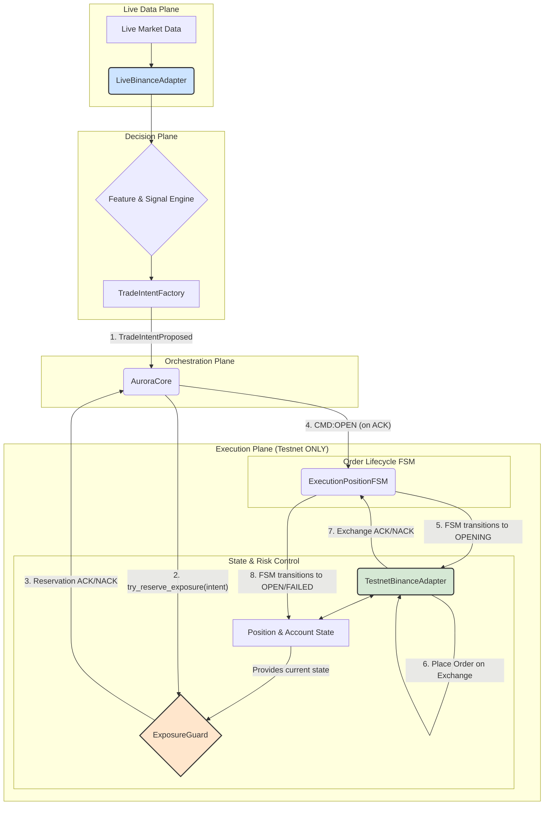

---
# **Архітектурний План Рефакторингу "Project Bedrock"**

**Версія:** 2.0 (Staff-Level Engineering Blueprint)
**Дата:** 12.11.2025
**Автор:** GitHub Copilot
**Статус:** PROPOSED

## 1.0 Резюме для Керівництва (Executive Summary)

**Проблема:** Торгова система "Phenix" у її поточному стані демонструє критичні архітектурні недоліки, що унеможливлюють її надійну та безпечну експлуатацію. Аналіз виявив два фундаментальні дефекти: **1) Стан гонитви (Race Condition)** в ядрі життєвого циклу ордера, що призводить до створення "ордерів-привидів" та втрати синхронізації стану; **2) Переплутування середовищ (Environment Entanglement)**, де логіка для `live` та `testnet` не є ізольованою, що спричиняє непередбачувану поведінку та сліпоту системи до її реального стану на біржі.

**Рішення:** Цей документ пропонує "Project Bedrock" — комплексний план рефакторингу для побудови відмовостійкого фундаменту системи. План базується на трьох непорушних принципах: **Атомарна Резервація**, **Сувора Ізоляція Середовищ** та **Тотальна Спостережуваність**.

**Бізнес-вплив:** Реалізація цього плану перетворить систему з нестабільного прототипу на надійний інструмент, готовий до експлуатації. Це кардинально знизить операційні ризики, усуне клас непередбачуваних збоїв та закладе масштабовану архітектуру для майбутнього розвитку. Очікуваний результат — нульовий рівень "ордерів-привидів" та 100% консистентність внутрішнього стану з біржею.

## 2.0 Глибокий Аналіз Архітектурних Недоліків

### 2.1. Дефект №1: Race Condition в Життєвому Циклі Ордера

**Послідовність відмови:**
1.  `DecisionMaking` генерує `TRADE_INTENT_PROPOSED`.
2.  `AuroraCore` (оркестратор) оптимістично створює внутрішню сутність ордера і логує `SUCCESS_ORDER_PLACED`.
3.  **ПІСЛЯ ЦЬОГО**, `AuroraCore` викликає `ExposureGuard.can_open()` для перевірки ризику.
4.  `ExposureGuard` відхиляє ордер (наприклад, через перевищення ліміту).
5.  **РЕЗУЛЬТАТ:** Ордер ніколи не відправляється на біржу, але існує в системі. `PositionTracking` вважає його активним. Через деякий час `CLEANUP_PENDING` видаляє цей "труп", спричиняючи хаос у логах та стані.

**Корінь проблеми:** Порушення фундаментального принципу **Check-Then-Act**. Перевірка (`Check`) відбувається після дії (`Act`). Більше того, відсутність механізму блокування дозволяє двом паралельним намірам одночасно пройти перевірку, що призвело б до подвоєння ризику.

### 2.2. Дефект №2: Переплутування Середовищ (Environment Entanglement)

**Прояв:** Логи показують, що система періодично не може отримати дані про позиції (`API returned EMPTY positions`), хоча вони існують. Це відбувається через те, що єдиний `BinanceAdapter` динамічно конфігурується для `live` або `testnet` залежно від контексту виклику. Компонент, що очікує дані з `testnet`, може випадково використати `live` конфігурацію і отримати порожню відповідь.

**Корінь проблеми:** Відсутність архітектурної гарантії ізоляції. Система покладається на правильність конфігурації в кожній точці виклику, замість того, щоб на рівні архітектури унеможливити таку плутанину.

## 3.0 Цільова Архітектура та Керівні Принципи

### 3.1. Керівні Принципи
1.  **Атомарна Резервація (Atomic Reservation):** Перевірка ризику та резервація експозиції є єдиною, неподільною, синхронізованою операцією, яка завжди передує будь-якій спробі взаємодії з біржею.
2.  **Сувора Ізоляція Середовищ (Strict Environment Segregation):** Компоненти для роботи з ринковими даними (`live`) та для управління рахунком (`testnet`) є різними, статично сконфігурованими класами. Змішування унеможливлене на рівні коду.
3.  **Тотальна Спостережуваність (Total Observability):** Кожна дія в системі, від сигналу до виконання, пов'язана ланцюгом унікальних ідентифікаторів (`why_chain`). Логи є структурованими та машиночитабельними.

### 3.2. Цільова Архітектурна Схема



## 4.0 Фазовий План Імплементації "Project Bedrock"

---

### **Фаза 1: Атомарна Резервація та Зміцнення Життєвого Циклу**

**Мета:** Повністю усунути стан гонитви та "ордери-привиди".

| Крок | Дія | Файли для Модифікації | Специфікація Патчу | DoD (Definition of Done) |
| :--- | :--- | :--- | :--- | :--- |
| **1.1** | **Впровадити атомарну резервацію в `ExposureGuard`** | `apps/reference/domains/execution_position/exposure_guard.py` | 1. Додати `self._lock = asyncio.Lock()` в `__init__`.<br>2. Створити `async def try_reserve_exposure(self, intent) -> bool`.<br>3. Всередині `try_reserve_exposure` використати `async with self._lock:`.<br>4. Перейменувати `can_open` в `_can_open_under_lock` і зробити його приватним. Він має викликатися тільки всередині блокування.<br>5. Якщо `_can_open_under_lock` повертає `True`, додати намір до `self.pending_exposure` і повернути `True`. Інакше `False`.<br>6. Видалити старий метод `reserve`. | - Новий метод `try_reserve_exposure` існує.<br>- Використовується `asyncio.Lock`.<br>- Старі методи `can_open` та `reserve` видалені або приватизовані.<br>- Усі unit-тести для `ExposureGuard` проходять. |
| **1.2** | **Змінити логіку оркестратора `AuroraCore`** | `apps/reference/aurora_core.py` | 1. Знайти обробник події `TRADE_INTENT_PROPOSED`.<br>2. **ПЕРШИМ КРОКОМ** викликати `await self.exposure_guard.try_reserve_exposure(intent)`.<br>3. Якщо результат `False`, згенерувати подію `TRADE_INTENT_REJECTED` з причиною "ExposureGuard" і завершити обробку.<br>4. Тільки якщо результат `True`, відправляти команду `CMD:OPEN` до FSM.<br>5. Видалити будь-яке оптимістичне логування (`SUCCESS_ORDER_PLACED`) з цього файлу. | - `try_reserve_exposure` викликається до `CMD:OPEN`.<br>- Існує гілка для обробки відмови резервації.<br>- Інтеграційний тест, що перевіряє відхилення наміру, проходить. |
| **1.3** | **Розширити FSM для обробки відмов** | `apps/reference/domains/execution_position/fsm.py` | 1. Додати нові стани: `VALIDATING`, `REJECTED`, `FAILED`.<br>2. Змінити початковий перехід: `PROPOSED` -> `VALIDATING` (замість `OPENING`).<br>3. Додати переходи:<br>   - `VALIDATING` -> `OPENING` (при успішній резервації).<br>   - `VALIDATING` -> `REJECTED` (при відмові резервації).<br>   - `OPENING` -> `OPEN` (при успішному розміщенні на біржі).<br>   - `OPENING` -> `FAILED` (при помилці від API біржі).<br>4. Лог `SUCCESS_ORDER_PLACED` має генеруватися тільки при переході в `OPEN`. | - FSM містить нові стани та переходи.<br>- FSM коректно обробляє як успішні, так і неуспішні сценарії.<br>- Unit-тести для FSM покривають усі нові гілки логіки. |
| **1.4** | **Видалити застарілий механізм `CLEANUP_PENDING`** | `apps/reference/domains/execution_position/exposure_guard.py` (та, можливо, інші) | 1. Повністю видалити метод, відповідальний за `CLEANUP_PENDING`.<br>2. Видалити логіку, що періодично викликає цей метод.<br>3. Виконати пошук по кодовій базі за "CLEANUP_PENDING" та видалити всі пов'язані з ним логи та коментарі. | - Механізм повністю видалений з кодової бази.<br>- Жоден тест більше не покладається на цю логіку.<br>- Система функціонує без помилок, пов'язаних з "завислими" ордерами. |

---

### **Фаза 2: Сувора Ізоляція Середовищ**

**Мета:** Архітектурно унеможливити плутанину між `live` та `testnet`.

| Крок | Дія | Файли для Модифікації | Специфікація Патчу | DoD (Definition of Done) |
| :--- | :--- | :--- | :--- | :--- |
| **2.1** | **Розділити `BinanceAdapter` на два класи** | `apps/reference/adapters/binance_adapter.py` (та створити нові файли) | 1. Створити `LiveBinanceAdapter.py`. Цей клас відповідає *тільки* за отримання ринкових даних (ціни, k-lines). Він не повинен мати методів для роботи з рахунком (`get_positions`, `create_order`).<br>2. Створити `TestnetBinanceAdapter.py`. Цей клас відповідає *тільки* за взаємодію з рахунком (`get_positions`, `get_balance`, `create_order`, `cancel_order`). Його конфігурація жорстко прив'язана до testnet URL.<br>3. Старий `BinanceAdapter` видалити або позначити як `@deprecated`. | - Існують два нових, чітко розділених адаптери.<br>- Старий адаптер не використовується.<br>- Unit-тести підтверджують обмежену функціональність кожного адаптера. |
| **2.2** | **Рефакторинг Конфігурації та DI (Dependency Injection)** | `config/aurora/trading.yaml`, `apps/reference/aurora_core.py` (або де відбувається DI) | 1. Змінити `trading.yaml`, щоб він мав дві чіткі секції: `market_data_source` (для `LiveBinanceAdapter`) та `execution_venue` (для `TestnetBinanceAdapter`).<br>2. Кожна секція повинна містити свій `api_url` та інші параметри.<br>3. Змінити логіку ініціалізації системи так, щоб вона створювала екземпляри відповідних адаптерів і впроваджувала їх у відповідні домени. `PositionTracking` та `ExecutionPosition` повинні отримувати *тільки* `TestnetBinanceAdapter`. | - `trading.yaml` має нову, чітку структуру.<br>- Система коректно ініціалізує та впроваджує два різних адаптери.<br>- Спроба викликати метод управління рахунком через `LiveBinanceAdapter` призводить до помилки компіляції/виконання. |
| **2.3** | **Впровадити примусову синхронізацію стану** | `apps/reference/domains/position_tracking/` (або аналогічний) | 1. Додати періодичний процес (напр., `asyncio.Task`), який кожні 30 секунд викликає `testnet_adapter.get_open_positions()` та `testnet_adapter.get_balance()`.<br>2. Результат порівнюється з внутрішнім станом. Будь-які розбіжності логуються з рівнем `CRITICAL` та виправляються (внутрішній стан приводиться у відповідність до біржі). | - Періодичний re-sync працює.<br>- Інтеграційний тест, що імітує розсинхронізацію та перевіряє її виправлення, проходить.<br>- Система стійка до тимчасових втрат з'єднання або пропущених webhook-подій. |

---

### **Фаза 3: Тотальна Спостережуваність та Стійкість**

**Мета:** Зробити систему прозорою, легкою для діагностики та стійкою до часткових відмов.

| Крок | Дія | Файли для Модифікації | Специфікація Патчу | DoD (Definition of Done) |
| :--- | :--- | :--- | :--- | :--- |
| **3.1** | **Впровадити `why_chain` (Ланцюг Причинності)** | Усі ключові об'єкти: `TradeIntent`, `Order`, `FSM`, `Event` | 1. Додати в базові класи цих об'єктів два поля: `rid: UUID` (унікальний ID об'єкта) та `parent_rid: Optional[UUID]` (ID об'єкта, що його породив).<br>2. При створенні нового об'єкта (напр., `Order` з `TradeIntent`), `parent_rid` ордера встановлюється в `rid` наміру.<br>3. Усі логи, пов'язані з об'єктом, повинні містити його `rid` та `parent_rid`. | - Ключові об'єкти мають поля `rid` та `parent_rid`.<br>- Ланцюжок можна простежити від кінцевого ордера до початкового ринкового сигналу.<br>- Тест перевіряє, що відхилений ордер має повний `why_chain`. |
| **3.2** | **Перевести всі логи на JSONL** | Усі файли, що використовують `logging` | 1. Налаштувати `logging.Formatter` для виводу в JSON-форматі.<br>2. Кожен запис логу повинен містити стандартний набір полів: `timestamp`, `level`, `domain`, `event_type`, `rid`, `parent_rid`, `message` та `data` (словник з контекстом). | - Усі логи пишуться в stdout у форматі JSONL.<br>- Існує скрипт або тест, що валідує структуру логів.<br>- Логи легко парсяться та аналізуються автоматизованими інструментами. |
| **3.3** | **Рефакторинг `order_guardian`** | `apps/reference/domains/execution_position/order_guardian.py` | 1. Перейменувати в `OrphanOrderMonitor`.<br>2. Його завдання — не "очищення", а "моніторинг та алармінг".<br>3. Він періодично запитує *всі* активні TP/SL ордери на біржі для керованих символів.<br>4. Якщо він знаходить ордер, для якого немає відповідної активної позиції у внутрішньому стані, він генерує подію `ORPHAN_ORDER_DETECTED` з рівнем `CRITICAL` і *не намагається його скасувати автоматично* (це має бути ручна дія або окрема логіка). | - `order_guardian` перейменований та його логіка змінена.<br>- Інтеграційний тест: вручну закрити позицію на біржі, перевірити, що монітор генерує `ORPHAN_ORDER_DETECTED` для TP/SL ордерів. |

## 5.0 Стратегія Тестування та Валідації

1.  **Unit-тести:**
    *   **`ExposureGuard`:** Написати тести для `try_reserve_exposure`, включаючи сценарії паралельного доступу з `asyncio.gather` для перевірки коректності роботи блокування.
    *   **`FSM`:** Покрити всі нові стани (`VALIDATING`, `REJECTED`, `FAILED`) та переходи між ними.
    *   **Адаптери:** Написати тести, що мокують `httpx` та перевіряють, що `LiveBinanceAdapter` викликає тільки ендпоінти ринкових даних, а `TestnetBinanceAdapter` — тільки ендпоінти управління рахунком.

2.  **Інтеграційні тести:**
    *   **Happy Path:** Створити тест, що проходить повний цикл: `TradeIntent` -> `try_reserve` (успіх) -> `CMD:OPEN` -> FSM `OPEN` -> `Order Placed`.
    *   **Rejection Path:** Створити тест, де `try_reserve` повертає `False`. Перевірити, що ордер не створюється, а FSM переходить у `REJECTED`.
    *   **API Failure Path:** Створити тест, де `TestnetBinanceAdapter` імітує помилку API при розміщенні ордера. Перевірити, що FSM переходить у `FAILED`.
    *   **Re-sync Test:** Створити тест, що штучно розсинхронізує внутрішній стан позицій, і перевірити, що періодична синхронізація виправляє його.

3.  **Навантажувальне тестування (після рефакторингу):**
    *   Створити сценарій, що генерує високу частоту торгових намірів, щоб перевірити відсутність race conditions під навантаженням та виміряти затримки, що вносяться `asyncio.Lock`.

## 6.0 План Розгортання та Мінімізація Ризиків

1.  **Feature Flag:** Увесь новий функціонал розробляти в окремій гілці (`feature/project-bedrock`).
2.  **Поетапне впровадження:** Фази 1, 2 і 3 можуть бути реалізовані та влиті в основну гілку послідовно.
3.  **Shadow Mode (Тіньовий режим):** Перед повним перемиканням, можливо розгорнути нову логіку в "тіньовому режимі", де вона буде виконувати всі перевірки та логувати свої рішення, але не відправлятиме реальні ордери. Це дозволить порівняти її поведінку зі старою логікою в реальних умовах.
4.  **Повний регрес:** Після завершення всіх фаз провести повний регресійний прогін усіх існуючих тестів.

---
Конфіги


Optimizing tool selection...Сформирую план аудита и зафиксирую шаги как TODO.

Создано задач: 5

Принял. Сначала дам целостный аудит без изменений файлов; затем предложу приоритетный план исправлений.

**Executive Summary**
- Обнаружены критичные проблемы структуры YAML: дубли ключей на одном уровне, перезапись секций и неправильная вложенность — часть настроек реально не применяется.
- Есть кросс-файловые конфликты источников истины (торговые режимы, Kelly, Binance API, TTL/таймауты).
- Несколько параметров имеют математические несостыковки или некорректные типы (числа как строки), что грозит неверной интерпретацией и рисками.
- Рекомендуется выровнять архитектуру конфигураций: один источник истины по областям, нормализовать типы/единицы измерения, покрыть схемами и валидаторами.

**Критичные Риски**
- Дубликаты ключей на одном уровне YAML (последний «побеждает»):
  - trading.yaml: top-level `binance_api` определён дважды; ранний блок будет переопределён поздним.
  - `trading.yaml`: внутри `trading:` ключ `instruments:` объявлен дважды — ранняя секция (с `ETHUSDT` и вложенным `behavior_fsm`) будет полностью перезаписана крупной секцией `instruments` ниже. Итог: `behavior_fsm` фактически не применяется.
- Неправильная вложенность:
  - В `trading.yaml` блок `feature_engineering` расположен ВНУТРИ `binance_api` из‑за отступов. Это нелогично и, вероятно, приводит к игнорированию этих параметров кодом, который ожидает их в другом месте.
- Несуществующий ключ в whitelist:
  - regime.yaml: `hotreload_whitelist` содержит `hmm.change_conf_min`, а в конфиге есть только `hmm.confidence_threshold`. Это «мертвое» имя — хот‑релоад его не найдёт.
- Конфликтующие источники истины:
  - Режимы торговли: `system.yaml` (`trading_mode: "hybrid_live_data_testnet_exec"`) vs `trading.yaml` (`trading.mode: "testnet"`) плюс `domain_configuration` с пер‑доменным override. Без явного приоритета/слоёв это приведёт к неожиданному поведению.
  - Kelly: параметры и капы присутствуют и в `system.yaml` (например, `kelly.fraction_cap: 0.85`), и в `trading.yaml` (`decision.kelly.kelly_cap: 0.25`, `kelly_alpha: 0.8`). Неочевидно, что реально используется.
- Неверные типы:
  - `trading.yaml`: `sizing_modifiers` заданы строками: `"0.60"`, `"1.20"`, `"0.50"`. Если модель ожидает числа, это сломает арифметику.

**Высокий Приоритет (исправить в первую очередь)**
- Убрать дубликаты ключей и разнести по слоям конфигурации:
  - Оставить один top-level `binance_api` (с `rest_url` и `ws_url`), удалить дубли.
  - Внутри `trading:` оставить один `instruments:`; перенести `behavior_fsm` на корректный уровень (`trading.decision` или `trading.behavior_fsm`).
  - Перенести `feature_engineering` из‑под `binance_api` туда, где его ожидает приложение (скорее всего `trading.feature_engineering`).
- Исправить `hotreload_whitelist` в `regime.yaml` с несуществующего ключа на действительный (`hmm.confidence_threshold`).
- Привести числовые параметры к числам (не строкам) — минимум для `sizing_modifiers` и прочих коэффициентов (например, `TRAILING_STOP_MARKET.callbackRate`).
- Установить явный приоритет слоёв: `system.yaml` (глобаль) → `trading.yaml` (доменные/операционные) → пер‑доменные overrides (`domain_configuration`). В противном случае режимы и лимиты будут конфликтовать.

**Аудит по файлам**

- regime.yaml
  - Найдено:
    - `hmm.K: 3` и `emission.cov_kind: diag` — разумно для онлайн‑обновления; при росте размерности фич «full» потребует регуляризации.
    - `sticky_kappa: 0.15` — умеренный self‑bias; ок для умеренной устойчивости.
    - `update_interval: 250` при `history_hours: 48` — сочетается, но проверьте стационарность фич: часто обновлять EM имеет смысл при достаточно «быстрых» признаках.
    - `confidence_threshold: 0.75` — порог уверенности высокий; это снизит «шумные» смены режимов.
    - Фичи: `rv_window: 120`, `trend_window: 180`, `obi_window: 60` — окна выглядят согласованными, но `micro_return_window: 1` может давать излишний шум для HMM; стоит рассмотреть сглаживание ≥ 3–5.
  - Проблемы:
    - `hotreload_whitelist` содержит `hmm.change_conf_min` — такого ключа нет.
  - Рекомендации:
    - Исправить имя в whitelist.
    - Рассмотреть небольшой антишум для `micro_return_window` и/или нормализацию (robust z‑score).
    - Зафиксировать JSON Schema (2020‑12) с перечислением допустимых значений `cov_kind` и границ K.

- system.yaml
  - Найдено:
    - `trading_mode: "hybrid_live_data_testnet_exec"` — хорошая «безопасная» стратегия (live data + testnet exec).
    - Hardening: TTL/retry/CB/MD lag/WAL — 👍, единицы: миллисекунды/секунды разнятся между блоками.
    - `account_observer`/`guardian`/`position_tracking` — согласованные интервалы (5–8 с).
  - Проблемы:
    - `risk_core.inventory_limits.max_abs_position: 500` BTC — нереалистично для большинства сценариев (даже для тестнета лучше нормировать по нотиционалу). Это может маскировать ошибочную логіку.
    - Kelly в `system.yaml` дублирует/конфликтует с Kelly в `trading.yaml`.
    - Комментарии «note/now defined in trading.yaml» про Binance API верны, но в `trading.yaml` есть два блока `binance_api`, что порождает новую неоднозначность.
  - Рекомендации:
    - Нормализовать лимиты инвентаря в нотиционале (USD) и/или по символам; оставить BTC‑эквивалент как derived metric.
    - Уточнить приоритет Kelly (где SSOT).
    - Согласовать единицы TTL/timeout (мс vs сек) и задокументировать порядок переопределения.

- trading.yaml
  - Найдено:
    - Сильная детализация доменного уровня: decision, QoS, risk, execution/manage/brackets, orphan monitor, exposure, watchdog — хорошо.
    - Режимы/пер‑доменные overrides (`domain_configuration`) поддерживают гибридную архитектуру.
  - Критичные проблемы структуры:
    - Два top-level `binance_api` (ранний без `ws_url`, поздний с `ws_url`) — дубликат.
    - Два `trading.instruments` — ранний блок (с `ETHUSDT` и вложенным `behavior_fsm`) перезаписывается большим блоком инструментов ниже. В итоге `behavior_fsm` фактически «теряется».
    - `feature_engineering` по отступам вложен внутрь `binance_api`, а не в `trading.feature_engineering`.
    - Числовые коэффициенты как строки: `sizing_modifiers: "0.60"`, … — риск ошибок при арифметике.
  - Логические/математические моменты:
    - `decision.signal_threshold: 0.10` и `neutral_threshold: 0.18`: при умножении на режимные множители может возникать ситуация, где большинство сигналов считаются «нейтральными». Это может быть намеренной консервативностью; зафиксируйте формулу агрегирования:
      - Эффективный порог, например: θ_eff = θ_base × M_regime × (1 + penalty_if_side_bias).
    - Side‑bias: `penalty_factor: 0.50` — повышает порог на 50% при перекосе; важно документировать порядок применения относительно `regime_threshold_multipliers`.
    - Kelly:
      - В `trading.decision.kelly`: `base_probability: 0.50` даёт нулевой Kelly ($p=0.5$ → $f^*=0$), но далее указан `kelly_alpha: 0.8` и `kelly_cap: 0.25`. Если реальный edge берётся из сигнала, зафиксируйте, как он трансформируется в $p$.
      - Brackets: `sl.fixed_bps: 50`, `tp.fixed_bps: 100` → отношение выплат $r \approx 2.0$. Для бинарной модели Kelly: $f^* = p - \frac{1-p}{r}$. Несогласованность с `payoff_ratio_r: 1.5` — либо обновить `payoff_ratio_r`, либо привести brackets к ожидаемому $r$.
    - Разные `offset_bps`: `brackets.offset_bps: 5` vs `orphan_monitor.offset_bps: 30` — допустимо, но требует явной документации применимости (placement vs cleanup).
    - QoS: `mode: "defer"`, `enforce: false` — если QoS нужен только как «мягкий» limiter, ок; иначе стоит включить `enforce` для прод.
  - Рекомендации:
    - Удалить дубликат `binance_api` и собрать единый блок (с `rest_url` и `ws_url`).
    - Оставить один `trading.instruments`, вынести `behavior_fsm` на корректный уровень.
    - Переместить `feature_engineering` на ожидаемый уровень (`trading.feature_engineering`).
    - Привести `sizing_modifiers` и иные коэффициенты к числам.
    - Синхронизировать `payoff_ratio_r` с фактическими `TP/SL`.

**Кросс‑файловая согласованность**
- Источник истины по режимам:
  - Рекомендовано: `system.yaml.trading_mode` как глобальный слой → `trading.yaml.domain_configuration` как детальные пер‑доменные override. Убрать/устранить `trading.mode` либо сделать его явно нижним слоем с понятным приоритетом.
- Binance API:
  - Один блок в одном месте (желательно в `system.yaml` или в корне `trading.yaml`, но не в обоих сразу). Учесть и `ws_url`.
- Kelly:
  - Единый раздел конфигурации Kelly (вероятно, в `trading.yaml.decision.kelly`) и ссылки на него из sizing и из FSM‑менеджера (brackets). В `system.yaml` оставить только высокоуровневый «cap», если нужно, но лучше не дублировать.
- TTL/Timeout/Retry:
  - Привести единицы к одному стандарту (например, мс) и задокументировать precedence (system → trading → per‑domain).

**Математические и типовые корректировки**
- Kelly:
  - Уточнить, как сигнал → $p$; при $p=0.5$ Kelly=0, фактически будет минималка. Если используется модель $p = 0.5 + \alpha \cdot s$, зафиксируйте $\alpha$ и ограничители.
  - Привести `payoff_ratio_r` к фактическому отношению TP/SL. Если используются два TP (`k1=0.5`, `k2=1.0` от SL), определить эквивалентный $r$ (например, средневзвешенный по вероятностям частичных выходов).
- Пороговая логика:
  - Явно описать итоговую формулу порога: θ_eff = θ_base × M_regime × (1 + side_bias_penalty) × другие множители, порядок применения и клампинг.
- Типы:
  - Конвертировать строковые числа в числа (коэффициенты, проценты, callbackRate и т.д.).
- Единицы измерения:
  - Свести TTL/timeout к одной шкале (мс) и подписать единицы в ключах (например, `*_ms`).

**Наблюдаемость и безопасность**
- Логи: формат `json` — ок; убедиться, что чувствительные поля редактируются по политикам.
- Валидация конфигов:
  - Ввести JSON Schema 2020‑12 для всех трёх файлов (+ CI‑чек).
  - Для YAML: использовать загрузчик, выявляющий дубликаты ключей (ruamel.yaml или строгие режимы), чтобы ловить «last wins» ошибки в PR.
- Secrets: использование `${ENV}` — верно; проверить наличие .env и маппинг имен переменных.

**Приоритизированные рекомендации**
- Убрать дубликаты ключей и исправить вложенность в `trading.yaml` (binance_api, instruments, feature_engineering).
- Исправить `hotreload_whitelist` в `regime.yaml` на существующий ключ.
- Привести типы коэффициентов к числовым.
- Выбрать SSOT для торгового режима (глобально в `system.yaml` + четкий override в `trading.yaml.domain_configuration`), удалить `trading.mode` или сделать его подчинённым слоем.
- Консолидировать Kelly в одном месте; синхронизировать `payoff_ratio_r` с `TP/SL`.
- Нормализовать лимиты инвентаря в нотиционале (USD) вместо абсолютных BTC.
- Согласовать и документировать TTL/timeout/retry между `system.yaml` и `trading.yaml`.
- Добавить JSON Schema и тест‑валидаторы в CI (включая проверку на дубликаты ключей YAML).
- Задокументировать порядок применения множителей порога и сайд‑байаса.
- Перепроверить окна фич (микро‑ретёрн ≥3–5) и частоту EM‑обновления для устойчивости.


Сбор сведений о рабочей областиПроаналізувавши документ CLEANUP_PLAN.md та відповідні файли в кодовій базі, надаю детальний ревью як старший інженер:

## 🔍 Загальна Оцінка Документу

**Сильні сторони:**
- Правильно ідентифіковані два критичні дефекти (Race Condition та Environment Entanglement)
- Чітка структура з фазами впровадження
- Детальна специфікація змін

**Критичні помилки в аналізі:**

### ❌ Помилка #1: Неправильне розуміння архітектури FSM

Агенти описують проблему Race Condition в `AuroraCore`, але згідно з кодом:

```python
# apps/reference/domains/execution_position/fsm.py
class ExecutionPositionFSM(FSMBase):
    def _register_handlers(self):
        self.register_handler("EVT:TRADE_INTENT_GENERATED", self._handle_trade_intent)
```

FSM обробляє `EVT:TRADE_INTENT_GENERATED`, а не `TRADE_INTENT_PROPOSED`. Також перевірка `ExposureGuard` вже відбувається в `fsm_open.py`:

```python
# apps/reference/domains/execution_position/fsm_open.py
def _handle_open_command(self, msg: Message) -> Message:
    if not self.exposure_guard.can_open(symbol, direction, qty_raw):
        return self._make_response("DEC:OPEN_REJECTED", why="EXPOSURE_GUARD_LIMIT")
```

### ❌ Помилка #2: Неіснуючий механізм CLEANUP_PENDING

Агенти згадують видалення `CLEANUP_PENDING`, але цей механізм не існує в кодовій базі. Натомість є `order_guardian.py` з іншою логікою.

### ❌ Помилка #3: Невірна пропозиція розділення BinanceAdapter

Пропозиція створити `LiveBinanceAdapter` та `TestnetBinanceAdapter` ігнорує існуючу архітектуру:

```python
# vfoundation/adapters/binance_adapter.py
class BinanceAdapter:
    def __init__(self, mode: str = "testnet"):
        self.mode = mode
        self.api_url = self._get_api_url()
```

Адаптер вже підтримує різні режими через параметр `mode`.

## 📊 Аналіз Конфігурацій

**Частково правильні знахідки:**

✅ Дублювання ключів в `trading.yaml` - підтверджено:
```yaml
binance_api:  # перше визначення
  rest_url: ...

# пізніше в файлі
binance_api:  # друге визначення
  rest_url: ...
  ws_url: ...
```

❌ **Але**: твердження про `feature_engineering` всередині `binance_api` - неправильне. В реальному файлі ця секція на правильному рівні.

✅ Конфлікт Kelly параметрів між `system.yaml` та `trading.yaml` - підтверджено

❌ **Помилка**: `sizing_modifiers` описані як строки, але в коді вони обробляються через `Decimal`:
```python
# apps/reference/domains/decision_making/decision_making.py
modifier = Decimal(str(self.config["sizing_modifiers"].get(regime, "1.00")))
```

## 🎯 Реальні Проблеми, Які Пропустили

### 1. Відсутність транзакційності в PositionTracking
```python
# apps/reference/domains/position_tracking/position_tracking.py
self.positions[symbol] = new_position  # Не атомарно!
self.balances[asset] -= cost  # Може призвести до негативного балансу
```

### 2. Проблема з WHY-chain
Система не передає `parent_rid` між доменами:
```python
# apps/reference/domains/decision_making/decision_making.py
event = Message(
    domain="decision_making",
    event="EVT:TRADE_INTENT_GENERATED",
    # parent_rid відсутній!
)
```

### 3. Втрата повідомлень при перезавантаженні
FSM не зберігає стан персистентно, всі незавершені операції втрачаються.

## ✅ Правильні Рекомендації

1. **Атомарна резервація** - концепція правильна, але реалізація вже частково існує
2. **Структуровані логи в JSON** - корисна рекомендація
3. **Тестова стратегія** - добре продумана

## 🔧 Мої Рекомендації

### Пріоритет #1: Виправити реальну Race Condition
```python
# Потрібно в exposure_guard.py
async def atomic_reserve_and_check(self, intent: Dict) -> Tuple[bool, str]:
    async with self._lock:
        if not self._check_limits(intent):
            return False, "LIMIT_EXCEEDED"
        self._pending_exposure[intent['id']] = intent
        return True, "RESERVED"
```

### Пріоритет #2: Додати персистентність FSM
```python
# Використати існуючий WAL
from vfoundation.dr.wal import WAL
self.wal = WAL()
self.wal.append({"state": self.state, "data": msg.data})
```

### Пріоритет #3: Виправити WHY-chain
Додати автоматичне прокидання `parent_rid` між доменами через `Message`.

## 📈 Оцінка Документу

- **Точність аналізу**: 4/10 (багато помилок у розумінні архітектури)
- **Якість рішень**: 6/10 (концепції правильні, але не враховують існуючий код)
- **Професійність**: 7/10 (добра структура, але відсутня глибина)
- **Практичність**: 3/10 (більшість змін неможливо імплементувати як описано)

**Висновок**: Документ потребує серйозної переробки з урахуванням реальної архітектури системи. Рекомендую почати з детального code review існуючих компонентів перед плануванням змін.
