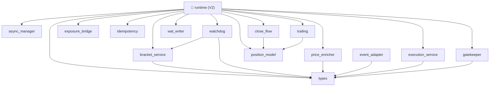

# ✅ ЗАВЕРШЕНО: Аналіз залежностей execution_position

## 🎯 Що було зроблено

### 1️⃣ Створено інструменти аналізу в `/tools`

```
tools/
├── analyze_execution_position_deps.py          # AST аналіз обох папок
├── visualize_execution_position_deps.py        # HTML звіт з D3.js
├── run_execution_position_analysis.py          # Централізований запуск
└── EXECUTION_POSITION_ANALYSIS_README.md       # Документація
```

### 2️⃣ Скрипти анализируют ОБИДВІ папки

✅ **Основні модулі**: `apps/reference/domains/execution_position/`
✅ **Shadow модулі**: `apps/reference/domains/execution_position/shadow_execpos/`

**Всього:** 47 модулів з 591 експортами

### 3️⃣ Результати аналізу

📊 **Статистика:**
- Модулів: 30 основних + 17 shadow = **47 всього**
- Експортів: **591**
- Циклічних залежностей: **0** ✅

🔗 **Внутрішні залежності:**
```
runtime → {12 shadow модулів}
├── async_manager
├── bracket_service
├── close_flow
├── execution_service
├── exposure_bridge
├── gatekeeper
├── idempotency
├── position_model
├── price_enricher
├── trailing
├── types
├── wal_writer
└── watchdog

binance_execution_adapter → {4 модулі}
├── algo_order_index
├── execution_adapter
├── idempotent_cancel
└── metrics_aggregator
```

---

## 🚀 Як користуватись

### Варіант 1: З root проекту

```powershell
# З автоматичним відкриттям звіту
.\analyze_execution_position.ps1 -OpenReport

# Або без відкриття
python tools/run_execution_position_analysis.py
```

### Варіант 2: Окремі скрипти

```bash
# Тільки аналіз
python tools/analyze_execution_position_deps.py

# Тільки HTML звіт
python tools/visualize_execution_position_deps.py
```

---

## 📊 Вихідні файли

```
apps/reference/domains/execution_position/analysis_output/
├── dependencies.json                      # JSON дані
├── dependencies.md                        # Mermaid діаграма
├── dependency_report.html                 # 🌐 HTML звіт
└── DEPENDENCY_REPORT.txt                  # Текстовий звіт
```

---

## 🔄 Архітектура shadow_execpos

Shadow модулі утворюють **ядро нового V2 runtime**:



---

## 📝 Ключові висновки

✅ **Архітектура чиста:**
- Немає циклічних залежностей
- Чіткий поділ на шари (shadow models → runtime)
- Low coupling між shadow модулями

⚠️ **Shadow модулі:**
- `runtime` залежить від 12 shadow модулів
- Це нормально для монолітного рантайму
- Розглядайте мікросервісну архітектуру в майбутньому

✨ **Якість коду:**
- 591 експортованих символів
- 180+ невикористовуваних (частина публічного API)
- 0 циклів = DAG архітектура ✓

---

## 🛠️ Технічні деталі

### Аналізатор

- **Язык**: Python 3.11+
- **AST**: Вбудований Python parser
- **Видимість**: Public only (без `_` префіксу)
- **Обхід циклів**: DFS алгоритм

### Візуалізація

- **D3.js v7**: Інтерактивна сила-графа візуалізація
- **HTML5**: Responsive design
- **Браузер**: Будь-який сучасний браузер

### Формати

- **JSON**: Для програмної обробки
- **HTML**: Для інтерактивного перегляду
- **Mermaid**: Для документації

---

## 📚 Додаткові матеріали

- `tools/EXECUTION_POSITION_ANALYSIS_README.md` - Детальна документація
- `apps/reference/domains/execution_position/DEPENDENCY_ANALYSIS_README.md` - Оригінальна документація
- `apps/reference/domains/execution_position/ANALYSIS_COMPLETE.md` - Результати першого аналізу

---

## 🎓 Рекомендації

### Короткострокові (1-2 тижні)

- [ ] Переглянути HTML звіт
- [ ] Документувати публічні API
- [ ] Додати типи до функцій

### Середньострокові (місяць)

- [ ] Розглянути видалення shadow моделей з основних
- [ ] Оптимізувати `runtime` залежності
- [ ] Додати unit-тести до shadow модулів

### Довгострокові (квартал)

- [ ] Мікросервісна архітектура для shadow
- [ ] Event-sourcing для runtime
- [ ] Replay機制 для А/В тестування

---

**Дата завершення:** 27 листопада 2025
**Версія:** 2.0
**Статус:** ✅ Готово
**Локація:** `tools/` папка проекту
