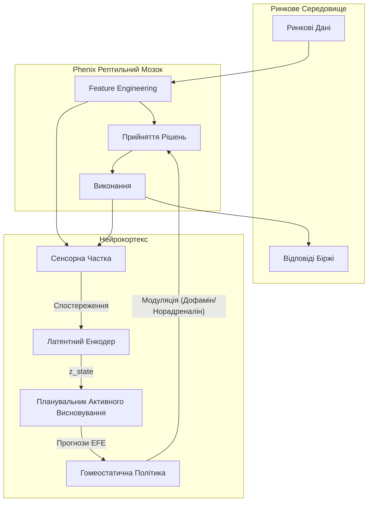

# Нейрокортекс: Живий Агент у Латентному Ринку

**Статус**: Концепція / Фаза Дизайну
**Основа**: `living_latent/core` (Біологічний Фреймворк Активного Висновування)
**Ціль**: домен `apps.neurocortex`

## 1. Філософія: Ринок як Екосистема

"Нейрокортекс" — це не просто торгова стратегія. Це **цифрова форма життя**, що мешкає в ринковому середовищі.
*   **Середовище (Environment)**: Безперервний потік ринкових даних та станів системи.
*   **Тіло (Body)**: Базова торгова система (Phenix), яка виконує фізичні дії (ордери).
*   **Метаболізм (Metabolism)**: PnL (прибуток/збиток) — це енергія. Позитивний PnL живить ріст/дослідження; негативний PnL викликає стрес/голод.
*   **Ціль (Objective)**: Мінімізація Вільної Енергії (EFE) — тобто максимізація точності передбачення майбутніх станів ринку при збереженні внутрішнього гомеостазу (збереження капіталу).

## 2. Архітектура: "Живий" Цикл

Кортекс працює як окремий асинхронний процес ("Розум"), що спостерігає за "Тілом" (Phenix).



## 3. Ключові Компоненти (Адаптовано з `living_latent`)

### A. Сенсорна Частка (`telemetry.py` + `world.py`)
Замість статистики GPU/CPU, "Чуття" сприймають високорівневі характеристики ринку.

*   **Екстероцепція (Зовнішнє)**:
    *   Режими волатильності (Висока/Низька)
    *   Сила тренду (ADX, Ковзні середні)
    *   Структура ринку (Дисбаланс ордербуку)
*   **Інтероцепція (Внутрішнє)**:
    *   Поточна просадка (Drawdown) — `стрес`
    *   Експозиція / Плече
    *   Затримки / Помилки — `біль`

### B. Латентний Простір та Атрактори (`state.py` + `attractors.py`)
Кортекс стискає багатовимірні сенсорні вхідні дані у низьковимірний **Латентний Стан**.
*   **Атрактори**: Кластери станів, де агент успішно "живе" (отримує прибуток).
    *   *Приклад Атрактора A*: "Bull Run + Momentum Strategy" (Висока Енергія)
    *   *Приклад Атрактора B*: "Chop + Mean Reversion" (Стабільна Енергія)
    *   *Приклад Атрактора C*: "Crash + Cash" (Гібернація)
*   **Механізм**: Використовує логіку `AttractorState` для відстеження "часу перебування" в цих режимах та управління переходами.

### C. Гомеостаз та Життєздатність (`viability.py`)
Агент визначає "Конверт Життєздатності" (Viable Envelope) свого існування.
*   **Обмеження**: Помилка реконструкції Латентного Стану.
*   **Інтерпретація**: Якщо ринок поводиться так, що Кортекс не може це передбачити/закодувати (висока помилка реконструкції), це "Невідома Територія" (Небезпека).
*   **Реакція**: 
    *   *Низький Стрес*: Продовжувати дослідження.
    *   *Високий Стрес*: Реакція "Паніка" → Зменшити ризик, Зупинити торгівлю, Вийти в кеш (Режим виживання).

### D. Градієнт: PnL як Енергія (`efe.py`)
*   **Вільна Енергія (F)**: Розбіжність між *Очікуваним Станом* (Прибутковим) та *Фактичним Станом*.
*   **Мінімізація EFE**: Кортекс постійно планує дії для мінімізації F.
    *   *Здивування (Surprisal)*: "Я очікував, що ціна піде вгору, а вона впала." (Помилка прогнозу)
    *   *Незгода (Disagreement)*: "Мої внутрішні моделі розходяться в оцінках." (Невизначеність)
*   **Планування**: `BridgeExecutor` не виставляє ордери. Він вибирає **Стратегії**.
    *   *Дія*: "Переключитися з Momentum на Mean Reversion".

## 4. Етапи Реалізації

### Фаза 1: "Тихий Спостерігач" (Пасивний)
Кортекс працює в режимі лише для читання, будуючи свій Латентний Простір.
1.  **Ingest (Споживання)**: Підключення до `EVT:FEATURES_CALCULATED` та `EVT:EXPOSURE_SUMMARY_UPDATED`.
2.  **Dream (Сновидіння)**: Тренування VAE (Варіаційного Автоенкодера) / Світової Моделі на живих даних.
3.  **Feel (Відчуття)**: Розрахунок "Віртуального PnL" та метрик "Стресу" без виконання дій.

### Фаза 2: "Радник" (Активний Моніторинг)
Кортекс генерує окремі події, які може бачити Користувач (або Лог).
1.  **Signal (Сигнал)**: `EVT:CORTEX_REGIME_DETECTED` (напр., "Ринок волатильний, пропоную зменшити плече").
2.  **Warn (Попередження)**: `EVT:CORTEX_STRESS_HIGH` (Порушення конверту життєздатності).

### Фаза 3: "Контролер" (Активний Модулятор)
Кортекс отримує права на запис у домен `DecisionMaking`.
1.  **Modulate (Модуляція)**: Може динамічно оновлювати `config.strategies.active_strategy_id`.
2.  **Protect (Захист)**: Може викликати `CMD:HALT`, якщо внутрішній стрес стає критичним.

## 5. Структура Директорій (`apps/neurocortex`)

```
apps/neurocortex/
├── __init__.py
├── cortex_main.py       # Головний цикл процесу
├── perception/          # Сенсорні адаптери
│   ├── market_sense.py  # Адаптує FeatureEngineering -> Obs
│   └── self_sense.py    # Адаптує Стан Системи -> Obs
├── cognition/           # "Мозок" (ядро living_latent)
│   ├── memory.py        # Історія латентних станів
│   └── dreamer.py       # Тренування Світової Моделі
└── motor/               # Вихідні модулятори (Фенотип)
    └── phenotype.py     # Відображає рішення Кортексу на Конфіг Системи
```
