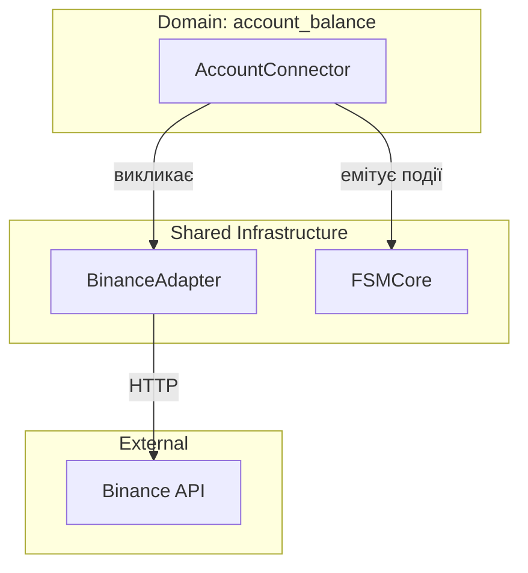
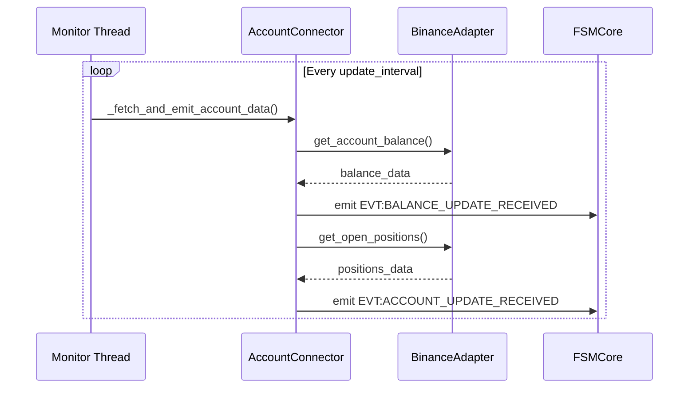

# Атлас домену Account Balance

## 1. Огляд (Scope & Purpose)
Домен **account_balance** відповідає за моніторинг стану рахунку користувача на біржі (Binance Futures). Він є "джерелом істини" (Source of Truth) для залишків коштів (balances) та відкритих позицій (positions) у системі.

**Межі відповідальності:**
- Періодичне опитування (polling) Binance API через `BinanceAdapter`.
- Перетворення сирих даних API у внутрішні формати подій.
- Емісія подій про оновлення балансу та позицій у шину подій FSM.

## 2. Карта залежностей (Dependencies)

- **Вхідні залежності:** `AuroraConfig` (для налаштувань API та інтервалів).
- **Вихідні залежності:** `BinanceAdapter` (для зв'язку з біржею), `FSMCore` (для публікації подій).

## 3. Карта файлів (File Map)
- `account_connector.py`: Основний оркестратор домену. Містить клас `AccountConnector`, який керує фоновим потоком моніторингу.
- `docs/`: Технічна документація домену.
- `Readme/`: (Застаріла) початкова документація.

## 4. Карта подій (Event Map)

### Вихідні події (Outbound Events)
| Назва події | Опис | Призначення |
|-------------|------|-------------|
| `EVT:BALANCE_UPDATE_RECEIVED` | Оновлення залишків по активах | Для `risk_management` та `strategies` |
| `EVT:ACCOUNT_UPDATE_RECEIVED` | Оновлення відкритих позицій та загального балансу | Для `execution_position` та `position_tracking` |

### Вхідні події (Inbound Events)
- *Домен не споживає подій.* Він ініціює дані самостійно через таймер.

## 5. Діаграма послідовності (Sequence Diagram)

