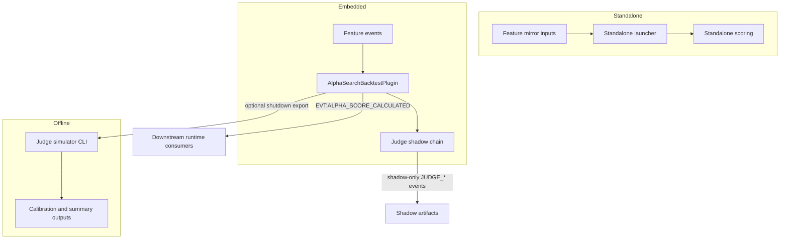

# Alpha Search Atlas

## 1. Canonical Mental Model

alpha_search is a bounded strategy-analysis domain, not a single-purpose alpha-score emitter.

It started as a standalone shadow or scenario runtime that consumed mirrored feature snapshots and produced scoring artifacts outside the main execution loop. In the current tree it also runs inside apps/reference/main.py as AlphaSearchBacktestPlugin loaded from config/alpha_search.yaml.

The same domain now owns four related but distinct surfaces:

1. alpha-provider scoring
2. judge shadow expert, chamber, evidence, and verdict emission
3. the offline judge simulator subtree under judge/simulator/
4. the optional shutdown-time export seam that invokes that offline simulator after session end

The key normalization point is that surface 4 is automation of surface 3. It does not convert the simulator into a live policy engine.

## 2. What alpha_search Owns

- provider configuration, model registry, adapters, ensembles, and fail-closed scoring behavior
- the plugin-side feature cache that bridges feature events to decision-time scoring
- runtime emission of EVT:ALPHA_SCORE_CALCULATED
- runtime emission of judge shadow events when judge.mode=shadow
- the historical standalone feature-mirror and replay path
- the offline simulator CLI, writers, schemas, and validation helpers
- the optional simulator_shutdown_export hook on plugin shutdown

## 3. What alpha_search Does Not Own

- Aurora DomainsConfig or config/aurora/domains.yaml registration
- decision policy, trade admission, or strategy promotion authority
- execution_position, order lifecycle, or live order management
- hybrid_advisory or any other judge mode widening beyond off and shadow
- Phase 6 review semantics beyond producing bounded evidence artifacts

## 4. Runtime Shapes

### 4.1 Historical Standalone Path

The original alpha_search runtime shape is still present in the tree.

- runtime/feature_mirror_writer.py mirrors feature snapshots into alpha_input_v1.jsonl-style inputs
- runtime/launcher.py and runtime/contracts.py support standalone scoring and shadow analysis
- scripts/runners/run_alpha_search_domain.py is the operator-facing standalone runner
- ALPHA_SEARCH_QUICKSTART.md describes that path

This path matters because alpha_search was originally built as a standalone analysis substrate, and the current tree still preserves that mode of operation.

### 4.2 Embedded main.py Plugin Path

apps/reference/main.py now imports load_alpha_search_config, loads config/alpha_search.yaml, and instantiates AlphaSearchBacktestPlugin directly during startup.

That plugin:

- listens to the configured feature_event and optional ta_feature_event
- listens to the configured decision_event to score cached same-bar features
- listens to EVT:TRADE_EXECUTED for virtual PnL tracking
- optionally listens to EVT:OBJECTIVE_REALIZED_V1 for objective feedback
- emits alpha scores for standard providers
- runs the judge shadow chain for judge expert providers when judge.mode=shadow

alpha_search is therefore integrated in the main runtime without being moved into Aurora domain registration.

### 4.3 Offline Simulator Path

The Phase 5 simulator lives under apps/reference/domains/alpha_search/judge/simulator/.

- the actual supported entrypoint is judge/simulator/cli.py
- the simulator loads config/judge_simulator.yaml
- it consumes offline judge logs and outcome data
- it writes calibration and summary artifacts
- it does not emit live FSM events and does not widen JudgeCortexConfig

### 4.4 Shutdown Export Path

AlphaSearchBacktestPlugin.shutdown() can optionally invoke the same offline simulator path when simulator_shutdown_export.enabled=true.

This is a bounded, fail-closed handoff after session end. It is part of current alpha_search authority, but it is still offline evidence production, not live decision logic.

## 5. High-Level Dependency Map

## 6. Key Files and Why They Matter

| Path | Why it matters now |
|------|--------------------|
| backtest_plugin.py | Current embedded runtime owner for scoring, judge shadow emission, and shutdown export |
| config_models.py | Defines AlphaSearchConfig and simulator_shutdown_export |
| judge/config_models.py | Keeps judge runtime mode bounded to off and shadow |
| judge/simulator/cli.py | Canonical offline simulator entrypoint |
| runtime/launcher.py | Preserves historical standalone runtime shape |
| runtime/feature_mirror_writer.py | Connects mirrored runtime features to the standalone path |
| scripts/runners/run_alpha_search_domain.py | Operator-facing standalone runner |
| config/alpha_search.yaml | Direct config surface for the embedded plugin |
| config/judge_simulator.yaml | Standalone config surface for the offline simulator |

## 7. How to Describe alpha_search Correctly

When documenting or reviewing this domain, use this description:

alpha_search is a dual-shape strategy-analysis domain. It still supports standalone shadow or replay scoring, and it is also directly embedded in the main runtime as a plugin. It owns alpha scoring, judge shadow evidence emission, and the offline simulator subtree plus its bounded shutdown export seam. It does not own decision policy, execution authority, or Phase 6 admission semantics.
