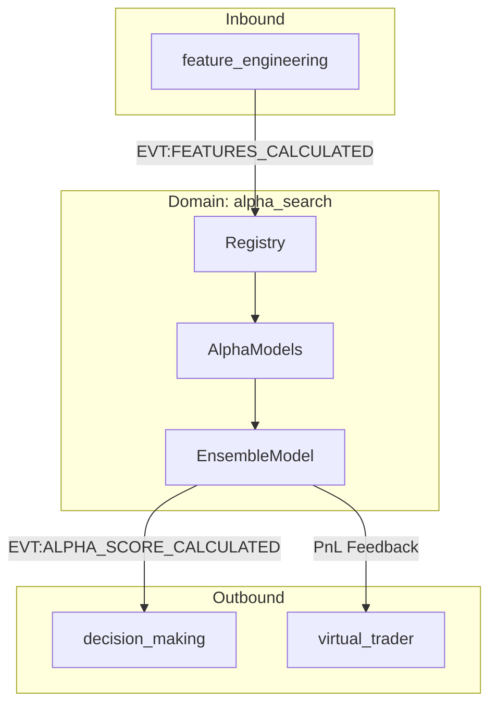
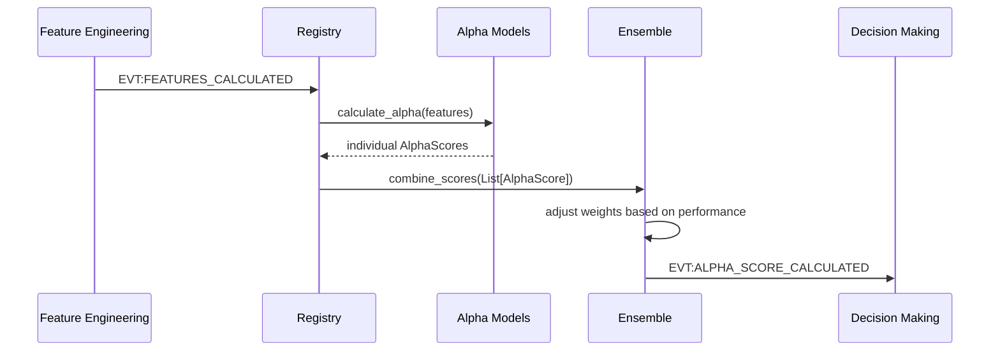

# Атлас домену Alpha Search

## 1. Огляд (Scope & Purpose)
Домен **alpha_search** — це "мозковий центр" стратегії, відповідальний за генерацію торгових сигналів (Alpha Scores). Він перетворює обчислені ознаки (features) у числові оцінки [-1, 1], які вказують на напрямок та силу очікуваного руху ціни.

**Межі відповідальності:**
- Визначення абстрактного фреймворку для альфа-моделей.
- Реалізація конкретних алгоритмів (Trend, Mean Reversion, Volatility).
- Ансамблювання (Ensemble) декількох сигналів в один результуючий.
- Динамічне управління вагами моделей на основі їхньої продуктивності.

## 2. Карта залежностей (Dependencies)

- **Вхідні:** `EVT:FEATURES_CALCULATED` (ознаки для розрахунку).
- **Вихідні:** `EVT:ALPHA_SCORE_CALCULATED` (сигнали для прийняття рішень).

## 3. Карта файлів (File Map)
- `alpha_model.py`: Базові класи `AlphaModel`, `AlphaScore` та реєстр `AlphaModelRegistry`.
- `ensemble.py`: Логіка комбінування сигналів та динамічного ребалансування.
- `models/`: Директорія з конкретними реалізаціями моделей.
  - `momentum.py`: Трендові сигнали.
  - `mean_reversion.py`: Сигнали повернення до середнього.
  - `volatility.py`: Сигнали на основі волатильності.
- `config_models.py`: Pydantic-моделі для валідації конфігурації.

## 4. Карта подій (Event Map)

### Вхідні події (Inbound Events)
| Назва події | Джерело | Опис |
|-------------|---------|------|
| `EVT:FEATURES_CALCULATED` | `feature_engineering` | Надає набір ознак для аналізу. |

### Вихідні події (Outbound Events)
| Назва події | Споживач | Опис |
|-------------|----------|------|
| `EVT:ALPHA_SCORE_CALCULATED` | `decision_making` | Містить фінальний сигнал (score) та впевненість (confidence). |

## 5. Діаграма потоків (Data Flow)

