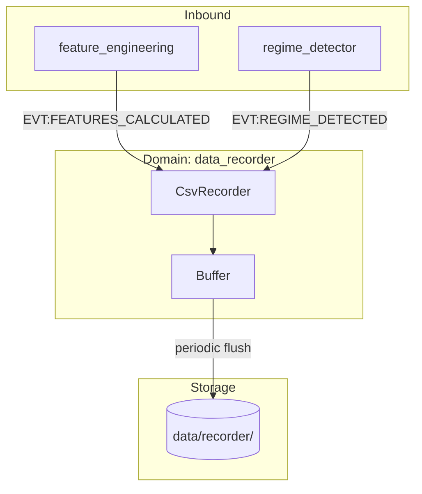
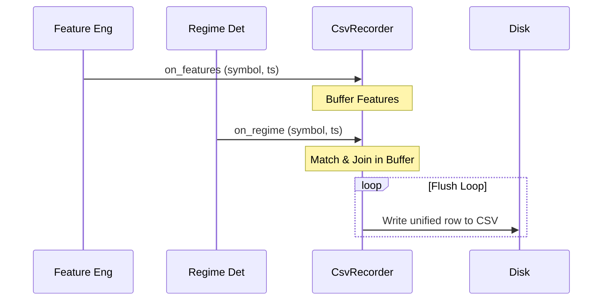

# Атлас домену Data Recorder

## 1. Огляд (Scope & Purpose)
Домен **data_recorder** відповідає за збереження уніфікованих знімків ринкових даних (барів), розрахованих ознак (features) та режимів ринку (regimes) у CSV-файли. Ці дані використовуються для подальшого бектестування та аналізу.

**Межі відповідальності:**
- Слухання подій ознак та режимів.
- Синхронізація (join) потоків даних за символом та часом (timestamp).
- Буферизація та періодичне скидання (flush) даних на диск.

## 2. Карта залежностей (Dependencies)

- **Вхідні:** `EVT:FEATURES_CALCULATED`, `EVT:REGIME_DETECTED`.
- **Вихідні:** CSV-файли в директорії `data/recorder/`.

## 3. Карта файлів (File Map)
- `recorder.py`: Основний клас `CsvRecorder`, що реалізує логіку збору та запису даних.

## 4. Карта подій (Event Map)

### Вхідні події (Inbound Events)
| Назва події | Джерело | Опис |
|-------------|---------|------|
| `EVT:FEATURES_CALCULATED` | `feature_engineering` | Надає OHLCV дані та розраховані ознаки. |
| `EVT:REGIME_DETECTED` | `regime_detector` | Надає поточну фазу ринку (режим). |

## 5. Діаграма послідовності (Sync Logic)

