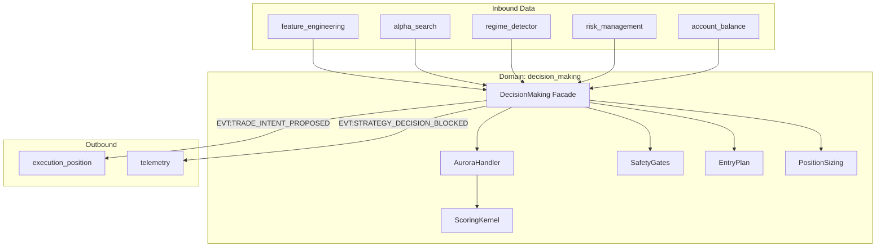

# Атлас домену Decision Making

## 1. Огляд (Scope & Purpose)
Домен **decision_making** — це "центральна нервова система" торгової платформи. Він приймає сигнали від моделей (`alpha_search`), враховує фазу ринку (`regime_detector`), перевіряє ліміти ризику (`risk_management`) та стан гаманця (`account_balance`), щоб сформувати остаточне торгове рішення — **Торговий Намір** (`EVT:TRADE_INTENT_PROPOSED`).

**Межі відповідальності:**
- Агрегація та арбітраж сигналів від різних стратегій (Aurora, Mean Reversion).
- Розрахунок параметрів входу (Entry, Stop Loss, Take Profit) на основі волатильності та ліквідності.
- Розрахунок об'єму позиції (Position Sizing) з урахуванням маржинальних вимог.
- Забезпечення "Гейтів готовності" (Readiness Gates) та лімітів QoS (Quality of Service).
- Оркестрація переворотів позицій (Flips: Long <-> Short).

## 2. Карта залежностей (Dependencies)

## 3. Карта файлів (File Map)
- **Core Orchestration:**
  - `decision_making.py`: Тонкий фасад (facade), що делегує логіку підмодулям.
  - `aurora_handler.py`: Обробник стратегії Aurora зі станом (warmup, side bias).
  - `aurora_decision.py`: Основна логіка прийняття рішень для Aurora.
- **Scoring & Logic:**
  - `aurora_scoring_kernel.py`: Чиста математика розрахунку скорингу та гістерезису.
  - `quadratic_scoring_kernel.py`: Квадратична модель скорингу.
  - `entry_plan.py`: Розрахунок цін Entry, SL, TP та OBI-модуляція.
  - `sizing_margin_first.py`: Логіка розрахунку об'єму на основі маржі.
- **Safety & Quality:**
  - `safety_gates.py`: Передторгові перевірки ризику та ліквідності.
  - `qos_rate_control.py`: Контроль частоти ордерів та кулдауни символів.
  - `readiness_gates.py`: Перевірка актуальності даних (TTL) перед торгівлею.
- **Metadata & Infrastructure:**
  - `why_codes.py` & `normalized_reject_reasons.py`: Стандартизовані коди помилок та відмов.
  - `dm_log_adapter.py`: Структуроване логування рішень (Decision Trace).

## 4. Карта подій (Event Map)

### Вхідні події (Inbound)
| Подія / Команда | Джерело | Дія |
| :--- | :--- | :--- |
| `CMD:PROCESS_STRATEGY` | `feature_engineering` | Запуск циклу прийняття рішення. |
| `EVT:REGIME_DETECTED` | `regime_detector` | Оновлення контексту ринку. |
| `EVT:RISK_ASSESSMENT_COMPLETED` | `risk_management` | Оновлення гейтів ризику. |
| `EVT:PORTFOLIO_STATE_UPDATED` | `account_balance` | Оновлення даних для сайзингу. |

### Вихідні події (Outbound)
| Подія | Споживач | Опис |
| :--- | :--- | :--- |
| `EVT:TRADE_INTENT_PROPOSED` | `execution_position` | Запит на відкриття/закриття позиції. |
| `EVT:STRATEGY_DECISION_BLOCKED` | `telemetry` | Повідомлення про відхилене рішення. |
| `EVT:DECISION_TRACE_EMITTED` | `monitoring` | Детальний лог розрахунків для аудиту. |
