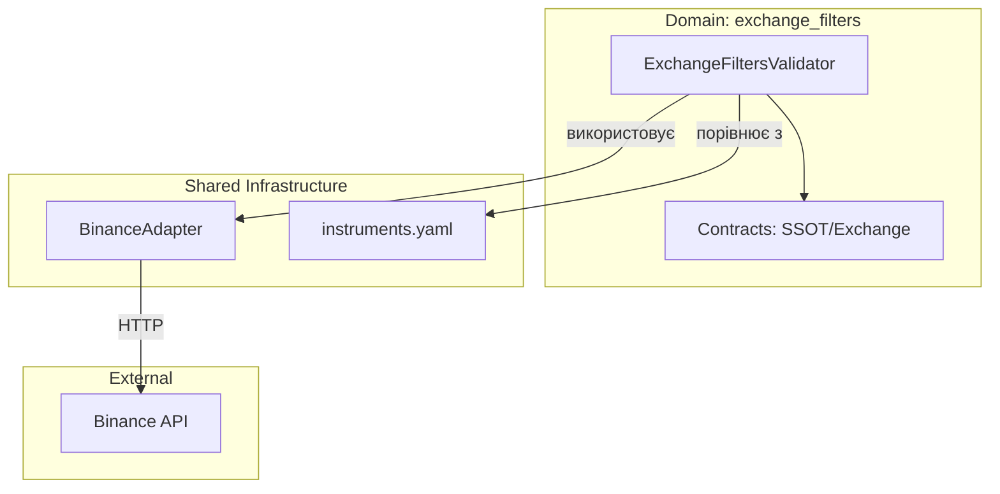
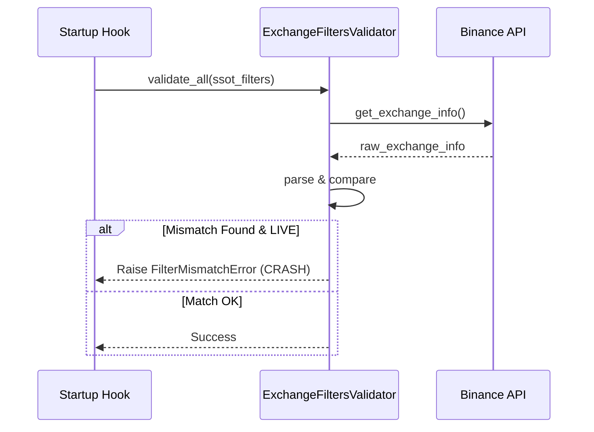

# Атлас домену Exchange Filters

## 1. Огляд (Scope & Purpose)
Домен **exchange_filters** — це охоронець цілісності конфігурації. Його основна задача — переконатися, що параметри торгових інструментів (step_size, min_qty, min_notional) у файлі `instruments.yaml` (SSOT) відповідають реальним обмеженням біржі.

**Межі відповідальності:**
- Отримання актуальної інформації про фільтри від біржі (Binance `exchangeInfo`).
- Порівняння SSOT-фільтрів з біржовими.
- Блокування запуску системи (Fail-closed) у разі критичних розбіжностей у режимі LIVE.

## 2. Карта залежностей (Dependencies)

- **Вхідні залежності:** `BinanceAdapter` (для запитів), `instruments.yaml` (конфігурація).
- **Вихідні:** `FilterMismatchError` або логування розбіжностей.

## 3. Карта файлів (File Map)
- `validator.py`: Логіка валідації та обробки помилок.
- `contracts.py`: Dataclasses для типізованого представлення фільтрів (`ExchangeFilters`, `SSOTFilters`).

## 4. Карта подій (Event Map)
*Домен не працює через події FSM*. Він викликається синхронно (або через асинхронні виклики функцій) під час фази розігріву (Warmup) системи.

## 5. Діаграма послідовності (Startup Validation)

