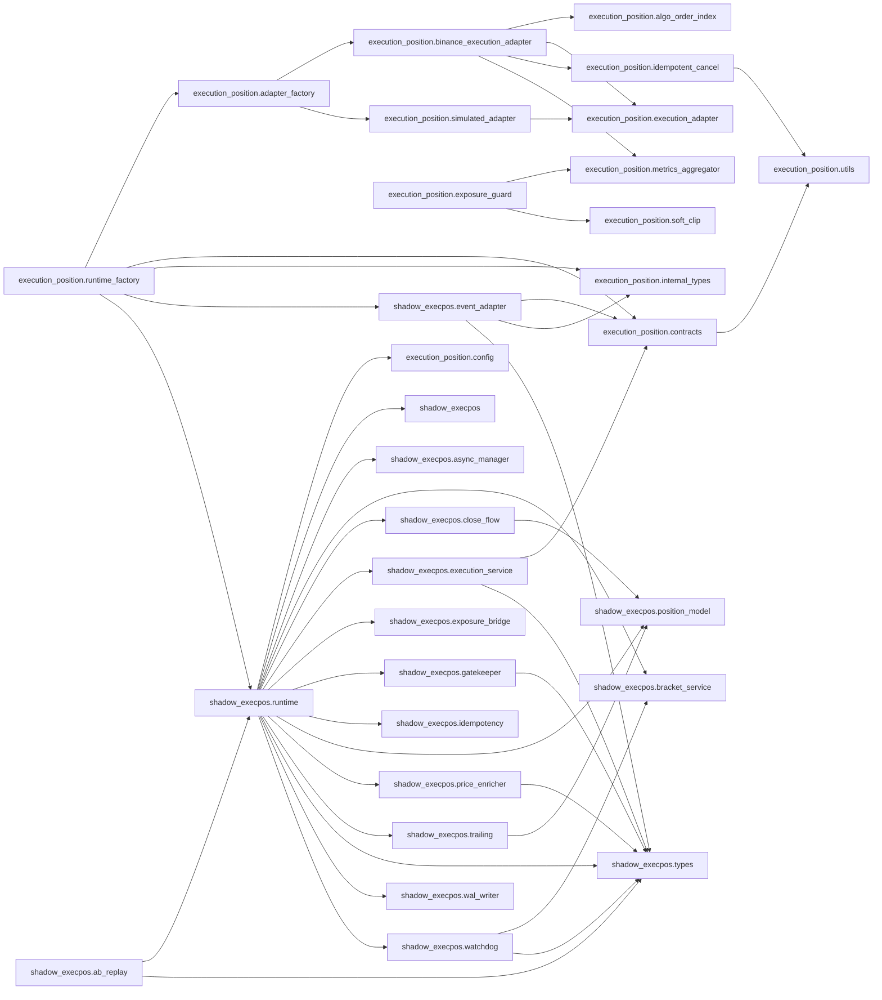

```mermaid
graph LR
    execution_position_adapter_factory[execution_position.adapter_factory] --> execution_position_binance_execution_adapter[execution_position.binance_execution_adapter]
    execution_position_adapter_factory[execution_position.adapter_factory] --> execution_position_simulated_adapter[execution_position.simulated_adapter]
    execution_position_binance_execution_adapter[execution_position.binance_execution_adapter] --> execution_position_algo_order_index[execution_position.algo_order_index]
    execution_position_binance_execution_adapter[execution_position.binance_execution_adapter] --> execution_position_execution_adapter[execution_position.execution_adapter]
    execution_position_binance_execution_adapter[execution_position.binance_execution_adapter] --> execution_position_idempotent_cancel[execution_position.idempotent_cancel]
    execution_position_binance_execution_adapter[execution_position.binance_execution_adapter] --> execution_position_metrics_aggregator[execution_position.metrics_aggregator]
    execution_position_contracts[execution_position.contracts] --> execution_position_utils[execution_position.utils]
    execution_position_exposure_guard[execution_position.exposure_guard] --> execution_position_metrics_aggregator[execution_position.metrics_aggregator]
    execution_position_exposure_guard[execution_position.exposure_guard] --> execution_position_soft_clip[execution_position.soft_clip]
    execution_position_idempotent_cancel[execution_position.idempotent_cancel] --> execution_position_utils[execution_position.utils]
    execution_position_runtime_factory[execution_position.runtime_factory] --> execution_position_adapter_factory[execution_position.adapter_factory]
    execution_position_runtime_factory[execution_position.runtime_factory] --> execution_position_contracts[execution_position.contracts]
    execution_position_runtime_factory[execution_position.runtime_factory] --> execution_position_internal_types[execution_position.internal_types]
    execution_position_runtime_factory[execution_position.runtime_factory] --> shadow_execpos_event_adapter[shadow_execpos.event_adapter]
    execution_position_runtime_factory[execution_position.runtime_factory] --> shadow_execpos_runtime[shadow_execpos.runtime]
    execution_position_simulated_adapter[execution_position.simulated_adapter] --> execution_position_execution_adapter[execution_position.execution_adapter]
    shadow_execpos_ab_replay[shadow_execpos.ab_replay] --> shadow_execpos_runtime[shadow_execpos.runtime]
    shadow_execpos_ab_replay[shadow_execpos.ab_replay] --> shadow_execpos_types[shadow_execpos.types]
    shadow_execpos_close_flow[shadow_execpos.close_flow] --> shadow_execpos_position_model[shadow_execpos.position_model]
    shadow_execpos_event_adapter[shadow_execpos.event_adapter] --> execution_position_contracts[execution_position.contracts]
    shadow_execpos_event_adapter[shadow_execpos.event_adapter] --> execution_position_internal_types[execution_position.internal_types]
    shadow_execpos_event_adapter[shadow_execpos.event_adapter] --> shadow_execpos_types[shadow_execpos.types]
    shadow_execpos_execution_service[shadow_execpos.execution_service] --> execution_position_contracts[execution_position.contracts]
    shadow_execpos_execution_service[shadow_execpos.execution_service] --> shadow_execpos_types[shadow_execpos.types]
    shadow_execpos_gatekeeper[shadow_execpos.gatekeeper] --> shadow_execpos_types[shadow_execpos.types]
    shadow_execpos_price_enricher[shadow_execpos.price_enricher] --> shadow_execpos_types[shadow_execpos.types]
    shadow_execpos_runtime[shadow_execpos.runtime] --> execution_position_config[execution_position.config]
    shadow_execpos_runtime[shadow_execpos.runtime] --> shadow_execpos[shadow_execpos]
    shadow_execpos_runtime[shadow_execpos.runtime] --> shadow_execpos_async_manager[shadow_execpos.async_manager]
    shadow_execpos_runtime[shadow_execpos.runtime] --> shadow_execpos_bracket_service[shadow_execpos.bracket_service]
    shadow_execpos_runtime[shadow_execpos.runtime] --> shadow_execpos_close_flow[shadow_execpos.close_flow]
    shadow_execpos_runtime[shadow_execpos.runtime] --> shadow_execpos_execution_service[shadow_execpos.execution_service]
    shadow_execpos_runtime[shadow_execpos.runtime] --> shadow_execpos_exposure_bridge[shadow_execpos.exposure_bridge]
    shadow_execpos_runtime[shadow_execpos.runtime] --> shadow_execpos_gatekeeper[shadow_execpos.gatekeeper]
    shadow_execpos_runtime[shadow_execpos.runtime] --> shadow_execpos_idempotency[shadow_execpos.idempotency]
    shadow_execpos_runtime[shadow_execpos.runtime] --> shadow_execpos_position_model[shadow_execpos.position_model]
    shadow_execpos_runtime[shadow_execpos.runtime] --> shadow_execpos_price_enricher[shadow_execpos.price_enricher]
    shadow_execpos_runtime[shadow_execpos.runtime] --> shadow_execpos_trailing[shadow_execpos.trailing]
    shadow_execpos_runtime[shadow_execpos.runtime] --> shadow_execpos_types[shadow_execpos.types]
    shadow_execpos_runtime[shadow_execpos.runtime] --> shadow_execpos_wal_writer[shadow_execpos.wal_writer]
    shadow_execpos_runtime[shadow_execpos.runtime] --> shadow_execpos_watchdog[shadow_execpos.watchdog]
    shadow_execpos_trailing[shadow_execpos.trailing] --> shadow_execpos_position_model[shadow_execpos.position_model]
    shadow_execpos_watchdog[shadow_execpos.watchdog] --> shadow_execpos_bracket_service[shadow_execpos.bracket_service]
    shadow_execpos_watchdog[shadow_execpos.watchdog] --> shadow_execpos_types[shadow_execpos.types]
```