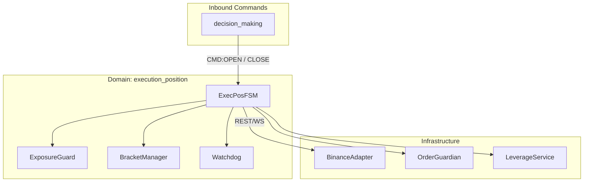

# Атлас домену Execution Position

## 1. Огляд (Scope & Purpose)
Домен **execution_position** є критичним виконавчим шаром системи. Він відповідає за детерміноване перетворення торгових намірів у реальні біржові ордери, супровід позицій (TP/SL) та гарантування цілісності торгового стану.

**Межі відповідальності:**
- Валідація та нормалізація об'ємів (`LOT_SIZE`) та цін (`TICK_SIZE`).
- Управління життєвим циклом ордерів (Entry -> TP/SL Brackets).
- Моніторинг ризиків експозиції та концентрації (`ExposureGuard`).
- Реконсиляція стану ордерів та позицій з біржею.
- Захист від помилок ціни (Anti-2021) та "завислих" ордерів (Watchdog).

## 2. Карта залежностей (Dependencies)

- **Вхідні:** `CMD:OPEN`, `CMD:CLOSE` (від `decision_making`).
- **Вихідні:** Виклики API через `BinanceAdapter`, події `EVT:ORDER_FILL`, `EVT:EXPOSURE_SUMMARY_UPDATED`.

## 3. Карта файлів (File Map)
- **FSM Orchestration:**
  - `fsm.py`: Головний оркестратор (4400+ LOC).
  - `fsm_open.py` / `fsm_manage.py` / `fsm_close.py`: Спеціалізовані потоки життєвого циклу.
- **Managers & Guards:**
  - `exposure_guard.py` & `exposure_manager.py`: Контроль ризиків та лімітів.
  - `bracket_manager.py`: Управління TP/SL ордерами.
  - `order_guardian.py`: Реконсиляція та очищення "сирітських" ордерів.
  - `watchdog.py`: Відстеження таймаутів та зависань.
- **Utilities:**
  - `qty_normalizer.py`: Сувора нормалізація до лімітів біржі.
  - `leverage_service.py`: Управління плечем та режимом маржі.
  - `order_index.py`: Індексація та запобігання дублюванню (Idempotency).

## 4. Карта подій (Event Map)

### Вхідні (Inbound)
| Назва події | Джерело | Опис |
| :--- | :--- | :--- |
| `CMD:OPEN` | Decision Making | Запит на відкриття позиції. |
| `CMD:CLOSE` | Decision Making | Запит на негайне закриття позиції. |
| `EVT:ORDER_ACK` | Adapter | Підтвердження розміщення ордера на біржі. |
| `EVT:ORDER_FILL` | Adapter | Повідомлення про виконання (часткове/повне). |

### Вихідні (Outbound)
| Назва події | Споживач | Опис |
| :--- | :--- | :--- |
| `EVT:EXPOSURE_SUMMARY_UPDATED` | Risk Management | Оновлена інформація про поточну експозицію. |
| `EVT:ORDER_REJECTED` | Telemetry | Повідомлення про відхилення ордера. |
| `EVT:DEC_CLOSE_COMPLETED` | Decision Making | Підтвердження завершення закриття позиції. |
