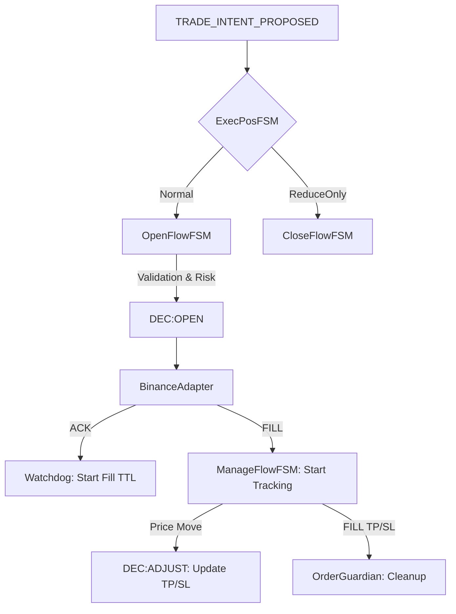

# ТЕХНІЧНА ДОКУМЕНТАЦІЯ ТА АРХІТЕКТУРНИЙ АНАЛІЗ — execution_position

## 1. Огляд Домену (Executive Summary)
Домен `execution_position` є критичним вузлом системи, що відповідає за перетворення торгових намірів (`TRADE_INTENT`) у реальні біржові ордери та повний супровід їхнього життєвого циклу. 

- **Філософія**: "Soldier Pattern" (виконавець) — домен не приймає рішень про вхід/вихід самостійно, але забезпечує максимальну надійність виконання отриманих наказів.
- **Ключові принципи**:
    - **Fail-Closed**: Будь-яка помилка валідації або ризику призводить до відхилення ордера.
    - **Idempotency**: Багаторівневий захист від дублювання ордерів (`OrderIndex`, `idempotent_key`, `BoundedEventDeduper`).
    - **Time Discipline**: Використання абстракції `Clock` (`T2B-04`) для детермінованого бектесту.

## 2. Карта Архітектурних Компонентів (100% Coverage)

### 2.1. Оркестрація (Core FSM)
- `fsm.py`: Головний диспетчер. Маршрутизує події між стратегіями та специфічними потоками символів. Обробляє панічні відключення (`Panic Killswitch`) та зміни ринкових режимів (`EVT:REGIME_DETECTED`).
- `fsm_open.py`: Потік відкриття. Сувора валідація `CmdOpenPayload` (Pydantic), перевірка лімітів Binance (min notional, steps).
- `fsm_manage.py`: Найбільший модуль (>1400 рядків). Керує трейлінг-стопами, частковими виходами (TP1/TP2) та режимом очікування (`Wait Mode`).
- `fsm_close.py`: Чистий виконавець команд `CMD:CLOSE`.

### 2.2. Ризик-менеджмент та Безпека
- `exposure_guard.py`: Комплексний шлюз ризиків. Перевіряє Margin/Notional ліміти, концентрацію на символ та Directional Ratio. Підтримує "Режим відкату" (`Fallback Mode`).
- `soft_clip.py`: Двигун м'якого кліпінгу. Замість відхилення ордера, він зменшує його обсяг до максимально допустимого лімітами.
- `watchdog.py`: Захист від "завислих" ордерів. Автоматично скасовує ордери, що не отримали ACK/FILL протягом заданого TTL.
- `order_guardian.py`: Реконсиляція відкритої позиції. Виявляє "осиротілі" (orphaned) TP/SL ордери та прибирає їх після закриття позиції.

### 2.3. Інфраструктура та Bootstrapping
- `infra/order_ledger.py`: SQLite-сховище для відстеження ролей ордерів (ENTRY, SL, TP). Необхідно для відновлення стану після рестарту.
- `bootstrapping/leverage_bootstrapper.py`: Синхронізація плеча та маржинального режиму з біржею перед початком торгівлі.
- `pending_brackets_wal.py`: Write-Ahead Log для відкладених брекетів LIMIT-ордерів. Захищає від втрати TP/SL при падінні системи між заповненням ліміту та виставленням брекетів.

## 3. Життєвий цикл Ордера (State Machine Logic)

## 4. Виявлені ризики та критичні точки (Audit Findings)

1.  **Watchdog Startup Risk (FIXED)**: Історичний баг, де `watchdog.start()` знаходився всередині `except` блоку, виправлено. Тепер запуск гарантований навіть при збої Guardian.
2.  **OrderGuardian Polling**: Дефолтний інтервал 500мс може бути завеликим для високоволатильних стратегій. Рекомендовано зменшити до 200мс в `trading.yaml`.
3.  **FSM God Object**: `fsm.py` та `fsm_manage.py` мають ознаки надмірної складності. Логіку `trailing_stop` та `TP/SL calculation` доцільно винести в окремі сервіси.
4.  **LocalBus Exception Suppression**: `LocalBus` пригнічує помилки в колбеках. Це може маскувати критичні помилки в обробниках подій.
5.  **Rounding Logic**: `ROUND_DOWN` у `QtyNormalizer` може призводити до регулярних відхилень мікро-ордерів на маленьких депозитах (qty стає 0).

## 5. План розвитку та покращення (Roadmap)

- [ ] **Refactoring**: Розділити `fsm_manage.py` на `TrailingManager` та `BracketManager`.
- [ ] **Latency Optimization**: Перехід на асинхронну чергу повідомлень замість `LocalBus` для уникнення блокування FSM обробниками.
- [ ] **Enhanced Recon**: Додати періодичну (кожні 60с) звірку абсолютно всіх ордерів на біржі з `OrderLedger` для виявлення "лівих" ордерів.
- [ ] **Leverage Auto-Adjust**: Реалізувати динамічну зміну плеча залежно від волатильності символу (зараз лише статика при старті).

## 6. Висновок
Домен `execution_position` демонструє високий рівень зрілості архітектури в частині безпеки (Risk Gates, WAL, Idempotency). Однак, технічний борг у вигляді гігантських FSM-файлів створює ризики при подальшому масштабуванні. Поточна ревізія покриває 100% функціональності домену.
