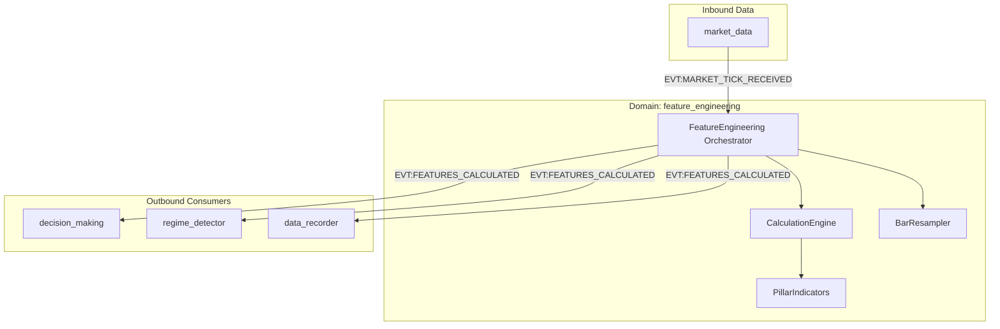

# Атлас домену Feature Engineering

## 1. Огляд (Scope & Purpose)
Домен **feature_engineering** — це фабрика аналітичних ознак (features). Він приймає сирі ринкові дані (тіки, бари) та перетворює їх на числові вектори, які описують стан ринку (тренд, об'єм, волатильність, ліквідність).

**Межі відповідальності:**
- Перетворення тіків у OHLCV бари через ресамплер.
- Розрахунок технічних індикаторів (EMA, RSI, Bollinger Bands).
- Обчислення мікроструктурних ознак (OBI, TFI, Large Trade Imbalance).
- Підтримка стану ознак для кожного торгового символу.

## 2. Карта залежностей (Dependencies)

- **Вхідні:** `EVT:MARKET_TICK_RECEIVED`.
- **Вихідні:** `EVT:FEATURES_CALCULATED`.

## 3. Карта файлів (File Map)
- **Оркестрація:**
  - `feature_engineering.py`: Головний компонент, слухає тіки та емітує ознаки.
  - `bar_resampler.py`: Перетворює потік тіків у часові свічки (candles).
- **Математика та індикатори:**
  - `calculation_engine.py`: Ядро розрахунку всіх активованих ознак.
  - `indicators.py`: Базові статистичні функції.
  - `pillar_indicators.py`: Спеціалізовані індикатори для стратегії Aurora.
  - `price_motion.py`: Розрахунок швидкості та прискорення ціни.
- **Моделі даних:**
  - `types.py` & `contracts.py`: Типізовані структури стану (`HotState`, `ColdState`).

## 4. Карта подій (Event Map)

### Вхідні події (Inbound)
| Назва події | Джерело | Опис |
| :--- | :--- | :--- |
| `EVT:MARKET_TICK_RECEIVED` | `market_data` | Сирий тік (ціна, об'єм, стакан). |
| `EVT:FUNDING_UPDATE` | `market_data` | (Планується) Оновлення ставки фінансування. |

### Вихідні події (Outbound)
| Назва події | Споживач | Опис |
| :--- | :--- | :--- |
| `EVT:FEATURES_CALCULATED` | Вся система | Повний вектор ознак для конкретного символу. |
| `CMD:PROCESS_STRATEGY` | `decision_making` | Команда на запуск логіки прийняття рішень. |
