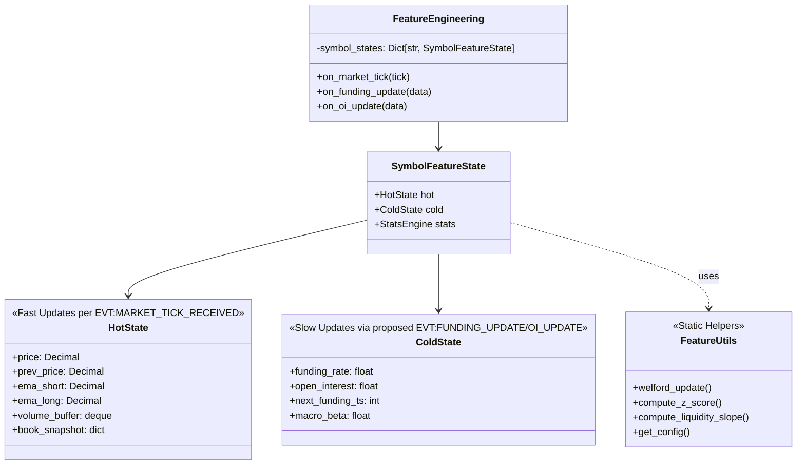

# FTR-DESIGN-01-FEATURES-V2: Futures-Grade High-Performance Feature Engineering

**System:** Aurora / Phenix Runtime  
**Domain:** `apps/reference/domains/feature_engineering`  
**Author:** Design Team (Gemini base + Aurora adaptation)  
**Date:** 2025-11-29  
**Last Updated:** 2025-11-29 (ADAPT-AURORA revision)  
**Status:** APPROVED DESIGN  
**Task ID:** FTR-DESIGN-01-FEATURES-V2-ADAPT-AURORA

---

## Table of Contents

1. [Executive Summary](#1-executive-summary)
2. [Invariants & Constraints](#2-invariants--constraints)
3. [Current State Audit](#3-current-state-audit)
4. [Architecture: Hot/Cold State Separation](#4-architecture-hotcold-state-separation)
5. [Futures-Grade Feature Set v2 Proposal](#5-futures-grade-feature-set-v2-proposal)
6. [Feature Semantics Contract](#6-feature-semantics-contract)
7. [DecisionContext Design (Logical)](#7-decisioncontext-design-logical)
8. [Configuration Integration](#8-configuration-integration)
9. [Roadmap: FTR-00 → FTR-04](#9-roadmap-ftr-00--ftr-04)
10. [Risks and Mitigations](#10-risks-and-mitigations)

---

## 1. Executive Summary

This document defines the **Futures-Grade Feature Set v2** for **Aurora/Phenix** runtime, specifically the `feature_engineering` domain located in `apps/reference/domains/feature_engineering`.

Unlike typical "spot" implementations, this design prioritizes:
- **Runtime performance** (O(1) complexity per tick)
- **Data consistency** in an asynchronous FSM environment
- **Contract-first approach** with additive-only versioning

### Key Principles

1. **Performance First**: No O(N) loops on trade lists per tick. Use O(1) aggregates (Welford's Algorithm, Running Counters).
2. **State Separation**: Split per-symbol state into `HotState` (tick-critical, ms latency) and `ColdState` (Funding/OI, min/hour latency).
3. **Robust Math**: Use `FeatureUtils` for safe configuration, robust scaling (clipping), and online statistics.
4. **Contract-first**: Backward-compatible extension of `EVT:FEATURES_CALCULATED`. New features = new keys only.
5. **No breaking changes**: Existing consumers continue working without modification.

---

## 2. Invariants & Constraints

These rules **MUST** be followed throughout all FTR-* tasks:

### 2.1 No Runtime Behavior Changes (in design phase)
- This document does NOT change `feature_engineering.py`
- No changes to `decision_making`, `regime_detector`
- Implementation happens in separate FTR-00..FTR-04 tasks

### 2.2 Contract-first, Additive-only
- Event `EVT:FEATURES_CALCULATED` schema remains backward-compatible
- New features = **new keys** in `features{}` object
- No renaming of existing features (`obi`, `tfi`, `ema_bias`, etc.)

### 2.3 No New Cross-Domain Dependencies
- All domain interactions are via events only
- `feature_engineering` **imports**: `EVT:MARKET_TICK_RECEIVED` (from `market_data`)
- `feature_engineering` **exports**: `EVT:FEATURES_CALCULATED` (to `decision_making`, `risk_strategy`, `analyzer`, `feature_store`)

### 2.4 Event Naming Convention (Aurora/Phenix)

| This Document | Actual Event Name (Aurora) |
|---------------|---------------------------|
| `EVT:MARKET_TICK` | **`EVT:MARKET_TICK_RECEIVED`** |
| `EVT:FEATURES_CALCULATED` | `EVT:FEATURES_CALCULATED` (unchanged) |
| `EVT:REGIME_DETECTED` | `EVT:REGIME_DETECTED` (unchanged) |

### 2.5 Proposed Events (not yet in codebase)

The following events are **proposed** for Cold State features. They must be introduced in `market_data` or a dedicated `metadata` domain **before** FTR-04:

| Proposed Event | Source Domain | Description |
|----------------|---------------|-------------|
| `EVT:FUNDING_UPDATE` | `market_data` / `metadata` | Funding rate data from exchange |
| `EVT:OI_UPDATE` | `market_data` / `metadata` | Open Interest updates |

> **Note:** `feature_engineering` will only **consume** these events, not define them.

---

## 3. Current State Audit

### 3.1 Domain Location
- **Path:** `apps/reference/domains/feature_engineering/`
- **Main file:** `feature_engineering.py` (612 LOC)
- **Config:** `config/aurora/features.yaml`
- **Domain dict:** `domain_dict.json`

### 3.2 Features Currently Emitted (v1)

From `domain_dict.json` and runtime analysis:

| Feature | Group | Range | Status |
|---------|-------|-------|--------|
| `obi` | flow | [-1, 1] | ✅ Production |
| `tfi` | flow | [-1, 1] | ✅ Production |
| `delta_price` | trend | ℝ | ✅ Production |
| `price` | meta | ℝ | ✅ Production |
| `liquidity_kappa` | liquidity | [0.3, 1.0] | ✅ Production |
| `absorption` | flow | - | ⚠️ Placeholder (always "0.0") |
| `ema_bias` | trend | [0, 1] | ✅ Phase 1 |
| `volume_spike` | volume | [0, 1] | ✅ Phase 1 |
| `volatility_state` | volatility | [0, 1] | ✅ Phase 1 |
| `depth_imbalance` | liquidity | [0, 1] | ✅ Phase 1 |
| `macro_sync` | macro | [0, 1] | ✅ Phase 1 |

### 3.3 Event Flow (Current)

```
┌──────────────────────────────────────────────────────────────┐
│                       market_data                             │
│                    (WebSocket/REST)                           │
└──────────────────────────┬───────────────────────────────────┘
                           │
                           ▼ EVT:MARKET_TICK_RECEIVED
┌──────────────────────────────────────────────────────────────┐
│              feature_engineering (FeatureEngineering)        │
│                                                               │
│  1. Store tick (first tick only stored, no emission)         │
│  2. Calculate: obi, tfi, delta_price, liquidity_kappa        │
│  3. If enable_new_metrics:                                   │
│     - ema_bias, volume_spike, volatility_state               │
│     - depth_imbalance, macro_sync                            │
│  4. Emit EVT:FEATURES_CALCULATED                             │
└──────────────────────────┬───────────────────────────────────┘
                           │
                           ▼ EVT:FEATURES_CALCULATED
     ┌─────────────────────┼─────────────────────┐
     ▼                     ▼                     ▼
decision_making    regime_detector         risk_strategy
```

### 3.4 Gaps Identified

1. **No Futures-Specific Data**: Missing Funding Rate, Open Interest
2. **No Large Trade Detection**: `absorption` is placeholder
3. **regime_detector gap**: Expects `sma_short`, `sma_long` features that `feature_engineering` does NOT provide — regime_detector calculates them internally (duplication)
4. **Magic numbers partially resolved**: Config refactoring done via Pydantic, but `FeatureUtils` helper not yet implemented

---

## 4. Architecture: Hot/Cold State Separation

To prevent locking the main loop while waiting for slow data (Funding/OI), we bifurcate the per-symbol state.

> **Scope:** This is the **internal state** of the `feature_engineering` domain in `apps/reference/domains/feature_engineering`. It does NOT affect external event contracts.



### 4.1 Data Flow

1. **`EVT:MARKET_TICK_RECEIVED`** → Updates `HotState`. Reads *last known* values from `ColdState`. Computes Features. Emits `EVT:FEATURES_CALCULATED`. (Non-blocking)
2. **`EVT:FUNDING_UPDATE`** (proposed) → Updates `ColdState.funding_rate` only. No immediate emission.
3. **`EVT:OI_UPDATE`** (proposed) → Updates `ColdState.open_interest` only.

### 4.2 FTR-02 Refactoring Constraints

When implementing Hot/Cold State architecture (FTR-02):
- **MUST NOT change event interfaces** (`EVT:FEATURES_CALCULATED` payload)
- **MUST NOT change emitted feature values** (verified by FTR-00 tests)
- Internal refactoring only — external contract unchanged

---

## 5. Futures-Grade Feature Set v2 Proposal

### 5.1 Trend / Direction Features

#### 5.1.1 `ema_bias` (Existing, Optimized)

* **Formula:** `(EMA_short - EMA_long) / EMA_long`, normalized to [0, 1]
* **Config:** `features.yaml` → `feature_engineering.ema.period_short/long`, `ema_bias.clamp_min/max`
* **Semantics:** >0.5 = bullish, <0.5 = bearish, 0.5 = neutral
* **Status:** ✅ Production (Phase 1)

#### 5.1.2 `ema_bias_mid` (NEW — proposed)

* **Semantics:** Medium-term trend (10/30 periods) for regime alignment
* **Usage:** Optional — for regime_detector alignment
* **Note:** May help close the gap where regime_detector calculates its own SMAs

---

### 5.2 Order Flow Features

#### 5.2.1 `tfi` (Existing)

* **Formula:** `(BuyVol - SellVol) / TotalVol`
* **Range:** [-1, 1]
* **Status:** ✅ Production

#### 5.2.2 `large_trade_imbalance` (NEW — O(1) method)

* **Problem:** Iterating through trades list is O(N) and kills CPU
* **Solution:** Use **Average Trade Size** proxy (O(1))
* **Formula:**
  ```python
  # Requires buy_count, sell_count from market_data
  avg_buy_size = buy_volume / buy_count if buy_count > 0 else 0
  avg_sell_size = sell_volume / sell_count if sell_count > 0 else 0
  denom = avg_buy_size + avg_sell_size
  imbalance = (avg_buy_size - avg_sell_size) / denom if denom > 0 else 0
  ```
* **Semantics:** If `avg_buy_size` >> `avg_sell_size`, whales are buying aggressively
* **Range:** [-1, 1]
* **Group:** `flow`
* **Dependency:** Requires `buy_count`, `sell_count` fields in `EVT:MARKET_TICK_RECEIVED`

---

### 5.3 Order Book / Liquidity Features

#### 5.3.1 `obi` (Existing — Top-of-Book)

* **Formula:** `(bid_size - ask_size) / (bid_size + ask_size)`
* **Range:** [-1, 1]
* **Status:** ✅ Production

#### 5.3.2 `liquidity_kappa` (Existing)

* **Formula:** `depth / (depth + depth_half)`, clamped to [kappa_min, kappa_max]
* **Config:** `features.yaml` → `liquidity.depth_half`, `kappa_min`, `kappa_max`
* **Status:** ✅ Production

#### 5.3.3 `liquidity_impact_index` (NEW — Order Book Slope)

* **Problem:** Summing depth is inaccurate for slippage estimation
* **Solution:** **Order Book Slope** — cost to move price by X basis points
* **Formula:**
  1. Take top N levels (e.g., 5) from orderbook
  2. Calculate USD volume required to move price by **X bps** (e.g., 5 bps)
  3. `slope = usd_cost / basis_points`
  4. Normalize via robust scaling (or log-scale)
* **Semantics:** Higher = High Liquidity (hard to move price). Lower = Slippage Risk
* **Range:** [0, 1] (normalized)
* **Group:** `liquidity`

> **⚠️ Dependency Warning:** This feature requires richer orderbook data in `EVT:MARKET_TICK_RECEIVED`.
> 
> **Current payload** has only `bid_size`, `ask_size` (aggregated depth).
> 
> **Required:** Top-N price levels with individual volumes, OR degraded mode using only top-of-book + aggregated depth.

#### 5.3.4 `spread_bps` (NEW)

* **Formula:** `(ask_price - bid_price) / mid_price * 10000`
* **Usage:** Execution gate — don't trade if `spread_bps > limit`
* **Range:** ℝ+ (basis points)
* **Group:** `liquidity`
* **Dependency:** Requires `bid_price`, `ask_price` in market tick (currently not in payload)

---

### 5.4 Volatility / Regime Features

#### 5.4.1 `volatility_state` (Existing)

* **Formula:** `current_range / SMA(historical_ranges, sma_length)`, capped and normalized
* **Config:** `features.yaml` → `volatility.window_sec`, `sma_length`, `volatility_state.cap_max`
* **Range:** [0, 1]
* **Status:** ✅ Production (Phase 1)

#### 5.4.2 `atr_ratio` (NEW — proposed)

* **Formula:** `ATR(14) / SMA(ATR, 100)`
* **Implementation:** Calculated on HotState tick data, but updated less frequently (e.g., per candle close)
* **Usage:** Regime detection alignment
* **Range:** ℝ+ (normalized via clipping)

---

### 5.5 Volume / Anomalies Features

This section defines **two modes**: Default (production-ready) and Advanced (optional).

#### 5.5.1 `volume_spike` (Existing — Default Mode)

**Default (v2 base) — ratio-based:**

* **Formula:** `current_vol / SMA(vol, n)`
* **Config:** `features.yaml` → `volume.window_sec`, `sma_length`, `volume_spike.cap_max`
* **Normalization:** Capped at `cap_max` (e.g., 3.0), then divided by cap → [0, 1]
* **Pros:** Simple, cheap, familiar
* **Status:** ✅ Production (Phase 1)

```python
# Current implementation
spike_ratio = current_vol / sma_vol if sma_vol > 0 else 0
capped = min(spike_ratio, cfg.volume_spike_cap_max)
volume_spike = Decimal(capped / cfg.volume_spike_cap_max)
```

#### 5.5.2 `volume_zscore` (NEW — Advanced Mode, Optional)

**Advanced mode — Welford's Algorithm:**

* **Formula:** Online mean/std via Welford, then Z-score
* **Implementation:**
  ```python
  # O(1) online update
  (count, mean, m2) = FeatureUtils.welford_update(existing_stats, current_vol)
  std = sqrt(m2 / count) if count > 1 else 1.0
  z_score = (current_vol - mean) / std
  
  # Robust clipping (from config)
  z_score_clamped = clip(z_score, -clip_sigma, clip_sigma)
  
  # Map to [0, 1] via tanh or linear
  volume_zscore = (tanh(z_score_clamped) + 1) / 2
  ```
* **Config:** `features.yaml` → `volume.zscore.enabled`, `volume.zscore.clip_sigma`
* **Range:** [0, 1]
* **Default:** **Disabled** — not part of base v2 configuration

```yaml
# features.yaml v2 extension (example)
feature_engineering:
  volume:
    # ... existing window_sec, sma_length ...
    zscore:
      enabled: false         # Advanced mode disabled by default
      use_welford: true
      clip_sigma: 5.0        # Clip at ±5 sigma
```

---

### 5.6 Futures-Specific Features (Cold State)

*These features are stored in `ColdState` and updated asynchronously via **proposed** events.*

#### 5.6.1 `funding_rate_normalized` (NEW)

* **Data Source:** `ColdState.funding_rate` (from proposed `EVT:FUNDING_UPDATE`)
* **Formula:** `clamp(funding_rate / extreme_threshold, -1, 1)`
* **Config:** `features.yaml` → `futures.funding.extreme_threshold` (e.g., 0.001 = 0.1%)
* **Semantics:** Extreme values indicate overcrowded trade (counter-trend signal)
* **Range:** [-1, 1]
* **Group:** `futures`

#### 5.6.2 `oi_delta_pct` (NEW)

* **Data Source:** `ColdState.open_interest` (from proposed `EVT:OI_UPDATE`)
* **Formula:** `(CurrentOI - OI_1h_Ago) / OI_1h_Ago`
* **Semantics:**
  - Rising OI + Price Trend = Strong Trend (new money entering)
  - Falling OI + Price Trend = Weakness (short covering / profit taking)
* **Range:** ℝ (percentage change)
* **Group:** `futures`

---

### 5.7 Macro Sync Features

#### 5.7.1 `macro_sync` (Existing)

* **Formula:** `mean(Pearson(symbol_returns, anchor_returns))`
* **Anchors:** Configurable (default: BTCUSDT, ETHUSDT)
* **Config:** `features.yaml` → `macro_sync.anchors`, `window`, `min_buffer_size`
* **Range:** [0, 1] (normalized from correlation [-1, 1])
* **Status:** ✅ Production (Phase 1)

---

## 6. Feature Semantics Contract

### 6.1 Event Schema: `EVT:FEATURES_CALCULATED`

Backward-compatible schema with v2 additive keys:

```json
{
  "ts": 1640995200000,
  "symbol": "BTCUSDT",
  "features": {
    // === V1 FEATURES (existing, unchanged) ===
    "obi": "-0.15",
    "tfi": "0.23",
    "delta_price": "25.50",
    "price": "45000.50",
    "absorption": "0.0",
    "liquidity_kappa": "0.82",
    "ema_bias": "0.62",
    "volume_spike": "0.45",
    "volatility_state": "0.78",
    "depth_imbalance": "0.52",
    "macro_sync": "0.71",
    
    // === V2 FEATURES (new, additive) ===
    "large_trade_imbalance": "0.35",      // FTR-03
    "liquidity_impact_index": "0.80",     // FTR-03 (requires data)
    "spread_bps": "1.2",                  // FTR-03 (requires data)
    "volume_zscore": "0.65",              // FTR-03 (optional, flag-gated)
    "funding_rate_normalized": "0.3",     // FTR-04
    "oi_delta_pct": "0.05"                // FTR-04
  }
}
```

### 6.2 Feature Metadata Registry

Each feature MUST have documented semantics:

| Feature | Group | Range | Monotonicity | Usage |
|---------|-------|-------|--------------|-------|
| `obi` | flow | [-1, 1] | +1 = bullish | decision, regime |
| `tfi` | flow | [-1, 1] | +1 = bullish | decision, regime |
| `delta_price` | trend | ℝ | +/- = direction | decision |
| `price` | meta | ℝ | n/a | reference |
| `absorption` | flow | - | - | placeholder |
| `liquidity_kappa` | liquidity | [0.3, 1] | higher = more liquid | decision |
| `ema_bias` | trend | [0, 1] | >0.5 = bullish | decision, regime |
| `volume_spike` | volume | [0, 1] | higher = anomaly | decision |
| `volatility_state` | volatility | [0, 1] | higher = volatile | regime |
| `depth_imbalance` | liquidity | [0, 1] | higher = sell pressure | decision |
| `macro_sync` | macro | [0, 1] | higher = correlated | decision |
| `large_trade_imbalance` | flow | [-1, 1] | +1 = whale buying | decision (v2) |
| `funding_rate_normalized` | futures | [-1, 1] | extreme = contrarian | decision (v2) |
| `oi_delta_pct` | futures | ℝ | context-dependent | decision (v2) |

---

## 7. DecisionContext Design (Logical)

> **Note:** This section describes the **logical** structure of how `decision_making` domain consumes features. It does NOT propose changes to `decision_making.py` code.

### 7.1 Feature Consumption Pattern

The `decision_making` domain receives `EVT:FEATURES_CALCULATED` and builds its internal `DecisionContext`:

```
DecisionContext = {
    features: Dict[str, Decimal],      // from EVT:FEATURES_CALCULATED
    regime: RegimeState,               // from EVT:REGIME_DETECTED
    position: PositionState,           // from EVT:PORTFOLIO_STATE_UPDATED
    risk_limits: RiskBudget,           // from EVT:RISK_ASSESSMENT_COMPLETED
}
```

### 7.2 Feature Views (Logical Grouping)

Decision domain MAY internally group features into semantic views:

| View | Features Used |
|------|--------------|
| `trend_view` | `ema_bias`, `delta_price`, `ema_bias_mid` |
| `flow_view` | `obi`, `tfi`, `large_trade_imbalance` |
| `liquidity_view` | `liquidity_kappa`, `depth_imbalance`, `spread_bps`, `liquidity_impact_index` |
| `volatility_view` | `volatility_state`, `volume_spike`, `volume_zscore` |
| `futures_view` | `funding_rate_normalized`, `oi_delta_pct` |
| `macro_view` | `macro_sync` |

### 7.3 Regime Integration

The `regime_detector` domain:
- **Imports:** `EVT:FEATURES_CALCULATED`
- **Exports:** `EVT:REGIME_DETECTED`
- **Uses features:** Currently calculates own SMAs; v2 could use `ema_bias`, `volatility_state`

**Gap to address in FTR-01:** Define which features `regime_detector` should consume vs calculate internally.

---

## 8. Configuration Integration

### 8.1 Current Config Style (Aurora/Phenix)

From `config/aurora/features.yaml`:

```yaml
feature_engineering:
  enable_new_metrics: true

  ema:
    period_short: 3
    period_long: 7

  ema_bias:
    clamp_min: -0.02
    clamp_max: 0.02

  volume:
    window_sec: 60
    sma_length: 5

  volume_spike:
    cap_max: 3.0

  volatility:
    window_sec: 60
    sma_length: 10

  volatility_state:
    cap_max: 3.0

  liquidity:
    depth_half: 1000.0
    kappa_min: 0.3
    kappa_max: 1.0

  # ... etc
```

### 8.2 V2 Config Extensions (Proposed)

Extend **existing structure** (not new format):

```yaml
feature_engineering:
  # === Existing v1 config (unchanged) ===
  enable_new_metrics: true
  ema:
    period_short: 3
    period_long: 7
  # ... etc ...

  # === V2 extensions (additive) ===
  
  # Medium-term EMA for regime alignment
  ema_mid:
    enabled: false            # Disabled by default
    period_short: 10
    period_long: 30

  # Advanced volume z-score (optional)
  volume:
    window_sec: 60
    sma_length: 5
    zscore:
      enabled: false          # DISABLED by default
      use_welford: true
      clip_sigma: 5.0

  # Large trade detection
  flow:
    large_trade:
      enabled: true
      method: "avg_trade_size"  # O(1) method

  # Liquidity slope (requires extended market data)
  liquidity:
    depth_half: 1000.0
    kappa_min: 0.3
    kappa_max: 1.0
    impact_slope:
      enabled: false          # Disabled until market_data extended
      bps_target: 5
      normalization_cap: 1000000  # USD

  # Futures-specific (Cold State)
  futures:
    enabled: false            # Disabled until EVT:FUNDING_UPDATE exists
    funding:
      extreme_threshold: 0.001  # 0.1%
    oi:
      lookback_hours: 1
```

### 8.3 FeatureUtils Helper

```python
class FeatureUtils:
    @staticmethod
    def get_config(config: dict, path: str, default: Any) -> Any:
        """Safe config access without try/except."""
        keys = path.split(".")
        value = config
        for key in keys:
            if isinstance(value, dict) and key in value:
                value = value[key]
            else:
                return default
        return value
```

---

## 9. Roadmap: FTR-00 → FTR-04

**Order is critical for maintaining stability.**

### FTR-00: Freeze v1 Behaviour & Tests

> **Purpose:** Create a "safety net" before any refactoring.

* **Goal:** Lock current feature calculation logic so FTR-01..FTR-04 can be verified.
* **Tasks:**
  1. Extract from `feature_engineering.py` the exact list of features emitted: `obi`, `tfi`, `delta_price`, `price`, `absorption`, `liquidity_kappa`, `ema_bias`, `volume_spike`, `volatility_state`, `depth_imbalance`, `macro_sync`.
  2. Create/update Pydantic model and/or JSON Schema for `features_calculated_v1` (additive-only).
  3. Write **snapshot tests** that:
     - Given fixed input ticks, assert exact feature values.
     - If any future change breaks these, tests fail.
  4. These tests become the "regression guard" for FTR-02 refactoring.
* **Deliverable:** `tests/units/test_feature_engineering_v1_snapshot.py` (or similar)

---

### FTR-01: Feature Contract & Utils (Foundational)

* **Files:** `contracts.py` (new), `utils.py` (new)
* **Tasks:**
  1. Define Pydantic models for v1 and v2 feature schema (additive).
  2. Implement `FeatureUtils` class:
     - `get_config(config, path, default)` — safe nested access
     - `welford_update(aggregate, value)` — O(1) online stats
     - `compute_slope(levels, target_bps)` — liquidity slope helper
  3. Document feature metadata registry (group, range, monotonicity, usage).
* **Deliverable:** New files in `apps/reference/domains/feature_engineering/`

---

### FTR-02: Architecture Refactoring (Hot/Cold State + SymbolFeatureState)

* **Files:** `feature_engineering.py`
* **Constraint:** **No change to emitted values** (verified by FTR-00 tests)
* **Tasks:**
  1. Create `SymbolFeatureState` class with `HotState` and `ColdState` dataclasses.
  2. Refactor per-symbol state storage to use new structure.
  3. `on_market_tick` updates `HotState`, reads `ColdState` snapshot.
  4. Add stub handlers for `on_funding_update`, `on_oi_update` (no-op until events exist).
  5. Run FTR-00 snapshot tests — must pass without changes.
* **Deliverable:** Cleaner internal architecture, same external behavior.

---

### FTR-03: Optimized Math Implementation

* **Goal:** Add new v2 features with robust/fast implementations.
* **Tasks:**
  1. Implement `large_trade_imbalance` using avg trade size method (O(1)).
  2. Implement `volume_zscore` (optional, behind `volume.zscore.enabled` flag).
  3. Implement `liquidity_impact_index` (stub returning `None` until market_data extended).
  4. Implement `spread_bps` (stub returning `None` until bid_price/ask_price available).
  5. Add features to emitted payload (additive keys).
  6. Update JSON Schema for v2.
* **Deliverable:** New features in `EVT:FEATURES_CALCULATED` payload.

---

### FTR-04: Futures Data Integration (Cold State)

* **Goal:** Connect slow data sources for futures-specific features.
* **Dependency:** `market_data` or `metadata` domain must emit `EVT:FUNDING_UPDATE`, `EVT:OI_UPDATE`.
* **Tasks:**
  1. Implement `on_funding_update` handler → writes to `ColdState.funding_rate`.
  2. Implement `on_oi_update` handler → writes to `ColdState.open_interest`.
  3. Compute `funding_rate_normalized` and `oi_delta_pct` features.
  4. Emit in `EVT:FEATURES_CALCULATED` (additive keys).
* **Deliverable:** Full Cold State integration.

---

## 10. Risks and Mitigations

| Risk | Impact | Mitigation |
|------|--------|------------|
| **Latency Spikes** | Slow tick processing | Use O(1) aggregates (Welford, avg size). No O(N) loops. |
| **Data Staleness (Cold State)** | Stale funding/OI | Design accepts slow updates; use "last known" value. |
| **Outliers (Fat Tails)** | Extreme z-scores | Hard clipping at ±5 sigma in `FeatureUtils`. |
| **Breaking Changes** | Consumer failures | New features = additive keys only. FTR-00 tests guard v1. |
| **OrderBook Slope requires richer data** | Feature unavailable | Return `None` until `market_data` extended. Gate behind config flag. |
| **Proposed events don't exist** | FTR-04 blocked | Coordinate with `market_data` domain team. Document dependency. |
| **Regime uses own SMAs** | Duplication | FTR-01 defines contract for shared features. Optional alignment. |

---

**End of Design Document**

*Last updated: 2025-11-29 (FTR-DESIGN-01-FEATURES-V2-ADAPT-AURORA)*
