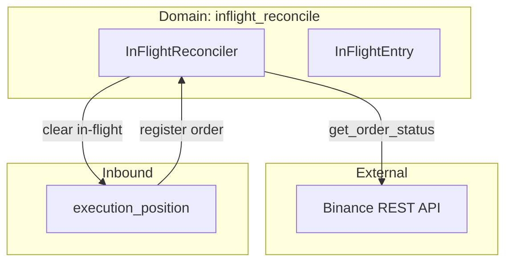
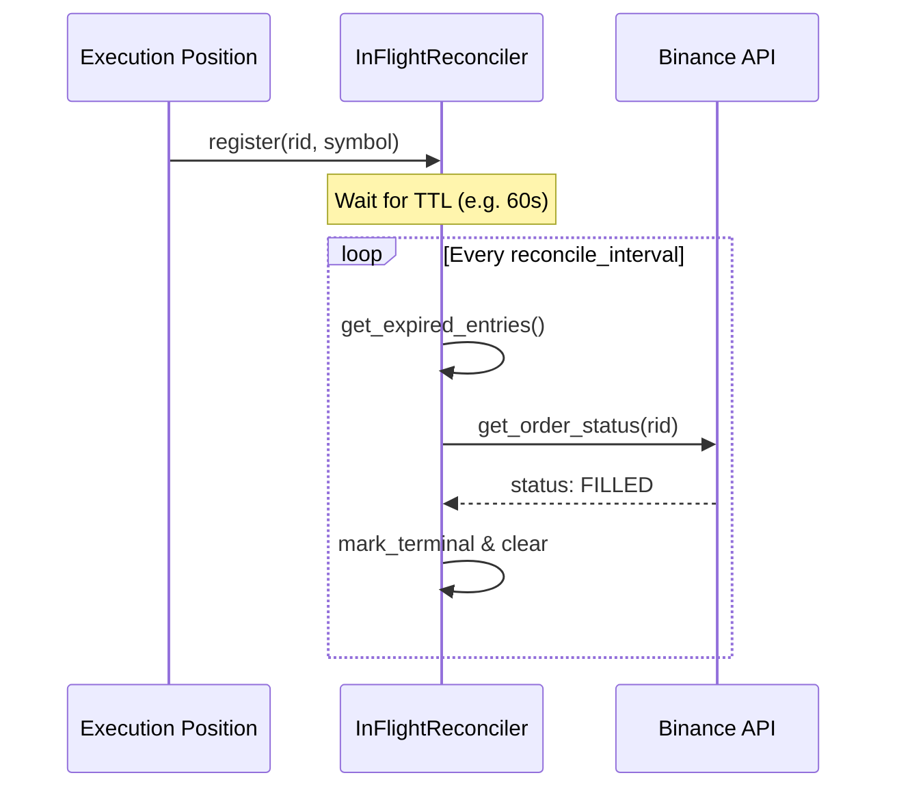

# Атлас домену In-Flight Reconcile

## 1. Огляд (Scope & Purpose)
Домен **inflight_reconcile** виконує роль "санітара" для торгових ордерів, що знаходяться у процесі виконання (in-flight). Його головна задача — запобігти вічному блокуванню системи через ордери, статус яких не був оновлений через стандартні канали (WebSocket).

**Межі відповідальності:**
- Відстеження часу життя (TTL) активних ордерів.
- Активна звірка статусу ордерів через REST API після закінчення TTL.
- Примусове очищення локального стану "in-flight" для розблокування нових операцій.

## 2. Карта залежностей (Dependencies)

- **Вхідні:** Реєстрація ордерів від `execution_position`.
- **Вихідні:** Запити статусу до `BinanceAdapter`.

## 3. Карта файлів (File Map)
- `reconciler.py`: Основна логіка відстеження та цикл звірки.
- `config.py`: Параметри TTL та інтервалів перевірки.

## 4. Карта подій (Event Map)
*Домен працює переважно через прямі виклики методів (Method Injection) з `execution_position`, але результати звірки можуть впливати на стан FSM.*

## 5. Діаграма послідовності (Reconciliation Flow)

