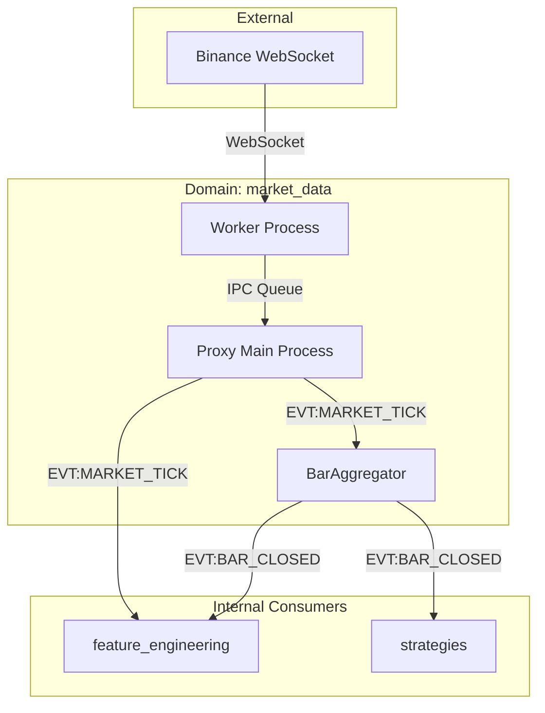

# Атлас домену Market Data

## 1. Огляд (Scope & Purpose)
Домен **market_data** — це вхідні ворота системи. Його місія — отримувати сирий потік даних з біржі (Binance) та перетворювати його на впорядковані події для всієї платформи. Він гарантує, що час подій (Event Time) має пріоритет над системним часом.

**Межі відповідальності:**
- Підключення до WebSocket Binance (bookTicker, aggTrade).
- Агрегація тіків у часові бари (OHLCV).
- Ізоляція мережевого вводу-виводу (IO) від ядра системи через багатопроцесність.
- Забезпечення Single Source of Truth для котирувань та об'ємів.

## 2. Карта залежностей (Dependencies)

- **Вхідні:** Дані Binance WebSocket.
- **Вихідні:** `EVT:MARKET_TICK_RECEIVED`, `EVT:BAR_CLOSED`, `EVT:ANCHOR_UPDATED`.

## 3. Карта файлів (File Map)
- **Multi-Process Layer:**
  - `worker.py`: Ізольований процес для WebSocket з'єднання.
  - `proxy.py`: Міст у головному процесі, що передає дані в шину FSM.
- **Aggregation Logic:**
  - `bar_aggregator.py`: Перетворює тіки в бари (OHLCV).
  - `websocket_aggregator.py`: Накопичує стакан та об'єм угод.
- **Legacy:**
  - `market_data_connector.py`: Стара однопоточна реалізація (DEPRECATED).

## 4. Карта подій (Event Map)

### Вихідні події (Outbound)
| Назва події | Опис | Призначення |
|-------------|------|-------------|
| `EVT:MARKET_TICK_RECEIVED` | Знімок стакану та об'єму | Розрахунок мікроструктурних ознак |
| `EVT:BAR_CLOSED` | Завершений OHLCV бар | Тригер для стратегій та індикаторів |
| `EVT:ANCHOR_UPDATED` | Оновлення ціни якоря (напр. BTC) | Розрахунок кореляцій (Macro Sync) |

### Вхідні події (Inbound)
*Домен є первинним джерелом даних і не споживає внутрішніх подій.*
