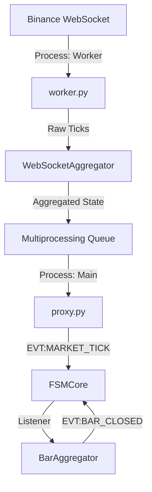

# DOMAIN DOCUMENTATION — market_data

## 1. Філософія та Огляд Домену (Domain Philosophy & Overview)
Домен `market_data` — це "нервова система" торгової платформи. Його місія — перетворити хаотичний, шумний потік даних із зовнішнього світу (Binance) на впорядкований, детермінований потік подій для внутрішніх споживачів.

### Ключові принципи
1.  **Single Source of Truth (SSOT)**: Жоден інший домен не має права підключатися до біржі напряму. Всі дані легітимізуються лише тут.
2.  **Event Time > Wall Clock**: Ми довіряємо лише часовій мітці біржі (`ts`). Час сервера використовується лише для діагностики, але ніколи для агрегації. Це дозволяє проводити детерміновані бектести.
3.  **Fail-Fast Configuration**: Якщо конфігурація некоректна (наприклад, дублікати символів), домен відмовляється стартувати, щоб не продукувати сміття.
4.  **Process Isolation**: Критичний IO винесено в окремий процес, щоб захистити ядро стратегії (Decision Making) від блокувань GIL.

### Контекст Міграції (Legacy -> Tick-to-Bar)
Історично система реагувала на кожен тік. Зараз архітектура зміщена в бік **Bar-Based Execution**.
-   **Old Flow**: `on_tick` -> обчислення індикаторів (високе навантаження).
-   **New Flow**: `BarAggregator` накопичує тіки -> `EVT:BAR_CLOSED` -> обчислення індикаторів раз на хвилину (стабільність).
Домен повністю підтримує цю парадигму.

## 2. Архітектура та Топологія (Architecture & Topology)
Домен використовує патерн **Hybrid Multi-Process Proxy**.

## 3. Публічні Контракти (Inter-Domain Contracts)

### Вхідні Сигнали
Домен ініціалізується при старті `main.py` через `AuroraConfig`. Він не слухає події від інших доменів (він є джерелом, Source).

### Вихідні Події
1.  **`EVT:MARKET_TICK_RECEIVED`**
    -   **Payload**: `{symbol, bid, ask, bid_size, ask_size, buy_volume, sell_volume, ts}`.
    -   **Семантика**: Це знімок стакану та потоку угод на момент часу `ts`.
    -   **Гарантія**: Емітиться для кожного батчу, отриманого з воркера (частота залежить від налаштувань батчінгу).

2.  **`EVT:BAR_CLOSED`**
    -   **Payload**: `{symbol, timeframe_sec, open, high, low, close, volume, gap_bars_skipped}`.
    -   **Семантика**: Бар повністю сформовано. Наступні тіки належать новому бару.
    -   **Гарантія**: Неперервність часу барів (якщо є гепи, `gap_bars_skipped` > 0).

3.  **`EVT:ANCHOR_UPDATED`**
    -   **Payload**: `{anchor, price}`.
    -   **Семантика**: Оновлення ціни макро-активу (наприклад, BTC) для кореляційних моделей.

## 4. Детальний Розбір Файлів (Detailed Component Analysis)

---

### 4.1. `worker.py` (The Heavy Lifter)

#### Опис Логіки (Descriptive Logic)
Це ізольований процес, який виконує "брудну роботу".
1.  **Ініціалізація**: Зчитує `AuroraConfig` (або `dict`), налаштовує `asyncio` loop та локальний логер.
2.  **Підключення**: Створює `aiohttp.ClientSession` та відкриває WebSocket з'єднання з `fstream.binance.com`.
3.  **Підписка**: Формує JSON-запит на підписку (`SUBSCRIBE`) для каналів `bookTicker` та `aggTrade` для всіх символів з конфігу.
4.  **Loop**: У нескінченному циклі читає повідомлення.
    -   Якщо `ping` -> шле `pong`.
    -   Якщо дані -> передає в `WebSocketAggregator`.
5.  **Емісія**: Раз на `poll_interval_sec` (зазвичай 1с) викликає `aggregator.get_updates()` і кладе результат в `multiprocessing.Queue`.

#### Форензік Аудит (Forensic Audit & Risks)
-   **[CRITICAL] Hardcoded Timeouts**:
    -   Рядок 410: `connect=10`, `sock_read=30`. Жорсткі ліміти. У повільній мережі це призведе до циклічних реконнектів.
-   **[HIGH] "Blackhole" Detection**:
    -   Немає перевірки на "мовчання" каналу. Якщо сокет відкритий, але дані не йдуть, воркер вважає, що все ОК, доки не спрацює TCP keepalive.
-   **[MED] Logging Bomb**:
    -   Рядок 74: `maxBytes=50*1024*1024`. 50МБ на файл логу. 5 бекапів. Це 250МБ дискового простору, що не конфігурується.

---

### 4.2. `proxy.py` (The Orchestrator)

#### Опис Логіки (Descriptive Logic)
Компонент, що живе в головному процесі.
1.  **Spawn**: При старті (`start_async`) породжує процес `worker.py`.
2.  **Bridge**: Запускає окремий потік `_consume_queue_sync`, який в циклі `while True` читає з IPC черги.
3.  **Transformation**: Отримані "сирі" дані (dict) конвертує в `Message` (FSM format) та запускає `fsm.dispatch()`.
4.  **Watchdog**: Якщо воркер падає, логує CRITICAL помилку (але наразі не перезапускає його автоматично).

#### Форензік Аудит (Forensic Audit & Risks)
-   **[HIGH] Daemon Thread Data Loss**:
    -   Потік споживання помічений як `daemon=True`. При штатному завершенні програми (`sys.exit`) цей потік вбивається миттєво, не дочитавши чергу. Це втрата останніх секунд даних.
-   **[MED] IPC Deadlock**:
    -   Черга має ліміт (зазвичай 1000). Якщо `proxy` заблокується (наприклад, на GC), черга переповниться, і `worker` на іншому кінці заблокується на спробі запису. Система встане.

---

### 4.3. `bar_aggregator.py` (The Migration Core)

#### Опис Логіки (Descriptive Logic)
Відповідає за перетворення потоку тіків на бари.
1.  **State**: Тримає в пам'яті "поточний бар" для кожного символу та таймфрейму.
2.  **Transition**: Коли приходить тік з `ts >= next_open_time`:
    -   Закриває поточний бар (OHLCV).
    -   Емітить `EVT:BAR_CLOSED`.
    -   Відкриває новий бар.
    -   Якщо між барами була пауза (геп) — інкрементує лічильник `gap_bars_skipped`.

#### Форензік Аудит (Forensic Audit & Risks)
-   **[HIGH] Performance Bottleneck**:
    -   Рядок 207: `self.completed_bars[key].pop(0)`. Видалення з голови списку у Python має складність O(N). При великій кількості барів це сповільнить систему. Треба `collections.deque`.
-   **[HIGH] Data Loss / Strict OOO**:
    -   Рядок 160: `if ts_ms <= last_ts: return`. Жорстке відкидання "запізнілих" тіків. У HFT мережах порядок пакетів не гарантований. Втрата тіка = втрата High/Low екстремуму.
-   **[MED] Hardcoded Rules**:
    -   Таймфрейми `[180, 300]` (3м і 5м) прописані дефолтом, якщо конфіг пустий.

---

### 4.4. `websocket_aggregator.py` (The Buffer)

#### Опис Логіки (Descriptive Logic)
Агрегатор, що живе всередині воркера.
1.  **Snapshots**: Зберігає останній відомий `bid` та `ask` (Quote Update).
2.  **Windowing**: Зберігає список угод (`trades list`) за останні 60 секунд.
3.  **Calculations**: На кожному кроці рахує:
    -   `buy_volume` / `sell_volume` (сума угод).
    -   `OBI` (Order Book Imbalace).
    -   `TFI` (Trade Flow Imbalance).

#### Форензік Аудит (Forensic Audit & Risks)
-   **[CRITICAL] Memory Leak**:
    -   Рядок 69: `seen_trade_ids = set()`. Цей сет зберігає ID всіх угод для дедублікації. Очищення відбувається "ліниво". При штормі на ринку пам'ять воркера може вирости до OOM за хвилини.
-   **[HIGH] Stale Price**:
    -   Логіка оновлення ціни зав'язана на угоди. Якщо йде тільки потік котирувань (`bookTicker`), ціна не оновлюється. Це може дати хибний сигнал спреду.

---

### 4.5. `market_data_connector.py` (Legacy Active)

#### Опис Логіки
Стара реалізація, яка робить все те саме, що й Worker, але в одному потоці.
#### Статус: LEGACY ACTIVE
Вона не "мертва". Вона викликається в `main.py`, якщо в конфізі немає налаштувань проксі. Це небезпечно, оскільки створює ілюзію, що все працює, але без ізоляції процесів.

---

## 5. Оцінка за Критеріями "Principal Architect"

| Критерій | Оцінка (1-10) | Аналіз |
| :--- | :--- | :--- |
| **Архітектурна Чистота** | **8** | Розділення Responsibility (Proxy/Worker) виконано грамотно. Патерн "Plugin" дотримано. |
| **Стійкість (Resilience)** | **6** | Слабкий захист від мережевих аномалій (timeouts, OOO drops). Відсутність авто-рестарту воркера. |
| **Продуктивність** | **7** | Використання `multiprocessing` — плюс. Використання `pop(0)` та `set` без лімітів — мінус. |
| **Легасі Борг** | **5** | Наявність двох паралельних реалізацій (`Connector` vs `Proxy`) ускладнює рефакторинг. |
| **Повнота Логування** | **9** | Логи воркера детальні (Bootstrap Proof), дозволяють розслідувати інциденти постфактум. |

## 6. План Покращень (Remediation Plan)

1.  **Fix Memory Leak**: Замінити `seen_trade_ids` на `collections.deque(maxlen=10000)` або `LRUCache`. Вже заплановано.
2.  **Smart Out-of-Order**: Впровадити буфер перевпорядкування (Reordering Buffer) на 50мс у `BarAggregator`.
3.  **Kill Legacy**: Видалити `market_data_connector.py` та переписати `main.py` на безальтернативне використання Proxy.
4.  **Config Extraction**: Винести всі магічні числа (50MB, 30s timeouts) у `system.yaml`.

---
*Документ відображає стан кодової бази на січень 2026 року (Post-Audit).*
