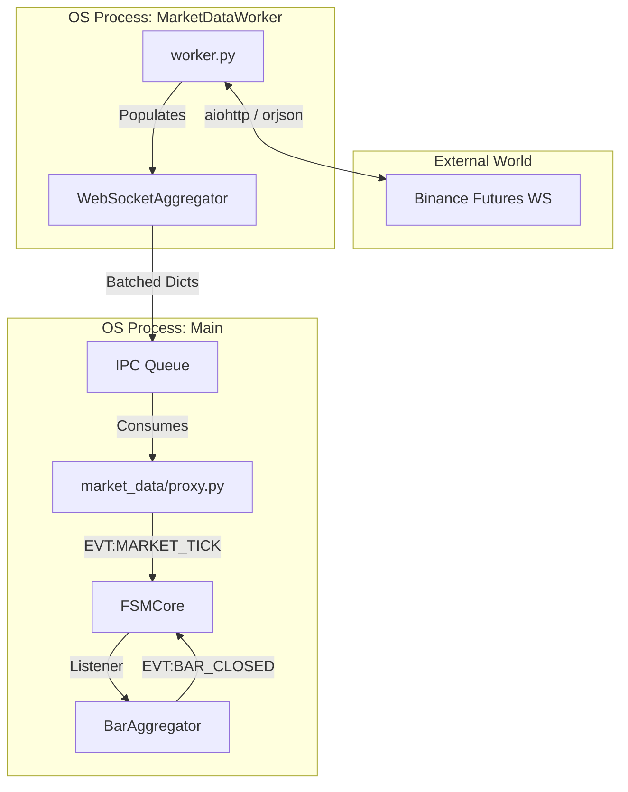

# Market Data Domain

## Overview

The `market_data` domain serves as the real-time market data ingestion and feature engineering component of the Phenix system. It acts as the **Single Source of Truth (SSOT)** for all extrinsic market information, strictly enforcing Event Time ordering to ensure deterministic behavior for strategies.

**Key Responsibilities:**
- **Real-time Ingestion:** Consuming `bookTicker` and `aggTrade` via isolated worker processes (Hybrid Multi-Process Architecture).
- **Feature Calculation:** Windowed OBI (Order Book Imbalance), TFI (Trade Flow Imbalance), and Delta Price calculation.
- **Tick-to-Bar Aggregation:** Transforming raw ticks into OHLCV bars (`EVT:BAR_CLOSED`) for the `MeanReversion` strategy.
- **Macro Synchronization:** Providing "Anchor" price feeds (e.g., BTC/ETH) for correlation algorithms.
- **Resilience:** Protecting the core FSM from GIL blocking via process isolation.

**Domain Status:** ⚠️ **ACTIVE TRANSITION** (Standardizing on Proxy/Worker architecture)
**Performance:** Sub-2 second data freshness (REST), <10ms internal latency.

---

## Architecture

The domain implements a **Hybrid Multi-Process** pattern to guarantee resilience against GIL (Global Interpreter Lock) contention.

### Core Components

#### 1. MarketDataProxy (`proxy.py`)
**Role:** Orchestrator (Control Plane)
- Acts as the domain entry point.
- Spawns and monitors the `MarketDataWorker` process.
- Consumes the IPC (Inter-Process Communication) queue to emit `EVT:MARKET_TICK_RECEIVED` into the main FSM.
- **Safety:** Isolates the main trading loop from network I/O jitter.

#### 2. MarketDataWorker (`worker.py`)
**Role:** Ingestion Engine (Data Plane)
- Dedicated process for I/O operations.
- Manages `aiohttp` WebSocket connections to Binance.
- Parses raw JSON and performs CPU-intensive aggregation boundaries.
- **Risk:** Known to have hardcoded timeouts (30s) and potential memory leaks in `WebSocketAggregator`.

#### 3. BarAggregator (`bar_aggregator.py`)
**Role:** Tick-to-Bar Factory
- The engine of the **Tick-to-Bar Migration**.
- Aggregates ticks into 1m, 3m, 5m candlesticks.
- **Constraint:** Strictly enforces Event Time (monotonically increasing timestamps). Out-of-order ticks (`ts <= last_ts`) are silently dropped to preserve integrity.

#### 4. MarketDataConnector (Legacy)
**Role:** Fallback Implementation
- Single-threaded implementation used only when `use_proxy: false`.
- **Status:** **LEGACY / ZOMBIE**. Should be avoided in production as it blocks the main loop.

### Data Flow Topology



---

## Feature Engineering Logic

### Real-Time Features (Calculated in `WebSocketAggregator`)

#### Order Book Imbalance (OBI)
- **Formula:** `(bid_size - ask_size) / (bid_size + ask_size)`
- **Range:** -1.0 (Selling Pressure) to +1.0 (Buying Pressure).
- **Update Frequency:** On every `bookTicker` update.

#### Trade Flow Imbalance (TFI)
- **Formula:** `(buy_volume - sell_volume) / (buy_volume + sell_volume)`
- **Window:** Rolling window of trades (default 60s).
- **Purpose:** Measures aggressive market taking.

#### Price Delta
- **Formula:** `(current_price - previous_price) / previous_price`
- **Purpose:** Instantaneous momentum detection.

---

## Configuration

The domain is configured via `AuroraConfig` (YAML).

### System Configuration (`system.yaml`)
```yaml
market_data:
  mode: proxy              # Options: proxy (recommended), legacy
  worker:
    ipc_queue_size: 1000   # Buffer size between processes
    log_level: INFO
```

### Trading Configuration (`trading.yaml`)
```yaml
market_data:
  poll_interval_sec: 1.0   # Frequency of worker signals
  websocket_streams: ["bookTicker", "aggTrade"]
  macro_sync:
    anchors: ["BTCUSDT", "ETHUSDT"]
```

---

## Forensic Risk Assessment (Red Flags)

While the domain is functional, the following risks were identified during the Jan 2026 Audit:

1.  **Memory Leak (`seen_trade_ids`)**: The `WebSocketAggregator` stores all trade IDs in a `set()` without clearing them. Long-running processes (>24h) risk OOM crashes.
2.  **Data Loss (OOO Drops)**: `BarAggregator` drops ticks that arrive slightly out of order due to network jitter. A 50ms reordering buffer is recommended.
3.  **Connection Blackhole**: The `worker.py` loop lacks a "Read Timeout". It may think it's connected even if the server stops sending data.
4.  **Zombie Mode**: If configured incorrectly, `main.py` may fall back to `MarketDataConnector` (Legacy), disabling process isolation.

---

## Performance Characteristics

### Latency Metrics
-   **Data Freshness:** < 1.5 seconds (WebSocket mode).
-   **Processing Latency:** < 2ms (IPC overhead is negligible).
-   **Event Emission:** Burst capability up to 1000 events/sec.

### Scalability
-   **Capacity:** Single worker can comfortably handle ~20-30 active symbols.
-   **Horizontal Scaling:** Requires running multiple "Shards" of the application (not yet natively supported).

---

## Troubleshooting

### Common Issues
1.  **No Events Emitted**: Check if `worker.py` is running (`ps aux | grep worker`). If only Main process exists, check `proxy.py` logs.
2.  **Stale Data**: If prices are flat but `ts` is updating, check if `aggTrade` stream is active. `bookTicker` alone does not update "Last Price" in aggregation logic.
3.  **OOM Crash**: Monitor memory usage. If growing linearly, restart container and reduce `poll_interval_sec`.

See `TROUBLESHOOTING.md` for detailed recovery procedures.
