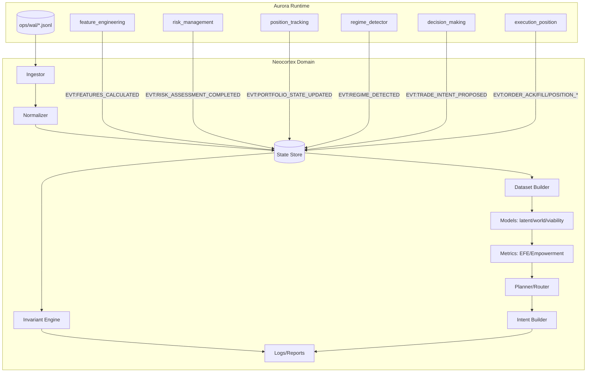
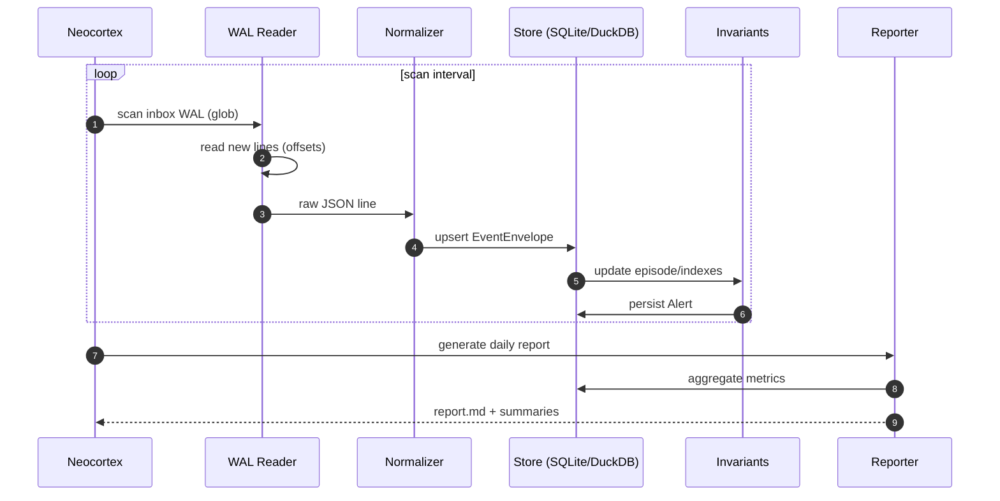
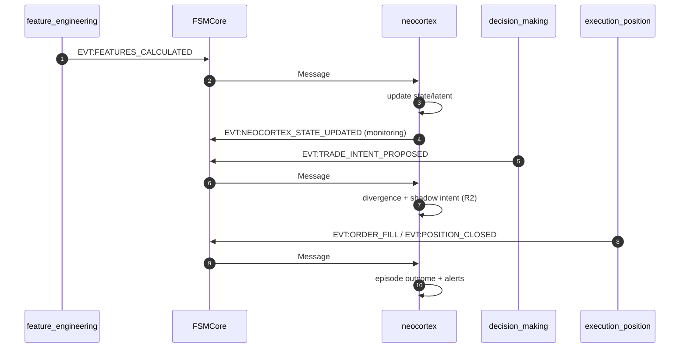
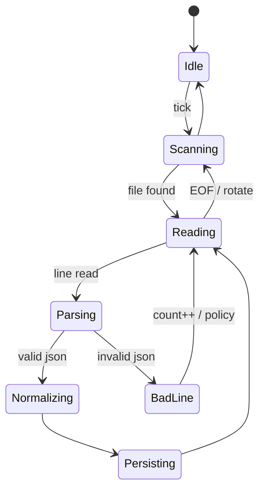

# Neocortex — архітектура та креслення

## 1) Контекст системи (Aurora як середовище)

Принципи:
- **R0–R2:** Neocortex не має жодного “зворотного каналу” у торгівлю (тільки лог/репорт).
- **R3:** будь‑який вплив тільки через окремо задокументований і заґейтований інтерфейс (allowlist + TTL + audit).

---

## 2) Потоки виконання

### 2.1. Standalone (offline‑first) ingest WAL → store → alerts/report

### 2.2. In‑proc (FSM bus) — тільки для low‑latency R2/R3

---

## 3) Машина станів ingest (щоб не “розмазати” edge cases)

Ключові політики (все з YAML):
- обробляти тільки “закриті” WAL файли або дозволяти partial‑tail (але тільки на копії);
- `max_bad_lines = 0` у strict‑режимі (fail‑closed для R0 аналізу);
- timestamp‑нормалізація без евристик (явні правила для `ts`/`timestamp`).

---

## 4) “Креслення” компонентів (what to implement)

### 4.1. Ingestor

Вхід: `ops/wal/*.jsonl` (або копія).
Вихід: `EventEnvelope` (нормалізований контракт) + offset state.

Обовʼязково:
- idempotent ingestion (offsets + dedup ключ);
- інтегриті‑перевірка hash chain (якщо `_prev/_hash` присутні).

### 4.2. State Store

Мінімум таблиць/колекцій:
- `events` (raw + normalized)
- `episodes` (rid + lifecycle)
- `alerts` (інваріанти/аномалії)
- `shadow_intents` (R2)

### 4.2.a. Training provenance boundary

Для ML/RL dataset builder, який читає `EVT:TRADE_INTENT_PROPOSED` з WAL:
- pre-cutover поля `p`, `payoff_ratio_r` і `size.kelly_fraction` вважаються **untrusted**, бо до прийнятого Kelly provenance repair вони могли бути synthetic boundary metadata;
- точну cutover boundary треба записувати в Kelly acceptance re-audit report і дублювати в ingest/reporting surface перед увімкненням цих полів у train/eval dataset;
- якщо cutover boundary не зафіксована, dataset builder має маскувати ці Kelly поля або явно позначати їх як `provenance_untrusted_pre_cutover`.

### 4.3. Invariant Engine

Працює на timeline/episodes і викидає `NEOCORTEX_ALERT`:
- missing brackets / missing fill / close anomalies / churn / stale intents.

### 4.4. Model Layer (R1+)

Окремі модулі:
- viability (AE + conformal tau)
- world model ensemble (uncertainty)
- EFE/empowerment як метрики (не як “магічні” скори)

---

## 5) Вузькі місця (попередження)

Проблемні зони, які треба врахувати в дизайні/коді:
- WAL schema drift (частина записів має `ts`, частина `timestamp`, `rid` може бути в `pld.rid`);
- змішані одиниці часу (seconds vs ms);
- обʼєм WAL (потрібен інкрементальний ingest + індексація, інакше буде дуже повільно);
- selection bias, якщо вчитись лише по WAL (на R1 потрібен “щільний” state stream);
- deterministic behavior: всі рішення router/selector мають бути відтворювані з `rng_seed`.

