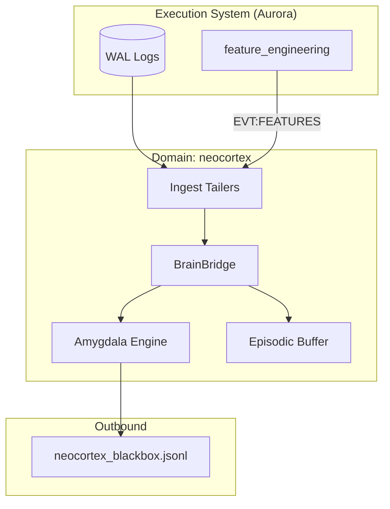

# Атлас домену Neocortex

## 1. Огляд (Scope & Purpose)
Домен **neocortex** — це шар інтелектуального аналізу та навчання (Intelligence Layer). Він спроектований як автономна система, що "живе" паралельно з торговою платформою, спостерігає за її рішеннями та навчається на ринкових даних як на середовищі (Environment).

**Межі відповідальності:**
- Спостереження (Observation) за потоком подій через WAL-тайлінг.
- Побудова моделі світу (World Model) для прогнозування станів.
- Розрахунок очікуваної вільної енергії (Expected Free Energy) для оцінки планів.
- Генерація "тіньових рішень" (Shadow Decisions) для порівняння з реальними стратегіями.
- Виявлення аномалій та порушень торгових контрактів.

## 2. Карта залежностей (Dependencies)

- **Вхідні:** `ops/wal/*.jsonl` (повний лог системи), `EVT:FEATURES_CALCULATED`.
- **Вихідні:** `EVT:NEOCORTEX_ALERT`, `neocortex.log`, звіти про навчання.

## 3. Карта файлів (File Map)
- **Runtime:**
  - `main.py`: Точка входу асинхронного процесу.
- **Logic Layers:**
  - `logic/ingest/`: Парсери та тайлери для збору даних (WAL, MultiSource).
  - `logic/brain/`: Міст до обчислювальних воркерів.
  - `logic/amygdala/`: Система оцінки (Valuation) та розрахунку нагород.
  - `logic/memory/`: Епізодична пам'ять (Buffers).
- **ML Models:**
  - `PPO/`: Реалізація алгоритму Proximal Policy Optimization.

## 4. Карта подій (Event Map)

### Вхідні події (Inbound)
| Назва події | Джерело | Опис |
| :--- | :--- | :--- |
| `EVT:FEATURES_CALCULATED` | `feature_engineering` | Ознаки ринку для спостереження. |
| `EVT:TRADE_INTENT_PROPOSED` | `decision_making` | Рішення системи для аналізу. |
| `EVT:ORDER_FILL` | `execution_position` | Результат виконання для розрахунку нагороди. |

### Вихідні події (Outbound)
| Назва події | Опис |
| :--- | :--- |
| `EVT:NEOCORTEX_ALERT` | Сповіщення про аномалії або порушення інваріантів. |
| `EVT:NEOCORTEX_STATE_UPDATED` | Публікація оновленого внутрішнього латентного стану. |
