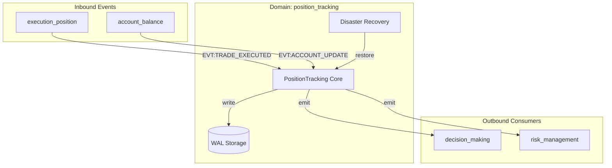

# Атлас домену Position Tracking

## 1. Огляд (Scope & Purpose)
Домен **position_tracking** — це "бухгалтерія" системи. Він відповідає за відстеження поточних позицій, розрахунок реалізованого та нереалізованого P&L (прибутків та збитків) та синхронізацію стану портфеля з біржею.

**Межі відповідальності:**
- Ведення обліку позицій по кожному символу (кількість, середня ціна входу).
- Розрахунок капіталу (Equity) та вільної маржі.
- Забезпечення відмовостійкості через Write-Ahead Logging (WAL) та механізм знімків стану (Snapshots).
- Виявлення ручних втручань у торгівлю на біржі.

## 2. Карта залежностей (Dependencies)

- **Вхідні:** `EVT:TRADE_EXECUTED`, `EVT:ACCOUNT_UPDATE_RECEIVED`.
- **Вихідні:** `EVT:PORTFOLIO_STATE_UPDATED`.

## 3. Карта файлів (File Map)
- `position_tracking.py`: Головний компонент, що обробляє угоди та оновлення акаунту.
- `domain_dict.json`: Специфікація контрактів домену.
- `schemas/`: JSON-схеми для подій портфеля та знімків DR.

## 4. Карта подій (Event Map)

### Вхідні події (Inbound)
| Назва події | Джерело | Опис |
|-------------|---------|------|
| `EVT:TRADE_EXECUTED` | `execution_position` | Факт виконання угоди на біржі. |
| `EVT:ACCOUNT_UPDATE_RECEIVED` | `account_balance` | Стан акаунту та позицій за даними API Binance. |
| `EVT:BALANCE_UPDATE_RECEIVED` | `account_balance` | Оновлення залишків активів. |

### Вихідні події (Outbound)
| Назва події | Споживач | Опис |
|-------------|----------|------|
| `EVT:PORTFOLIO_STATE_UPDATED` | `decision_making`, `risk_management` | Повний стан портфеля (Equity, PnL, Positions). |
