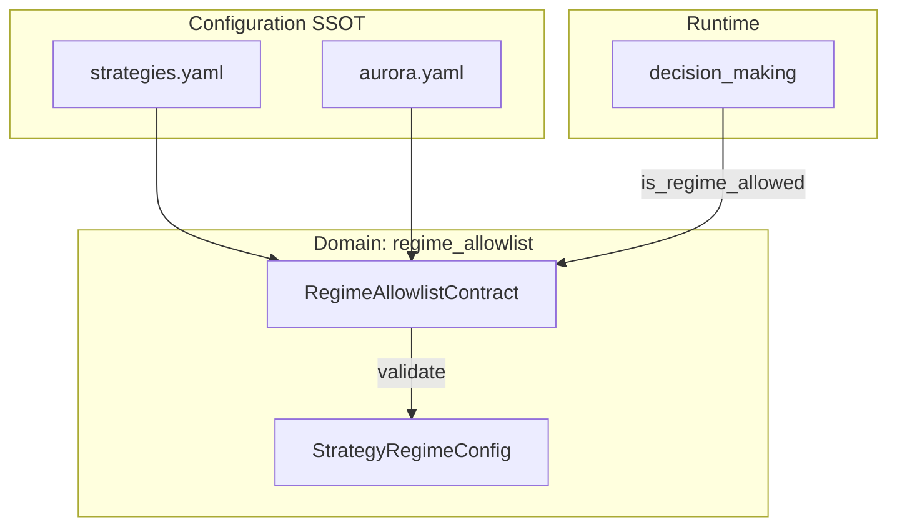
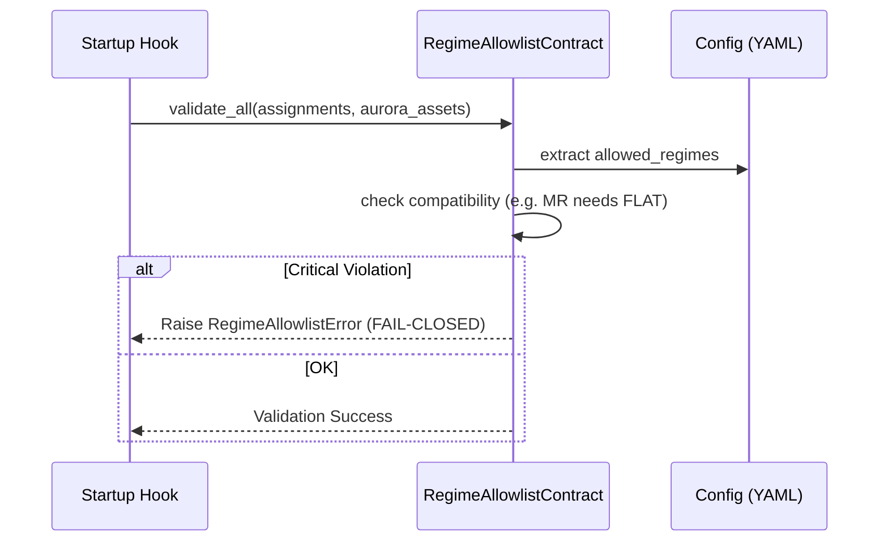

# Атлас домену Regime Allowlist

## 1. Огляд (Scope & Purpose)
Домен **regime_allowlist** — це контролер логічної цілісності стратегій. Його мета — переконатися, що призначені стратегії (напр. Mean Reversion) мають дозволені режими ринку, у яких вони фізично здатні працювати.

**Межі відповідальності:**
- Валідація конфігурації `allowed_regimes` для кожного символу.
- Перевірка сумісності між типом стратегії та дозволеними фазами ринку.
- Надання зрозумілих пояснень (Explainability) у разі блокування торгівлі через режим.

## 2. Карта залежностей (Dependencies)

- **Вхідні:** Конфігурації стратегій та інструментів.
- **Вихідні:** `RegimeAllowlistError` (на старті) або логування порушень.

## 3. Карта файлів (File Map)
- `contract.py`: Містить усю логіку валідації, реєстр сумісних режимів та класи порушень.

## 4. Карта подій (Event Map)
*Домен не використовує події FSM*. Він викликається як сервіс валідації під час старту системи або як утиліта пояснення причин блокування в `decision_making`.

## 5. Діаграма послідовності (Startup Validation)

