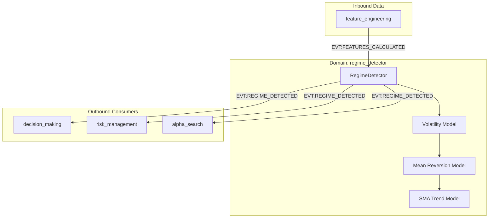

# Атлас домену Regime Detector

## 1. Огляд (Scope & Purpose)
Домен **regime_detector** — це "навігатор" системи. Його задача — класифікувати поточний стан ринку (трендовий, боковик, шторм) для адаптації торгових стратегій. Він забезпечує контекст для прийняття рішень, блокуючи торгівлю у невідповідних фазах.

**Межі відповідальності:**
- Аналіз вхідних ознак (`features`) на предмет ринкових фаз.
- Детекція трендів (через SMA), волатильності (через ATR) та боковиків.
- Забезпечення стабільності режиму через механізм гістерезису.
- Моніторинг якості даних (Fail-closed на "брудних" даних).

## 2. Карта залежностей (Dependencies)

- **Вхідні:** `EVT:FEATURES_CALCULATED`.
- **Вихідні:** `EVT:REGIME_DETECTED`.

## 3. Карта файлів (File Map)
- `regime_detector.py`: Єдиний оркестратор логіки детекції та управління станом.
- `schemas/`: JSON-схеми вихідних подій.

## 4. Карта подій (Event Map)

### Вхідні події (Inbound)
| Назва події | Джерело | Опис |
|-------------|---------|------|
| `EVT:FEATURES_CALCULATED` | `feature_engineering` | Ознаки ринку (ціна, SMA, ATR). |

### Вихідні події (Outbound)
| Назва події | Споживач | Опис |
|-------------|----------|------|
| `EVT:REGIME_DETECTED` | Вся система | Поточна фаза ринку з оцінкою впевненості. |
| `inc_data_quality_drop` | Telemetry | Метрика відкинутих даних через застарілість. |
