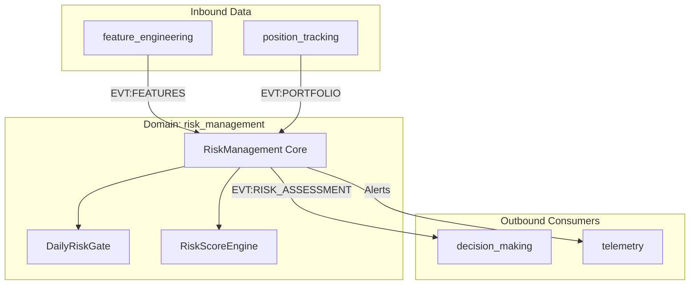

# Атлас домену Risk Management

## 1. Огляд (Scope & Purpose)
Домен **risk_management** — це "служба безпеки" системи. Його задача — оцінювати ризики на основі ринкових умов та стану портфеля, видаючи дозвіл на торгівлю. Він захищає капітал від критичних просадок та аномальної волатильності.

**Межі відповідальності:**
- Розрахунок інтегрального показника ризику (`risk_score`).
- Контроль денного ліміту просадки (Daily Drawdown Gate).
- Визначення Kelly Fraction та лімітів CVaR для сайзингу.
- Емісія дозволів/блокувань на відкриття нових позицій.

## 2. Карта залежностей (Dependencies)

- **Вхідні:** `EVT:FEATURES_CALCULATED`, `EVT:PORTFOLIO_STATE_UPDATED`.
- **Вихідні:** `EVT:RISK_ASSESSMENT_COMPLETED`.

## 3. Карта файлів (File Map)
- `risk_management.py`: Головний оркестратор, що об'єднує ринкові та портфельні ризики.
- `daily_gate.py`: Реалізація денного ліміту збитків та логіка скидання (Daily Reset).
- `domain_dict.json`: Опис контрактів та івентів.

## 4. Карта подій (Event Map)

### Вхідні події (Inbound)
| Назва події | Джерело | Опис |
|-------------|---------|------|
| `EVT:FEATURES_CALCULATED` | `feature_engineering` | Ознаки ринку для розрахунку `risk_score`. |
| `EVT:PORTFOLIO_STATE_UPDATED` | `position_tracking` | Стан капіталу для Daily Drawdown перевірки. |

### Вихідні події (Outbound)
| Назва події | Споживач | Опис |
|-------------|----------|------|
| `EVT:RISK_ASSESSMENT_COMPLETED` | `decision_making` | Фінальний вердикт: чи дозволена торгівля. |
| `EVT:CONFIG_DEBUG_OVERRIDE_ACTIVE` | Monitoring | Попередження про вимкнені ліміти (DEV mode). |
