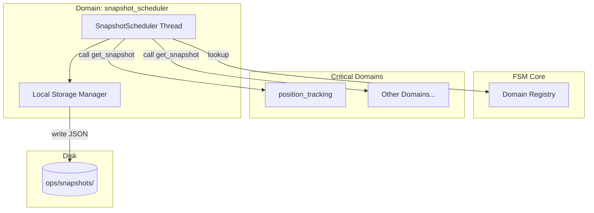

# Атлас домену Snapshot Scheduler

## 1. Огляд (Scope & Purpose)
Домен **snapshot_scheduler** — це "архіватор" системи. Він забезпечує виконання протоколу відновлення після збоїв (Disaster Recovery, Phase L4), періодично створюючи знімки стану критичних доменів та зберігаючи їх у надійному сховищі.

**Межі відповідальності:**
- Періодичний запуск циклу створення знімків (за замовчуванням кожні 300с).
- Виявлення доменів, що підтримують протокол `get_snapshot()`.
- Запис серіалізованих станів у файлову систему (`ops/snapshots/`).
- Збір статистики успішності/відмов резервного копіювання.

## 2. Карта залежностей (Dependencies)

- **Вхідні:** Доступ до реєстру доменів у `FSMCore`.
- **Вихідні:** JSON-файли знімків на диску.

## 3. Карта файлів (File Map)
- `snapshot_scheduler.py`: Основний клас, що керує фоновим потоком та записом файлів.

## 4. Карта подій (Event Map)
*Домен не використовує події FSM для активації*. Він працює автономно через внутрішній таймер, але результати його роботи є критичними для фази відновлення (Disaster Recovery).
