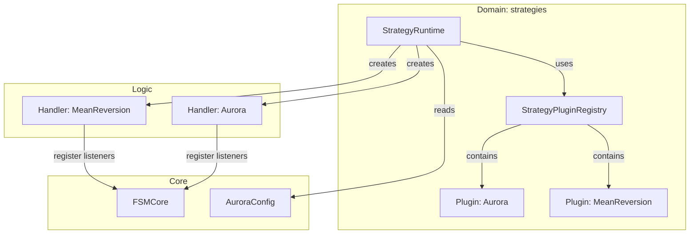

# Атлас домену Strategies

## 1. Огляд (Scope & Purpose)
Домен **strategies** — це "диспетчер" торгових логік. Він керує реєстром доступних стратегій-плагінів та забезпечує їхній запуск (bootstrap) відповідно до призначень у конфігурації.

**Межі відповідальності:**
- Реєстрація дозволених плагінів стратегій (`StrategyPlugin`).
- Створення екземплярів обробників (`StrategyHandler`) для кожного активного символу.
- Валідація призначень стратегій на старті (перевірка наявності плагіна для ID).
- Оркестрація життєвого циклу рантайму стратегій.

## 2. Карта залежностей (Dependencies)

- **Вхідні:** `strategies.yaml` (assignments), `FSMCore`.
- **Вихідні:** Ініціалізовані та зареєстровані обробники подій.

## 3. Карта файлів (File Map)
- `registry.py`: Опис протоколів `StrategyHandler`, `StrategyPlugin` та логіка рантайму.
- `plugins/`: Директорія з конкретними реалізаціями плагінів.
  - `aurora_builtin.py`: Плагін для вбудованої стратегії Aurora.
  - `mean_reversion.py`: Плагін для Mean Reversion стратегії.

## 4. Карта подій (Event Map)
*Домен сам не слухає події*. Його роль — створити об'єкти-обробники, які вже самостійно підписуються на потрібні їм події (`EVT:FEATURES_CALCULATED`, `EVT:REGIME_DETECTED` тощо) через метод `handler.register()`.
