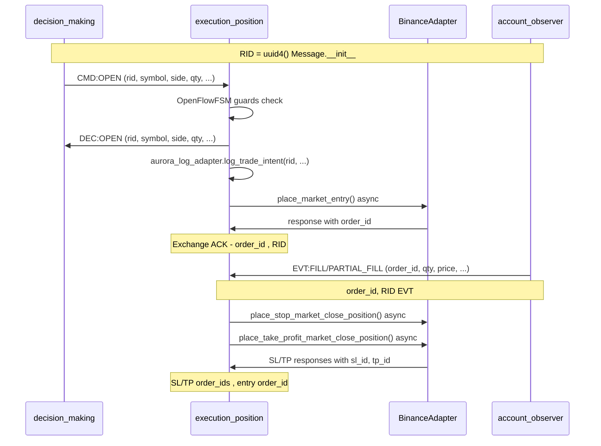

# LIFECYCLE_AUDIT.md -                                                                               

## 1.                                      

###                    RID/Corr_ID
- **                               **: `vfoundation/core/protocol.py:15` - `rid: str = Field(default_factory=lambda: str(uuid.uuid4()))`
- **                                            **: RID                                              Message                       (`rid=msg.rid`)
- **                                            **:
  -                    ASK      decision_making
  - EVT      market_data/feature_engineering
  - CMD      risk_management

###                                                                        

#### TRADE_INTENT
- **      **: `apps/reference/domains/execution_position/aurora_log_adapter.py:log_trade_intent()`
- **          **:            DEC:OPEN      execution_position FSM
- **        **: rid, symbol, side, probability, size_usd, price, quantity, risk_score, features

#### CMD:OPEN
- **      **: `apps/reference/domains/execution_position/fsm.py:handle()`     `open_flow.handle(msg)`
- **          **:                  CMD:OPEN      decision_making
- **        **: symbol, side, qty, price, order_type, tif, idempotent_key

#### DEC:OPEN
- **      **: `apps/reference/domains/execution_position/fsm_open.py:handle()`
- **          **:                                   guards (min_notional, cooldown, qty/price steps)
- **        **: symbol, side, qty, order_type, price?, tif?, idempotent_key

#### Exchange ACK
- **      **: `apps/reference/domains/execution_position/fsm.py:_execute_decision()`
- **          **:                               `adapter.place_market_entry()`
- **        **: order_id      Binance response,                                            RID

#### Partial/Full FILL
- **      **: `apps/reference/domains/account_observer.py`     EVT:FILL/PARTIAL_FILL
- **          **:                           trade updates      Binance WebSocket
- **        **: symbol, side, qty, price, order_id,                              RID            order_id?

####                      SL/TP
- **      **: `apps/reference/domains/execution_position/fsm.py:_execute_decision()`
- **          **:            entry order, `adapter.place_stop_market_close_position()`    `adapter.place_take_profit_market_close_position()`
- **        **: sl_id, tp_id                                     `generate_client_order_id()`,                                     entry order_id

###                                 (Mermaid)



## 2.                             

###                                        
1. **Exchange ACK**:                    order_id      Binance                              RID.                 _execute_decision LOG.info,                                                          .
2. **OCO Group ID**: SL    TP orders                                entry order_id            OCO group. Binance                          OCO,                                                     STOP_MARKET    TAKE_PROFIT_MARKET.
3. **Parent ClientOrderId**: SL/TP orders                 parent_client_order_id,                               entry order.
4. **Partial FILL correlation**: EVT:FILL      account_observer                  order_id,           RID                            CMD:OPEN.
5. **Retry/Fallback correlation**:        retry TP (    -     -2021),            order_id                                                        .

###                  ,                                     
1. **idempotent_key**:                           CMD:OPEN    DEC:OPEN,              SL/TP orders.
2. **span_id/parent_span_id**:                         Message,                                           tracing.
3. **why_explain_ref**:                                                 ,                                     execution logs.

## 3.          AUR-004 (additive-only correlation)

###                                  /          
```python
#    Message.pld        DEC:OPEN    EVT
{
    "corr_id": "uuid4()",  #            correlation ID                               
    "parent_client_order_id": null,  #        SL/TP -                         entry
    "oco_group_id": "uuid4()",  #                     entry + SL + TP
    "link_ack_id": "order_id      exchange",  #            DEC:OPEN     ACK
    "link_fill_id": "order_id",  #        EVT:FILL correlation
}
```

###                                 (hooks)
1. **   OpenFlowFSM.handle()**:                           DEC:OPEN                  `corr_id`, `oco_group_id`
2. **   _execute_decision()**:            place_market_entry                    `entry_order_id`,                     SL/TP        `parent_client_order_id`
3. **   account_observer**:                           EVT:FILL                  `corr_id`      lookup      order_id
4. **   aurora_log_adapter**:                      corr_id             /                rid

###                             L1-ORDER-LOGGER
-                        : corr_id, oco_group_id, parent_client_order_id, link_ack_id
-                                          :                                                   rid        fallback, corr_id        primary        tracing

## 4. L3-METRICS-SUMMARY (            )

###         -                       
- **open_success_rate**: (                 DEC:OPEN) / (       CMD:OPEN) * 100
- **mean_time_to_open**:                                CMD:OPEN      DEC:OPEN (    )
- **defer_rate**: (                     CMD:OPEN) / (       CMD:OPEN) * 100
- **block_rate**: (                               CMD:OPEN) / (       CMD:OPEN) * 100
- **retry_count**:                      retry                             orders
- **qos_cooldown_hits**:                                               -     cooldown

###                                
- **open_success_rate**:      OpenFlowFSM._metrics["fsm_open_decisions_total"] /            CMD:OPEN (                                          )
- **mean_time_to_open**: Timestamp CMD:OPEN - timestamp DEC:OPEN,                             metrics_collector
- **defer_rate/block_rate**:      QoS                 decision_making (                 )
- **retry_count**:    _execute_decision        retry TP     -     -2021
- **qos_cooldown_hits**:      OpenFlowFSM guards

### JSON-            : reports/summary_gate_status.json
```json
{
  "timestamp": "2025-10-31T12:00:00Z",
  "period_hours": 24,
  "metrics": {
    "open_success_rate": 95.2,
    "mean_time_to_open_ms": 45.3,
    "defer_rate": 2.1,
    "block_rate": 1.8,
    "retry_count": 12,
    "qos_cooldown_hits": 8
  },
  "breakdown_by_symbol": {
    "BTCUSDT": {
      "open_success_rate": 96.1,
      "cmd_open_count": 150,
      "dec_open_count": 144
    },
    "ETHUSDT": {
      "open_success_rate": 94.3,
      "cmd_open_count": 120,
      "dec_open_count": 113
    }
  },
  "alerts": [
    "ETHUSDT defer_rate > 5% threshold"
  ]
}
```

                      `tools/metrics_summary.py`:
-                   Prometheus /metrics/json
-             WAL           
-                               symbol,                                
-                      JSON         

## 5.                                                             

###                                    AUR-004 correlation:
- `vfoundation/core/protocol.py`:                           corr_id, oco_group_id    Message
- `apps/reference/domains/execution_position/fsm_open.py`:                          corr_id/oco_group_id    DEC:OPEN
- `apps/reference/domains/execution_position/fsm.py`:                  parent_client_order_id    SL/TP orders
- `apps/reference/domains/account_observer.py`:                  corr_id lookup    EVT:FILL
- `apps/reference/domains/execution_position/aurora_log_adapter.py`:                      corr_id

###                   L3-METRICS-SUMMARY:
- `tools/metrics_summary.py`:                                                                                    JSON
- `apps/reference/domains/execution_position/fsm_open.py`:                  timestamp tracking        mean_time_to_open
- `apps/reference/domains/execution_position/metrics_collector.py`:                                          retry_count, qos_hits
- `vfoundation/obs/debug_api.py`:                  endpoints                                     tools/

###                                      :
- `docs/ORDER_LIFECYCLE_CORRELATION.md`:                                                correlation
- `tests/test_order_lifecycle_correlation.py`:                                    corr_id propagation
- `tests/test_metrics_summary.py`:                   JSON               </content>
<parameter name="filePath">c:\Users\user\Music\Phenix\artifacts\LIFECYCLE_AUDIT.md
