# LIFECYCLE_AUDIT.md - –ê—É–¥–∏—Ç —Ç—Ä–∞— — –∏—Ä–æ–≤–∫–∏ –∂–∏–∑–Ω–µ–Ω–Ω–æ–≥–æ —Ü–∏–∫–ª–∞ –æ—Ä–¥–µ—Ä–∞

## 1. –¢–µ–∫—É—â–∞—è —Ç—Ä–∞— — –∏—Ä–æ–≤–∫–∞

### –ì–µ–Ω–µ—Ä–∞—Ü–∏—è RID/Corr_ID
- **–ì–¥–µ –≥–µ–Ω–µ—Ä–∏—Ä—É–µ—Ç— —è**: `vfoundation/core/protocol.py:15` - `rid: str = Field(default_factory=lambda: str(uuid.uuid4()))`
- **–ü–µ—Ä–µ–¥–∞—á–∞ –º–µ–∂–¥—É –¥–æ–º–µ–Ω–∞–º–∏**: RID –∫–æ–ø–∏—Ä—É–µ—Ç— —è –∏–∑ –≤—Ö–æ–¥—è—â–µ–≥–æ Message –≤ –∏— —Ö–æ–¥—è—â–∏–µ (`rid=msg.rid`)
- **–ü—Ä–∏–º–µ—Ä—ã —Ç–æ—á–µ–∫ –≥–µ–Ω–µ—Ä–∞—Ü–∏–∏**:
  - –ù–∞—á–∞–ª—å–Ω—ã–π ASK –æ—Ç decision_making
  - EVT –æ—Ç market_data/feature_engineering
  - CMD –æ—Ç risk_management

### –õ–æ–≥–∏—Ä–æ–≤–∞–Ω–∏–µ –º–æ–º–µ–Ω—Ç–æ–≤ –∂–∏–∑–Ω–µ–Ω–Ω–æ–≥–æ —Ü–∏–∫–ª–∞

#### TRADE_INTENT
- **–ì–¥–µ**: `apps/reference/domains/execution_position/aurora_log_adapter.py:log_trade_intent()`
- **–ö–æ–≥–¥–∞**: –ü–æ— –ª–µ DEC:OPEN –æ—Ç execution_position FSM
- **–ü–æ–ª—è**: rid, symbol, side, probability, size_usd, price, quantity, risk_score, features

#### CMD:OPEN
- **–ì–¥–µ**: `apps/reference/domains/execution_position/fsm.py:handle()` ‚Üí `open_flow.handle(msg)`
- **–ö–æ–≥–¥–∞**: –ü—Ä–∏—Ö–æ–¥–∏—Ç CMD:OPEN –æ—Ç decision_making
- **–ü–æ–ª—è**: symbol, side, qty, price, order_type, tif, idempotent_key

#### DEC:OPEN
- **–ì–¥–µ**: `apps/reference/domains/execution_position/fsm_open.py:handle()`
- **–ö–æ–≥–¥–∞**: –ü–æ— –ª–µ –ø—Ä–æ—Ö–æ–∂–¥–µ–Ω–∏—è guards (min_notional, cooldown, qty/price steps)
- **–ü–æ–ª—è**: symbol, side, qty, order_type, price?, tif?, idempotent_key

#### Exchange ACK
- **–ì–¥–µ**: `apps/reference/domains/execution_position/fsm.py:_execute_decision()`
- **–ö–æ–≥–¥–∞**: –ü–æ— –ª–µ —É— –ø–µ—à–Ω–æ–≥–æ `adapter.place_market_entry()`
- **–ü–æ–ª—è**: order_id –∏–∑ Binance response, –Ω–æ –Ω–µ –ª–æ–≥–∏—Ä—É–µ—Ç— —è —è–≤–Ω–æ —  RID

#### Partial/Full FILL
- **–ì–¥–µ**: `apps/reference/domains/account_observer.py` ‚Üí EVT:FILL/PARTIAL_FILL
- **–ö–æ–≥–¥–∞**: –ü—Ä–∏ –ø–æ–ª—É—á–µ–Ω–∏–∏ trade updates –æ—Ç Binance WebSocket
- **–ü–æ–ª—è**: symbol, side, qty, price, order_id, –Ω–æ –∫–æ—Ä—Ä–µ–ª—è—Ü–∏—è —  RID —á–µ—Ä–µ–∑ order_id?

#### –ü–æ— —Ç–∞–Ω–æ–≤–∫–∞ SL/TP
- **–ì–¥–µ**: `apps/reference/domains/execution_position/fsm.py:_execute_decision()`
- **–ö–æ–≥–¥–∞**: –ü–æ— –ª–µ entry order, `adapter.place_stop_market_close_position()` –∏ `adapter.place_take_profit_market_close_position()`
- **–ü–æ–ª—è**: sl_id, tp_id –≥–µ–Ω–µ—Ä–∏—Ä—É—é—Ç— —è —á–µ—Ä–µ–∑ `generate_client_order_id()`, –Ω–æ –Ω–µ — –≤—è–∑—ã–≤–∞—é—Ç— —è —  entry order_id

### –°—Ö–µ–º–∞ –∫–æ—Ä—Ä–µ–ª—è—Ü–∏–∏ (Mermaid)



## 2. –ü—Ä–æ–±–µ–ª—ã –∏ –¥—É–±–ª–∏

### –û—Ç— —É—Ç— —Ç–≤—É—é—â–∏–µ –∑–≤–µ–Ω—å—è
1. **Exchange ACK**: –ü–æ–ª—É—á–µ–Ω–∏–µ order_id –æ—Ç Binance –Ω–µ –ª–æ–≥–∏—Ä—É–µ—Ç— —è —  RID. –¢–æ–ª—å–∫–æ –≤ _execute_decision LOG.info, –Ω–æ –±–µ–∑ — —Ç—Ä—É–∫—Ç—É—Ä–∏—Ä–æ–≤–∞–Ω–Ω–æ–≥–æ –ª–æ–≥–∞.
2. **OCO Group ID**: SL –∏ TP orders –Ω–µ — –≤—è–∑—ã–≤–∞—é—Ç— —è —  entry order_id —á–µ—Ä–µ–∑ OCO group. Binance –ø–æ–¥–¥–µ—Ä–∂–∏–≤–∞–µ—Ç OCO, –Ω–æ –∫–æ–¥ –∏— –ø–æ–ª—å–∑—É–µ—Ç –æ—Ç–¥–µ–ª—å–Ω—ã–µ STOP_MARKET –∏ TAKE_PROFIT_MARKET.
3. **Parent ClientOrderId**: SL/TP orders –Ω–µ –∏–º–µ—é—Ç parent_client_order_id, —É–∫–∞–∑—ã–≤–∞—é—â–µ–≥–æ –Ω–∞ entry order.
4. **Partial FILL correlation**: EVT:FILL –æ—Ç account_observer — –æ–¥–µ—Ä–∂–∏—Ç order_id, –Ω–æ –Ω–µ RID –æ—Ä–∏–≥–∏–Ω–∞–ª—å–Ω–æ–≥–æ CMD:OPEN.
5. **Retry/Fallback correlation**: –ü—Ä–∏ retry TP (–∏–∑-–∑–∞ -2021), –Ω–æ–≤—ã–π order_id –Ω–µ — –≤—è–∑—ã–≤–∞–µ—Ç— —è —  –æ—Ä–∏–≥–∏–Ω–∞–ª—å–Ω—ã–º.

### –ü–æ–ª—è –µ— —Ç—å, –Ω–æ –Ω–µ –ø—Ä–æ–∫–∏–¥—ã–≤–∞—é—Ç— —è
1. **idempotent_key**: –ü–µ—Ä–µ–¥–∞–µ—Ç— —è –∏–∑ CMD:OPEN –≤ DEC:OPEN, –Ω–æ –Ω–µ –≤ SL/TP orders.
2. **span_id/parent_span_id**: –û–ø—Ä–µ–¥–µ–ª–µ–Ω—ã –≤ Message, –Ω–æ –Ω–µ –∏— –ø–æ–ª—å–∑—É—é—Ç— —è –¥–ª—è tracing.
3. **why_explain_ref**: –î–ª—è –¥–µ—Ç–∞–ª—å–Ω–æ–≥–æ –æ–±—ä—è— –Ω–µ–Ω–∏—è, –Ω–æ –Ω–µ –∑–∞–ø–æ–ª–Ω—è–µ—Ç— —è –≤ execution logs.

## 3. –ü–ª–∞–Ω AUR-004 (additive-only correlation)

### –ü—Ä–µ–¥–ª–∞–≥–∞–µ–º—ã–µ –ø–æ–ª—è/— –≤—è–∑–∏
```python
# –í Message.pld –¥–ª—è DEC:OPEN –∏ EVT
{
    "corr_id": "uuid4()",  # –ù–æ–≤—ã–π correlation ID –¥–ª—è –≤— –µ–π —Ü–µ–ø–æ—á–∫–∏
    "parent_client_order_id": null,  # –î–ª—è SL/TP - —É–∫–∞–∑—ã–≤–∞–µ—Ç –Ω–∞ entry
    "oco_group_id": "uuid4()",  # –ì—Ä—É–ø–ø–∞ –¥–ª—è entry + SL + TP
    "link_ack_id": "order_id –æ—Ç exchange",  # –°–≤—è–∑—å DEC:OPEN ‚Üî ACK
    "link_fill_id": "order_id",  # –î–ª—è EVT:FILL correlation
}
```

### –¢–æ—á–∫–∏ –∫–æ—Ä—Ä–µ–ª—è—Ü–∏–∏ (hooks)
1. **–í OpenFlowFSM.handle()**: –ü—Ä–∏ –≥–µ–Ω–µ—Ä–∞—Ü–∏–∏ DEC:OPEN –¥–æ–±–∞–≤–∏—Ç—å `corr_id`, `oco_group_id`
2. **–í _execute_decision()**: –ü–æ— –ª–µ place_market_entry — –æ—Ö—Ä–∞–Ω–∏—Ç—å `entry_order_id`, –ø–µ—Ä–µ–¥–∞—Ç—å –≤ SL/TP –∫–∞–∫ `parent_client_order_id`
3. **–í account_observer**: –ü—Ä–∏ –≥–µ–Ω–µ—Ä–∞—Ü–∏–∏ EVT:FILL –¥–æ–±–∞–≤–∏—Ç—å `corr_id` –∏–∑ lookup –ø–æ order_id
4. **–í aurora_log_adapter**: –õ–æ–≥–∏—Ä–æ–≤–∞—Ç—å corr_id –≤–º–µ— —Ç–æ/–≤–º–µ— —Ç–µ —  rid

### –°–æ–≥–ª–∞— –æ–≤–∞–Ω–∏–µ —  L1-ORDER-LOGGER
- –¶–µ–ª–µ–≤—ã–µ –ø–æ–ª—è: corr_id, oco_group_id, parent_client_order_id, link_ack_id
- –ò–∑–±–µ–≥–∞—Ç—å –¥—É–±–ª–∏—Ä–æ–≤–∞–Ω–∏—è: –∏— –ø–æ–ª—å–∑–æ–≤–∞—Ç—å — —É—â–µ— —Ç–≤—É—é—â–∏–µ rid –∫–∞–∫ fallback, corr_id –∫–∞–∫ primary –¥–ª—è tracing

## 4. L3-METRICS-SUMMARY (–¥–∏–∑–∞–π–Ω)

### –ú–∏–Ω–∏-–Ω–∞–±–æ—Ä –º–µ—Ç—Ä–∏–∫
- **open_success_rate**: (—É— –ø–µ—à–Ω—ã–µ DEC:OPEN) / (–≤— –µ CMD:OPEN) * 100
- **mean_time_to_open**: –°—Ä–µ–¥–Ω–µ–µ –≤—Ä–µ–º—è –æ—Ç CMD:OPEN –¥–æ DEC:OPEN (–º— )
- **defer_rate**: (–æ—Ç–ª–æ–∂–µ–Ω–Ω—ã–µ CMD:OPEN) / (–≤— –µ CMD:OPEN) * 100
- **block_rate**: (–∑–∞–±–ª–æ–∫–∏—Ä–æ–≤–∞–Ω–Ω—ã–µ CMD:OPEN) / (–≤— –µ CMD:OPEN) * 100
- **retry_count**: –ö–æ–ª–∏—á–µ— —Ç–≤–æ retry –ø—Ä–∏ —Ä–∞–∑–º–µ—â–µ–Ω–∏–∏ orders
- **qos_cooldown_hits**: –ö–æ–ª–∏—á–µ— —Ç–≤–æ –æ—Ç–∫–ª–æ–Ω–µ–Ω–∏–π –∏–∑-–∑–∞ cooldown

### –ò— —Ç–æ—á–Ω–∏–∫–∏ –º–µ—Ç—Ä–∏–∫
- **open_success_rate**: –ò–∑ OpenFlowFSM._metrics["fsm_open_decisions_total"] / –æ–±—â–µ–µ CMD:OPEN (–Ω—É–∂–µ–Ω — —á–µ—Ç—á–∏–∫ –≤—Ö–æ–¥—è—â–∏—Ö)
- **mean_time_to_open**: Timestamp CMD:OPEN - timestamp DEC:OPEN, –∞–≥—Ä–µ–≥–∏—Ä–æ–≤–∞—Ç—å –≤ metrics_collector
- **defer_rate/block_rate**: –ò–∑ QoS –ª–æ–≥–∏–∫–∏ –≤ decision_making (–µ— –ª–∏ –µ— —Ç—å)
- **retry_count**: –í _execute_decision –ø—Ä–∏ retry TP –∏–∑-–∑–∞ -2021
- **qos_cooldown_hits**: –ò–∑ OpenFlowFSM guards

### JSON-—Ä–µ–ø–æ—Ä—Ç: reports/summary_gate_status.json
```json
{
  "timestamp": "2025-10-31T12:00:00Z",
  "period_hours": 24,
  "metrics": {
    "open_success_rate": 95.2,
    "mean_time_to_open_ms": 45.3,
    "defer_rate": 2.1,
    "block_rate": 1.8,
    "retry_count": 12,
    "qos_cooldown_hits": 8
  },
  "breakdown_by_symbol": {
    "BTCUSDT": {
      "open_success_rate": 96.1,
      "cmd_open_count": 150,
      "dec_open_count": 144
    },
    "ETHUSDT": {
      "open_success_rate": 94.3,
      "cmd_open_count": 120,
      "dec_open_count": 113
    }
  },
  "alerts": [
    "ETHUSDT defer_rate > 5% threshold"
  ]
}
```

–ê–≥—Ä–µ–≥–∞—Ü–∏—è –≤ `tools/metrics_summary.py`:
- –ß–∏—Ç–∞—Ç—å –∏–∑ Prometheus /metrics/json
- –ò–ª–∏ –∏–∑ WAL –ª–æ–≥–æ–≤
- –ì—Ä—É–ø–ø–∏—Ä–æ–≤–∞—Ç—å –ø–æ symbol, — —á–∏—Ç–∞—Ç—å –ø—Ä–æ—Ü–µ–Ω—Ç—ã
- –ó–∞–ø–∏— —ã–≤–∞—Ç—å JSON —Ñ–∞–π–ª

## 5. –°–ø–∏— –æ–∫ —Ñ–∞–π–ª–æ–≤ –¥–ª—è –±—É–¥—É—â–∏—Ö –ø—Ä–∞–≤–æ–∫

### –û— –Ω–æ–≤–Ω—ã–µ —Ñ–∞–π–ª—ã –¥–ª—è AUR-004 correlation:
- `vfoundation/core/protocol.py`: –î–æ–±–∞–≤–∏—Ç—å –ø–æ–ª—è corr_id, oco_group_id –≤ Message
- `apps/reference/domains/execution_position/fsm_open.py`: –ì–µ–Ω–µ—Ä–∏—Ä–æ–≤–∞—Ç—å corr_id/oco_group_id –≤ DEC:OPEN
- `apps/reference/domains/execution_position/fsm.py`: –ü–µ—Ä–µ–¥–∞—Ç—å parent_client_order_id –≤ SL/TP orders
- `apps/reference/domains/account_observer.py`: –î–æ–±–∞–≤–∏—Ç—å corr_id lookup –≤ EVT:FILL
- `apps/reference/domains/execution_position/aurora_log_adapter.py`: –õ–æ–≥–∏—Ä–æ–≤–∞—Ç—å corr_id

### –§–∞–π–ª—ã –¥–ª—è L3-METRICS-SUMMARY:
- `tools/metrics_summary.py`: –°–æ–∑–¥–∞—Ç—å –Ω–æ–≤—ã–π —Ñ–∞–π–ª –¥–ª—è –∞–≥—Ä–µ–≥–∞—Ü–∏–∏ –∏ –≥–µ–Ω–µ—Ä–∞—Ü–∏–∏ JSON
- `apps/reference/domains/execution_position/fsm_open.py`: –î–æ–±–∞–≤–∏—Ç—å timestamp tracking –¥–ª—è mean_time_to_open
- `apps/reference/domains/execution_position/metrics_collector.py`: –†–∞— —à–∏—Ä–∏—Ç—å –º–µ—Ç—Ä–∏–∫–∏ –¥–ª—è retry_count, qos_hits
- `vfoundation/obs/debug_api.py`: –î–æ–±–∞–≤–∏—Ç—å endpoints –¥–ª—è —á—Ç–µ–Ω–∏—è –º–µ—Ç—Ä–∏–∫ –≤ tools/

### –°–æ–ø—É—Ç— —Ç–≤—É—é—â–∏–µ —Ñ–∞–π–ª—ã:
- `docs/ORDER_LIFECYCLE_CORRELATION.md`: –î–æ–∫—É–º–µ–Ω—Ç–∞—Ü–∏—è –Ω–æ–≤–æ–π — —Ö–µ–º—ã correlation
- `tests/test_order_lifecycle_correlation.py`: –¢–µ— —Ç—ã –¥–ª—è –ø—Ä–æ–≤–µ—Ä–∫–∏ corr_id propagation
- `tests/test_metrics_summary.py`: –¢–µ— —Ç—ã –¥–ª—è JSON —Ä–µ–ø–æ—Ä—Ç–∞</content>
<parameter name="filePath">c:\Users\user\Music\Phenix\artifacts\LIFECYCLE_AUDIT.md
