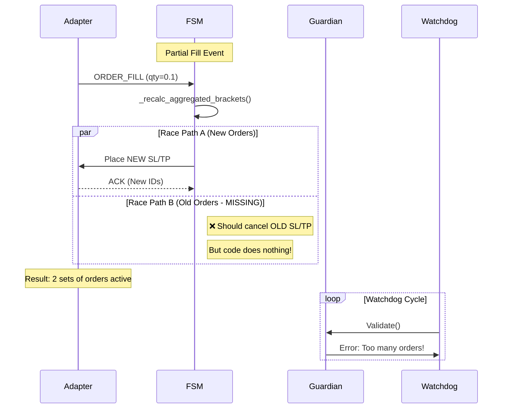

# AGG_OCO Phase 4: Fragility & Root Cause Analysis

**Дата:** 19 листопада 2025
**Статус:** ✅ Completed

---

## 1. Why the System is Fragile (Root Cause Analysis)

Система "крихка" тому що вона покладається на **ідеальний стан** (happy path) і не має механізмів самовідновлення (self-healing) для активних позицій.

### A. The "No Man's Land" Problem
Архітектура має чіткий поділ відповідальності, який створює "сліпу зону":
- **OrderGuardian:** Відповідає ТІЛЬКИ за ордери БЕЗ позиції (`positionAmt == 0`). Якщо позиція є — він ігнорує все.
- **ManageFlowFSM:** Відповідає за ордери АКТИВНОЇ позиції. Але якщо він втрачає state (через рестарт або баг гідрації), він думає що ордерів немає.

**Результат:** Якщо `ManageFlowFSM` "забув" про ордери (Defect #2), а позиція відкрита — **ніхто** не керує цими ордерами. Вони стають "зомбі" (не orphans, бо позиція є, але і не managed).

### B. Race Conditions in State Management
1. **Bracket Registration Race:**
   - `_emit_place_order` (async) → повертає control
   - `_maybe_register_bracket_set` (sync) → реєструє `None` IDs
   - `ORDER_ACK` (async, later) → оновлює IDs
   *Вікно вразливості:* 200-500ms. Якщо в цей час watchdog перевірить стан — він побачить invalid state.

2. **Recalc Race:**
   - Partial fill trigger → `_recalc_aggregated_brackets`
   - New brackets placed (async)
   - Old brackets cancellation (missing)
   *Результат:* Накладання ордерів (2 SL замість 1).

### C. Silent Failures & Missing Feedback Loops
- **Startup Rehydration:** `rehydrate_bracket_set_for_position` фейлиться тихо (Defect #3). FSM пише в лог, але не retry-ить.
- **Watchdog:** Бачить проблему (`NO_SL_FOR_OPEN_POSITION`), кричить в лог, але не має права (або коду) це виправити (Defect #4).

---

## 2. Critical Race Conditions Diagram

---

## 3. Systemic Weaknesses (Fragility Factors)

### 1. Lack of "Active" Reconciliation
OrderGuardian вміє робити `cleanup_orphans` (коли позиції немає), але не вміє робити `reconcile_active_position` (коли позиція є, але ордери не співпадають з очікуваними).
**Fix:** Guardian повинен мати режим "Enforce State", де він примусово приводить ордери до відповідності з бажаним станом FSM.

### 2. In-Memory State Dependency
`ManageFlowFSM` занадто покладається на in-memory змінні (`self.sl_order_id`). При рестарті або помилці гідрації цей стан втрачається безповоротно, оскільки немає надійного відновлення з REST API (Defect #2).

### 3. "Fire and Forget" Order Placement
FSM відправляє команди на створення ордерів і не чекає підтвердження перед тим як змінити свій внутрішній стан. Це створює розсинхронізацію між "що FSM думає" і "що є на біржі".

---

## 4. Conclusion for Phase 4

Крихкість системи викликана **архітектурним розривом** між Guardian та FSM, посиленим відсутністю механізмів **active reconciliation** та **state recovery**.

Виправлення тільки багів (Defects #1-7) стабілізує систему, але для справжньої надійності потрібно впровадити **Active State Enforcement** в Guardian.

**Ready for Phase 5: Integration Tests**
