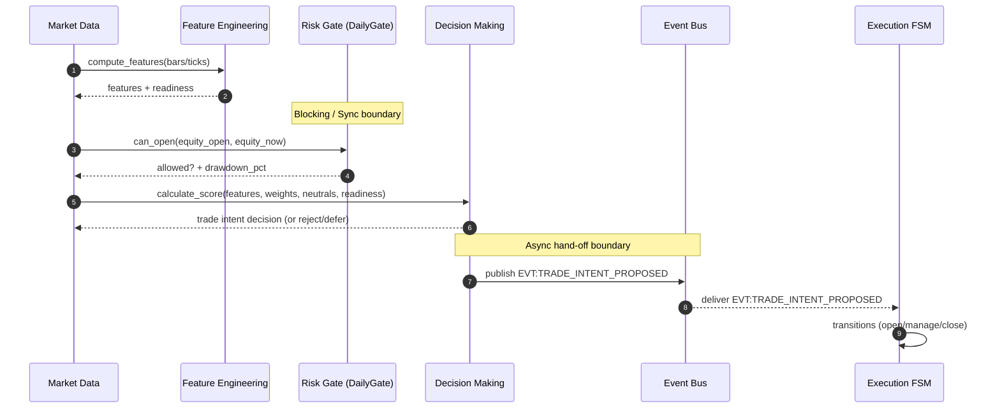
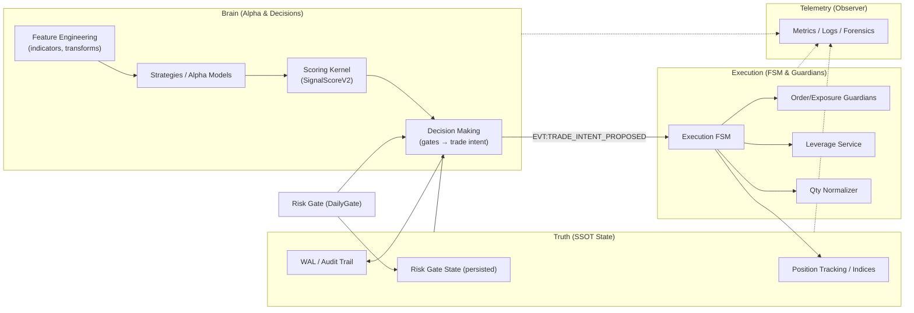

# Architecture Atlas (SSOT)

This document is the **visual single source of truth** for the system’s runtime flow and domain boundaries.

Scope anchor (code):
- Decision making + intent emission: `apps/reference/domains/decision_making/decision_making.py`
- Alpha scoring kernel: `apps/reference/domains/decision_making/signal_score_v2.py`
- Daily risk gate (drawdown): `apps/reference/domains/risk_management/daily_gate.py`
- Execution FSM: `apps/reference/domains/execution_position/fsm.py`
- Execution arithmetic helpers: `apps/reference/domains/execution_position/qty_normalizer.py`, `apps/reference/domains/decision_making/sizing_margin_first.py`

## Diagram 1: Data-to-Decision Spine (Sequence)

## Diagram 2: Domain Map (C4 Context Style)

## Boundaries (SSOT)

- **Confirmed sync boundary (blocking):** `Risk Gate (DailyGate.can_open)` blocks new opens without valid equity and blocks when drawdown exceeds limit (`apps/reference/domains/risk_management/daily_gate.py`).
- **Confirmed async boundary:** `EVT:TRADE_INTENT_PROPOSED` emitted by Decision Making and consumed by Execution FSM (`apps/reference/domains/execution_position/fsm.py`).

