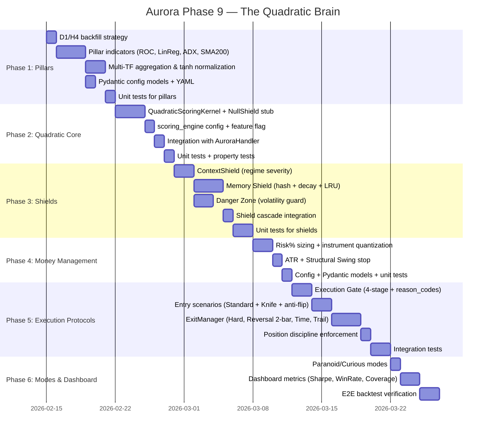

# Aurora Phase 9 — "The Quadratic Brain"
# Дорожня Карта та Повний План Реалізації

> **Статус:** ✅ Затверджено (2026-02-14)  
> **Тип:** Повна реалізація в production code  
> **Контроль:** Всі ліміти/обмеження мають `enabled: bool` toggle  
> **Термін:** ~28-40 днів (6 фаз)

---

## Зміст

1. [Мета та Філософія](#мета-та-філософія)
2. [Принципи реалізації](#принципи-реалізації)
3. [Архітектурні рішення](#архітектурні-рішення-затверджені)
4. [Gap-аналіз](#gap-аналіз-поточний-стан-vs-концепція)
5. [Дорожня карта (Gantt)](#дорожня-карта)
6. [Повна конфігурація (YAML)](#повна-конфігурація-yaml-spec-з-усіма-toggles)
7. [Фаза 1: Pillars](#фаза-1-multi-timeframe-pillars-три-стовпи)
8. [Фаза 2: Quadratic Core](#фаза-2-quadratic-scoring-core)
9. [Фаза 3: Shields](#фаза-3-система-щитів-defense-layer)
10. [Фаза 4: Money Management](#фаза-4-money-management)
11. [Фаза 5: Execution Protocols](#фаза-5-execution-protocols)
12. [Фаза 6: Modes & Dashboard](#фаза-6-operational-modes--dashboard)
13. [Verification Plan](#verification-plan)
14. [Порядок та оцінка](#порядок-та-оцінка)
15. [Критичні правки (КР)](#критичні-правки-кр)

---

## Мета та Філософія

Повна перебудова ядра прийняття рішень Aurora: перехід від поточної моделі `SignalScoreV2` + `DirectionStrength` до нової архітектури **"Quadratic Brain"** — системи перетворення **Впевненості** (Confidence) у **Ризик** (Exposure) з трьома шарами захисту (Shields) та жорсткою позиційною дисципліною.

### Ключова формула

```
Confidence = sign(weighted_sum) × (weighted_sum)²
```

Де `weighted_sum = Σ(pillar_i × weight_i)`. Квадрат **підсилює** сильні сигнали та **пригнічує** шум.

### Архітектурна діаграма

```
┌─────────────────────────────────────────────────────────────┐
│                    QUADRATIC BRAIN                          │
│                                                             │
│  ┌───────────┐  ┌───────────┐  ┌───────────┐               │
│  │ Tactician │  │ Operator  │  │ Strategist│   ← PILLARS   │
│  │   (M15)   │  │   (H4)    │  │   (D1)    │               │
│  │  ROC(14)  │  │ LinReg+ADX│  │ SMA(200)  │               │
│  └─────┬─────┘  └─────┬─────┘  └─────┬─────┘               │
│        │              │              │                      │
│        ▼              ▼              ▼                      │
│  ┌─────────────────────────────────────────┐                │
│  │     QUADRATIC SCORING KERNEL            │   ← CORE      │
│  │  sign(Σ w_i × p_i) × (Σ w_i × p_i)²   │                │
│  │  → Confidence [-1.0, +1.0]              │                │
│  └───────────────────┬─────────────────────┘                │
│                      │                                      │
│                      ▼                                      │
│  ┌─────────────────────────────────────────┐                │
│  │         SHIELD CASCADE                  │   ← DEFENSE    │
│  │  ContextShield → MemoryShield → DZ      │                │
│  │  multiplier ≤ 1.0 (only reduce)         │                │
│  │  → FinalScore = Confidence × Π(shields) │                │
│  └───────────────────┬─────────────────────┘                │
│                      │                                      │
│                      ▼                                      │
│  ┌─────────────────────────────────────────┐                │
│  │       MONEY MANAGEMENT                  │   ← SIZING     │
│  │  Qty = (Bal × Risk%) / (SL × PV)       │                │
│  │  → InstrumentQuantizer                  │                │
│  └───────────────────┬─────────────────────┘                │
│                      │                                      │
│                      ▼                                      │
│  ┌─────────────────────────────────────────┐                │
│  │       EXECUTION GATE                    │   ← GATE       │
│  │  1. Hard Veto                           │                │
│  │  2. Conflict Check                      │                │
│  │  3. Soft Threshold                      │                │
│  │  4. Execute                             │                │
│  └───────────────────┬─────────────────────┘                │
│                      │                                      │
│                      ▼                                      │
│  ┌──────────────┐  ┌──────────────┐                         │
│  │ ENTRY        │  │ EXIT         │   ← PROTOCOLS           │
│  │ • Standard   │  │ • Hard Stop  │                         │
│  │ • Knife      │  │ • Reversal   │                         │
│  │              │  │ • Time(12h)  │                         │
│  │              │  │ • Trailing   │                         │
│  └──────────────┘  └──────────────┘                         │
└─────────────────────────────────────────────────────────────┘
```

---

## Принципи реалізації

1. **Повна реалізація** — без MVP/shadow розбиття. Всі 6 фаз йдуть одразу в production код
2. **`enabled` toggle** — кожен новий механізм обмеження/ліміту має поле `enabled: bool` в конфігу, щоб користувач мав повний контроль вмикання/вимикання
3. **Feature flag** — `scoring_engine.active: quadratic | legacy` з `fallback_on_error: legacy`
4. **Pydantic `extra="forbid"`** — всі нові config моделі (як встановлений патерн проекту)
5. **Contract-first** — стандартизовані `reason_code` для всіх reject/gate decisions (для WAL/логів/дебагу)
6. **Incremental testing** — кожна фаза завершується unit tests + backtest verification

---

## Архітектурні рішення (затверджені)

| # | Рішення | Обґрунтування | Статус |
|---|---|---|---|
| 1 | Memory Shield: LIVE=persistent JSON, BACKTEST=RAM-only, reset per run/fold | Anti-lookahead bias. Витік інформації між фолдами в оптимізації | ✅ |
| 2 | ExitManager: окремий клас, FSM делегує | `ExecPosFSM` вже 4640 рядків — не додавати exit логіку туди | ✅ |
| 3 | Oracle Shield → **ContextShield** | "Oracle" зарезервовано для LLM/news модуля в майбутньому | ✅ |
| 4 | D1 SMA200: окремий fetch D1/H4 з біржі в live | 1000 M15 барів = лише 10 днів, потрібно 200 D1 = 19200 M15 | ✅ |
| 5 | Sizing → InstrumentQuantizer окремий крок | `min_qty`, `step_size`, `min_notional` — без цього ордери не пройдуть біржу | ✅ |
| 6 | Operator Reversal: 2 H4 closes підтвердження | Без гістерезису буде churn/flip-flop на шумовому H4 | ✅ |
| 7 | Всі ліміти/обмеження — `enabled: bool` toggle | Повний контроль користувача над кожним механізмом | ✅ |
| 8 | Pydantic `extra="forbid"` для всіх нових конфігів | Захист від typos/невалідних полів — existing pattern проекту | ✅ |
| 9 | Contract-first `reason_code` для всіх reject/gate | Стандартизований дебаг через WAL/лог | ✅ |

---

## Gap-аналіз: Поточний стан vs. Концепція

| Елемент концепції | Поточний стан | Що потрібно |
|---|---|---|
| **3 Pillars (M15/H4/D1)** | FE рахує фічі на `[180, 300, 900]`, немає ROC, LinReg+ADX, SMA(200) | **НОВИЙ** — pillar indicators + D1/H4 backfill |
| **Quadratic Confidence** | `signal_score_v2.py` — лінійна сума `Σ w_i * (x_i - n_i) / Σ|w_i|` | **ЗАМІНИТИ** — квадратичний kernel |
| **ContextShield** _(ex-Oracle)_ | `RegimeDetector` + `regime_allowlist` — SMA-based, без severity levels | **РЕФАКТОР** — маппінг режимів на LOW/MEDIUM/HIGH + TTL stale |
| **Memory Shield** | Не існує | **НОВИЙ** — State Hash + Decay + LRU cap + per-fold reset |
| **Danger Zone** | Часткова: `anti_fomo_sigma` gate в `aurora_handler.py` | **РЕФАКТОР** — формалізувати як Shield з Block OPEN + Force Tighten |
| **Money Management** | `sizing_margin_first.py` — margin-first notional/qty | **РЕФАКТОР** — Risk% formula + InstrumentQuantizer |
| **Execution Gate** | `_on_strategy_signal_gateway()` — складний каскад | **РЕФАКТОР** — впорядкувати 4-стадійний протокол + reason_codes |
| **Entry Scenarios** | Один шлях: score > threshold | **НОВИЙ** — Standard + Knife протоколи |
| **Exit Scenarios** | ATR-based SL/TP + trailing | **РЕФАКТОР** — ExitManager: Reversal(2-bar), Time Expiry, Swing Stop |
| **Operational Modes** | Немає | **НОВИЙ** — Paranoid/Curious modes |

---

## Дорожня Карта



---

## Повна конфігурація (YAML spec з усіма toggles)

> **ВАЖЛИВО:** Кожна секція з обмеженнями/лімітами має `enabled: bool`. Це дозволяє вмикати/вимикати кожен механізм незалежно, даючи повний контроль користувачу.

### `domains.yaml` — нові секції

```yaml
# ═══════════════════════════════════════════════════════════════
# PHASE 1: PILLAR INDICATORS  
# Вхідні дані для Quadratic Brain. Три таймфрейми, кожен окремо.
# ═══════════════════════════════════════════════════════════════
feature_engineering:
  pillars:
    enabled: true                    # ← TOGGLE: вимкнути всі pillars
    normalization: tanh              # tanh(x * sensitivity) — м'яка нормалізація
    sensitivity: 3.0                 # 3.0 для чутливості в середньому діапазоні
    
    tactician:
      enabled: true                  # ← TOGGLE: M15 pillar
      timeframe_sec: 900             # M15
      indicator: roc                 # Rate of Change
      roc_period: 14
      weight: 0.30                   # внесок у weighted_sum
    
    operator:
      enabled: true                  # ← TOGGLE: H4 pillar
      timeframe_sec: 14400           # H4
      indicator: linreg_adx          # LinReg Slope + ADX
      linreg_period: 20
      adx_period: 14
      weight: 0.40                   # основний pillar
    
    strategist:
      enabled: true                  # ← TOGGLE: D1 pillar
      timeframe_sec: 86400           # D1
      indicator: sma_position        # Price vs SMA(200)
      sma_period: 200
      weight: 0.30
      warmup_candles: 200            # min D1 bars before READY
    
    backfill:
      enabled: true                  # ← TOGGLE: live fetch D1/H4 candles
      backtest_fetch: false          # backtest uses resampler on full data

# ═══════════════════════════════════════════════════════════════
# PHASE 2: QUADRATIC SCORING ENGINE
# Заміна SignalScoreV2 + DirectionStrength на Quadratic формулу.
# ═══════════════════════════════════════════════════════════════
decision_making:
  scoring_engine:
    active: quadratic                # quadratic | legacy
    fallback_on_error: legacy        # якщо quadratic fatal → перейти на legacy
    log_differences: true            # логувати коли engines дають різне рішення

# ═══════════════════════════════════════════════════════════════
# PHASE 3: SHIELDS (Defense Layer)
# Три щити, які ТІЛЬКИ зменшують ризик (multiplier ≤ 1.0).
# Кожен shield може бути вимкнений окремо.
# ═══════════════════════════════════════════════════════════════
  shields:
    enabled: true                    # ← TOGGLE: master switch для ВСІХ shields
    
    context:                         # (ex-Oracle Shield — перейменовано)
      enabled: true                  # ← TOGGLE: режимний контекст
      ttl_hours: 4                   # TTL для stale policy
      stale_multiplier_normal: 0.7   # stale в Normal режимі
      stale_multiplier_danger: 0.35  # stale в Danger режимі
      regime_severity_map:           # маппінг RegimeDetector → severity
        TREND_UP: LOW                # x1.0
        TREND_DOWN: LOW              # x1.0
        MEAN_REVERSION: MEDIUM       # x0.7
        HIGH_VOLATILITY: HIGH        # x0.0 = Block
    
    memory:
      enabled: true                  # ← TOGGLE: пам'ять станів
      decay_rate: 0.95               # weight = visits × 0.95^days
      max_states: 200                # LRU cap — видаляти найстаріші при перевищенні
      unknown_threshold: 10          # <10 visits = Unknown
      exploring_threshold: 50        # 10-50 visits = Exploring  
      unknown_multiplier: 0.6        # Unknown → x0.6
      exploring_multiplier: 0.8      # Exploring → x0.8
      known_multiplier: 1.0          # Known → x1.0
      storage_path: "data/memory_state.json"  # LIVE only
      backtest_mode: ram_only        # BACKTEST: RAM dict, reset per run/fold
    
    danger_zone:
      enabled: true                  # ← TOGGLE: аварійна відсічка
      atr_multiplier_trigger: 2.0    # ATR(now) > 2.0 × ATR(median) = trigger
      force_tighten_on_profit: true  # тайтніти стопи при PnL > 0
      block_open_on_trigger: true    # ← TOGGLE: блокувати нові входи

# ═══════════════════════════════════════════════════════════════
# PHASE 4: MONEY MANAGEMENT
# Risk% formula + instrument quantization (exchange constraints).
# ═══════════════════════════════════════════════════════════════
  position_sizing:
    risk_based:
      enabled: true                  # ← TOGGLE: risk% formula (on/off)
      risk_per_trade_pct: 1.0        # 1% балансу на угоду
      point_value: 1.0               # Crypto=1.0, Forex=10.0, Indices=50.0
    structural_stop:
      enabled: true                  # ← TOGGLE: structural swing stop
      swing_period: 20               # N=20 bars для Swing High/Low
      atr_multiplier: 2.0            # SL = Max(2.0×ATR, StructuralSwing)
    instrument_quantization:
      enabled: true                  # ← TOGGLE: округлення під exchange constraints

# ═══════════════════════════════════════════════════════════════
# PHASE 5: EXECUTION PROTOCOLS
# 4-стадійний gate + entry/exit scenarios + discipline.
# Кожна стадія/сценарій може бути вимкнена окремо.
# ═══════════════════════════════════════════════════════════════
  execution_gate:
    enabled: true                    # ← TOGGLE: master gate on/off
    hard_veto:
      enabled: true                  # ← TOGGLE: Context=HIGH or DZ=ACTIVE → REJECT
    conflict_check:
      enabled: true                  # ← TOGGLE: Strategist проти entry → WAIT
      strategist_threshold: 0.5      # поріг для conflict (|strategist| > 0.5)
    soft_threshold:
      enabled: true                  # ← TOGGLE: слабкий сигнал → IGNORE
      min_score: 0.20                # |FinalScore| < 0.20 → IGNORE
    anti_flip_flop:
      enabled: true                  # ← TOGGLE: протилежний сигнал → exit, не вхід
    
  entry_scenarios:
    standard:
      enabled: true                  # ← TOGGLE: стандартний вхід
    knife:
      enabled: true                  # ← TOGGLE: knife catching
      size_multiplier: 0.3           # 30% від стандартного розміру
      swing_period: 20               # Swing High Break period
      require_follow_through: true   # вимагати follow-through після break

  exit_scenarios:
    hard_stop:
      enabled: true                  # ← TOGGLE: жорсткий стоп
    operator_reversal:
      enabled: true                  # ← TOGGLE: розворот оператора
      noise_band: 0.1                # ±0.1 noise band навколо 0
      confirmation_bars: 2           # 2 послідовних H4 закриття (КР-5)
    time_expiry:
      enabled: true                  # ← TOGGLE: ліміт часу
      max_hours: 12                  # 12 годин hard limit
    trailing:
      enabled: true                  # ← TOGGLE: trailing stop
      activation_r: 1.5              # активація при 1.5R прибутку

  position_discipline:
    enabled: true                    # ← TOGGLE: master discipline switch
    single_position_rule: true       # ← TOGGLE: одна позиція на символ
    entry_block_on_open: true        # ← TOGGLE: блок входу при відкритій позиції
    cooldown:
      enabled: true                  # ← TOGGLE: cooldown між виходом і входом
      bars: 3                        # 3 бари × TF = 45 хв для M15

# ═══════════════════════════════════════════════════════════════
# PHASE 6: OPERATIONAL MODES & DASHBOARD
# ═══════════════════════════════════════════════════════════════
  operational_mode: paranoid         # paranoid | curious
  dashboard:
    enabled: true                    # ← TOGGLE: метричний dashboard
    sharpe_window_days: 30
    metrics:
      - sharpe_ratio
      - win_rate
      - memory_coverage
```

### `instruments.yaml` — нове поле `quantization`

```yaml
instruments:
  BTCUSDT:
    # ... existing fields ...
    point_value: 1.0                 # для Risk% формули
    risk_per_trade_pct: 1.0          # override per instrument
    quantization:                    # exchange constraints
      min_qty: 0.001
      step_size: 0.001
      min_notional: 10.0
      tick_size: 0.10
  
  ETHUSDT:
    point_value: 1.0
    risk_per_trade_pct: 1.0
    quantization:
      min_qty: 0.01
      step_size: 0.01
      min_notional: 10.0
      tick_size: 0.01
  
  SOLUSDT:
    point_value: 1.0
    risk_per_trade_pct: 1.0
    quantization:
      min_qty: 0.1
      step_size: 0.1
      min_notional: 10.0
      tick_size: 0.001
```

---

## Фаза 1: Multi-Timeframe Pillars ("Три Стовпи")

### Опис

Додати 3 pillar-індикатори, які обчислюються на різних таймфреймах:
- **Tactician (M15)**: ROC (Rate of Change) — тактичний імпульс
- **Operator (H4)**: LinReg Slope + ADX — робочий вектор
- **Strategist (D1)**: Price vs SMA(200) — глобальна територія

Всі нормалізуються до `[-1.0, +1.0]` через `tanh`-based нормалізацію:

```python
def normalize_to_pm1(x: float, min_val: float, max_val: float) -> float:
    """tanh-based normalization to [-1, +1].
    Більш 'м'яка' ніж лінійна, уникає різких стрибків на краях.
    """
    scaled = (x - min_val) / (max_val - min_val + 1e-8)
    return math.tanh(scaled * 3.0)  # 3.0 — sensitivity
```

### Підсистема Backfill (КР-1)

**Проблема:** D1 SMA(200) потребує 200 D1 барів = 19 200 M15 барів (≈200 днів). При backfill "1000 M15 барів" = лише ≈10 днів — Strategist **ніколи не прогріється**.

**Рішення:**
- **LIVE**: `PillarBackfillService` — окремий fetch D1/H4 свічок з біржі API при старті
- **BACKTEST**: Resampler бере дані з повного датасету (проблеми немає)
- Якщо warmup не готовий → `pillar_strategist = NOT_READY` → **fail-closed** (не торгуємо)

### Нові файли

| Файл | Опис |
|---|---|
| `apps/reference/domains/feature_engineering/pillar_indicators.py` | Pure functions: `compute_tactician_roc()`, `compute_operator_linreg_slope()`, `compute_operator_adx()`, `compute_operator_combined()`, `compute_strategist_sma_position()`, `normalize_to_pm1()` |
| `apps/reference/domains/feature_engineering/pillar_backfill.py` | `PillarBackfillService` — async fetch D1/H4 з біржі при старті (live only) |

### Модифікації

| Файл | Зміни |
|---|---|
| `apps/reference/domains/feature_engineering/calculation_engine.py` | `compute_pillar_tactician()`, `compute_pillar_operator()`, `compute_pillar_strategist()` методи, OHLC буфери по таймфреймах |
| `apps/reference/domains/feature_engineering/types.py` | `PillarState` dataclass з `deque` буферами для кожного pillar: `tactician_closes_m15`, `operator_closes_h4`, `operator_highs_h4`, `operator_lows_h4`, `strategist_sma200_buffer` |
| `apps/reference/domains/feature_engineering/feature_engineering.py` | Emit нових фіч `pillar_tactician`, `pillar_operator`, `pillar_strategist` у `EVT:FEATURES_CALCULATED` |
| `apps/reference/config_models.py` | `PillarConfig`, `PillarTacticianConfig`, `PillarOperatorConfig`, `PillarStrategistConfig`, `PillarBackfillConfig` — всі з `ConfigDict(extra="forbid")` |
| `config/aurora/domains.yaml` | Секція `feature_engineering.pillars` з toggles |

### Тести

```bash
python -m pytest tests/unit/feature_engineering/test_pillar_indicators.py -v
python -m pytest tests/unit/feature_engineering/test_pillar_backfill.py -v
```

---

## Фаза 2: Quadratic Scoring Core

### Опис

Замінити поточне ядро скорингу (`SignalScoreV2` + `DirectionStrengthScore`) на квадратичну формулу.

```python
@dataclass
class QuadraticResult:
    confidence: float       # [-1.0, +1.0] — raw quadratic value
    shield_mult: float      # cascade multiplier from shields
    final_score: float      # confidence × shield_mult
    side: str               # "BUY" / "SELL"
    raw_pillars: dict       # per-pillar raw values (pre-weight) для debug
    pillar_contribs: dict   # per-pillar weighted contributions
    shield_details: dict    # per-shield multiplier + reason
    why_chain: list[str]    # XAI explanation chain

class QuadraticScoringKernel:
    """Quadratic Brain: signal → sign(Σ) × (Σ)²"""
    def compute(
        self,
        pillars: dict[str, float],  # tactician, operator, strategist
        weights: dict[str, float],  # per-pillar weights
        shields: list[Shield],       # ordered shield cascade
    ) -> QuadraticResult: ...
```

> **NullShield stub:** На цьому етапі shields ще не готові (Фаза 3). Використовуємо `NullShield(multiplier=1.0)` як заглушку, щоб kernel працював end-to-end.

### Нові файли

| Файл | Опис |
|---|---|
| `apps/reference/domains/decision_making/quadratic_scoring_kernel.py` | `QuadraticResult` + `QuadraticScoringKernel` |
| `apps/reference/domains/decision_making/shields/__init__.py` | Package init |
| `apps/reference/domains/decision_making/shields/null_shield.py` | `NullShield` — passthrough stub (multiplier=1.0) |

### Модифікації

| Файл | Зміни |
|---|---|
| `apps/reference/domains/decision_making/aurora_handler.py` | Feature flag routing (`scoring_engine.active`), `_process_decision()` для pillar values |
| `apps/reference/domains/decision_making/aurora_scoring_kernel.py` | Deprecation warning, збереження для legacy fallback |
| `apps/reference/config_models.py` | `ScoringEngineConfig` з `ConfigDict(extra="forbid")` |
| `config/aurora/domains.yaml` | Секція `scoring_engine` |

### Тести

```bash
python -m pytest tests/unit/decision_making/test_quadratic_scoring_kernel.py -v
python -m pytest tests/unit/decision_making/test_quadratic_properties.py -v
```

---

## Фаза 3: Система Щитів (Defense Layer)

### Опис

Три щити, які **тільки зменшують** ризик (`multiplier ≤ 1.0`), застосовуються каскадно:

```
FinalScore = Confidence × ContextShield.mult × MemoryShield.mult × DangerZone.mult
```

### Shield Base Class

```python
from abc import ABC, abstractmethod

class Shield(ABC):
    """Base class for all shields. Multiplier must be ≤ 1.0."""
    
    @abstractmethod
    def compute_multiplier(self, context: ShieldContext) -> ShieldResult:
        """Return multiplier ∈ [0.0, 1.0]."""
        
    @abstractmethod  
    def name(self) -> str: ...

@dataclass
class ShieldResult:
    multiplier: float   # [0.0, 1.0]
    reason: str         # machine-readable reason_code
    details: dict
```

### ContextShield (ex-Oracle Shield — КР-2)

> **Перейменовано:** Oracle Shield → **ContextShield**. Назва "Oracle" зарезервована для потенційного LLM/news модуля.

```python
class ContextShield(Shield):
    """
    Regime-based context shield.
    Levels: LOW (×1.0), MEDIUM (×0.7), HIGH (×0.0 = Block).
    Stale Policy (TTL 4h): Normal → ×0.7, Danger → ×0.35.
    """
```

- Маппінг поточних режимів (`TREND_UP`, `TREND_DOWN`, `MEAN_REVERSION`, `HIGH_VOLATILITY`) на severity levels
- TTL = 4h: якщо `regime_ts_ms` > 4h ago → stale multiplier

### Memory Shield (КР-3)

```python
class MemoryShield(Shield):
    """
    State Hash: Regime(3) × Vol(3) × Strength(3) × Quality(2) = ~54 states.
    Decay: weight = visit_count × 0.95^(days_since_last_visit).
    Multipliers: Unknown(<10) → ×0.6, Exploring(10-50) → ×0.8, Known(>50) → ×1.0.
    
    Storage policy:
    - LIVE: persistent JSON (data/memory_state.json)
    - BACKTEST: RAM-only dict, reset per run()
    - OPTIMIZATION: RAM-only dict, reset per fold
    
    LRU cap: max_states=200 (evict oldest when exceeded).
    """
```

> **КР-3:** Memory reset per run **І** per fold в оптимізації. Без цього — витік інформації між фолдами.

### Danger Zone

```python
class DangerZone(Shield):
    """
    Trigger: ATR(current) > 2.0 × ATR(rolling_median).
    Actions:
    - Block OPEN (configurable via block_open_on_trigger toggle)
    - Force Tighten Stops (only if PnL > 0)
    Emit: EVT:DANGER_ZONE_ACTIVE
    """
```

### Нові файли

| Файл | Опис |
|---|---|
| `apps/reference/domains/decision_making/shields/base.py` | `Shield` ABC, `ShieldResult`, `ShieldContext` |
| `apps/reference/domains/decision_making/shields/context_shield.py` | Regime severity + TTL stale policy |
| `apps/reference/domains/decision_making/shields/memory_shield.py` | State Hash + Decay + LRU(200) + per-fold reset |
| `apps/reference/domains/decision_making/shields/danger_zone.py` | ATR guard + Block OPEN + Force Tighten |

### Модифікації

| Файл | Зміни |
|---|---|
| `apps/reference/domains/decision_making/aurora_handler.py` | Shield cascade ініціалізація + виклик в `_process_decision()` |
| `apps/reference/config_models.py` | `ShieldsConfig`, `ContextShieldConfig`, `MemoryShieldConfig`, `DangerZoneConfig` — з toggles |
| `config/aurora/domains.yaml` | Секція `shields` з master toggle + per-shield toggles |

### Тести

```bash
python -m pytest tests/unit/decision_making/test_context_shield.py -v
python -m pytest tests/unit/decision_making/test_memory_shield.py -v
python -m pytest tests/unit/decision_making/test_danger_zone.py -v
python -m pytest tests/unit/decision_making/test_shield_cascade.py -v
```

---

## Фаза 4: Money Management

### Опис

Нова формула лота:

```
Qty = (Balance × RiskPerTrade%) / (StopLossDistance × PointValue)
```

Де:
- `StopLossDistance = Max(2.0 × ATR, StructuralSwing(N=20))`
- `PointValue`: Crypto=1.0, Forex=10.0, Indices=50.0

### Instrument Quantization (КР-4)

> **ВАЖЛИВО:** `compute_risk_based_qty()` повертає **raw qty**. Потім **окремий** `InstrumentQuantizer` застосовує exchange constraints:
> - `min_qty` / `max_qty`
> - `step_size` rounding
> - `min_notional` check
> - `tick_size` для price

Без цього — ордери відхиляються біржею або округлюються в 0.

```python
class InstrumentQuantizer:
    """Applies exchange-specific constraints to raw qty.
    Returns QuantizedResult or REJECT if constraints cannot be satisfied.
    """
    def quantize(
        self,
        raw_qty: Decimal,
        price: Decimal,
        instrument: InstrumentSpec,
    ) -> QuantizedResult: ...
```

### Нові файли

| Файл | Опис |
|---|---|
| `apps/reference/domains/decision_making/instrument_quantizer.py` | `InstrumentQuantizer` + `QuantizedResult` |

### Модифікації

| Файл | Зміни |
|---|---|
| `apps/reference/domains/decision_making/sizing_margin_first.py` | `compute_risk_based_qty()` method |
| `apps/reference/domains/decision_making/entry_plan.py` | `SL = Max(2.0×ATR, StructuralSwing(N=20))`, `structural_swing_period` param |
| `apps/reference/config_models.py` | `RiskBasedSizingConfig`, `StructuralStopConfig`, `QuantizationConfig` |
| `config/aurora/instruments.yaml` | `quantization` + `point_value` per instrument |

### Тести

```bash
python -m pytest tests/unit/decision_making/test_risk_based_sizing.py -v
python -m pytest tests/unit/decision_making/test_instrument_quantizer.py -v
```

---

## Фаза 5: Execution Protocols

### A. Execution Gate (4 стадії)

```python
class GateResult:
    action: str          # REJECT / WAIT / IGNORE / EXECUTE
    reason_code: str     # "HARD_VETO_CONTEXT_HIGH", "CONFLICT_STRATEGIST", etc.
    details: dict

class ExecutionGate:
    """
    4-stage execution filter (кожна стадія має enabled toggle):
    1. Hard Veto: Context=HIGH or Danger=ACTIVE → REJECT
    2. Conflict Check: Strategist > 0.5 against entry → WAIT (unless Knife)
    3. Soft Threshold: |FinalScore| < 0.20 → IGNORE
    4. Execute: Open order
    
    Anti-flip-flop: if open position AND new signal is OPPOSITE → 
       don't open new, only check exit via ExitManager.
    """
    def evaluate(self, ...) -> GateResult: ...
```

### B. Entry Scenarios

- **Standard Entry**: Operator визначає напрямок, `|FinalScore|` > 0.2
- **Knife Entry**: Strategist проти напрямку, вхід тільки при Swing High Break (N=20) + Follow-through, розмір **0.3x**
- **Anti-flip-flop**: Протилежний сигнал при відкритій позиції → перевірка exit, **НЕ** новий вхід

### C. Exit Scenarios (ExitManager)

```python
class ExitDecision:
    exit_type: str      # "HARD_STOP" / "OPERATOR_REVERSAL" / "TIME_EXPIRY" / "TRAILING"
    reason_code: str    # contract-first
    details: dict

class ExitManager:
    """Centralized exit engine. FSM delegates to this class."""
    def evaluate_exits(self, ...) -> ExitDecision | None: ...
```

Exit triggers (кожен має `enabled` toggle):
1. **Hard Stop**: Swing Low (N=20) або 2.0 × ATR
2. **Operator Reversal (КР-5)**: H4 cross 0 (±0.1 noise band) + **2 consecutive H4 closes** поспіль
3. **Time Expiry**: 12 годин hard limit
4. **Trailing**: Активується при 1.5R прибутку

### D. Position Discipline

- Bar-based cooldown: 3 бари × timeframe_sec (M15 = 45 хв)
- Entry Block: якщо є відкрита позиція — нові входи заборонені
- Single Position Rule: одна позиція на символ

### Нові файли

| Файл | Опис |
|---|---|
| `apps/reference/domains/decision_making/execution_gate.py` | `ExecutionGate` + `GateResult` (4 стадії + anti-flip-flop) |
| `apps/reference/domains/execution_position/exit_manager.py` | `ExitManager` + `ExitDecision` |

### Модифікації

| Файл | Зміни |
|---|---|
| `apps/reference/domains/decision_making/aurora_handler.py` | Entry scenarios routing + position discipline enforcement |
| `apps/reference/domains/execution_position/fsm.py` | Delegate exit decisions to `ExitManager` |
| `apps/reference/config_models.py` | `ExecutionGateConfig`, `EntryScenarioConfig`, `ExitScenarioConfig`, `PositionDisciplineConfig` — всі з toggles |

### Тести

```bash
python -m pytest tests/unit/decision_making/test_execution_gate.py -v
python -m pytest tests/unit/execution_position/test_exit_manager.py -v
python -m pytest tests/unit/decision_making/test_entry_scenarios.py -v
python -m pytest tests/integration/test_quadratic_brain_e2e.py -v
```

---

## Фаза 6: Operational Modes & Dashboard

### Опис

```python
class OperationalMode(Enum):
    PARANOID = "paranoid"     # Default: all shields active, strict discipline
    CURIOUS = "curious"       # R&D: Memory × 1.0, relaxed thresholds

class ModeManager:
    """Manages operational mode switching based on config."""
    def get_shield_overrides(self, mode: OperationalMode) -> dict: ...
```

### Dashboard Metrics

При `dashboard.enabled: true`:
- **Sharpe Ratio** — rolling window (default 30 днів)
- **Win Rate** — % profitable exits
- **Memory Coverage** — % known states з 54 total

### Нові файли

| Файл | Опис |
|---|---|
| `apps/reference/domains/decision_making/operational_mode.py` | `OperationalMode` enum + `ModeManager` |

### Тести

```bash
python -m pytest tests/unit/decision_making/test_operational_modes.py -v
```

---

## Verification Plan

### Automated Tests (per phase)

```bash
# Phase 1: Pillars (normalization, backfill, readiness)
python -m pytest tests/unit/feature_engineering/test_pillar_indicators.py -v
python -m pytest tests/unit/feature_engineering/test_pillar_backfill.py -v

# Phase 2: Quadratic Core (quadratic formula, property tests, NullShield)
python -m pytest tests/unit/decision_making/test_quadratic_scoring_kernel.py -v
python -m pytest tests/unit/decision_making/test_quadratic_properties.py -v

# Phase 3: Shields (per-shield + cascade + toggle behavior)
python -m pytest tests/unit/decision_making/test_context_shield.py -v
python -m pytest tests/unit/decision_making/test_memory_shield.py -v
python -m pytest tests/unit/decision_making/test_danger_zone.py -v
python -m pytest tests/unit/decision_making/test_shield_cascade.py -v

# Phase 4: Money Management (sizing + quantization + reject cases)
python -m pytest tests/unit/decision_making/test_risk_based_sizing.py -v
python -m pytest tests/unit/decision_making/test_instrument_quantizer.py -v

# Phase 5: Execution (gate stages + exit manager + anti-flip-flop)
python -m pytest tests/unit/decision_making/test_execution_gate.py -v
python -m pytest tests/unit/execution_position/test_exit_manager.py -v
python -m pytest tests/unit/decision_making/test_entry_scenarios.py -v

# Phase 6: Modes
python -m pytest tests/unit/decision_making/test_operational_modes.py -v

# E2E Integration (full pipeline)
python -m pytest tests/integration/test_quadratic_brain_e2e.py -v
```

### Backtest Verification

```bash
# Запустити backtest з новим scoring engine
python -m apps.reference.main --mode backtest --config config/aurora
# scoring_engine.log_differences=true → порівняння в логах
```

### Manual Verification

1. **Перегляд 100 послідовних рішень** у JSONL логах:
   - Чи правильно працює квадратичне підсилення (сильні сигнали > weak)
   - Чи щити тільки зменшують (multiplier ≤ 1.0)
   - Чи cooldown дотримується правила
2. **Toggle verification**: вимкнути кожен shield/gate і переконатися що:
   - Система працює без нього
   - Тести проходять
   - Поведінка відповідає очікуванням "вимкнено"

---

## Критичні правки (КР)

### КР-1: D1 SMA200 Backfill
- **Проблема:** 1000 M15 барів = 10 днів → Strategist не прогріється
- **Рішення:** `PillarBackfillService` — окремий fetch D1/H4 з біржі. Fail-closed при NOT_READY

### КР-2: Oracle → ContextShield
- **Проблема:** Назва "Oracle" → плутанина з LLM/news
- **Рішення:** `ContextShield` / `RegimeSeverityShield`

### КР-3: Memory Shield per-fold reset
- **Проблема:** Memory не очищається між фолдами в оптимізації → витік інформації
- **Рішення:** RAM-only + reset per `BacktestEngine.run()` + reset per fold

### КР-4: Instrument Quantization
- **Проблема:** Raw qty не пройде exchange filters (min_qty, step_size, min_notional)
- **Рішення:** Окремий `InstrumentQuantizer` крок після sizing

### КР-5: Operator Reversal гістерезис
- **Проблема:** Noise band ±0.1 недостатньо — flip-flop
- **Рішення:** 2 consecutive H4 closes за порогом перед exit

---

## Порядок та оцінка

| # | Фаза | Оцінка | Ризик | Ключові файли |
|---|---|---|---|---|
| 1 | Pillars + Backfill | 5-7 днів | Низький | `pillar_indicators.py`, `pillar_backfill.py` |
| 2 | Quadratic Core + Flag | 4-6 днів | Середній | `quadratic_scoring_kernel.py`, `aurora_handler.py` |
| 3 | Shield System | 6-8 днів | Середній | `shields/*.py`, `aurora_handler.py` |
| 4 | Money Management | 3-4 дні | Низький | `sizing_margin_first.py`, `instrument_quantizer.py` |
| 5 | Execution Protocols | 7-10 днів | **Високий** | `execution_gate.py`, `exit_manager.py`, `fsm.py` |
| 6 | Modes & Dashboard | 3-5 днів | Низький | `operational_mode.py` |
| **TOTAL** | | **~28-40 днів** | | |

> Кожна фаза завершується повним набором unit tests + backtest verification перед переходом до наступної. Всі фази — production code з першого дня. Incremental delivery.

---

*Документ створено: 2026-02-14*  
*Останнє оновлення: 2026-02-14*
