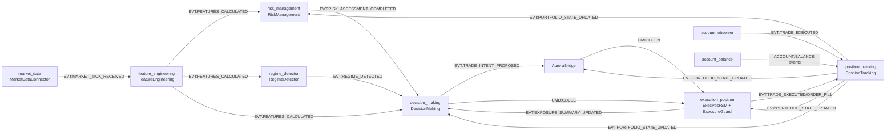

# Pipeline Overview (Runtime Event Flow)

> End‑to‑end view of the Aurora reference trading loop as implemented in `apps/reference/main.py` and domains under `apps/reference/domains/*`.

## Event Pipeline (High‑Level)

## Pipeline Stages and Files

### 1. Market Data → Features

- **Domain:** `market_data` → `feature_engineering`.
- **Files:**
  - `apps/reference/domains/market_data/market_data_connector.py`
  - `apps/reference/domains/feature_engineering/feature_engineering.py`
- **Configs:**
  - `config/aurora/trading.yaml` → `trading.market_data.*` (poll intervals, macro_sync anchors, symbols via `trading.instruments` / `aurora_instruments`).
  - `config/aurora/domains.yaml` → `domains.feature_engineering.*` (ema periods, volume/volatility windows, macro_sync, futures flags).
- **Events:**
  - `EVT:MARKET_TICK_RECEIVED` – normalized tick payload.
  - `EVT:FEATURES_CALCULATED` – feature vector for downstream consumers.

### 2. Features → Risk Management + Regime

- **Domains:** `risk_management`, `regime_detector`.
- **Files:**
  - `apps/reference/domains/risk_management/risk_management.py`
  - `apps/reference/domains/risk_management/daily_gate.py`
  - `apps/reference/domains/regime_detector/regime_detector.py`
- **Configs:**
  - `config/aurora/domains.yaml` → `domains.risk_management.risk_score_weights`, `domains.risk_management.trading_allowed_thresholds`.
  - `config/aurora/regime.yaml` → `models.*`, `axes.*`, `hmm.*`.
- **Events:**
  - `EVT:RISK_ASSESSMENT_COMPLETED` – risk score + `is_trading_allowed`.
  - `EVT:REGIME_DETECTED` – regime, confidence, warmup state.

### 3. Portfolio / Exposure Loop

- **Domains:** `execution_position`, `position_tracking`, `risk_management`, `decision_making`.
- **Files:**
  - `apps/reference/domains/execution_position/exposure_guard.py`
  - `apps/reference/domains/execution_position/fsm.py`
  - `apps/reference/domains/position_tracking/position_tracking.py`
- **Configs:**
  - `config/aurora/domains.yaml` → `domains.execution_position.exposure_guard.*`, `domains.position_tracking.precision.*`.
  - `config/aurora/trading.yaml` → `trading.execution.exposure`, `trading.risk.soft_limits`.
  - `configs/master_config_v1.yaml` → additive overrides under `trading.execution.exposure` and `trading.risk.soft_limits`.
- **Events:**
  - `EVT:TRADE_EXECUTED` / `EVT:ORDER_FILL` – fills.
  - `EVT:PORTFOLIO_STATE_UPDATED` – SSOT portfolio snapshot.
  - `EVT:EXPOSURE_SUMMARY_UPDATED` – exposure summary from ExposureGuard.

### 4. Decision Making

- **Domain:** `decision_making`.
- **Files:**
  - `apps/reference/domains/decision_making/decision_making.py`
  - `apps/reference/domains/decision_making/decision_context.py`
  - `apps/reference/domains/decision_making/normalized_reject_reasons.py`
- **Configs:**
  - `config/aurora/trading.yaml` → `trading.decision.*` (signal_threshold, signal_weights, position_sizing, kelly, behavior_fsm).
  - `config/aurora/domains.yaml` → `domains.decision_making.qos`, `domains.decision_making.features`, `domains.decision_making.position_sizing`.
- **Events / Commands:**
  - Inputs: `EVT:FEATURES_CALCULATED`, `EVT:RISK_ASSESSMENT_COMPLETED`, `EVT:PORTFOLIO_STATE_UPDATED`, `EVT:REGIME_DETECTED`, `EVT:EXPOSURE_SUMMARY_UPDATED`.
  - Outputs: `EVT:TRADE_INTENT_PROPOSED`, `EVT:ALPHA_SCORE_CALCULATED`, `CMD:CLOSE`.

Key gates (see `decision_flow_diagram.md` for detailed diagram):

- `features_ready?` – TTL check on feature freshness.
- `risk_assessment_ready?` – risk parameters present for symbol.
- `portfolio_fresh?` – delegated to AuroraBridge (`positions_last_ts_ms` and TTL).
- `QoS allow?` – QoS state (`domains.decision_making.qos` + DecisionMaking internal `_qos_state`).
- `trading_allowed?` – `is_trading_allowed` from risk payload.
- `signal_valid?` – score vs `signal_threshold` + regime multipliers.
- `regime_filter?` – per‑instrument `allowed_regimes`.
- `sizing_valid?` – position sizing, exposure, min_notional constraints.

### 5. AuroraBridge → Execution

- **Component:** `AuroraBridge` in `apps/reference/main.py`.
- **Role:** Convert `EVT:TRADE_INTENT_PROPOSED` → `CMD:OPEN` with:
  - QoS check (bridge‑side view of cooldowns from DecisionMaking).
  - Portfolio freshness gate using latest `EVT:PORTFOLIO_STATE_UPDATED` (`positions_last_ts_ms` and `positions_stale_ttl_sec`).
  - Deferral via `EVT:INTENT_DEFERRED` + retry; during migration legacy payloads may exist, but reliable retry is guaranteed only for v1 (`retry_key`, `next_allowed_ts`, `original_event`).
  - **Configs:**
  - `config/aurora/domains.yaml` → `domains.position_tracking.positions_stale_ttl_sec` (propagated into bridge config).

### 6. ExecPos FSM and Brackets

- **Domain:** `execution_position`.
- **Files:**
  - `apps/reference/domains/execution_position/fsm.py`
  - `apps/reference/domains/execution_position/fsm_open.py`
  - `apps/reference/domains/execution_position/fsm_manage.py`
  - `apps/reference/domains/execution_position/fsm_close.py`
  - `apps/reference/domains/execution_position/tpsl_math.py`
  - `apps/reference/domains/execution_position/order_guardian.py`
  - `apps/reference/domains/execution_position/exposure_guard.py`
- **Configs:**
  - `config/aurora/domains.yaml` → `domains.execution_position.*` (watchdog, exposure_guard, metrics, order_index).
  - `configs/master_config_v1.yaml` → `trading.execution.manage.brackets`, `trading.execution.manage.orphan_monitor`, `trading.execution.order_guardian`.
- **Flow:**
  - `CMD:OPEN` → `OpenFlowFSM` → `DEC:OPEN` → adapter.
  - `CMD:CLOSE` → `CloseFlowFSM` → `DEC:CLOSE`.
  - Fills (`EVT:ORDER_FILL`) → `ManageFlowFSM` (brackets, OCO emulation) + `ExposureGuard` + `PositionTracking`.

### 7. Regime Influence on Decisions

- **Domain:** `regime_detector` (producer), `decision_making` (consumer).
- **Effect:**
  - `EVT:REGIME_DETECTED` updates per‑symbol regime cache in DecisionMaking (`on_regime`).
  - Regime affects:
    - signal thresholds (`trading.decision.regime_threshold_multipliers`).
    - sizing multipliers (`trading.decision.sizing_modifiers`).
    - per‑instrument `allowed_regimes` in `trading.mean_reversion_1m.assets.*.allowed_regimes` and aurora instruments.
  - `regime_filter?` gate in Decision flow blocks trading for disallowed regimes.
