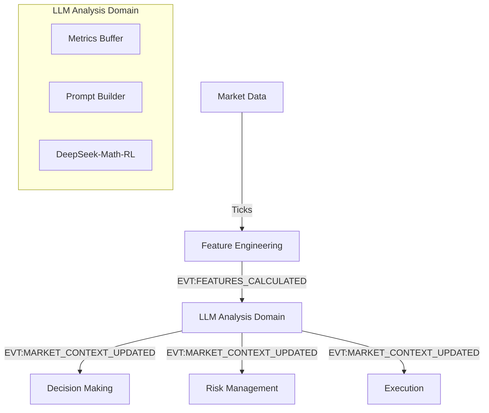

# Дизайн: LLM як Ядро Аналізу Ринку (Core Market Analyzer)

## 1. Концепція
Ми інтегруємо LLM не просто як радника, а як **центральний вузол аналізу**.
Вона замінює (або стає головною над) стандартні алгоритми визначення режиму та напрямку.

**Роль**: "Стратегічний Мозок".
**Вхід**: Розраховані метрики (RSI, MACD, Levels) від `feature_engineering`.
**Вихід**: Комплексний аналіз ринку (`Market Context`), який керує іншими доменами.

## 2. Потік Даних (Data Flow)



## 3. Новий Домен: `llm_analysis`

### 3.1. Вхідні дані
Ми не подаємо "сирі" тіки (це неефективно для 7B моделі). Ми подаємо **готові метрики** з `feature_engineering`.
Приклад вхідного промпта (всередині домену):
```text
Metrics:
- RSI(14): 72 (Overbought)
- MACD: Bearish Crossover
- Volatility(ATR): High
- Price Action: Testing Resistance 50000
```

### 3.2. Вихідна Подія: `EVT:MARKET_CONTEXT_UPDATED`
Ця подія стає "серцебиттям" стратегії. Всі інші домени підлаштовуються під неї.

**Payload Structure:**
```json
{
  "timestamp": 1700000000,
  "analysis": {
    "direction": "BEARISH",       // BULLISH, BEARISH, NEUTRAL
    "regime": "TRENDING_DOWN",    // RANGING, TRENDING_UP, TRENDING_DOWN, VOLATILE_CHOP
    "volatility_forecast": "HIGH",// LOW, NORMAL, HIGH, EXTREME
    "confidence": 0.92
  },
  "forecast": {
    "next_move": "Breakout below 49800",
    "target_levels": [49500, 49000],
    "invalidation_level": 50200
  },
  "directives": {
    "decision": "LOOK_FOR_SHORTS", // Вказівка для Decision Making
    "risk": "REDUCE_SIZE_50",      // Вказівка для Risk (через високу волатильність)
    "execution": "PASSIVE_LIMIT"   // Вказівка для Execution (не маркет ордери)
  }
}
```

## 4. Вплив на Інші Домени

### 4.1. `decision_making`
*   **Раніше**: Сам вирішував, куди торгувати на основі if/else.
*   **Тепер**: Отримує `direction` від LLM.
    *   Якщо LLM каже "BEARISH", домен ігнорує всі сигнали на покупку, навіть якщо RSI низький.
    *   Шукає точки входу тільки в напрямку, який задала LLM.

### 4.2. `risk_management`
*   **Раніше**: Статичний ризик або проста формула.
*   **Тепер**: Динамічний ризик на основі `volatility_forecast` та `confidence` від LLM.
    *   LLM Confidence < 0.6 -> Risk = 0 (No Trade).
    *   Volatility = EXTREME -> Risk = 0.5% (замість 1%).

### 4.3. `execution`
*   **Раніше**: Жорсткі налаштування.
*   **Тепер**: Адаптивність.
    *   LLM каже "Fast Breakout expected" -> Використовуємо Aggressive Market Orders.
    *   LLM каже "Chop / Ranging" -> Використовуємо Limit Orders на краях діапазону.

## 5. Технічна Реалізація
1.  **Сервіс**: Той самий `llm_server.py` (FastAPI), що тримає модель у пам'яті.
2.  **Домен**: `apps/reference/domains/llm_analysis`.
3.  **Оптимізація**:
    *   Оскільки це "легка" модель (7B), ми можемо запускати аналіз досить часто (наприклад, кожну хвилину або при закритті свічки).
    *   Для HFT (High Frequency) це не підійде, але для Scalping/Intraday (інтервал 1хв - 15хв) — ідеально.

## 6. План Дій
1.  Створити `llm_analysis` домен.
2.  Налаштувати підписку на `EVT:FEATURES_CALCULATED`.
3.  Реалізувати логіку "перекладу" метрик у промпт.
4.  Визначити чіткий JSON-формат відповіді моделі (щоб вона завжди повертала валідний JSON).
5.  Модифікувати `decision_making`, щоб він слухав `EVT:MARKET_CONTEXT_UPDATED`.
