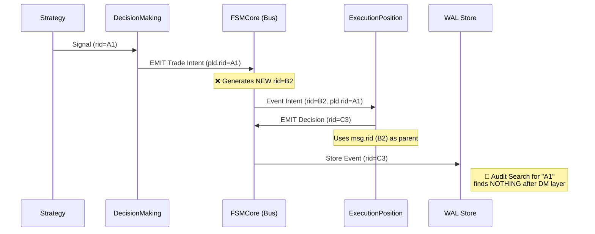
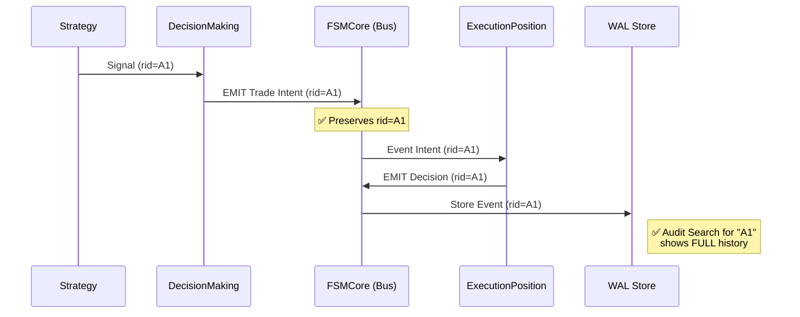

# Why Chain Remediation Plan

**Мета:** Відновити наскрізну простежуваність (End-to-End Traceability) подій у системі Phenix та забезпечити коректну роботу інструментів аудиту (WAL, Debug CLI).
**Статус:** Draft
**Мова:** Ukrainian

## 1. Executive Summary
Поточна реалізація "Why Chain" має критичні архітектурні дефекти, які роблять неможливим автоматичний аудит причинно-наслідкових зв'язків. Головні проблеми:
1.  **Розрив RID (Trace ID)**: Шлюз подій (`FSMCore`) перезаписує ідентифікатори подій, розриваючи ланцюжок між Стратегією та Виконанням.
2.  **Сліпота WAL**: Інструменти читання логів ігнорують основне поле даних (`data_ref`), де зберігається історія причин.
3.  **Втрата контексту помилок**: Критичні помилки (Rejections) не містять посилань на причини їх виникнення.

Цей план пропонує **хетурургічне втручання** в ядро системи (`vfoundation/core`) для виправлення ситуації з мінімальним ризиком для стабільності.

---

## 2. Архітектура: Before vs After

### Поточний стан (Broken Flow)


### Цільовий стан (Corrected Flow)


---

## 3. Етапи реалізації

### Етап 1: Infrastructure Fix (Core Surgery)
**Критичність:** P0 (Блокер)
**Ризик:** High (Зміни в ядрі впливають на всі домени)

Необхідно навчити `FSMCore` приймати та прокидати зовсім `rid`.

#### Патч 1.1: `vfoundation/core/fsm_core.py`
Змінити сигнатуру методу `emit`, додавши опціональний аргумент `rid`.

```python
# vfoundation/core/fsm_core.py

    def emit(self, event_name: str, payload: Dict[str, Any], why: str, 
             data_ref: Optional[List[str]] = None, 
             rid: Optional[str] = None) -> None:  # <--- [NEW]
        """
        Emit an event to all registered listeners.
        ...
        Args:
            rid: Optional Trace ID to preserve causal chain. 
                 If None, a new UUID will be generated by Protocol.
        """
        with self._lock:
            callbacks = list(self.listeners.get(event_name, []))

        if callbacks:
            # Create Message object
            message = Message(
                op="EVT",
                verb=event_name.split(":")[1],
                src="fsm_core",
                dst="any",
                rid=rid if rid else str(uuid.uuid4()),  # <--- [FIX] Use provided RID or gen new
                pld=payload,
                why=why,
                data_ref=data_ref or [],
            )
            # ...
```

#### Патч 1.2: `vfoundation/dr/wal.py`
Навчити читач WAL бачити `data_ref` там, де він є згідно протоколу (top-level field).

```python
# vfoundation/dr/wal.py

def read_by_rid(rid: str) -> tuple[list[Dict[str, Any]], list[str], bool]:
    # ... (all_hashes loop) ...
                            # Collect WHY information
                            # ... (existing payload check) ...

                            # [FIX] Check canonical data_ref field in Message
                            # Priority 1: Message-level data_ref (Canonical)
                            msg_data_ref = record.get("data_ref")
                            if msg_data_ref and isinstance(msg_data_ref, list):
                                why_chain.extend(msg_data_ref)

                            # Priority 2: Payload-level data_ref (Legacy/Fallback)
                            pld_data_ref = record.get("pld", {}).get("data_ref")
                            if pld_data_ref and isinstance(pld_data_ref, list):
                                why_chain.extend(pld_data_ref)
    # ...
```

---

### Етап 2: Domain Adoption (Execution)
**Критичність:** P1
**Ризик:** Medium

Оновити `ExecPosFSM`, щоб він використовував нові можливості ядра для коректного репортингу помилок.

#### Патч 2.1: `apps/reference/domains/execution_position/fsm.py`
Прокидання `data_ref` та `rid` у подіях відхилення (Rejections).

```python
# apps/reference/domains/execution_position/fsm.py

            except Exception as e:
                LOG.error(f"Failed to process TRADE_INTENT_PROPOSED: {e}", exc_info=True)
                if hasattr(self, "bus"):
                    try:
                        # ...
                        self.bus.emit(
                            "EVT:TRADE_INTENT_REJECTED",
                            {
                                "symbol": symbol,
                                "reason": f"EXCEPTION: {str(e)}",
                                "error_type": type(e).__name__
                            },
                            "execution_exception",
                            data_ref=msg.data_ref,  # <--- [FIX] Preserve Why Chain
                            rid=msg.rid             # <--- [FIX] Preserve Trace ID
                        )
```

---

## 4. План Тестування (Verification Strategy)

Оскільки зміни торкаються ядра, тестування має бути параноїдальним.

### Тест 1: Unit Test для FSMCore
Створити скрипт `tests/core/test_fsm_core_rid.py`, який:
1.  Створює екземпляр `FSMCore`.
2.  Реєструє лісенера.
3.  Емітить подію з явним `rid="test-trace-id-123"`.
4.  Assert: Отримане повідомлення має `message.rid == "test-trace-id-123"`.
5.  Емітить подію без rid.
6.  Assert: Отримане повідомлення має валідний UUID4.

### Тест 2: End-to-End Trace Simulation
Створити інтеграційний тест `tests/system/test_why_chain.py`, який:
1.  Імітує повний цикл: Strategy -> DecisionMaking -> ExecutionPosition.
2.  Використовує реальний WAL (або temp dir).
3.  Після циклу викликає `wal.read_by_rid(original_rid)`.
4.  Assert: Повертається ПОВНИЙ список подій (Intent + Decision + Execution) під одним і тим самим RID.
5.  Assert: Поле `why_chain` містить всі факти ("signal produced", "margin check ok", "execution started").

---

## 5. Аналіз Ризиків та Критика

> **Критика (від Agent Antigravity):**
> "Зміна сигнатури `FSMCore.emit` є небезпечною, оскільки цей метод можуть використовувати десятки інших файлів. Якщо ми змінимо порядок аргументів, це зламає систему."

**Mitigation (Зменшення ризику):**
1.  У Патчі 1.1 ми додаємо `rid` як **іменований опціональний аргумент** в кінець списку (`rid: Optional[str] = None`).
2.  Це зберігає зворотну сумісність: весь існуючий код, який викликає `emit("name", pld, why)`, продовжить працювати без змін (rid буде generated).
3.  Ми будемо змінювати виклики `emit` тільки в тих місцях, де нам критично потрібен трейсинг (DecisionMaking, ExecutionPosition).

## 6. Рекомендація
Затвердити план та розпочати реалізацію з Етапу 1 (Infrastructure Fix), обов'язково супроводжуючи його створенням нових юніт-тестів для гарантії стабільності.
