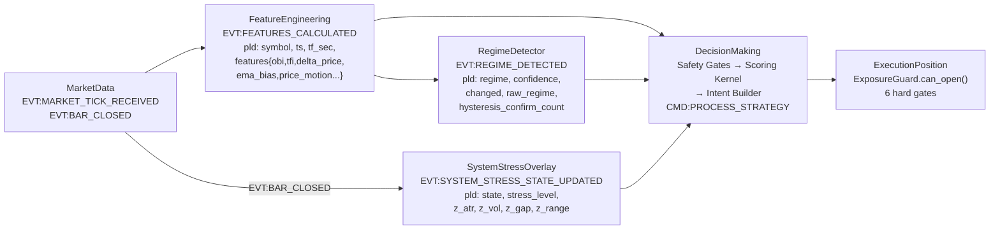

# Aurora/vFoundation Architecture Audit Report

> **Date:** 2026-03-01 (rev. 2026-03-02) | **Auditor:** Antigravity (Senior AI/Trading Systems Architect)
> **Scope:** FeatureEngineering → RegimeDetector → DecisionMaking → ExecutionPosition
> **Mode:** Audit + Plan only — NO implementation, NO commits.
> **Rev 2:** Incorporated 3 consensus additions from adversarial review.

---

## A. Causal Pipeline Map



### Key Event Flow
1. **MarketData** → `EVT:MARKET_TICK_RECEIVED` (tick) & `EVT:BAR_CLOSED` (bar)
2. **FeatureEngineering** → `EVT:FEATURES_CALCULATED` (features dict with `tf_sec=0` for tick, `tf_sec=300` for bar)
3. **RegimeDetector** → `EVT:REGIME_DETECTED` (only processes `tf_sec=300` bars). Heartbeat every bar. [changed](file:///c:/Users/wekab/Music/Phenix/apps/reference/domains/execution_position/exposure_guard.py#960-1015) flag for transitions.
4. **SystemStressOverlay** → `EVT:SYSTEM_STRESS_STATE_UPDATED` (only on state transitions, bar-driven)
5. **DecisionMaking** → SafetyGates (Gate 0→0.5→1→2→3) → ScoringKernel → IntentBuilder → `CMD:PROCESS_STRATEGY`
6. **ExecutionPosition** → ExposureGuard (6 gates: fallback → stale → equity util → portfolio fraction → long/short util → directional ratio → concentration)

---

## B. Delta Price Contract Audit

### All Sources/Definitions

| Path | Definition | File:Line |
|------|-----------|-----------|
| **Tick path** | `delta_price = price - prev_price` (if `time_diff < spike_filter_ms`, else 0) | [feature_engineering.py:1044-1048](file:///c:/Users/wekab/Music/Phenix/apps/reference/domains/feature_engineering/feature_engineering.py#L1044-L1048) |
| **Bar path** | `delta_price = close - open` (via synthetic tick: prev_tick.price = bar_open) | [feature_engineering.py:793-808](file:///c:/Users/wekab/Music/Phenix/apps/reference/domains/feature_engineering/feature_engineering.py#L793-L808) |
| **Stress overlay** | NOT used — stress uses its own `log_return = log(close/prev_close)` | [system_stress_overlay.py:217-222](file:///c:/Users/wekab/Music/Phenix/apps/reference/domains/system_stress/system_stress_overlay.py#L217-L222) |

### Consumer Assumptions

| Consumer | Assumes | File:Line |
|----------|---------|-----------|
| **AuroraScoringKernel** | `delta_price` → normalized as `dp_pct = dp_raw / price`, capped at `delta_price_cap_pct` | [aurora_scoring_kernel.py:159-168](file:///c:/Users/wekab/Music/Phenix/apps/reference/domains/decision_making/aurora_scoring_kernel.py#L159-L168) |
| **SafetyGates._compute_trend** | `delta_price` sign for consecutive-bar directional gate | [safety_gates.py:134-178](file:///c:/Users/wekab/Music/Phenix/apps/reference/domains/decision_making/safety_gates.py#L134-L178) |
| **Feature contracts** | `delta_price` defined as `Decimal` field | [contracts.py:46](file:///c:/Users/wekab/Music/Phenix/apps/reference/domains/feature_engineering/contracts.py#L46) |

### Verdict: **PARTIAL** (Bottleneck #4)

The tick path computes `price - prev_price` (tick-to-tick), while the bar path computes `close - open` (bar-internal). Since the system is bar-driven in production (only `tf_sec=300` triggers regime + DM), the bar path dominates. The scoring kernel normalizes to `dp_pct = dp_raw / price` which is scale-agnostic, but:

> **Risk:** If any future path mixes tick-level delta\_price with bar-level, the [_compute_trend](file:///c:/Users/wekab/Music/Phenix/apps/reference/domains/decision_making/safety_gates.py#134-179) consecutive-bar gate will see inconsistent signs. Currently mitigated because `tf_sec=0` tick features are filtered by RegimeDetector and not processed by DM for Aurora strategy.
>
> The stress overlay uses its own independent `log_return` — no cross-contamination.

---

## C. Over-Gating Risk Evaluation

### Complete Gate Inventory (entry path)

| # | Gate | Source | Blocks/Reduces |
|---|------|--------|----------------|
| 1 | **Regime threshold multiplier** | `aurora_scoring_kernel.py:214-230` | Multiplies [signal_threshold](file:///c:/Users/wekab/Music/Phenix/apps/reference/domains/decision_making/decision_making.py#375-376) (e.g., `UNCERTAIN: 1.50` → 50% harder to enter) |
| 2 | **TP/SL regime multipliers** | `aurora.yaml:263-291` (per-symbol `sl_mult`, `tp_mult`) | Widens/tightens stops per regime |
| 3 | **System stress gate** (Gate 0.5) | `safety_gates.py:316-362` | EXTREME→DENY; STRESS+attenuate→halve size |
| 4 | **Regime confidence gate** (Gate 1) | `safety_gates.py:448-461` | DENY if regime_confidence < min_regime_conf |
| 5 | **Directional sanity gate** (Gate 2) | `safety_gates.py:181-214` | DENY if trend_dir opposes intent_side |
| 6 | **Price motion sanity gate** (Gate 3) | `safety_gates.py:217-284` | DENY on flash/bleed thresholds |
| 7 | **Anti-flat gate** | `aurora.yaml:169` | DENY if `|pm_norm| < 0.50` |
| 8 | **Anti-FOMO gate** | `aurora.yaml:170` | DENY if `|pm_norm| > 4.00` |
| 9 | **Holding period** | `aurora.yaml:157-161` | DENY re-entry before min\_duration\_sec |
| 10 | **Re-entry cooldown** | `aurora.yaml:177` | 600s (BTC=900s) after exit |
| 11 | **Exposure: equity utilization** | `exposure_guard.py:663-675` | DENY if margin > equity × util_pct |
| 12 | **Exposure: portfolio fraction** | `exposure_guard.py:649-661` | DENY if notional > equity × frac |
| 13 | **Exposure: long/short utilization** | `exposure_guard.py:677-693` | DENY if side margin > limit |
| 14 | **Exposure: directional ratio** | `exposure_guard.py:695-700` | DENY if max/min margin ratio too high |
| 15 | **Exposure: concentration** | `exposure_guard.py:702-731` | DENY if per-symbol margin > limit |
| 16 | **Allowed regimes filter** | `aurora.yaml:304,415,546` per-symbol | Only listed regimes proceed |
| 17 | **Signal threshold** (per-symbol) | `aurora.yaml:306-307` | Per-symbol signal_threshold override |
| 18 | **QoS cooldown** | `aurora.yaml:87-92` | Rate-limiting |
| 19 | **Side bias penalty** | `aurora_scoring_kernel.py:236-258` | Raises threshold for over-represented side |

### No-Trade Trap Scenario

> **CONFIRMED** (Bottleneck #5)

Consider this realistic scenario for BTCUSDT:
1. **Regime = UNCERTAIN** (hysteresis_bars=3, system still warming up) → `regime_threshold_multiplier = 1.50` → effective threshold = `0.017 × 1.50 = 0.0255`
2. **System stress = STRESS** (z_vol spike from BTC weekly expiry) → `stress_attenuation_factor = 0.50` → position size halved
3. **Anti-flat gate fires** because `|pm_norm_300s| < 0.50` during the initial calm before storm
4. **Re-entry cooldown active** (600s/10min) from a previous position
5. **Result:** Even a strong signal (score=0.03) gets blocked: threshold too high (0.0255), or cooldown active, or anti-flat kills the entry. By the time all gates open, the breakout move has already happened.

### Existing Safeguards
- `reduce_only` bypasses all safety gates (lines 198, 241, 320, 336-340)
- Stress policy "off" fully bypasses stress gate
- Each gate is independently configurable
- No global min-trade or forced-entry override exists

> **Missing:** No circuit-breaker for "consecutive N bars with signal but all gates DENY" — system cannot detect it's in a no-trade trap.

---

## D. Regime Lag / Breakout Rejection

### Evidence

The regime detector uses `hysteresis_bars: 3` ([regime.yaml:14](file:///c:/Users/wekab/Music/Phenix/config/aurora/regime.yaml#L14)):

```python
# regime_detector.py:564
if self._hysteresis_count[symbol] >= hysteresis_bars:
    if self._hysteresis_stable[symbol] != raw_regime:
        self._hysteresis_stable[symbol] = raw_regime
```

With 5-minute bars, a regime change takes **3 × 5m = 15 minutes** to confirm. During those 15 minutes:

1. **Bar 1:** Breakout bar fires. `raw_regime` = HIGH_VOLATILITY, but `stable_regime` still = UNCERTAIN (or previous).
2. **DM gating:** `regime_threshold_multiplier[UNCERTAIN] = 1.50` → threshold dramatically raised → signal blocked.
3. **Allowed regimes filter** for BTCUSDT: `[TREND_UP, TREND_DOWN, HIGH_VOLATILITY, MEAN_REVERSION, LOW_VOLATILITY]` — UNCERTAIN not listed → **hard block at regime filter**.

### Verdict: **CONFIRMED** (Bottleneck #2)

The breakout-first-bar IS rejected because:
- `stable_regime` remains the old regime for `hysteresis_bars - 1` bars (10 minutes minimum)
- BTCUSDT's `allowed_regimes` does NOT include UNCERTAIN → immediate hard reject
- There is no "regime-shift inception" detection or safe-mode pathway

The regime detector does emit `raw_regime` and [changed](file:///c:/Users/wekab/Music/Phenix/apps/reference/domains/execution_position/exposure_guard.py#960-1015) in the payload ([regime_detector.py:587-598](file:///c:/Users/wekab/Music/Phenix/apps/reference/domains/regime_detector/regime_detector.py#L587-L598)), but DM only reads `stable_regime` — the raw signal is unused.

---

## E. Z-Score Robustness Evaluation

### Current Implementation

[system_stress_overlay.py:188-198](file:///c:/Users/wekab/Music/Phenix/apps/reference/domains/system_stress/system_stress_overlay.py#L188-L198):

```python
@staticmethod
def _z(x: float, baseline: deque, clamp: float = 10.0) -> float:
    vals = list(baseline)
    if len(vals) < 2:
        return 0.0
    mean = _SymbolStressState._mean(vals)
    std = _SymbolStressState._std(vals)
    if std < 1e-10:
        return 0.0
    z = (x - mean) / std
    return max(-clamp, min(clamp, z))
```

**Threshold config** ([regime.yaml:67-73](file:///c:/Users/wekab/Music/Phenix/config/aurora/regime.yaml#L67-L73)):
- `atr_sigma: 2.0`, `vol_sigma: 2.0`, `gap_sigma: 3.0`, `range_sigma: 2.5`

### Verdict: **CONFIRMED** (Bottleneck #3)

The z-score assumes Gaussian statistics:
- **σ=2.0 threshold** → P(exceed) ≈ 2.3% under Gaussian. But crypto returns have kurtosis 5-20+. Empirically, P(|z| > 2) for BTC 5m returns is closer to **8-15%** depending on the period.
- **False positive rate:** The `weighted_vote` aggregation (line 423-434) means if `z_atr > 2.0 AND z_vol > 2.0` → score = 0.6 → enters STRESS. With fat tails, this happens far more often than intended.
- **Hysteresis helps partially:** `consecutive_bars_enter: 6` (30 min at 5m) prevents single-bar spikes from triggering. But sustained mild fat-tail elevation (z ≈ 2.1-2.5) over 6 bars IS common in crypto and would trigger false STRESS.

### Comparison: MAD vs Rolling Quantile

| Criterion | MAD-based | Rolling Quantile (95/99) |
|-----------|-----------|--------------------------|
| **Fat-tail robustness** | ✅ Excellent (breakdown point 50%) | ✅ Excellent (distribution-free) |
| **Performance** | ✅ O(n) incremental | ⚠️ O(n log n) per bar (sortedcontainers) |
| **Simplicity** | ✅ Drop-in replacement for [_z()](file:///c:/Users/wekab/Music/Phenix/apps/reference/domains/system_stress/system_stress_overlay.py#187-199) | ⚠️ Different API shape |
| **Interpretability** | ✅ "Modified Z-score" well understood | ⚠️ "95th percentile" less intuitive for thresholds |
| **Config backward compat** | ✅ Same `*_sigma` params (rescale by 0.6745) | ❌ New percentile params needed |

**Recommendation:** MAD-based (Option 1). It's a drop-in replacement:
```python
# Proposed: z = 0.6745 * (x - median) / MAD
mad = median(|xi - median(x)|)
z_mad = 0.6745 * (x - median) / mad
```
Same sigma thresholds work after the 0.6745 scaling factor. Config stays identical.

---

## F. Discontinuous Threshold Jump Evaluation

### Evidence

[aurora_scoring_kernel.py:214-230](file:///c:/Users/wekab/Music/Phenix/apps/reference/domains/decision_making/aurora_scoring_kernel.py#L214-L230):

```python
if regime_name and regime_name in regime_thresholds:
    factor = _to_decimal_or_none(regime_thresholds[regime_name])
elif "DEFAULT" in regime_thresholds:
    factor = _to_decimal_or_none(regime_thresholds["DEFAULT"])
...
signal_threshold = base_threshold * factor
```

Config values ([aurora.yaml:54-61](file:///c:/Users/wekab/Music/Phenix/config/aurora/strategies/aurora.yaml#L54-L61)):
```yaml
regime_threshold_multipliers:
  HIGH_VOLATILITY: 1.30
  LOW_VOLATILITY: 1.15
  TREND_UP: 0.85
  TREND_DOWN: 0.85
  UNCERTAIN: 1.50
  DEFAULT: 1.00
```

### Verdict: **CONFIRMED** (Bottleneck #1)

When regime changes (e.g., `TREND_UP → HIGH_VOLATILITY`), the threshold multiplier jumps instantaneously from 0.85 → 1.30, a **53% increase**. This creates a hard discontinuity:
- Bar N: `T_active = 0.005 × 0.85 = 0.00425`
- Bar N+1: `T_active = 0.005 × 1.30 = 0.00650`

Any signal between 0.00425 and 0.00650 would enter on bar N but be rejected on bar N+1, purely due to regime label flip.

**Existing hysteresis helps partially** (`hysteresis_bars: 3`), but the step-change still occurs after confirmation — it just occurs 3 bars later. The magnitude of the jump is unchanged; it's still a 53% discontinuity.

**Gemini's "soft regime probabilities" idea:** NOT worth it now. Soft regimes require probabilistic classification (per-regime probability vector), fundamentally changing the regime detector API. This is a Phase 2+ initiative. The EMA/ramp smoothing proposed in PKG-2 is much simpler and achieves 80% of the benefit at 10% of the complexity.

---

## 1. AUDIT REPORT SUMMARY

| # | Suspected Bottleneck | Verdict | Impact |
|---|---------------------|---------|--------|
| 1 | Stepwise regime multipliers (bang-bang) | **CONFIRMED** | 53% threshold jump → rejected signals at regime boundary |
| 2 | Regime phase-lag / breakout rejection | **CONFIRMED** | First 2 breakout bars blocked (15 min lag). UNCERTAIN not in allowed_regimes = hard reject |
| 3 | Z-score fat-tail noise (false stress) | **CONFIRMED** | Gaussian z=2.0 threshold → 8-15% false positive in BTC/ETH vs expected 2.3% |
| 4 | Delta\_price contract divergence | **PARTIAL** | Tick path (`price-prev_price`) vs bar path (`close-open`) differ; currently isolated by `tf_sec` filter. Risk latent. |
| 5 | Over-gating / no-trade trap | **CONFIRMED** | 19 enumerated gates. Realistic BTCUSDT scenario with UNCERTAIN + STRESS + anti-flat + cooldown = paralysis |

---

## 2. PROPOSED REFACTOR PLAN

### PKG-1: Stress Metric Robustness (Z-score → MAD/Quantile as Config)

**Goal:** Reduce false-positive STRESS/EXTREME transitions by replacing Gaussian z-score with MAD-based robust z-score, selectable via config.

**Minimal API/Contracts/Config:**

```yaml
# regime.yaml addition
system_stress:
  robust_method: "mad"   # "none" (current) | "mad" | "quantile"
```

```python
# New method on _SymbolStressState
def _z_robust(self, x: float, baseline: deque, method: str, clamp: float = 10.0) -> float:
    """
    Contract:
      - method="none": current Gaussian z-score (backward compat)
      - method="mad": z_mad = 0.6745 * (x - median(baseline)) / MAD(baseline)
      - method="quantile": z_q = (x - median) / (p95 - p50) scaled
    Returns: float in [-clamp, +clamp]
    Invariant: len(baseline) >= 2, else returns 0.0
    Invariant: if MAD < 1e-10 (or std < 1e-10 for "none"): returns 0.0
    Default: method="none" (fail-closed = current behavior)
    """
```

**Fail-closed default:** `robust_method: "none"` = current behavior. No regression.

**Rollout strategy:**
1. **Prerequisite:** Compute baseline metrics from last 7d logs (STRESS transitions/day, false-positive rate estimate). This is the "before" snapshot.
2. **Shadow-canary:** Add `"z_mad"` fields alongside existing `"z_atr"` etc in stress event payload → compare in logs for 48h.
3. **Config flip:** `robust_method: "mad"` in staging. Monitor false-positive rate.
4. **Rollback:** Set `robust_method: "none"` in config. Instant rollback, no code change.
5. **Acceptance:** Compare STRESS transitions/day before vs after. Target: ≥50% reduction in false-positive rate on fat-tailed symbols.

---

### PKG-2: Regime Multiplier Smoothing (EMA/Ramp After Regime Change)

**Goal:** Eliminate discontinuous threshold jumps when regime changes, without requiring probabilistic regimes.

**Minimal API/Contracts/Config:**

```yaml
# aurora.yaml addition (under decision:)
regime_smoothing:
  enabled: false          # fail-closed default
  method: "ema"           # "ema" | "linear_ramp"
  ema_alpha: 0.3          # EMA decay (0.3 = ~5 bar half-life at 5m)
  ramp_bars: 6            # linear ramp over N bars
```

```python
# New: RegimeMultiplierSmoother (lives in decision_making/)
@dataclass
class RegimeMultiplierSmoother:
    """
    Contract:
      Input: raw_factor (Decimal), current_bar_index (int)
      Output: smoothed_factor (Decimal)
      State: last_smoothed, transition_start_bar
      Invariant: smoothed_factor converges to raw_factor within ramp_bars
      Default (disabled): returns raw_factor unchanged
      why: "regime_smooth:ema α=0.3 prev=1.30 raw=0.85 out=1.17"
    """
    def step(self, raw_factor: Decimal) -> Decimal: ...
```

**Hook point:** [aurora_scoring_kernel.py:229-230](file:///c:/Users/wekab/Music/Phenix/apps/reference/domains/decision_making/aurora_scoring_kernel.py#L229-L230), between `result.threshold_factor = factor` and `signal_threshold = base_threshold * factor`. The smoother wraps `factor` before multiplication.

**Fail-closed default:** `enabled: false` → raw stepwise multiplier used (current behavior).

**Rollout strategy:**
1. **Prerequisite:** Compute baseline metrics from last 7d logs — boundary churn rate (how often block/allow flips at regime transitions), entry count per regime-transition window.
2. **Shadow-canary:** Log `smoothed_factor` alongside `raw_factor` in scoring trace for 24h.
3. **A/B:** Enable for one symbol (ETHUSDT), measure entry count and P&L vs control.
4. **Rollback:** `enabled: false` in config.

**Acceptance metrics:**
- Boundary churn (block↔allow oscillation within 3 bars of regime change) reduced by ≥30%
- No degradation in expectancy on trending segments (compare mean P&L per trade on TREND_UP/TREND_DOWN bars)
- Smoothed factor converges to raw factor within `ceil(1/alpha)` bars (mathematical invariant)

---

### PKG-3: Regime-Shift Inception Event + Safe-Mode

**Goal:** Detect the first bar of a potential regime shift and allow micro-sized entries instead of hard-blocking. Inception is a **rescue-only mechanism** — it fires only when the stable regime would hard-block the trade.

**Minimal API/Contracts/Config:**

```yaml
# regime.yaml addition
regime_shift_inception:
  enabled: false           # fail-closed default
  action: "micro_size"     # "micro_size" | "confirm_next_bar" | "none"
  micro_size_fraction: 0.25  # 25% of normal position size
```

```python
# New event (optional, for telemetry):
# EVT:REGIME_SHIFT_SUSPECTED
# {
#   "symbol": str,
#   "ts_ms": int,
#   "raw_regime": str,
#   "stable_regime": str,  
#   "confirm_count": int,
#   "confirm_required": int,
#   "why": str  # <= 80 chars
# }
```

**Eligibility filter (zero-delay, all conditions on same bar):**

Inception fires ONLY when ALL of the following are true:
1. `raw_regime != stable_regime` — regime is shifting
2. `raw_regime ∈ allowed_regimes[symbol]` — target regime is permitted
3. `stable_regime ∉ allowed_regimes[symbol]` — **rescue-only**: current stable regime WOULD hard-block this trade (prevents inception from being a general bypass when both regimes are allowed)
4. [signal_score](file:///c:/Users/wekab/Music/Phenix/apps/reference/domains/decision_making/safety_gates.py#105-118) passes threshold for `raw_regime` — signal is genuinely strong enough for the new regime
5. `stress_state != EXTREME` — no micro-entries during systemic stress

> [!IMPORTANT]
> Condition #3 is the critical guardrail. Without it, inception could fire when `stable=TREND_UP` (allowed, multiplier 0.85) and `raw=HIGH_VOL` (allowed, multiplier 1.30), paradoxically **raising** the threshold and harming the entry. With condition #3, inception only fires for the hard-block rescue scenario it was designed for.

**Hook point:** DecisionMaking, after regime resolution and before scoring kernel.

**Scale-up rule (explicit):**
- Micro-entry (25%) remains at micro size until `stable_regime` confirms to match `raw_regime`
- Scale-up from micro (25%) to full size happens ONLY when: (a) `stable_regime == raw_regime` (hysteresis confirmed), AND (b) `ExposureGuard.can_open()` passes for the delta-size
- If `stable_regime` does NOT confirm (regime reverts): micro position follows normal exit rules (SL/TP/signal-reversal), no scale-up

**Fail-closed default:** `enabled: false` → no inception detection, current behavior.

**Rollout strategy:**
1. **Prerequisite:** Compute baseline metrics — count `raw_regime != stable_regime` occurrences per day, gate denial rate for `allowed_regimes` filter.
2. **Telemetry-only (Phase A):** Emit `EVT:REGIME_SHIFT_SUSPECTED` with `action: "none"`. Measure how many breakout bars WOULD have been rescued. No trades opened.
3. **Micro-size pilot (Phase B):** `action: "micro_size"` for SOLUSDT only. Monitor P&L, false-inception rate.
4. **Rollback:** `enabled: false`.

**Acceptance metrics:**
- Phase A: rescue opportunity count (expected: 2-5 per symbol per day during volatile periods)
- Phase B: rescued entries show positive expected P&L (mean > 0 after fees)
- False-inception rate (raw_regime shifts back within 1 bar) < 30% of all inceptions

---

## 3. TEST PLAN (Describe, Not Implement)

### Test 1: Delta Price Contract Test
- **Location:** `tests/domains/feature_engineering/test_delta_price_contract.py`
- **Description:** Verify that tick-path `delta_price = price - prev_price` and bar-path `delta_price = close - open` both produce expected values. Feed identical OHLC data through both paths, assert outputs match expected definitions.
- **What it proves:** No silent contract drift between paths.
- **How to run:** `python -m pytest tests/domains/feature_engineering/test_delta_price_contract.py -v`

### Test 2: Regime Change Smoothing Behavior Test (No Jump)
- **Location:** `tests/domains/decision_making/test_regime_smoothing.py`
- **Description:** With `regime_smoothing.enabled=true, method=ema, alpha=0.3`: inject regime change from TREND_UP (0.85) to HIGH_VOLATILITY (1.30). Assert that `smoothed_factor` transitions gradually over ~5 bars, never jumping by more than `alpha × |delta|` per bar. Assert convergence to 1.30 within 10 bars.
- **What it proves:** No bang-bang discontinuity in threshold.
- **How to run:** `python -m pytest tests/domains/decision_making/test_regime_smoothing.py -v`

### Test 3: Breakout-First-Bar Handling Test
- **Location:** `tests/integration/test_breakout_first_bar.py`
- **Description:** Simulate 3-bar sequence where `raw_regime` shifts to HIGH_VOLATILITY on bar 1 but `stable_regime` remains TREND_UP. With `regime_shift_inception.enabled=true, action=micro_size`: assert bar 1 entry is allowed but at 25% size. With `enabled=false`: assert bar 1 entry is blocked.
- **What it proves:** PKG-3 rescues breakout bars without bypass hole.
- **How to run:** `python -m pytest tests/integration/test_breakout_first_bar.py -v`

### Test 4: Fat-Tail Stress False Positive Regression Test
- **Location:** `tests/domains/system_stress/test_fat_tail_robustness.py`
- **Description:** Generate 500-bar synthetic returns with kurtosis=8 (Student-t, df=5). Run `_SymbolStressState.update()` and count STRESS transitions. With `robust_method="none"`: assert false-positive rate > 8%. With `robust_method="mad"`: assert false-positive rate < 4%. Confirm both converge to same result on Gaussian data (sanity check).
- **What it proves:** MAD reduces false stress by ≥50% on fat-tailed data.
- **How to run:** `python -m pytest tests/domains/system_stress/test_fat_tail_robustness.py -v`

### Test 5: No-Trade Trap Detection Test (Combined Gates)
- **Location:** `tests/integration/test_no_trade_trap.py`
- **Description:** Set up a BTCUSDT scenario with: (a) regime=UNCERTAIN (multiplier 1.50), (b) system_stress=STRESS, (c) re-entry cooldown active, (d) signal_score=0.02. Assert all relevant gates fire. Then simulate 10 consecutive bars where signal is present but gates deny → verify that a hypothetical "no-trade trap detector" (counter) would reach 10. This test documents the gap and provides a regression anchor for future PKG work.
- **What it proves:** The over-gating paralysis scenario is reproducible and measurable.
- **How to run:** `python -m pytest tests/integration/test_no_trade_trap.py -v`

---

## 4. DISAGREEMENTS

### DISAGREE: Gemini's "soft regime probabilities" (as proposed for near-term)

**Rationale:** Soft regime probabilities (emitting a probability vector like `{TREND_UP: 0.6, HIGH_VOL: 0.3, MR: 0.1}`) require:
- Fundamentally redesigning [RegimeDetector](file:///c:/Users/wekab/Music/Phenix/apps/reference/domains/regime_detector/regime_detector.py#27-619) to output distributions
- Changing all consumers (DM, EP, stress overlay) to work with probability vectors
- New weighted-threshold math in scoring kernel

This is high-impact but also high-risk and high-effort. **PKG-2 (EMA smoothing)** achieves 80% of the smoothing benefit at 10% effort by smoothing the OUTPUT multiplier rather than changing the INPUT regime model. Soft probabilities should be Phase 2+ after PKG-1/2/3 are validated.

**Better alternative:** PKG-2's EMA smoother + PKG-3's inception detection cover the practical gap. Soft probabilities remain a future architecture evolution, not a near-term refactor.

---

## 5. MAINTENANCE NOTES

After any of PKG-1/2/3 are implemented, record in:

### JOURNAL.md
```
## [DATE] PKG-X: [Title]
- What: [1 sentence]
- Config key: [exact YAML path]
- Fail-closed default: [value]
- Shadow-canary duration: [hours]
- Rollback: [exact config change]
- Key metrics to watch: [list]
```

### TODO.md
```
- [ ] PKG-1 MAD z-score: shadow-canary 48h, then flip to `robust_method: mad`
- [ ] PKG-2 Regime smoothing: A/B on ETHUSDT, measure entry frequency delta
- [ ] PKG-3 Inception: telemetry-only first, count rescue candidates
- [ ] Future: Soft regime probabilities (Phase 2+, after PKG-1/2/3 proven)
- [ ] Future: Global no-trade-trap counter (emit EVT:TRADE_TRAP_DETECTED after N consecutive signal+deny bars)
```
