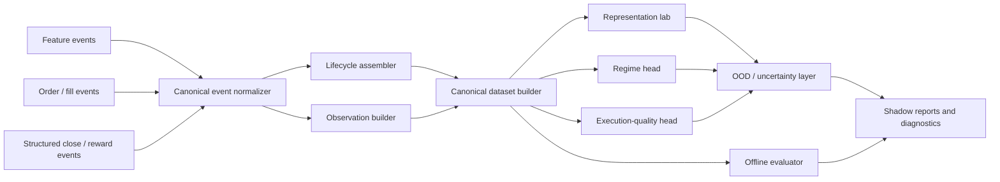

# Neocortex Target State 9.5

Date: 2026-03-10
Scope: `apps/reference/domains/neocortex`

## What Production-Grade Shadow Is

Production-grade shadow is not live authority. It is a contract-clean observer that can:

- ingest canonical market and lifecycle events,
- build reproducible latent representations,
- evaluate regime and execution-quality hypotheses offline,
- produce disagreement and drift reports,
- generate canonical datasets,
- remain read-only relative to Aurora.

## What 9.5/10 Requires Beyond Production Shadow

To reach a true 9.5/10 architecture, `neocortex` must add:

- uncertainty estimation,
- calibration monitoring,
- OOD / drift detection,
- agent-state-aware inputs,
- clean execution-quality labels,
- offline evaluator with calibration and pnl-aware metrics,
- explicit planner / world-model scope,
- gated advisory progression.

The delta from Stage A to Stage B is not "more PPO". It is better contracts, better labels, better evaluation, and tighter stage gates.

## Target Data Plane

Principles of the target data plane:

- all incoming records are normalized before any modeling logic,
- lifecycle assembly is explicit and identity-safe,
- dataset generation is reproducible and manifest-backed,
- evaluation is first-class, not an afterthought.

## Canonical Event Contracts

### 1. Canonical Observation Event

Required fields:

- `event_id`
- `event_ts_ms`
- `source_stream`
- `source_offset`
- `symbol`
- `bar_tf_sec`
- `market_features`
- `agent_state`
- `sequence_key`
- `provenance`

Rules:

- `event_ts_ms` is the only causal timestamp.
- `market_features` and `agent_state` are separate namespaces.
- `sequence_key` must identify the recurrent context boundary.

### 2. Canonical Lifecycle Event

Required fields:

- `event_id`
- `event_ts_ms`
- `lifecycle_id`
- `trade_id`
- `order_id`
- `client_order_id`
- `symbol`
- `event_type`
- `side`
- `qty`
- `price`
- `fill_qty`
- `fill_price`
- `is_partial_fill`
- `provenance`

Rules:

- placement, fill, open, close, cancel, reject are distinct events,
- ambiguous identity mapping is rejected, not guessed,
- same-symbol overlap is valid only when identity fields differentiate trajectories.

### 3. Canonical Close / Reward Event

Required fields:

- `event_id`
- `event_ts_ms`
- `lifecycle_id`
- `trade_id`
- `symbol`
- `realized_pnl_gross`
- `fees`
- `slippage`
- `realized_pnl_net`
- `holding_time_ms`
- `reward_completeness_status`

Optional fields:

- `mae`
- `mfe`
- `close_reason`

Rules:

- structured feed is the preferred source,
- parser shims must still emit completeness status,
- reward-bearing episodes without completeness status are invalid.

## Lifecycle Identity

Target rule set:

- primary key: `lifecycle_id`
- secondary identity: `trade_id`, `order_id`, `client_order_id`
- fallback is allowed only if the contract declares it explicitly
- symbol-only matching is forbidden for training-grade episode closure

Why:

- execution trajectories are defined by lifecycle, not ticker symbol.

## Reward Semantics

Production-shadow reward semantics are diagnostic, completeness-aware, and reproducible.

Future advisory reward semantics require:

- net pnl after fees,
- slippage attribution,
- holding-time awareness,
- optional adverse excursion metrics,
- explicit separation between realized reward and proxy labels.

Text parsing is only a temporary compatibility layer. The target architecture uses a structured close feed because reward semantics are business contracts, not log formatting accidents.

## Sequence Semantics

Target sequence contract:

- recurrent state isolated per `sequence_key`,
- reset on lifecycle boundary, symbol boundary, or explicit stream reset,
- true sequence minibatching,
- train / inference parity,
- no global hidden state across unrelated symbols.

The world model and recurrent policy must consume the same sequence semantics. Any architecture that trains on flattened rows and infers statefully is capped below target quality.

## Latent Model Evolution

Stage A:

- VAE or sequence encoder for market-state compression,
- regime diagnostics from latent space,
- offline clustering and drift monitoring.

Stage B:

- sequence-aware latent memory,
- agent-state-aware conditioning,
- uncertainty-calibrated latent embeddings,
- explicit separation between representation learning and decision heads.

The latent model should evolve from "market-only compression" to "market plus agent context memory", but only after lifecycle and reward correctness are green.

## Uncertainty, Calibration, And OOD Handling

The 9.5 target requires the domain to know when it does not know.

Required capabilities:

- predictive uncertainty per head,
- reliability curves and expected calibration error,
- OOD detection in latent space,
- drift monitoring over features, latents, and label mix,
- confidence gating before any advisory surface is shown.

Practical implementation options:

- deep ensembles or MC dropout for predictive spread,
- temperature scaling / isotonic calibration for classification heads,
- Mahalanobis, density ratio, or reconstruction-based OOD score,
- rolling drift statistics over feature and latent distributions.

## Offline Evaluator

The target architecture includes a first-class offline evaluator with separate scorecards for:

- representation quality,
- regime classification,
- execution-quality prediction,
- disagreement stability,
- calibration,
- drift / OOD performance,
- reward coverage and completeness.

For later offline RL research, the evaluator must also track:

- behavior-policy coverage,
- action-support gaps,
- reward completeness coverage,
- off-policy evaluation assumptions,
- pessimistic value bounds.

## Planner / World-Model Role

Current state:

- world model exists as scaffolding and is not part of real action selection.

Target role:

- offline counterfactual simulator,
- latent transition diagnostics,
- uncertainty-aware planning research tool,
- optional future advisory explainer.

Not allowed before later gates:

- direct live control,
- hidden use in live policy modulation,
- claims of causal planning without clean sequence and reward contracts.

## Gates Before Any Advisory Or Live Influence

Before even advisory influence is considered, the following must be true:

- production shadow gates are green,
- uncertainty and calibration outputs are implemented and validated,
- agent-state-aware inputs are added under explicit contract,
- offline evaluator is operational,
- reward completeness and lifecycle identity are stable on clean datasets,
- OOD / drift gating is working,
- execution-quality head beats baseline with calibrated reliability,
- advisory outputs remain read-only until dedicated advisory gates are passed.

## Staged Evolution

The intended evolution path is:

1. observer
2. latent / regime lab
3. execution advisor
4. contextual bandit advisor
5. conservative offline RL contour
6. tightly gated modulation advisor

Anything that skips these stages is architectural debt, not progress.
