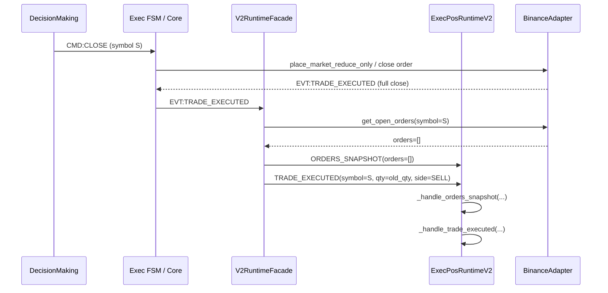
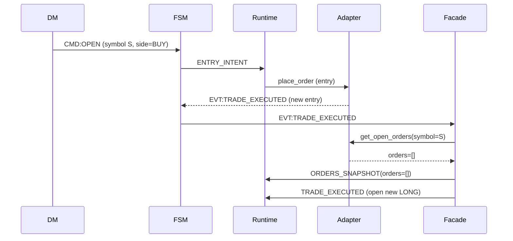
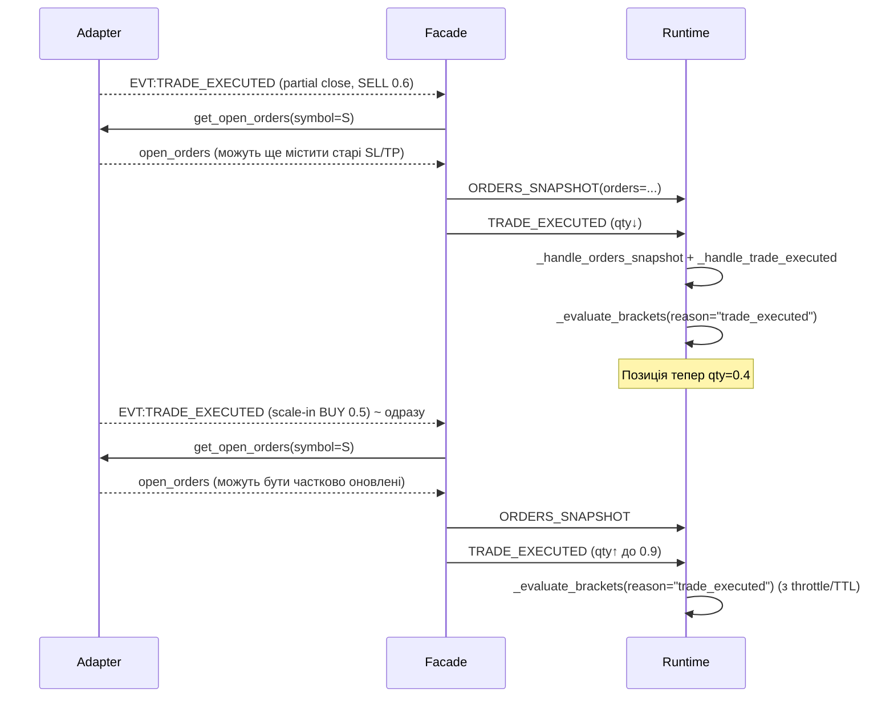
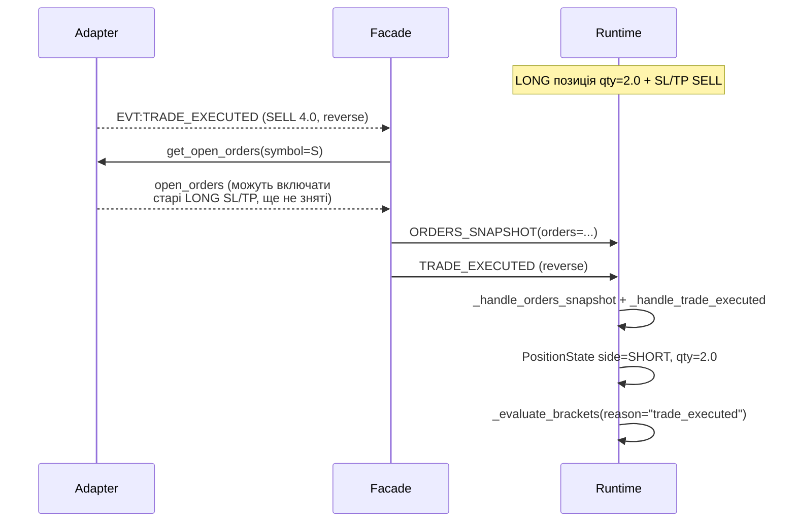

# PACK OCO-AUDIT-R1 — R1-C Race-condition Analysis (Aggregated OCO)

**Date:** 2025-11-23  
**RID:** OCO-AUDIT-R1-C-RACES  
**Type:** Read-only audit (no code changes)  
**Scope:** ExecPosRuntimeV2 + Aggregated OCO / TP‑SL under asynchronous events

---

## 1. Ціль

- Проаналізувати, як асинхронність подій впливає на:
  - створення/cleanup TP/SL при full close + new entry (same symbol),
  - partial close + scale‑in,
  - reverse (LONG→SHORT / SHORT→LONG).
- Виявити місця, де:
  - TP/SL можуть зникнути на короткий час (вікна без захисту),
  - старі TP/SL можуть «пережити» закриття і сприйматися як захист нової позиції,
  - cleanup опирається лише на `symbol`/`side` без `position_id` / версії.
- Сформувати R1‑C‑RISK‑* патерни із пріоритетами (P0/P1/P2).

---

## 2. Конкурентні поверхні ExecPosRuntimeV2

### 2.1 Декілька джерел подій

- **WebSocket:**
  - `EVT:TRADE_EXECUTED` → `V2RuntimeFacade.on_trade_executed`:
    - `_sync_orders_and_handle_trade(symbol, runtime_event)`:
      1. `orders = await adapter.get_open_orders(symbol=symbol)`
      2. `runtime.handle({"kind": "ORDERS_SNAPSHOT", "payload": {"orders": orders}})`
      3. `runtime.handle(runtime_event)` (`TRADE_EXECUTED`).
  - `EVT:ACCOUNT_UPDATE_RECEIVED` → `V2RuntimeFacade.on_account_update`:
    - `_process_account_update(payload)`:
      1. `orders = await adapter.get_open_orders()` (усі символи),
      2. `runtime.handle({"kind": "ORDERS_SNAPSHOT", "payload": {"orders": orders}})`,
      3. `runtime.handle({"kind": "POSITION_SYNC", "symbol": sym, "payload": {"positions": [pos]}})` для кожної позиції.

- **Legacy Messages via event_adapter:**
  - `CMD:OPEN` / `CLOSE` / `CANCEL` → `ENTRY_INTENT` / `CLOSE_INTENT` / `CANCEL_INTENT`.
  - `EVT:POSITION_SNAPSHOT` / `OPEN_ORDERS_UPDATED` → `POSITION_SNAPSHOT` / `ORDERS_SNAPSHOT`.

### 2.2 Снапшоти та TTL

- `_orders_snapshot_state[symbol] ∈ {"UNKNOWN", "STALE", "FRESH"}`:
  - `_handle_orders_snapshot`:
    - При **non‑empty** `orders`:
      - оновлює `_open_orders_by_symbol` та `_mark_orders_snapshot(symbol, now)` → `"FRESH"`.
    - При **empty** `orders`:
      - **не** очищає `_open_orders_by_symbol`,
      - лог `ORDERS_SNAPSHOT result="empty"`,
      - для всіх `sym` з позиціями:
        - якщо state `"UNKNOWN"` → `"FRESH"` + `_mark_orders_snapshot(sym)`.
      - для FRESH символів без позицій → `"STALE"`.
- `_is_orders_snapshot_fresh(symbol)`:
  - TTL за `SnapshotConfig.orders_ttl_sec` (з конфігів / дефолт).
  - Якщо TTL вийшов, `snapshot_state` переводиться з `"FRESH"` в `"STALE"`.

- `_evaluate_brackets(symbol, position, reason)`:
  - Якщо `snapshot_state == "FRESH"` але TTL вийшов → `snapshot_state="STALE"`.
  - Для `reason in {"account_update_sync", "guard_loop"}`:
    - якщо `snapshot_state != "FRESH"` → `BRACKETS` `result="snapshot_blocked"` і **return**.
  - Для `reason=="trade_executed"`:
    - якщо `snapshot_state=="UNKNOWN"` → `BRACKETS` `result="snapshot_blocked"` і **return**;
    - якщо `"STALE"` → **все одно** виконує evaluate (fail‑open відносно stale orders).

### 2.3 Cleanup і прив’язка до позиції

- Cleanup orphans:
  - `BracketService.evaluate()` вміє CANCEL для flat + brackets.
  - Реально використовується в `_run_bracket_recovery_pass()` лише **один раз** після першого non‑empty `ORDERS_SNAPSHOT`.
  - Watchdog (`AggOcoWatchdogService`) лише детектує; runtime на базі рекомендацій робить максимум `FORCE_SNAPSHOT`.
- Прив’язка:
  - Весь binding TP/SL — через `(symbol, side)` + clientOrderId‑fingerprint (`qty` + `avg_entry_price`).
  - Немає `position_id`/версій; cleanup працює символово/по side, не по конкретній історичній позиції.

---

## 3. Сценарій A — Full Close + New Entry (same symbol)

### 3.1 Базова послідовність подій

**Передумова:** LONG позиція з активним SL/TP (Aggregated OCO).

### 3.2 Що бачить Runtime на кожному кроці

1. `ORDERS_SNAPSHOT(orders=[])`:
   - `_handle_orders_snapshot`:
     - **НЕ очищає** `_open_orders_by_symbol[S]`.
     - `ORDERS_SNAPSHOT result="empty"`.
     - Якщо є позиція по `S` → `_orders_snapshot_state[S]` стає `"FRESH"` + `_mark_orders_snapshot`.
     - Якщо позиція по `S` вже відсутня (flat) → state може піти в `"STALE"`.
2. `TRADE_EXECUTED` (full close):
   - `_handle_trade_executed`:
     - `apply_fill` → `qty→0`, `avg_entry_price→0`, `side="FLAT"`.
     - `_positions_by_symbol[S]` оновлено на FLAT.
     - `_run_watchdog_analysis()`:
       - `AggOcoWatchdogService` бачить по snapshot’у:
         - позиція 0,
         - `_open_orders_by_symbol[S]` може все ще містити старі SL/TP (бо `orders=[]` не очистило mirror).
       - `BracketService.evaluate_all` видасть WARN/ALERT з рекомендаціями (`ORPHAN_SL/TP`).
       - Runtime **не** виконує CANCEL; максимум форсує ORDERS_SNAPSHOT.
     - `_evaluate_trailing(...)` (не впливає на TP/SL).
     - `_evaluate_brackets(S, position(side=FLAT), reason="trade_executed")`:
       - `position.side == "FLAT"` → early return, **BracketService не викликається**.

3. Новий entry для того ж `symbol S`:

- Якщо `_open_orders_by_symbol[S]` все ще містив старі ордери до пустого snapshot:
  - при пустому `orders=[]` mirror не оновлюється (старі ордери залишаються локально).
  - `_orders_snapshot_state[S]` стає `"FRESH"` → `_evaluate_brackets` вважатиме snapshot валідним.
- При новому `TRADE_EXECUTED`:
  - `PositionState` стає LONG > 0.
  - `_evaluate_brackets`:
    - PositionView: нова LONG позиція.
    - OrderView: базується на `_open_orders_by_symbol[S]`:
      - якщо там ще старі SL/TP (stale), BracketService вважатиме, що вже є brackets.
      - `sl_count==1`, `tp_count==1` → ні `MISSING_SL`, ні `MISSING_TP`.
      - Якщо ціни збігаються з `_compute_desired_levels` → `severity="INFO"`, **жодних PLACE_***.
    - Наслідок: нова позиція тимчасово «покривається» старими SL/TP від попередньої позиції, які на біржі вже могли бути:
      - або повністю виконані,
      - або частково виконані / вже не існуючі (але ще присутні локально через empty snapshot + no clear).

### 3.3 Потенційні гонки

- **R1‑C‑RISK‑1 (P0) — stale локальний mirror при empty ORDERS_SNAPSHOT:**
  - При `orders=[]` mirror не очищається, але snapshot_state стає `"FRESH"`.
  - `_evaluate_brackets` може використовувати старі SL/TP (локально), думаючи, що snapshot валідний.
  - Для нової позиції це означає:
    - або відсутність PLACE_SL/TP (бо вважається, що вже є brackets),
    - або майбутні `CANCEL`/`ADJUST` можуть намагатися працювати з ордерами, яких вже нема на біржі, створюючи надлишковий шум/таймаути.

- **R1‑C‑RISK‑2 (P1) — подвійна інтерпретація одних і тих же SL/TP:**
  - Старі SL/TP від попередньої позиції:
    - можуть ще бути у `_open_orders_by_symbol` на момент нової ENTRY/TRADE_EXECUTED,
    - BracketService не має поняття `position_id`, тому трактує їх як леги для нової позиції, якщо вони still reduceOnly по тому ж `symbol, side`.

---

## 4. Сценарій B — Partial Close + швидкий Scale-in

### 4.1 Послідовність подій

**Передумова:** LONG позиція `qty=1.0` з SL/TP, як у R1‑B S2‑IN.

### 4.2 Вікна без TP/SL і stale data

- Після partial close:
  - `PositionState.qty` зменшується (наприклад з 1.0 до 0.4).
  - Якщо `avg_entry_price` не сильно змінюється, `BracketService.evaluate` не бачить `stale_levels` → не генерує перерахунок.
  - Старий SL/TP (`qty=1.0`) лишається.
- Швидкий scale‑in:
  - між partial close і scale‑in:
    - guard‑loop може не встигнути виконати `account_update_sync`‑eval (залежить від TTL, `_bracket_throttle_sec`, `_guard_recovery_interval_sec`).
  - При другому `TRADE_EXECUTED`:
    - snapshot може бути FRESH, але `_last_brackets_apply_ts[symbol]` оновлюється лише після успішного `_apply_bracket_plan`.
    - Якщо перший partial close не породив plan (actions=[]), throttling фактично не спрацьовує.
- Ризик:
  - ділянка часу, коли `PositionState.qty` вже менша, а SL/TP все ще на старий обсяг (див. R1‑B‑INV‑3).
  - Якщо partial close відбувся через TP/SL fill, можливо, що частина bracket‑ордерів уже виконана, але локальний mirror ще не встиг оновитись.

### 4.3 Race‑pattern

- **R1‑C‑RISK‑3 (P1) — тимчасовий mismatch qty при partial close + scale‑in:**
  - Partial close **не** гарантує перерахунок SL/TP по qty.
  - Scale‑in, що йде відразу після, може:
    - або виправити ситуацію через `stale_levels` (якщо ціни змінилися),
    - або **залишити старі обсяги** ще довше, якщо рівні збігаються.
  - Вікно без коректного size‑sync збільшується з кожним out‑of‑order ORDERS_SNAPSHOT / POSITION_SYNC.

---

## 5. Сценарій C — Reverse (LONG → SHORT) з overlapping brackets

Цей сценарій частково розібраний у R1‑B (S3). Тут фокус — саме гонки/асинхронність.

### 5.1 Послідовність подій

### 5.2 Що відбувається з LONG vs SHORT brackets

- `_evaluate_brackets` викликає `BracketService.build_state` з `side=SHORT`:
  - Старі LONG SL/TP (SELL reduceOnly) **не** класифікуються як леги для SHORT (потрібні BUY for exit).
  - Для `(symbol, SHORT)` `BracketState` має позицію, але **немає brackets** → `MISSING_SL`/`MISSING_TP`.
  - План: PLACE нові SHORT SL/TP (`BUY reduceOnly`) без будь‑яких CANCEL.
- Cleanup старих LONG SL/TP:
  - Може статись:
    - або через DR‑pass `_run_bracket_recovery_pass` (якщо ще не відпрацьований),
    - або через зовнішній Guardian/legacy watchdog.
  - Runtime не має окремого кроку «спочатку CANCEL усі SL/TP старої сторони, потім PLACE для нової».

### 5.3 Race‑pattern

- **R1‑C‑RISK‑4 (P0) — перекриття LONG і SHORT brackets:**
  - На деякий час після reverse:
    - на біржі можуть одночасно існувати:
      - старі SELL reduceOnly SL/TP (LONG),
      - нові BUY reduceOnly SL/TP (SHORT).
  - Якщо старі LONG SL/TP не були повністю виконані/скасовані:
    - вони можуть спрацювати *після* того, як SHORT уже відкрито,
    - або при cleanup на рівні Guardian/зовнішніх скриптів можлива некоректна інтерпретація (symbol‑only).

---

## 6. Додаткові race‑фактори

### 6.1 Fail‑open vs fail‑closed при snapshot_state

- Для `reason="account_update_sync"` / `guard_loop`:
  - `snapshot_state != "FRESH"` → **skip evaluation** (fail‑closed по відношенню до stale ORDERS_SNAPSHOT).
- Для `reason="trade_executed"`:
  - `snapshot_state=="UNKNOWN"` → skip (fail‑closed),
  - `snapshot_state=="STALE"` → **дозволено** (fail‑open).

Це означає:

- Якщо вікно між останнім ORDERS_SNAPSHOT і TRADE_EXECUTED достатньо велике, але state вже `"STALE"`, brackets ставляться на основі застарілого `_open_orders_by_symbol`.
- Навпаки, при ACCOUNT_UPDATE події система воліє **не робити нічого** при stale snapshot (краще без дії, ніж дія на старих даних).

### 6.2 Watchdog як detect‑only

- `AggOcoWatchdogService` → `WatchdogRecommendation(kind, action, ...)`.
- `_run_watchdog_analysis`:
  - Для `SUPPRESS_BRACKETS` — suppression фактично відключено (HOTFIX).
  - Для `FORCE_SNAPSHOT` — лише `_request_orders_snapshot(symbol)`.
- Тобто «авто‑cleanup» орфанів / duplicate SL/TP **не відбувається** на основі сервера `WatchdogRecommendation` — це лише сигналізація + refresh snapshot.

---

## 7. R1‑C‑RISK‑* Патерни

### R1‑C‑RISK‑1 — Empty snapshot + stale локальний mirror (P0)

- **Опис:**  
  При `ORDERS_SNAPSHOT` з `orders=[]`:
  - `_open_orders_by_symbol[symbol]` **не очищається**,
  - `_orders_snapshot_state[symbol]` стає `"FRESH"`,
  - `_evaluate_brackets` сприймає snapshot як валідний.
- **Ризик:**  
  - BracketService працює по **старих** SL/TP, які можуть вже бути виконані або скасовані на біржі.
  - Нова позиція може залишитися без реального SL/TP, вважаючи, що вони є (локально).
- **Пріоритет:** P0 (може призвести до позиції без фактичного захисту або до некоректних auto‑действій на старих ордерах).

### R1‑C‑RISK‑2 — Symbol+side‑only binding без position_id (P0)

- **Опис:**  
  - BracketService / Runtime прив’язують SL/TP до `(symbol, side)` і не використовують `position_id/position_version`.
  - ClientOrderId використовує fingerprint `(symbol, side, qty, avg_entry_price, action_type)`, але не гарантує унікальність між різними сесіями.
- **Ризик:**  
  - Старі SL/TP від попередньої позиції можуть бути інтерпретовані як валідний захист нової позиції при схожих qty/цінах.
  - Cleanup по символу може прибрати SL/TP від **нової** позиції, якщо events reorder’яться.
- **Пріоритет:** P0 (direct відноситься до сценарію «старі TP/SL стріляють по новій позиції»).

### R1‑C‑RISK‑3 — Partial close + scale‑in без гарантованого size‑sync (P1)

- **Опис:**  
  - Partial close сам по собі не запускає перерахунок SL/TP по qty (див. R1‑B).
  - Швидкий scale‑in покладається на `stale_levels` (зміну цін), а не на `recalc_on_partial_close`.
- **Ризик:**  
  - На протязі кількох TRADE_EXECUTED / ACCOUNT_UPDATE/ORDERS_SNAPSHOT SL/TP можуть бути розміром > `position_qty`.
  - Потенційні overshoot‑fill’и або несподівані фрагментарні залишки.
- **Пріоритет:** P1 (стійкий, але «м’який» safety risk; менший пріоритет, ніж орфани по новій позиції).

### R1‑C‑RISK‑4 — Overlapping LONG/SHORT brackets при reverse (P0)

- **Опис:**  
  - При reverse, Runtime додає нові SL/TP для нової сторони, але не гарантує одночасний CANCEL усіх bracket‑ордерів старої сторони.
  - Cleanup старих brackets залежить від DR‑recovery або зовнішнього Guardian.
- **Ризик:**  
  - Одночасна наявність SELL (LONG) і BUY (SHORT) reduceOnly ордерів може:
    - порушити очікувану форму профілю ризику,
    - створити неочікувані fill’и при волатильності,
    - ускладнити логіку «reverse» у зовнішніх інструментів/моніторингу.
- **Пріоритет:** P0 (напряму зачіпає захист позиції).

### R1‑C‑RISK‑5 — Fail‑open на stale ORDERS_SNAPSHOT для trade_executed (P2)

- **Опис:**  
  - Для `reason="trade_executed"` stale snapshot (`snapshot_state=="STALE"`) не блокує evaluate.
- **Ризик:**  
  - BracketService може отримати значно застарілу картину відкритих ордерів, особливо якщо REST `get_open_orders` затримується або падає.
  - Теоретично: PLAN може базуватись на ордерах, які вже змінені на біржі, поки ORDERS_SNAPSHOT не оновився.
- **Пріоритет:** P2 (менш критично, ніж інші, але важливо для «fail‑closed» філософії).

---

## 8. Що це означає для наступних фаз

- R1‑C не змінює код, але:
  - фіксує, що Aggregated OCO зараз працює в режимі **detect‑heavy, control‑light**:
    - runtime виконує `BracketPlan` тільки при явних evaluate‑викликах,
    - orphan‑cleanup та size‑sync покладаються на DR‑pass / external guardian / ручні процедури.
  - підсвічує місця, де потрібна:
    - більш жорстка прив’язка TP/SL до `position_id/position_version`,
    - симетричні CANCEL+PLACE планки при reverse / full close,
    - перегляд політики `empty ORDERS_SNAPSHOT` і fail‑open на stale snapshots.

Ці R1‑C‑RISK‑* патерни будуть безпосередньо використані у R1‑D для проектування TDD‑тестів, а фактична імплементація фіксів планується в PACK `OCO-STABILIZE-R2`.

