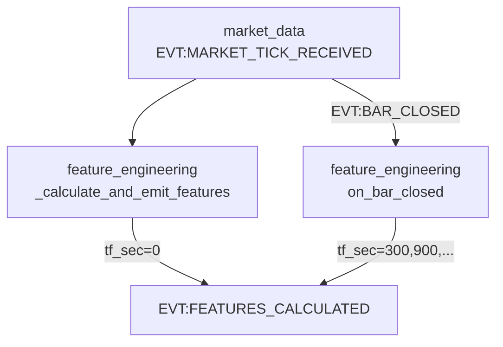
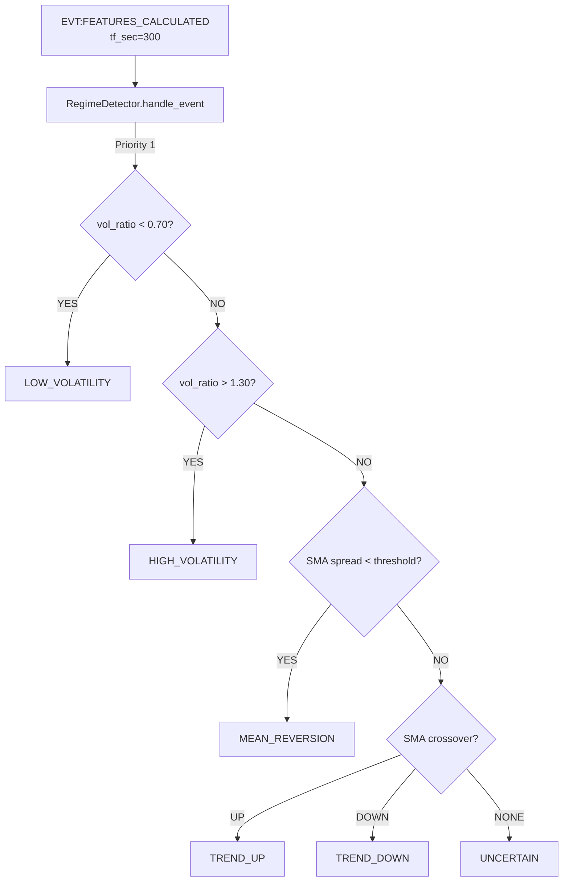

# Aurora/Phenix — Deep Forensic Audit Report

> **Scope**: Tick leakage / `tf_sec=0` dual-semantics contract + LOW_VOLATILITY / regime / quadratic attribution  
> **Method**: Code-first, production files only. Docs used only for drift detection.

---

## WORKSTREAM A: Tick/Bar Contract Audit

### A1 — Formal Meaning of `tf_sec=0`

| Aspect | Evidence |
|--------|----------|
| **Definition** | `tf_sec=0` = tick-level features (not bar-derived) |
| **Set at** | [feature_engineering.py:1067–1068](file:///c:/Users/user/Music/Phenix/apps/reference/domains/feature_engineering/feature_engineering.py#L1067-L1068) — [_calculate_and_emit_features()](file:///c:/Users/user/Music/Phenix/apps/reference/domains/feature_engineering/feature_engineering.py#1061-1069) explicitly passes `tf_sec=0` |
| **Verb used** | Same `EVT:FEATURES_CALCULATED` for both tick and bar |
| **Schema enforcement** | None. `tf_sec` is a payload field, NOT in [contracts.py](file:///c:/Users/user/Music/Phenix/apps/reference/domains/feature_engineering/contracts.py) typed schema |
| **Config note** | [aurora.yaml:12–13](file:///c:/Users/user/Music/Phenix/config/aurora/strategies/aurora.yaml#L12-L13): `type: bar_driven`, `legacy_tick_path_enabled: DELETED` |

> [!IMPORTANT]
> `tf_sec=0` is a **runtime convention**, not a typed contract. It relies on consumer-side filtering.

---

### A2 — Producer Map (Tick Path)



| Producer | Trigger | tf_sec | File:Line |
|----------|---------|--------|-----------|
| [_calculate_and_emit_features](file:///c:/Users/user/Music/Phenix/apps/reference/domains/feature_engineering/feature_engineering.py#1061-1069) | Every tick | `0` | [feature_engineering.py:1067](file:///c:/Users/user/Music/Phenix/apps/reference/domains/feature_engineering/feature_engineering.py#L1067) |
| [on_bar_closed](file:///c:/Users/user/Music/Phenix/apps/reference/domains/feature_engineering/feature_engineering.py#790-931) | Bar close | `300`, `900`, etc. | [feature_engineering.py:793](file:///c:/Users/user/Music/Phenix/apps/reference/domains/feature_engineering/feature_engineering.py#L793) |

**Features emitted at tick level**: `obi`, `tfi`, `delta_price`, [absorption](file:///c:/Users/user/Music/Phenix/apps/reference/domains/feature_engineering/calculation_engine.py#441-478), [price](file:///c:/Users/user/Music/Phenix/apps/reference/domains/feature_engineering/feature_engineering.py#311-340), `liquidity_kappa`, [ema_bias](file:///c:/Users/user/Music/Phenix/apps/reference/domains/feature_engineering/calculation_engine.py#269-283), [volume_spike](file:///c:/Users/user/Music/Phenix/apps/reference/domains/feature_engineering/calculation_engine.py#586-635), [volatility_state](file:///c:/Users/user/Music/Phenix/apps/reference/domains/feature_engineering/calculation_engine.py#694-749), [depth_imbalance](file:///c:/Users/user/Music/Phenix/apps/reference/domains/feature_engineering/calculation_engine.py#868-911), [macro_sync](file:///c:/Users/user/Music/Phenix/apps/reference/domains/feature_engineering/calculation_engine.py#937-1024)/[macro_resid](file:///c:/Users/user/Music/Phenix/apps/reference/domains/feature_engineering/calculation_engine.py#288-316), [spread_bps](file:///c:/Users/user/Music/Phenix/apps/reference/domains/feature_engineering/calculation_engine.py#813-838), [volume_zscore](file:///c:/Users/user/Music/Phenix/apps/reference/domains/feature_engineering/calculation_engine.py#668-689), [large_trade_imbalance](file:///c:/Users/user/Music/Phenix/apps/reference/domains/feature_engineering/calculation_engine.py#242-252).

---

### A3 — Consumer Map

| Consumer | Subscribes to | tf_sec Filter | Action on tf_sec=0 | File:Line |
|----------|--------------|----------------|---------------------|-----------|
| **DM [on_features](file:///c:/Users/user/Music/Phenix/apps/reference/domains/decision_making/decision_making.py#410-411)** | `EVT:FEATURES_CALCULATED` | `tf_sec <= 0 → REJECT` | Silent early return + WAL log (sampled 5min) | [event_handlers.py:105–132](file:///c:/Users/user/Music/Phenix/apps/reference/domains/decision_making/event_handlers.py#L105-L132) |
| **RegimeDetector** | `EVT:FEATURES_CALCULATED` | `tf_sec == 0 → IGNORE` | Silent debug log, return | [regime_detector.py:322–329](file:///c:/Users/user/Music/Phenix/apps/reference/domains/regime_detector/regime_detector.py#L322-L329) |
| **RegimeDetector** | `EVT:FEATURES_CALCULATED` | `tf_sec != basis_tf_sec → IGNORE` | Only accepts `tf_sec=300` | [regime_detector.py:331–335](file:///c:/Users/user/Music/Phenix/apps/reference/domains/regime_detector/regime_detector.py#L331-L335) |
| **MR Handler** | `EVT:FEATURES_CALCULATED` | `tf_sec != handler.timeframe_sec → REJECT` | Rejects tf_sec=0 explicitly | [mean_reversion_handler.py:1361–1385](file:///c:/Users/user/Music/Phenix/apps/reference/domains/decision_making/mean_reversion_handler.py#L1361-L1385) |
| **Strategy Gateway** | `EVT:STRATEGY_SIGNAL_PRODUCED` | Gate 5: `tf_sec` for TTL calc | `tf_sec=0 → tick TTL` | [strategy_gateway.py:786–799](file:///c:/Users/user/Music/Phenix/apps/reference/domains/decision_making/strategy_gateway.py#L786-L799) |

---

### A4 — Legitimate vs Accidental Consumers

**Legitimate**: None. All strategy consumers reject `tf_sec=0`.

**No accidental leakage found.** Every consumer that receives `EVT:FEATURES_CALCULATED` has an explicit `tf_sec` filter in the hot path.

---

### A5 — Leakage Analysis

> [!TIP]
> **Verdict: No active tick leakage into the decision path.**

The filtering is **consumer-side and redundant at 3 levels** (DM event_handlers, regime_detector, strategy handlers). This is defensive-correct but architecturally wasteful:

| Smell | Description | Severity |
|-------|-------------|----------|
| **Bus-level broadcast** | Ticks broadcast to ALL `EVT:FEATURES_CALCULATED` listeners | Low (filtered at consumer) |
| **No routing discrimination** | Same verb for tick and bar makes it impossible to subscribe selectively | Medium (wasted CPU) |
| **No typed contract** | `tf_sec` is a payload convention, not a schema-enforced field | Medium (drift risk) |

---

### A6 — Architecture Verdict

```
Current:   FE → [EVT:FEATURES_CALCULATED, tf_sec=0|300|900|...] → ALL consumers (filter in each)
Proposed:  FE → [EVT:TICK_FEATURES_CALCULATED, tf_sec=0]  → (telemetry only, no DM subscription)
           FE → [EVT:BAR_FEATURES_CALCULATED, tf_sec>0]  → DM, RD, strategies
```

The current system is **functionally correct** but violates the "narrow scope" principle. The verb split would eliminate all consumer-side filter code and make the tick contract explicit.

---

## WORKSTREAM B: LOW_VOLATILITY / Regime / Quadratic Attribution

### B1 — Exact LOW_VOLATILITY Formation Path



**LOW_VOLATILITY formation** ([regime_detector.py:579–584](file:///c:/Users/user/Music/Phenix/apps/reference/domains/regime_detector/regime_detector.py#L579-L584)):

```python
vol_ratio = atr_val / atr_baseline
if vol_ratio < low_vol_multiplier:    # default: 0.70
    regime = "LOW_VOLATILITY"
    confidence = min(conf_max, conf_min + calm * low_vol_confidence_multiplier)
```

| Parameter | Value | Source |
|-----------|-------|--------|
| `low_vol_multiplier` | `0.70` | [regime.yaml](file:///c:/Users/user/Music/Phenix/config/aurora/regime.yaml) `models.volatility.low_vol_multiplier` |
| `threshold_multiplier` (HIGH) | `1.30` | [regime.yaml](file:///c:/Users/user/Music/Phenix/config/aurora/regime.yaml) `models.volatility.threshold_multiplier` |
| ATR period (Wilder) | `14` bars | `models.volatility.atr_period` |
| ATR SMA baseline length | `288` bars (= 24h of 5m) | `models.volatility.atr_sma_length` |
| Hysteresis bars | `3` | `hysteresis_bars` |

---

### B2 — Basis Timeframe

**Basis**: `tf_sec = 300` (5-minute bars). Configured at [regime.yaml:3](file:///c:/Users/user/Music/Phenix/config/aurora/regime.yaml#L3): `basis_tf_sec: 300`.

RegimeDetector **only** processes `tf_sec == 300` events. All other timeframes are silently ignored.

---

### B3 — Role of Each Timeframe

| Timeframe | Used By | Purpose | Weight |
|-----------|---------|---------|--------|
| **5M** (300s) | RegimeDetector | Regime classification (ATR/SMA) | Sole basis for regime |
| **15M** (900s) | Tactician pillar | ROC momentum (short-term) | **0.30** |
| **4H** (14400s) | Operator pillar | LinReg slope × ADX weight (medium-term) | **0.40** |
| **1D** (86400s) | Strategist pillar | Price vs SMA(200) (long-term) | **0.30** |

> [!NOTE]
> Regime detection (5M) and pillar scoring (15M/4H/1D) are **independent subsystems**. The regime detection output flows to DM as `EVT:REGIME_DETECTED` and is used as a **threshold/sizing modifier**, while pillars flow as `pillar_sum` inside `EVT:FEATURES_CALCULATED`.

---

### B4 — Aurora Quadratic Scoring Path

```mermaid
graph LR
    FE_P[Pillar Computation<br>M15×0.30 + H4×0.40 + D1×0.30] -->|pillar_sum| FC2[EVT:FEATURES_CALCULATED]
    FC2 --> AH[AuroraHandler<br>CMD:PROCESS_STRATEGY]
    AH -->|linear_score| QSK[QuadraticScoringKernel.compute]
    QSK -->|Exposure = sign Σ × Σ²| SHIELD[Shield Cascade<br>DangerZone → Context → Memory]
    SHIELD -->|final_score| SIDE[Side Determination<br>3-zone hysteresis]
    SIDE -->|buy/sell/neutral| SSP[EVT:STRATEGY_SIGNAL_PRODUCED]
    SSP --> SG[StrategyGateway<br>8-gate chain]
    SG --> TIP[EVT:TRADE_INTENT_PROPOSED]
```



**Quadratic formula** ([quadratic_scoring_kernel.py:196–213](file:///c:/Users/user/Music/Phenix/apps/reference/domains/decision_making/quadratic_scoring_kernel.py#L196-L213)):

```python
S_clamped = clamp(S_linear × score_multiplier, -1, 1)
raw_exposure = sign(S_clamped) × S_clamped²
final_score = raw_exposure × shield_multiplier
```

---

### B5 — Exact Weights and Contributions

**Pillar weights** ([domains.yaml + pillar_indicators.py](file:///c:/Users/user/Music/Phenix/apps/reference/domains/feature_engineering/pillar_indicators.py#L382-L386)):

| Pillar | Timeframe | Indicator | Weight | Formula |
|--------|-----------|-----------|--------|---------|
| Tactician | M15 | `tanh(ROC × 3.0)` | **0.30** | [(close[-1] - close[-15]) / close[-15]](file:///c:/Users/user/Music/Phenix/apps/reference/domains/decision_making/strategy_gateway.py#37-44) |
| Operator | H4 | `tanh(LinReg_slope × ADX/50 × 3.0)` | **0.40** | OLS slope norm by mean × ADX weight |
| Strategist | D1 | `tanh((close - SMA200) / SMA200 × 3.0)` | **0.30** | Price position relative to 200-day SMA |

**Shield cascade multipliers** ([aurora.yaml:278–313](file:///c:/Users/user/Music/Phenix/config/aurora/strategies/aurora.yaml#L278-L313)):

| Shield | LOW_VOLATILITY | HIGH_VOLATILITY | TREND_UP/DOWN | UNCERTAIN |
|--------|---------------|-----------------|---------------|-----------|
| Context | **0.85** | **0.30** | 1.0 | 0.55 |
| Memory | 0.60–1.00 (visit-based) | 0.60–1.00 | 0.60–1.00 | 0.60–1.00 |

**Regime threshold factors** (base_threshold × factor must be exceeded):

| Regime | Decision Threshold | Config Line |
|--------|--------------------|-------------|
| LOW_VOLATILITY | **99.0** ⚠️ | [aurora.yaml:232](file:///c:/Users/user/Music/Phenix/config/aurora/strategies/aurora.yaml#L232) |
| UNCERTAIN | **99.0** ⚠️ | [aurora.yaml:236](file:///c:/Users/user/Music/Phenix/config/aurora/strategies/aurora.yaml#L236) |
| TREND_UP | 0.12 | [aurora.yaml:234](file:///c:/Users/user/Music/Phenix/config/aurora/strategies/aurora.yaml#L234) |
| TREND_DOWN | 0.12 | [aurora.yaml:235](file:///c:/Users/user/Music/Phenix/config/aurora/strategies/aurora.yaml#L235) |
| HIGH_VOLATILITY | 0.18 | [aurora.yaml:231](file:///c:/Users/user/Music/Phenix/config/aurora/strategies/aurora.yaml#L231) |
| MEAN_REVERSION | 0.075 | [aurora.yaml:233](file:///c:/Users/user/Music/Phenix/config/aurora/strategies/aurora.yaml#L233) |

> [!CAUTION]
> **`LOW_VOLATILITY: 99.0` is a de-facto BLOCK.** Since `final_score ∈ [-1, 1]` after quadratic transform, a threshold of 99.0 is **impossible to exceed**. Aurora will NEVER trade in LOW_VOLATILITY regime (globally). This is reinforced by ETHUSDT's `allowed_regimes` excluding LOW_VOLATILITY, and ETH's `regime_sizing.LOW_VOLATILITY: 0.0`.

---

### B6 — Dominant Influences on Final Decision

**Ranking by impact** (from most to least dominant):

1. **Regime threshold gate** — Determines whether trading is even possible. LOW_VOL/UNCERTAIN are hard-blocked globally.
2. **Operator pillar (H4)** — Highest weight (0.40). LinReg slope × ADX. Controls the "working direction" of the market.
3. **Context shield** — In HIGH_VOLATILITY, signal is multiplied by **0.30** (70% reduction). This effectively makes HIGH_VOL positions 1/3 the conviction of trending markets.
4. **Quadratic transform** — Weak signals (|Σ| < 0.3) produce exposure 0.09 or less. Strong signals (|Σ| > 0.7) produce exposure 0.49+. This creates a natural "conviction cliff".
5. **Tactician + Strategist pillars** (0.30 each) — Short-term momentum and long-term territory provide supporting context.
6. **DangerZone shield** — Blocks when volatility_state > 0.95, spread > 50bps, or motion sigma > 3.0.

---

### B7 — Consistency / Smell Assessment

| # | Finding | Severity | Detail |
|---|---------|----------|--------|
| 1 | **LOW_VOL globally blocked by threshold=99.0** | 🟡 Intentional but undocumented | Per-symbol overrides (BTC: 0.12, ETH: 0.85, SOL: 0.75) exist but global default blocks it. This is **config-based gating**, not code-based. Would be clearer as `allowed_regimes` exclusion. |
| 2 | **Dual-gating for LOW_VOL** | 🟡 Redundant | Both [regime_thresholds](file:///c:/Users/user/Music/Phenix/apps/reference/domains/decision_making/decision_making.py#378-379) (global=99) AND `allowed_regimes` (ETH) AND `regime_sizing` (ETH=0.0) block LOW_VOL. Three mechanisms for one intent. |
| 3 | **Tick features still broadcast** | 🟢 Low risk | Bus waste, ~3 consumer-side filter checks per tick, but no functional leakage. |
| 4 | **v2 scoring config retained** | 🟢 Low risk | `signal_weights`, `feature_neutrals`, `direction_strength_scoring` in aurora.yaml with note "DEPRECATED (Phase 9)" — dead config, not consumed. |
| 5 | **ETHUSDT shield context × LOW_VOL = 0.85** | 🟢 Consistent | But moot since threshold=99.0 blocks entry anyway. |
| 6 | **Regime detection vs Pillar scoring independent** | 🟢 By design | 5M regime and 15M/4H/1D pillars operate on different data, merged only at decision time. Clean separation. |
| 7 | **BTC allows LOW_VOL but globally blocked** | 🟡 Config conflict | BTC `allowed_regimes` includes LOW_VOLATILITY and `regime_thresholds.LOW_VOLATILITY: 0.12`, but global `decision.regime_thresholds.LOW_VOLATILITY: 99.0` takes precedence unless per-symbol overrides apply. |

---

## Summary

### Workstream A Verdict
**No tick feature leakage exists in the decision path.** All three consumer layers (DM, RegimeDetector, strategy handlers) independently filter `tf_sec=0`. The architecture is functionally correct but could be improved by verb-level separation (`EVT:TICK_FEATURES_CALCULATED` vs `EVT:BAR_FEATURES_CALCULATED`).

### Workstream B Verdict
**LOW_VOLATILITY is correctly formed** (ATR ratio < 0.70 on 5m bars) but **globally blocked from Aurora trading** via `regime_thresholds: 99.0`. The quadratic scoring system is coherent: `pillar_sum → Σ² → shield cascade → side determination`. The **Operator pillar (H4, weight 0.40)** is the single most influential factor in directional conviction.

> [!WARNING]
> **Config conflict**: BTC's per-symbol config allows LOW_VOLATILITY (`allowed_regimes` includes it, `regime_thresholds: 0.12`), but the global Aurora `decision.regime_thresholds.LOW_VOLATILITY: 99.0` may override this depending on the resolution order in [_resolve_regime_factor()](file:///c:/Users/user/Music/Phenix/apps/reference/domains/decision_making/quadratic_scoring_kernel.py#296-315). This should be audited at runtime to confirm which threshold wins.

---

*Report generated from production code analysis. Every file:line reference is traceable.*
