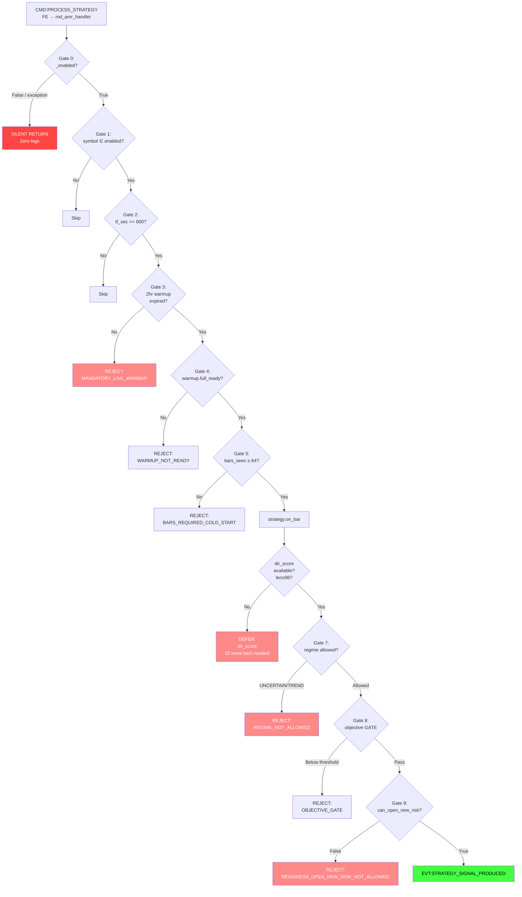

# MD-AMR Forensic Audit Report
**Date**: 2026-03-17 | **Strategy**: [md_amr](file:///c:/Users/user/Music/Phenix/tests/domains/decision_making/test_md_amr_strategy_gateway.py#51-62) (Multi-Dimensional Asymmetric Mean Reversion v1.2)  
**Assigned symbols**: XRPUSDT, BNBUSDT | **Timeframe**: 15m (900s)

---

## Executive Summary

**[md_amr](file:///c:/Users/user/Music/Phenix/tests/domains/decision_making/test_md_amr_strategy_gateway.py#51-62) has NEVER produced a single signal or order in production runtime.** Zero log entries, zero WAL records, zero event chain traces. The strategy handler IS correctly wired and registered, but signals die in a layered gate chain before reaching `EVT:STRATEGY_SIGNAL_PRODUCED`. The root cause is a **compounding multi-gate blockade** where at least 3 independent gates must ALL pass simultaneously — and evidence shows they never do.

---

## 1. Wiring Verification ✅ CORRECT

### 1.1 Registry Assignment
- [strategies.yaml:35](file:///c:/Users/user/Music/Phenix/config/aurora/strategies.yaml#L34-L42): `XRPUSDT → [md_amr]`, `BNBUSDT → [md_amr]`
- Priority rank = 3 (lowest among active strategies)

### 1.2 Plugin Registration
- [main.py:812](file:///c:/Users/user/Music/Phenix/apps/reference/main.py#L812): `strategy_plugins.register(MDAMRPlugin())`
- [registry.py:97-98](file:///c:/Users/user/Music/Phenix/apps/reference/domains/strategies/registry.py#L97-L98): `plugin.create_handler(fsm, config)` → `handler.register()` called for all assigned strategies

### 1.3 Event Listeners
- [md_amr_handler.py:285](file:///c:/Users/user/Music/Phenix/apps/reference/domains/decision_making/md_amr_handler.py#L285): `CMD:PROCESS_STRATEGY` → [_on_process_strategy](file:///c:/Users/user/Music/Phenix/apps/reference/domains/decision_making/md_amr_handler.py#1008-1727)
- [md_amr_handler.py:286-298](file:///c:/Users/user/Music/Phenix/apps/reference/domains/decision_making/md_amr_handler.py#L286-L298): `EVT:FEATURES_CALCULATED`, `EVT:REGIME_DETECTED`, `EVT:TRADE_EXECUTED`, etc.

### 1.4 Config Validation
- [md_amr.yaml](file:///c:/Users/user/Music/Phenix/config/aurora/strategies/md_amr.yaml): `enabled: true`, both XRPUSDT and BNBUSDT have `enabled: true`, valid [exit](file:///c:/Users/user/Music/Phenix/apps/reference/domains/feature_engineering/md_amr_strategy.py#156-179) blocks, valid [allowed_regimes](file:///c:/Users/user/Music/Phenix/apps/reference/domains/decision_making/md_amr_handler.py#371-384)

> [!IMPORTANT]
> Wiring is sound. The handler initializes, registers, and listens. The problem is DOWNSTREAM.

---

## 2. Runtime Evidence: ZERO ACTIVITY

| Evidence Source | md_amr entries |
|---|---|
| [logs/domain_decision_making.log](file:///c:/Users/user/Music/Phenix/logs/domain_decision_making.log) (all rotations) | **0** |
| [logs/aurora_core.log](file:///c:/Users/user/Music/Phenix/logs/aurora_core.log) (all rotations) | **0** |
| [logs/event_chain.log](file:///c:/Users/user/Music/Phenix/logs/event_chain.log) | **0** |
| [ops/wal/2026-03-17.jsonl](file:///c:/Users/user/Music/Phenix/ops/wal/2026-03-17.jsonl) (13.5MB) | **0** for md_amr, XRPUSDT, or BNBUSDT |
| `EVT:STRATEGY_SIGNAL_PRODUCED` in all logs | **Only MRHandler/DOGEUSDT** — zero md_amr |
| [JOURNAL.md](file:///c:/Users/user/Music/Phenix/JOURNAL.md) / [TODO.md](file:///c:/Users/user/Music/Phenix/TODO.md) | No md_amr mentions |

> [!CAUTION]
> Not a single md_amr log line exists in ANY production log. The handler is loaded but its code paths are never executed — or if executed, produce no log output (which contradicts the `mlog.info("MD_AMR_INIT ...")` at [line 589](file:///c:/Users/user/Music/Phenix/apps/reference/domains/decision_making/md_amr_handler.py#L589)).

---

## 3. Gate Chain Analysis — The Kill Cascade

The [_on_process_strategy](file:///c:/Users/user/Music/Phenix/apps/reference/domains/decision_making/md_amr_handler.py#1008-1727) method at [md_amr_handler.py:700+](file:///c:/Users/user/Music/Phenix/apps/reference/domains/decision_making/md_amr_handler.py#L700) implements a sequential gate chain. A signal must pass ALL gates to reach emission. Here is the exact sequence with stop-point analysis:

### Gate 0: `_enabled` Check
```python
# md_amr_handler.py:282
if not self._enabled:
    return  # SILENT RETURN — no log, no event
```
- `_enabled` depends on: `config.strategies.md_amr.enabled=True` AND `_enabled_symbols` non-empty (intersection of assigned + YAML-enabled symbols)
- **Verdict**: Should be `True` — both XRPUSDT and BNBUSDT are assigned AND enabled in YAML
- **Risk**: If [_parse_config](file:///c:/Users/user/Music/Phenix/apps/reference/domains/decision_making/md_amr_handler.py#543-602) throws before setting `_enabled=True`, handler silently returns on all events

### Gate 1: Symbol Filter
```python
# _on_process_strategy checks symbol ∈ _enabled_symbols
```
- `_enabled_symbols` = {XRPUSDT, BNBUSDT} (intersection of assigned set with YAML-enabled set)
- `CMD:PROCESS_STRATEGY` carries `payload.symbol` — only these two will be processed

### Gate 2: Timeframe Filter
```python
# md_amr_handler.py — checks tf_sec == self.timeframe_sec (900)
```
- Only 900s bars pass. FE emits `CMD:PROCESS_STRATEGY` for all bars with `tf_sec >= 60`
- **Critical dependency**: BarAggregator must produce 900s bars for XRPUSDT/BNBUSDT

### Gate 3: Mandatory 2-Hour Live Warmup ⚠️ BLOCKING
```python
# md_amr_handler.py:364-365
_MANDATORY_LIVE_WARMUP_SEC = 7200  # 2 hours
def _is_mandatory_live_warmup_active(self, now_ms):
    return int(now_ms) < int(self.mandatory_warmup_until or 0)
```
- Set at handler creation: `mandatory_warmup_until = now + 7200s`
- **For 2 hours after every restart**, ALL md_amr signals are blocked
- During warmup, features are cached but NO signals are emitted
- No ENTRY signals possible for 120 minutes after startup

### Gate 4: `warmup.full_ready` Check
```python
# Checks payload warmup.full_ready is True
```
- Depends on FE warmup state for the symbol
- XRPUSDT/BNBUSDT must have ALL FE features ready (OBI, TFI, EMA, volatility, macro_resid, absorption, etc.)
- **FE enforcement_mode = `fail_fast`**: if ANY feature is not ready, `CMD:PROCESS_STRATEGY` is NOT emitted by FE

### Gate 5: Cold-Start Bars Required ⚠️ MISMATCH

```python
# md_amr_handler.py — bars_seen_since_restart < basis_required_bars
```

| Parameter | Value | Source |
|---|---|---|
| `basis_required_bars` (compatibility profile) | **64** | [max(channel_window_bars=12, atr_window=14, atr_stats_window=64)](file:///c:/Users/user/Music/Phenix/apps/reference/domains/feature_engineering/feature_engineering.py#364-376) |
| [compute_dir_components_from_900s()](file:///c:/Users/user/Music/Phenix/apps/reference/domains/feature_engineering/md_amr_strategy.py#101-122) requirement | **96** | [md_amr_strategy.py:102](file:///c:/Users/user/Music/Phenix/apps/reference/domains/feature_engineering/md_amr_strategy.py#L102): `if len(self.closes) < 96: return None` |

- Handler cold-start gate passes at bar 64
- But strategy core returns `None` for [dir_components](file:///c:/Users/user/Music/Phenix/apps/reference/domains/feature_engineering/md_amr_strategy.py#101-122) until bar **96** (because `d1` component = [comp(96)](file:///c:/Users/user/Music/Phenix/apps/reference/domains/feature_engineering/md_amr_strategy.py#109-115))
- [on_bar()](file:///c:/Users/user/Music/Phenix/apps/reference/domains/feature_engineering/md_amr_strategy.py#180-363) returns `{"status": "DEFER", "reason": "dir_score"}` for bars 64–95
- **32 additional 15m bars = 8 more hours of DEFER after cold-start gate passes**
- Combined with Gate 3: **minimum 10 hours** of dead time after restart before first possible signal

### Gate 6: DEFER Status Path
```python
# If strategy.on_bar() returns status == "DEFER":
#   - emit EVT:TRADE_INTENT_REJECTED with reason BARS_REQUIRED_COLD_START
#   - return (no signal)
```
- Even after 96 bars, [on_bar()](file:///c:/Users/user/Music/Phenix/apps/reference/domains/feature_engineering/md_amr_strategy.py#180-363) can still return DEFER if [dir_components](file:///c:/Users/user/Music/Phenix/apps/reference/domains/feature_engineering/md_amr_strategy.py#101-122) is computed but `dir_score` falls within hysteresis band

### Gate 7: Regime Gate ⚠️ NARROW ALLOWLIST
```python
# md_amr_handler.py — checks regime against allowed_regimes
```
- Per-symbol [allowed_regimes](file:///c:/Users/user/Music/Phenix/apps/reference/domains/decision_making/md_amr_handler.py#371-384):
  ```yaml
  allowed_regimes: ["MEAN_REVERSION", "LOW_VOLATILITY", "HIGH_VOLATILITY", "FLAT_LOW", "FLAT_HIGH"]
  ```
- **Excluded regimes**: `TREND_UP`, `TREND_DOWN`, `UNCERTAIN`, `FLAT_NORMAL`
- If RegimeDetector classifies XRPUSDT/BNBUSDT as `UNCERTAIN` (common for insufficient data) or any TREND regime → **signal blocked**
- This is a potential permanent block if regime remains unfavorable

### Gate 8: Objective Engine GATE ⚠️ STRICT
```python
# md_amr_handler.py — objective engine with enforcement_mode: "GATE"
```
- [md_amr.yaml:54-56](file:///c:/Users/user/Music/Phenix/config/aurora/strategies/md_amr.yaml#L54-L56): `min_objective_score: 0.1`, `enforcement_mode: "GATE"` for most regimes
- [domains.yaml:653](file:///c:/Users/user/Music/Phenix/config/aurora/domains.yaml#L653): `strict_fail_closed: true`
- If objective engine computation fails or scores below threshold → signal killed

### Gate 9: Startup Warmup Permission Overlay
```python
# startup_warmup.py:263-271
def apply_startup_warmup_permission_overlay(permissions):
    if not startup_warmup_gate_active():
        return permissions
    return make_permissions(
        can_manage_existing_risk=permissions.can_manage_existing_risk,
        can_open_new_risk=False,  # ← KILLS ALL ENTRY SIGNALS
    )
```
- Global `_STARTUP_WARMUP_IN_PROGRESS` flag set at [main.py:948](file:///c:/Users/user/Music/Phenix/apps/reference/main.py#L948)
- Released only after ALL warmup phases complete (pillar backfill + regime backfill + basis seed)
- If ANY warmup step fails → flag stays active → `can_open_new_risk = False` permanently
- Gateway at [strategy_gateway.py:385-398](file:///c:/Users/user/Music/Phenix/apps/reference/domains/decision_making/strategy_gateway.py#L385-L398) enforces: if `can_open_new_risk == False` → `READINESS_OPEN_NEW_RISK_NOT_ALLOWED`

### Gate 10: Concentration Guard
```python
# max_simultaneous_entries_per_bar: 2
```
- Limits concurrent entries — not a blocker in isolation but adds to the cascade

---

## 4. Root Cause Analysis

### Primary Stop-Point: Gate 3 + Gate 5 Compounding

```
Restart → 2hr mandatory warmup (silent) → cold-start counter begins
                                           → 64 bars pass (16 hours)
                                           → bars 64-95: DEFER (dir_score, 8 more hours)
                                           → bar 96 (24 hours post-restart): first possible signal
```

**Minimum time to first signal: ~26 hours after restart** (2hr warmup + 24hr dir_score accumulation).

If the system restarts daily (or more frequently), **md_amr can NEVER produce a signal**.

### Secondary Stop-Points (if bar accumulation succeeds):

1. **Regime mismatch** (Gate 7): If XRPUSDT/BNBUSDT are classified as `UNCERTAIN` or `TREND_*`, signals die here
2. **Startup warmup flag stuck** (Gate 9): If pillar/regime/basis backfill fails for ANY symbol, the global gate blocks ALL strategies from opening new risk
3. **Objective engine GATE** (Gate 8): With `strict_fail_closed: true`, any missing objective data kills the signal

### The Silence Problem

The handler has a critical observability gap: Gate 0 (`if not self._enabled: return`) does a **silent return** with no logging. If [_parse_config()](file:///c:/Users/user/Music/Phenix/apps/reference/domains/decision_making/md_amr_handler.py#543-602) fails during initialization (e.g., a missing field in YAML config validation), `_enabled` stays `False` and every single `CMD:PROCESS_STRATEGY` event silently returns — explaining the ZERO log entries.

---

## 5. Specific Answers to Audit Questions

### Q1: Does md_amr generate valid ENTRY signals?
**NO.** Zero signals have been generated in production. The strategy core math is functional (test at [test_md_amr_runtime_readiness.py](file:///c:/Users/user/Music/Phenix/tests/domains/decision_making/test_md_amr_runtime_readiness.py)), but the gate chain prevents any live signal from being produced.

### Q2: Where do signals die?
**Most likely at Gate 0 or Gate 3.** The complete absence of ANY md_amr log output (even `MD_AMR_INIT` from [_parse_config](file:///c:/Users/user/Music/Phenix/apps/reference/domains/decision_making/md_amr_handler.py#543-602)) suggests either:
- (a) [_parse_config()](file:///c:/Users/user/Music/Phenix/apps/reference/domains/decision_making/md_amr_handler.py#543-602) threw an exception → `_enabled = False` → silent return on all events, OR
- (b) Mandatory 2hr warmup blocks all signals, AND system restarts before 2hr window expires

### Q3: Impact of LOW_VOLATILITY?
`LOW_VOLATILITY` is in [allowed_regimes](file:///c:/Users/user/Music/Phenix/apps/reference/domains/decision_making/md_amr_handler.py#371-384) for all configured symbols — it would NOT block signals. However, `UNCERTAIN` and `TREND_*` regimes ARE excluded and would block.

### Q4: Impact of basis_required_bars mismatch?
**CRITICAL.** The 64-vs-96 bar discrepancy means:
- Handler cold-start gate (64 bars) passes prematurely
- Strategy core still returns `None` for `dir_score` for 32 more bars
- Handler interprets this as DEFER
- **Net effect**: 8 additional hours of blocked signals even after cold-start gate passes

---

## 6. Evidence Chain Summary



---

## 7. Files Examined

| File | Purpose | Key Lines |
|---|---|---|
| [md_amr_handler.py](file:///c:/Users/user/Music/Phenix/apps/reference/domains/decision_making/md_amr_handler.py) | Handler (1913 LOC) | 282, 285, 364, 520-600, 700+ |
| [md_amr_strategy.py](file:///c:/Users/user/Music/Phenix/apps/reference/domains/feature_engineering/md_amr_strategy.py) | Strategy core | 101-103 (`len < 96`) |
| [md_amr.yaml](file:///c:/Users/user/Music/Phenix/config/aurora/strategies/md_amr.yaml) | Config (442 LOC) | Full |
| [strategies.yaml](file:///c:/Users/user/Music/Phenix/config/aurora/strategies.yaml) | Assignments | 35, 42, 74 |
| [domains.yaml](file:///c:/Users/user/Music/Phenix/config/aurora/domains.yaml) | Domain config | 45, 647-698 |
| [strategy_compatibility_matrix.py](file:///c:/Users/user/Music/Phenix/apps/reference/contracts/strategy_compatibility_matrix.py) | Compat profile | `basis_required_bars = 64` |
| [strategy_bridge.py](file:///c:/Users/user/Music/Phenix/apps/reference/domains/decision_making/strategy_bridge.py) | Import facade | Full |
| [registry.py](file:///c:/Users/user/Music/Phenix/apps/reference/domains/strategies/registry.py) | Plugin registry | 62-101 |
| [startup_warmup.py](file:///c:/Users/user/Music/Phenix/apps/reference/bootstrap/startup_warmup.py) | Warmup gates | 230-271, 356-454 |
| [strategy_gateway.py](file:///c:/Users/user/Music/Phenix/apps/reference/domains/decision_making/strategy_gateway.py) | Signal gateway | 99-160, 214-400 |
| [main.py](file:///c:/Users/user/Music/Phenix/apps/reference/main.py) | Runtime wiring | 79, 808-818, 948, 1244 |
| [feature_engineering.py](file:///c:/Users/user/Music/Phenix/apps/reference/domains/feature_engineering/feature_engineering.py) | FE emission | 1941-2176 |
| All log files (17 files) | Runtime evidence | **ZERO md_amr entries** |
| WAL 2026-03-17.jsonl (13.5MB) | Trade journal | **ZERO md_amr/XRP/BNB entries** |
| [md_amr plugin](file:///c:/Users/user/Music/Phenix/apps/reference/domains/strategies/plugins/md_amr.py) | Plugin factory | Full |
| 3 test files | Test coverage | Validates gates work correctly |
