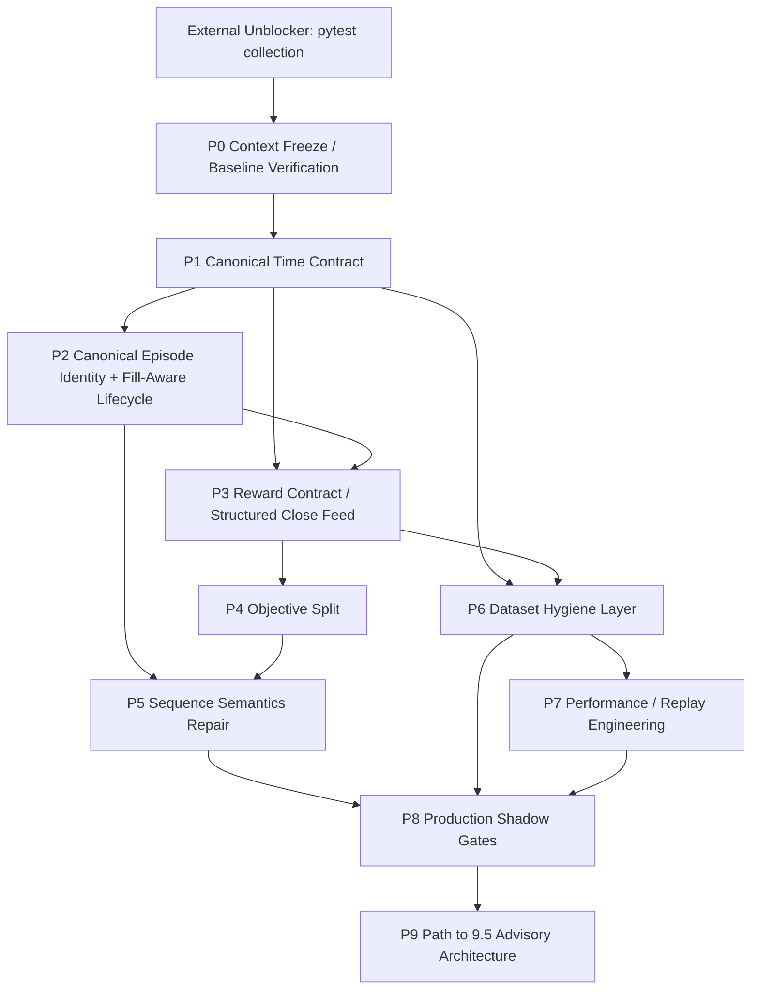

# Neocortex Remediation Plan

Date: 2026-03-10
Scope: `apps/reference/domains/neocortex`
Planning package type: remediation design only

## Executive Summary

`neocortex` should not be developed further as "more PPO on dirty logs". The verified failures are upstream of algorithm choice:

- time is non-canonical,
- episode identity is unsafe,
- reward extraction is unreliable,
- objectives are semantically mixed,
- recurrent sequence semantics are broken,
- datasets are contaminated,
- the hot path is too expensive for replay-scale shadowing.

Because of that, the correct target for the next stage is a production-grade shadow domain:

- read-only,
- deterministic,
- contract-clean,
- diagnostics-first,
- latent-research capable,
- explicitly non-authoritative over live trading.

## Current-State Diagnosis

The current implementation is a hybrid observer with real research value, but it is not yet an operational RL trading subsystem. Concretely, today it is:

- a feature ingestor and shadow-intent emitter,
- a VAE-based latent encoder,
- a regime-oracle experiment wrapped in PPO infrastructure,
- a partial log-to-episode reconstructor,
- a telemetry producer.

It is not yet:

- a fill-aware trajectory learner,
- a clean world-model planner,
- a causally correct sequence learner,
- a contract-clean production shadow domain,
- a safe advisory layer.

## Target-State Statement

### Stage A: Production-Grade Shadow

Allowed:

- standalone read-only observer,
- latent representation research,
- regime diagnostics,
- disagreement reporting against Aurora,
- drift / anomaly monitoring,
- canonical dataset generation,
- deterministic offline evaluation.

Forbidden:

- live policy modulation,
- live sizing changes,
- live execution control,
- online pnl-driven RL over current logs,
- any influence on Aurora decisions beyond reporting.

### Stage B: 9.5/10 Target Architecture

After Stage A is stable, `neocortex` should evolve into a layered research-to-advisory stack:

1. observer
2. latent / regime lab
3. execution-quality advisor
4. contextual bandit advisor
5. conservative offline RL contour
6. tightly gated modulation advisor only after dedicated gates beyond Stage A

## Production Shadow Definition

For this repo, production-grade shadow means:

- event contracts are explicit in YAML and validated by Pydantic,
- replay uses canonical causal time only,
- lifecycle assembly is fill-aware and fail-closed on ambiguity,
- reward semantics are explicit and completeness-tagged,
- datasets are quarantined and versioned,
- train / validation / test splits are time-based and reproducible,
- offline evaluation is deterministic with fixed seed,
- runtime exports match `domain.yaml`,
- no hidden fallback can silently convert invalid business inputs into training samples.

## Explicit Non-Goals For This Stage

- No live authority over Aurora.
- No policy-to-execution bridge.
- No reward hacking via heroic parsing of dirty logs.
- No world-model marketing beyond actual implemented role.
- No online learning from ambiguous or incomplete episodes.
- No attempt to "improve results" by tuning PPO before data correctness is repaired.

## Remediation Philosophy

This package follows the repo's governing principles:

- Contract-first.
- Additive-only evolution.
- Fail-closed by default.
- Test-driven development.
- Strict YAML + Pydantic SSOT.
- No silent business fallbacks.
- Manifest-driven events and registries only.
- No cross-domain coupling outside allowed contracts.

Translated into execution:

1. Freeze current behavior and fixtures before changing semantics.
2. Repair time and lifecycle contracts before touching model objectives.
3. Prefer structured reward feeds over brittle text parsing.
4. Split objectives before touching PPO / world-model claims.
5. Build canonical datasets before performance optimization.
6. Enforce acceptance gates before calling the domain "production shadow".

## Top Blockers

1. No canonical time contract.
2. No canonical lifecycle identity.
3. Reward path does not match actual close logs.
4. PPO objective is semantically contaminated.
5. Sequence contract is broken.
6. Dataset hygiene layer does not exist.
7. Repo-level pytest collection blocker prevents clean TDD start.
8. Hot path mixes replay-scale and live-shadow concerns.

## Contract Decisions

### Canonical Time Contract

Decision:

- Canonical field: `event_ts_ms`
- Canonical unit: integer milliseconds
- Causal ordering keys must derive from canonical event identity and time, never replay wallclock
- `time.time()` is forbidden as a substitute for missing event time

Why:

- Without causal time, sequence learning, stale cleanup, replay determinism, and disagreement analysis are invalid.

### Canonical Lifecycle Identity

Decision:

- Introduce explicit `lifecycle_id` and preserve `trade_id`, `order_id`, `client_order_id`
- Episode assembly fails closed on ambiguous symbol-only matching
- Entry anchor moves from `ORDER_PLACED` to `ORDER_FILLED` or canonical `POSITION_OPENED`

Why:

- Symbol-keyed pending state is unsafe under partial fills and overlapping same-symbol intents.

### Reward Contract

Decision:

- Preferred path: dedicated structured close / reward event feed
- Transitional path: parser shim for current logs with explicit `reward_completeness_status`
- Heroic free-text parsing is not a target architecture

Why structured feed is better than heroic text parsing:

- it is schema-testable,
- preserves fees / slippage / holding time semantics,
- avoids format fragility,
- supports deterministic offline evaluation,
- is compatible with SSOT and fail-closed design.

### Objective Split

Decision:

- Representation learning, regime supervision, execution-quality prediction, and policy learning must become separate tasks with separate buffers and metrics.

### Sequence Semantics

Decision:

- per-symbol or per-lifecycle recurrent state isolation,
- explicit reset rules,
- true sequence batching,
- train / inference parity.

## Dependency Order

Operational reading:

- P1 is the first true neocortex implementation package because every later phase depends on canonical time.
- P2 and P3 repair the label surface.
- P4 and P5 repair the modeling surface.
- P6 and P7 make the domain operationally trustworthy.
- P8 is the go / no-go gate for production shadow.

## Risks And Rollback Posture

Primary risks:

- silent semantic changes in replay ordering,
- backward-compat issues in emitted events,
- accidental contamination of shadow-mode metrics during migration,
- performance regressions while contracts are being enforced.

Rollback posture:

- additive-only migrations,
- dual-read or dual-emit only when contractually declared,
- no silent fallback from new contracts to ambiguous legacy behavior,
- shadow-only rollout first,
- deterministic fixture replays before and after each phase,
- preserve old logs and write new canonical dataset manifests side-by-side.

## Assumptions And Missing Inputs

- `reports/neocortex_deep_domain_audit_2026-03-10.md` was used as the audit baseline.
- `JOURNAL_мій.md` was not present in the workspace at planning time.
- `config/docs/scoring_passport.md` was not present in the workspace at planning time.
- These missing files do not block the remediation plan because current code and logs already confirm the required findings.

## Why Production Shadow First

Production shadow first is the only defensible order because:

- current data contracts are not clean enough for live influence,
- current reward semantics are not strong enough for advisory trust,
- current recurrent semantics are not valid enough for memory-based policy claims,
- the domain already has immediate value as a diagnostics and latent-research subsystem once contracts are repaired.
