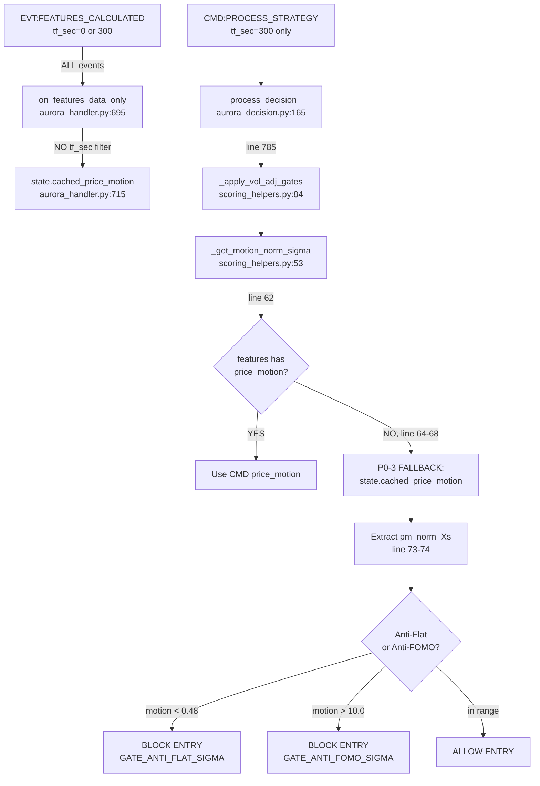

# Aurora Price-Motion Provenance Audit

> **Scope**: Narrow forensic audit — can tick-derived [price_motion](file:///c:/Users/user/Music/Phenix/apps/reference/domains/decision_making/safety_gates.py#86-103) contaminate Aurora's bar-driven decision path?  
> **Method**: Code-first. Every finding linked to file:line.  
> **Date**: 2026-03-17

---

# Executive Summary

**Primary Verdict: AUXILIARY IMPACT**

Tick-derived [price_motion](file:///c:/Users/user/Music/Phenix/apps/reference/domains/decision_making/safety_gates.py#86-103) **can and does** survive into Aurora's bar-driven decision cycle. It influences **entry gating** (Anti-Flat / Anti-FOMO gates) which can BLOCK or ALLOW trade entries. It does **NOT** influence the core quadratic score, side determination, or threshold crossing.

This is an **intentionally designed mixed-plane safety feature** (P0-3), not a routing leak. The config explicitly calls it "Anti-FOMO protection using tick-level price motion" ([domains.yaml:103](file:///c:/Users/user/Music/Phenix/config/aurora/domains.yaml#L103)).

---

# Scope and Evidence Sources

| Category | Files Examined |
|----------|----------------|
| **Wiring** | [aurora_builtin.py](file:///c:/Users/user/Music/Phenix/apps/reference/domains/strategies/plugins/aurora_builtin.py) |
| **Handler** | [aurora_handler.py](file:///c:/Users/user/Music/Phenix/apps/reference/domains/decision_making/aurora_handler.py) |
| **Scoring helpers** | [aurora_scoring_helpers.py](file:///c:/Users/user/Music/Phenix/apps/reference/domains/decision_making/aurora_scoring_helpers.py) |
| **Decision logic** | [aurora_decision.py](file:///c:/Users/user/Music/Phenix/apps/reference/domains/decision_making/aurora_decision.py) |
| **Safety gates** | [safety_gates.py](file:///c:/Users/user/Music/Phenix/apps/reference/domains/decision_making/safety_gates.py) |
| **Shields** | [danger_zone.py](file:///c:/Users/user/Music/Phenix/apps/reference/domains/decision_making/shields/danger_zone.py) |
| **FE producer** | [price_motion.py](file:///c:/Users/user/Music/Phenix/apps/reference/domains/feature_engineering/price_motion.py), [feature_engineering.py](file:///c:/Users/user/Music/Phenix/apps/reference/domains/feature_engineering/feature_engineering.py) |
| **Config** | [domains.yaml:102-112](file:///c:/Users/user/Music/Phenix/config/aurora/domains.yaml#L102-L112), [aurora.yaml:364-373](file:///c:/Users/user/Music/Phenix/config/aurora/strategies/aurora.yaml#L364-L373) |
| **Schema** | [features_calculated_v1.json](file:///c:/Users/user/Music/Phenix/apps/reference/domains/feature_engineering/schemas/features_calculated_v1.json) |
| **Tests** | [test_aurora_vol_adj_gates.py](file:///c:/Users/user/Music/Phenix/tests/domains/decision_making/test_aurora_vol_adj_gates.py), [test_price_motion_sanity_blocks_entry.py](file:///c:/Users/user/Music/Phenix/tests/integration/test_price_motion_sanity_blocks_entry.py), [test_danger_zone.py](file:///c:/Users/user/Music/Phenix/tests/test_danger_zone.py) |

---

# 1. Producer Provenance of [price_motion](file:///c:/Users/user/Music/Phenix/apps/reference/domains/decision_making/safety_gates.py#86-103)

## Producer Function

[price_motion.py:113 `compute_price_motion_block()`](file:///c:/Users/user/Music/Phenix/apps/reference/domains/feature_engineering/price_motion.py#L113) — produces 12-field dict with multi-window returns, volatility proxies, and normalized motion.

## Call Site

[feature_engineering.py:1738](file:///c:/Users/user/Music/Phenix/apps/reference/domains/feature_engineering/feature_engineering.py#L1738) — called inside [_calculate_and_emit_features_for_tf()](file:///c:/Users/user/Music/Phenix/apps/reference/domains/feature_engineering/feature_engineering.py#1266-2197) which executes for **both** tick (`tf_sec=0`) and bar (`tf_sec=300`) paths.

## Data Source

`hot.price_history` — a **shared deque** of [(ts_ms, price)](file:///c:/Users/user/Music/Phenix/apps/reference/domains/decision_making/strategy_gateway.py#37-44) tuples. This buffer is updated by every tick and pruned by time window. The [compute_price_motion_block](file:///c:/Users/user/Music/Phenix/apps/reference/domains/feature_engineering/price_motion.py#113-199) function uses this same buffer regardless of whether the caller is the tick path or bar path.

## Tick vs Bar Payload Differences

| Aspect | Tick (`tf_sec=0`) | Bar (`tf_sec=300`) |
|--------|-------------------|---------------------|
| **price_motion computed?** | ✅ Yes | ✅ Yes |
| **Source buffer** | Same `hot.price_history` | Same `hot.price_history` |
| **Timestamp** | Current tick ts_ms | Bar close ts_ms |
| **Data quality** | Based on latest tick | Based on bar close price |
| **Emission** | `EVT:FEATURES_CALCULATED` | `EVT:FEATURES_CALCULATED` |

> [!IMPORTANT]
> There is **NO difference** in the price_motion computation between tick and bar paths. Both use the same time-windowed price history. The [price_motion](file:///c:/Users/user/Music/Phenix/apps/reference/domains/decision_making/safety_gates.py#86-103) block is emitted at [feature_engineering.py:1914](file:///c:/Users/user/Music/Phenix/apps/reference/domains/feature_engineering/feature_engineering.py#L1914) as a **top-level field** in the `EVT:FEATURES_CALCULATED` payload (not nested inside [features](file:///c:/Users/user/Music/Phenix/apps/reference/domains/decision_making/decision_making.py#410-411)).

---

# 2. Aurora Consumers of [price_motion](file:///c:/Users/user/Music/Phenix/apps/reference/domains/decision_making/safety_gates.py#86-103)

## Three Distinct Consumer Paths

### Path A: Aurora Handler Cache (TICK + BAR)

```
EVT:FEATURES_CALCULATED (ALL tf_sec)
  → aurora_builtin.py:58  fsm.listen("EVT:FEATURES_CALCULATED", _on_features_data_only)  [NO tf_sec filter]
  → aurora_handler.py:695 on_features_data_only()
  → aurora_handler.py:713 price_motion = event.get("price_motion")
  → aurora_handler.py:715 state.cached_price_motion = price_motion  [NO tf_sec check]
```

**tf_sec filter**: ❌ NONE. Tick events (tf_sec=0) update cache identically to bar events.

### Path B: DangerZone Shield (BAR ONLY)

```
CMD:PROCESS_STRATEGY (tf_sec ≥ 60 only)
  → _process_decision() → QuadraticScoringKernel.compute() → shield_fn
  → danger_zone.py:98  motion = features.get("price_motion_norm")
```

**tf_sec filter**: ✅ Implicit — `CMD:PROCESS_STRATEGY` only fires for bars. However, `price_motion_norm` is NOT a standard field in CMD features. This field is only present if explicitly injected, which does NOT happen in the standard path.

> [!NOTE]
> `danger_zone.py:98` reads `features.get("price_motion_norm")`, but the CMD payload contains [features](file:///c:/Users/user/Music/Phenix/apps/reference/domains/decision_making/decision_making.py#410-411) dict (obi, tfi, etc.) — NOT the top-level [price_motion](file:///c:/Users/user/Music/Phenix/apps/reference/domains/decision_making/safety_gates.py#86-103) block. This key is typically `None`, making this path **functionally dead** unless separately injected.

### Path C: Safety Gates (BAR ONLY, via DM symbol_states)

```
DM event_handlers filters tf_sec=0 → symbol_states only has bar features
  → safety_gates.py:86  _extract_price_motion(symbol_states, symbol)
  → symbol_states[symbol]["features"]["price_motion"]
```

**tf_sec filter**: ✅ Yes (inherited from DM event_handlers bar-only filter at [event_handlers.py:112](file:///c:/Users/user/Music/Phenix/apps/reference/domains/decision_making/event_handlers.py#L112)). This path only sees bar-derived price_motion.

---

# 3. Decision-Path Usage

## The Critical Chain (Path A → Vol-Adj Gates)



## Where [price_motion](file:///c:/Users/user/Music/Phenix/apps/reference/domains/decision_making/safety_gates.py#86-103) Has Impact

| Site | Path | Impact Type | Can Use Tick Data? |
|------|------|-------------|-------------------|
| **Anti-Flat gate** | [scoring_helpers.py:116](file:///c:/Users/user/Music/Phenix/apps/reference/domains/decision_making/aurora_scoring_helpers.py#L116) | **BLOCKS entry** if motion < `anti_flat_sigma` (0.48) | ✅ Yes (via P0-3 fallback) |
| **Anti-FOMO gate** | [scoring_helpers.py:137](file:///c:/Users/user/Music/Phenix/apps/reference/domains/decision_making/aurora_scoring_helpers.py#L137) | **BLOCKS entry** if motion > `anti_fomo_sigma` (10.0) | ✅ Yes (via P0-3 fallback) |
| **DangerZone shield** | [danger_zone.py:98](file:///c:/Users/user/Music/Phenix/apps/reference/domains/decision_making/shields/danger_zone.py#L98) | Reads `price_motion_norm` (not from cache) | ❌ No (CMD features only, key typically absent) |
| **Safety gates (DM)** | [safety_gates.py:432](file:///c:/Users/user/Music/Phenix/apps/reference/domains/decision_making/safety_gates.py#L432) | Flash/Bleed gating | ❌ No (DM symbol_states is bar-only) |
| **Quadratic kernel** | [quadratic_scoring_kernel.py](file:///c:/Users/user/Music/Phenix/apps/reference/domains/decision_making/quadratic_scoring_kernel.py) | Core score | ❌ No (reads `pillar_sum` only) |

> [!WARNING]
> **[price_motion](file:///c:/Users/user/Music/Phenix/apps/reference/domains/decision_making/safety_gates.py#86-103) does NOT influence the quadratic score, side determination, or threshold crossing.** It only influences the vol-adj entry gates (Anti-Flat/Anti-FOMO), which are pre-filters that can BLOCK an entry BEFORE the signal is emitted.

---

# 4. Tick-to-Bar Survivability Analysis

## How Cache Is Updated

1. Every `EVT:FEATURES_CALCULATED` event (tick or bar) hits [on_features_data_only()](file:///c:/Users/user/Music/Phenix/apps/reference/domains/decision_making/aurora_handler.py#695-716)
2. If `event.get("price_motion")` is truthy → overwrites `state.cached_price_motion`
3. No timestamp check, no freshness validation, no tf_sec filter
4. Tick events fire **much more frequently** than bar events (~100x for 5m bars)

## Does Bar Overwrite Tick?

**YES, eventually.** When a bar closes, FE emits `EVT:FEATURES_CALCULATED` with `tf_sec=300`, which also contains [price_motion](file:///c:/Users/user/Music/Phenix/apps/reference/domains/decision_making/safety_gates.py#86-103). This overwrites the cache. But:

- Between bar closes, **every tick** updates the cache
- The bar-close event's [price_motion](file:///c:/Users/user/Music/Phenix/apps/reference/domains/decision_making/safety_gates.py#86-103) is computed at bar-close time
- Tick events continue *after* bar close, so the cache can flip back to tick-derived

## Timing Race

```
T=0     Bar N closes → EVT:FEATURES_CALCULATED(tf_sec=300) → cache = bar-derived PM
T=0.1s  Tick → EVT:FEATURES_CALCULATED(tf_sec=0) → cache = tick-derived PM ⚠️
T=0.2s  CMD:PROCESS_STRATEGY(Bar N) → _apply_vol_adj_gates → reads cache
         ↑ Cache now holds tick-derived PM, not the bar PM
```

> [!CAUTION]
> There is **no freshness check and no "prefer bar over tick" policy** in the cache. The last writer wins. Due to tick frequency, the cache at decision time will almost always hold a **tick-derived** value, even though the decision was triggered by a bar event.

## Survivability Verdict

**YES, tick-derived [price_motion](file:///c:/Users/user/Music/Phenix/apps/reference/domains/decision_making/safety_gates.py#86-103) survives into bar decision cycle.** It is the **normal operating state**, not an edge case.

---

# 5. Runtime Impact Verdict

## **AUXILIARY IMPACT**

Tick-derived [price_motion](file:///c:/Users/user/Music/Phenix/apps/reference/domains/decision_making/safety_gates.py#86-103) can influence **whether Aurora entries are allowed or blocked**, but NOT the core scoring math.

### Code Path Proof

```
1. aurora_builtin.py:58     → fsm.listen("EVT:FEATURES_CALCULATED", ...)  [no filter]
2. aurora_handler.py:713-715 → state.cached_price_motion = event.get("price_motion")  [tick writes here]
3. aurora_scoring_helpers.py:62-68 → fallback to state.cached_price_motion  [uses tick value]
4. aurora_scoring_helpers.py:73-80 → extract pm_norm_{window}s, return abs(float(val))
5. aurora_scoring_helpers.py:116   → if motion < anti_flat_sigma: BLOCK ENTRY
6. aurora_scoring_helpers.py:137   → if motion > anti_fomo_sigma: BLOCK ENTRY
7. aurora_decision.py:785          → if blocked: return (no signal emitted)
```

### What CANNOT be affected

- ❌ `pillar_sum` → quadratic kernel input (bar-only, from FE computation)
- ❌ [score](file:///c:/Users/user/Music/Phenix/apps/reference/domains/feature_engineering/calculation_engine.py#668-689) → output of [sign(Σ)×Σ²×shield_mult](file:///c:/Users/user/Music/Phenix/apps/reference/domains/decision_making/aurora_decision.py#1086-1542)
- ❌ [side](file:///c:/Users/user/Music/Phenix/apps/reference/domains/decision_making/quadratic_scoring_kernel.py#353-386) → determined by score vs thresholds
- ❌ `threshold_factor` → determined by regime_thresholds config
- ❌ `shield_multiplier` → DangerZone uses `price_motion_norm` which is NOT in cache path

### What CAN be affected

- ✅ Entry acceptance → Anti-Flat gate can block a valid signal
- ✅ Entry acceptance → Anti-FOMO gate can block a valid signal
- ✅ These gates fire **before** the signal is emitted to the StrategyGateway

---

# 6. Architecture Interpretation

## **Intentional Mixed-Plane Design**

This is NOT a leak. Evidence:

| Evidence | File:Line |
|----------|-----------|
| Config comment: "Anti-FOMO protection using **tick-level** price motion" | [domains.yaml:103](file:///c:/Users/user/Music/Phenix/config/aurora/domains.yaml#L103) |
| Code comment: "P0-3: Falls back to cached price_motion from EVT:FEATURES_CALCULATED" | [scoring_helpers.py:64](file:///c:/Users/user/Music/Phenix/apps/reference/domains/decision_making/aurora_scoring_helpers.py#L64) |
| Code comment: "CMD:PROCESS_STRATEGY does not include price_motion, only EVT:FEATURES_CALCULATED" | [aurora_handler.py:712](file:///c:/Users/user/Music/Phenix/apps/reference/domains/decision_making/aurora_handler.py#L712) |
| SymbolState has explicit field: `cached_price_motion` | [aurora_handler.py:143-144](file:///c:/Users/user/Music/Phenix/apps/reference/domains/decision_making/aurora_handler.py#L143-L144) |
| P0-3 label used consistently across all affected sites | Multiple |

### Design Rationale

`CMD:PROCESS_STRATEGY` was designed as a minimal bar-only payload (OHLCV + features + warmup). [price_motion](file:///c:/Users/user/Music/Phenix/apps/reference/domains/decision_making/safety_gates.py#86-103) is computed from tick-level price history and was deliberately left out of the CMD contract. The P0-3 cache was added as a **bridge** to give Aurora access to tick-rate motion data for safety gating, while keeping the CMD payload lean.

### Architectural Concern

The bridge bypasses the bar-driven isolation principle. [price_motion](file:///c:/Users/user/Music/Phenix/apps/reference/domains/decision_making/safety_gates.py#86-103) is the **only feature** that flows through this cross-plane cache. All other Aurora features arrive via `CMD:PROCESS_STRATEGY`.

---

# 7. Test Coverage and Gaps

## What IS Covered

| Test | Covers |
|------|--------|
| [test_aurora_vol_adj_gates.py](file:///c:/Users/user/Music/Phenix/tests/domains/decision_making/test_aurora_vol_adj_gates.py) | Vol-adj gate logic (anti-flat, anti-FOMO thresholds) |
| [test_price_motion_sanity_blocks_entry.py](file:///c:/Users/user/Music/Phenix/tests/integration/test_price_motion_sanity_blocks_entry.py) | Flash/bleed gates via DM safety_gates |
| [test_danger_zone.py](file:///c:/Users/user/Music/Phenix/tests/test_danger_zone.py) | DangerZone shield `price_motion_norm` evaluation |

## What IS NOT Covered

| Gap | Risk |
|-----|------|
| **No test verifies tick→cache→bar survivability** | Cannot prove cache isolation experimentally |
| **No test with mixed tick+bar event sequence** | Race condition between tick and bar cache updates untested |
| **No test for P0-3 fallback activation** | Cannot prove fallback is actually exercised |
| **No test asserting cache provenance** | No assertion on whether cached PM is tick or bar derived |

---

# 8. Docs / JOURNAL / TODO Drift

| Source | Line | Content | Status |
|--------|------|---------|--------|
| [JOURNAL.md:280](file:///c:/Users/user/Music/Phenix/JOURNAL.md#L280) | "missing price_motion" in domain_dict stale list | ✅ Accurate — domain_dict now includes [price_motion](file:///c:/Users/user/Music/Phenix/apps/reference/domains/decision_making/safety_gates.py#86-103) |
| [TODO.md:281](file:///c:/Users/user/Music/Phenix/TODO.md#L281) | Question about [features_price_motion_v1.json](file:///c:/Users/user/Music/Phenix/schemas/features_price_motion_v1.json) sub-schema registration | 🟡 Still open — schema exists but registration question unresolved |
| [domains.yaml:103](file:///c:/Users/user/Music/Phenix/config/aurora/domains.yaml#L103) | "Anti-FOMO protection using tick-level price motion" | ✅ Accurate — matches actual behavior |
| [FORENSIC_PROOF_PACK.md:45](file:///c:/Users/user/Music/Phenix/apps/reference/domains/decision_making/docs/FORENSIC_PROOF_PACK.md#L45) | [_extract_price_motion](file:///c:/Users/user/Music/Phenix/apps/reference/domains/decision_making/safety_gates.py#86-103) can raise TypeError if malformed | 🟡 Defensive `try/except` present, but noted |

---

# 9. Ranked Findings

| # | Finding | Severity | Impact |
|---|---------|----------|--------|
| **F1** | Aurora caches [price_motion](file:///c:/Users/user/Music/Phenix/apps/reference/domains/decision_making/safety_gates.py#86-103) from **ALL** `EVT:FEATURES_CALCULATED` events without `tf_sec` filter | 🟠 Medium | Tick-derived values dominate cache due to ~100x higher frequency |
| **F2** | P0-3 fallback in [_get_motion_norm_sigma](file:///c:/Users/user/Music/Phenix/apps/reference/domains/decision_making/aurora_scoring_helpers.py#53-83) uses cached tick-derived PM for **entry gating decisions** | 🟠 Medium | Can block valid entries (Anti-Flat) or allow entries that bar-only PM would block (Anti-FOMO) |
| **F3** | No "prefer bar over tick" policy or freshness validation on cache | 🟡 Low-Medium | Timing race: tick PM overwrites bar PM within milliseconds after bar close |
| **F4** | [DangerZoneShield](file:///c:/Users/user/Music/Phenix/apps/reference/domains/decision_making/shields/danger_zone.py#22-120) reads `price_motion_norm` which is **NOT present** in standard features dict | 🟡 Low | Dead code path — motion check in DangerZone never fires. Shield only checks vol and spread effectively. |
| **F5** | No test validates provenance isolation or mixed tick/bar cache behavior | 🟡 Low | Regression risk: any change to caching behavior has no safety net |
| **F6** | [price_motion](file:///c:/Users/user/Music/Phenix/apps/reference/domains/decision_making/safety_gates.py#86-103) is the **only feature** with cross-plane cache bridge | 🟢 Info | All other decision inputs are fully bar-isolated via CMD:PROCESS_STRATEGY |

---

# 10. Recommended Next Pack

## **Pack: Vol-Adj Gate Sensitivity Analysis**

Narrow scope: Quantify the **actual runtime impact** of tick-derived vs bar-derived [price_motion](file:///c:/Users/user/Music/Phenix/apps/reference/domains/decision_making/safety_gates.py#86-103) on entry gating.

- Pull production WAL/logs for `GATE_ANTI_FLAT_SIGMA` and `GATE_ANTI_FOMO_SIGMA` events
- For each blocked entry, determine: was [motion_norm_sigma](file:///c:/Users/user/Music/Phenix/apps/reference/domains/decision_making/aurora_scoring_helpers.py#53-83) derived from tick or bar cache?
- Compare `pm_norm_300s` values at bar-close-time (bar-derived) vs at CMD-processing-time (cache state)
- Estimate: how many entries were incorrectly blocked/allowed due to tick contamination?
- Deliverable: Data-driven decision on whether to add `tf_sec` filter to [on_features_data_only()](file:///c:/Users/user/Music/Phenix/apps/reference/domains/decision_making/aurora_handler.py#695-716) or leave the intentional mixed-plane design

This is pure analysis, no code changes.
