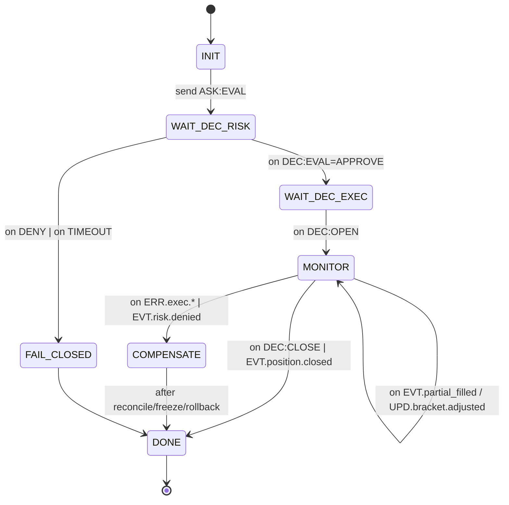

# docs/CENTRAL_FSM_SPEC.md

## 1) Мета й обсяг

Визначає **центральний координаційний шар** з двох FSM:

* **OrchestratorFSM (TRADE Coordinator)** — керує життєвим циклом `rid` у гарячому шляху.
* **MetaFSM (Registry/Governance)** — доменний реєстр, здоров’я, сумісність схем, freeze/failover.

## 2) Контракти (словник → схеми)

**Спільні поля (усі повідомлення):** `rid(uuid)`, `span`, `verb`, `domain`, `ttl_profile∈{critical,fast,normal,ml_slow,background}`, `policy.idempotent_key`, `why≤80`, `why_explain_ref?`, `data_ref?`, `sig?`.

### 2.1 OrchestratorFSM — ключові верби

* `ASK:EVAL` (до `risk_strategy`), `DEC:EVAL(APPROVE|DENY)` — повернення у координацію.
* `ASK:OPEN|CLOSE` (до `execution_position`), `DEC:OPEN|CLOSE` — підтвердження виконання.
* Події спостереження: `EVT.position.partial_filled`, `UPD.bracket.adjusted`, `ERR.exec.*`, `EVT.risk.denied`.
* Службові: `EVT.orch.timeout`, `EVT.orch.compensate`, `EVT.orch.freeze_position`.

### 2.2 MetaFSM — ключові верби

* `EVT.registry.heartbeat` (від доменів) → `UPD.registry.status` (здоров’я/версії).
* `ERR.registry.schema_mismatch` → `EVT.registry.freeze_domain` (governance freeze).
* `EVT.registry.schema_canary_ok|fail`.

> Усі схеми — Draft 2020‑12; `$id`/`$schema` обов’язкові; additive‑only версіонування.

## 3) Оркестрація — модель станів

**Інваріанти:** мовчання Risk = `DENY`; усі `ASK/DEC` мають `policy.idempotent_key`; дублікати — no‑op; out‑of‑order події паркуються до `DEC:OPEN` (буфер на `rid`).

## 4) Таймери, TTL, CB, ретраї

* **TTL-профілі:** critical(50мс)/fast(200мс)/normal(2с)/ml_slow(10с)/background(30с).
* **Risk‑wait таймер** = critical; по таймауту → `FAIL_CLOSED` + `ERR:TIMEOUT` у WAL.
* **CB (circuit breaker)** на домен: відкриття при `timeout_rate>1%` або `5xx spike`; деградація маршрутизації (відсікання неоплачених `ASK`).
* **Ретраї**: тільки для **ідемпотентних** операцій (наприклад, повтор `ASK:EVAL`).

## 5) Ідемпотентність і дедуплікація

* Ключ за замовчуванням: `domain:verb:{position_id|clientOrderId|rid}`.
* **Повтори** будь-якого `ASK/DEC` з тим самим ключем — **no-op**.
* **Out-of-order**: події до `DEC:OPEN` буферизуються, але не змінюють стан; після `DEC:OPEN` — програються у MONITOR.

## 6) Компенсації та зупинки (COMPENSATE)

Тригери: `ERR.exec.rejected`, `EVT.risk.denied`, довгий таймаут, неузгодженість стану.
Дії: freeze позиції, скасування peer-ордерів, вимога снапшоту, запис у WAL + panic-bundle, сповіщення Ops.

## 7) XAI і why_chain

* У кожному `DEC/ERR` — короткий `why≤80` (гарячий шлях).
* **why_chain** агрегується у OrchestratorFSM і доступний через `/debug/{rid}` (разом із trace).
* Розгорнуті пояснення — `why_explain_ref` (cold‑storage), не впливають на p95.

## 8) DR / WAL / Replay

* WAL JSONL append‑only, hash‑ланцюг, добовий Merkle‑root.
* Snapshots із метаданими `wal_range` та `merkle_root`.
* `/replay` відтворює сценарії 1:1; **replay‑success** — обов’язковий SLI.

## 9) Security (Ed25519, RBAC/ABAC, redaction)

* High‑risk `DEC/CMD` (OPEN/CLOSE/ADJUST) — підписуються Ed25519; ключі в KMS.
* RBAC/ABAC на `/debug`, promote/rollback, registry freeze.
* Redaction для секретів/PII в логах; окремий secure‑log канал.

## 10) Ендпойнти спостережності

* `/health` — liveness/readiness; `/metrics` — p50/p95/timeout/queue depth;
* `/debug/{rid}` — why_chain + trace + refs; `/replay` — відтворення RID/діапазону; `/statdump` — поточні лічильники/стани.

## 11) Приклади контрактів (уривки)

**ASK:EVAL (до Risk):** поля: `rid, verb=ASK:EVAL, domain=risk_strategy, ttl_profile=critical, signal_code, confidence, context[8..16], metrics{…}, data_ref?, why?`

**DEC:EVAL:** поля: `rid, verb=DEC:EVAL, verdict∈{APPROVE,DENY}, limits{max_f,max_leverage}? , why, sig`.

**ASK:OPEN (до Exec):** поля: `rid, ttl_profile=fast, policy.idempotent_key, order{symbol,side,qty,price_mode,reduce_only?}, why?`.

**EVT.position.partial_filled:** поля: `rid, position_id, filled_qty, remaining_qty, price, why, span`.

## 12) Тест‑матриця (центральний шар)

* **Contract**: JSON‑Schema валідатори для всіх verbs; additive‑only diffs.
* **Integration**: EVAL→OPEN→MONITOR→CLOSE; duplicates; out‑of‑order; compensation; freeze.
* **Chaos**: часова деградація Risk/Exec; CB‑trigger; mass duplicate; WAL‑corrupt (відхилення).
* **Perf (smoke)**: p95(hot) ≤ 50 мс; router p95 ≤ 10 мс.
* **DR**: replay усіх e2e сценаріїв 1:1; snapshot rollback тест.

## 13) KPI / SLI

Latency per hop; timeout_rate; CB‑open%; replay‑success%; state‑drift%; WHY‑coverage%; підписані DEC/CMD%; redaction coverage.

## 14) Межі відповідальності

* **OrchestratorFSM** не зберігає доменних станів; тільки RID‑контекст і таймери.
* **MetaFSM** не приймає торгових рішень; лише реєстр, health, governance freeze.

## 15) Впровадження в порожній гілці (кроки)

1. Додати записи Orchestrator/MetaFSM у `dictionaries/global_v2_2.yaml` → згенерувати `schemas/`.
2. Підняти `/health /metrics /debug /replay`; WAL round‑trip.
3. Підключити `execution_position` через Orchestrator (shadow), згодом — `risk_strategy`.
4. Увімкнути why_chain, панік‑бандл, CI‑гейти.
