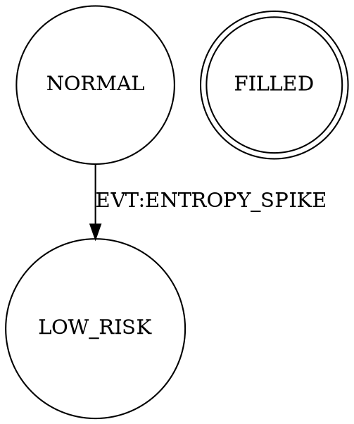

# vFoundation — Повний план реалізації Phase 14 + Cleanup
**Версія:** 1.0 | **Дата:** 2026-02-24 | **Гілка:** backtest_1 → потім main

---

## ПОТОЧНИЙ СТАН СИСТЕМИ

| Метрика | Значення |
|---------|----------|
| Тести vfoundation | 716 / 716 PASS |
| Покриття Phase 9-13 | ~90% |
| Залишається | ~10% (Phase 14 + bugfixes + cleanup) |
| Критичні баги | 2 (signing_ed25519.py, protocol.py) |

### Що вже реалізовано (DONE):
- FSMCore (event bus), FSMv2, MetaFSMv2
- Message Protocol v1 (Pydantic)
- DR: WAL, Snapshot, Replay, Merkle
- Security: Ed25519 signing, RBAC/ABAC
- Observability: XAI Store, Why-chain, Alert Manager, Topology Auditor
- Testing: ChaosHarness, PerfBenchmark
- CLI: vfound commands (schema, replay, drift, trace, init)
- Idempotency: Redis backends, InMemory

---

## ПРИНЦИПИ РЕАЛІЗАЦІЇ

1. **TDD-first** — спочатку тести, потім код
2. **Additive-first** — нові функції додаються, не замінюють старих
3. **Green-always** — після кожного кроку всі 716+ тестів мають проходити
4. **Strangler Fig** — монолітні файли розспорюються поступово через re-export
5. **Cleanup-after** — мертвий код видаляється тільки після підтвердження нічого не зламалось

---

## КРОК 0 — НЕГАЙНІ BUGFIXES (критично, не рухаємось далі без цього)

### 0.1 Виправити `vfoundation/security/signing_ed25519.py`

**Проблема:** `verify()` ловить лише `BadSignatureError`, але PyNaCl кидає `ValueError`/`TypeError` при неправильній довжині підпису → необроблений виняток виходить назовні.

**Файл:** `vfoundation/security/signing_ed25519.py`

**Зміна:**
```python
# BEFORE (line 33):
    except BadSignatureError:
        return False

# AFTER:
    except (BadSignatureError, ValueError, TypeError):
        return False
```

**Тести:**
- Додати в `tests/vfoundation/security/test_signing_ed25519.py`:
  - `test_verify_wrong_length_signature` → передати `b"short"` як підпис → має повернути `False`
  - `test_verify_empty_signature` → передати `b""` → має повернути `False`
  - `test_verify_none_type_signature` → передати `b"\x00" * 5` → має повернути `False`

**Послідовність:**
1. Написати тести (будуть червоні)
2. Виправити код
3. Запустити тести → всі зелені
4. `pytest tests/vfoundation/ -q` → 719+ pass

---

### 0.2 Виправити `vfoundation/core/protocol.py` — функція `truncate_why`

**Проблема:** Функція `truncate_why` має синтаксичний дефект — пропущений `"""` після docstring та помилкові відступи.

**Поточний код (lines 11-21):**
```python
def truncate_why(why_text: Optional[str], max_len: int = 80) -> Optional[str]:
    """Truncate why field to max_len to comply with Message validation.
    Usage in bridge: why = truncate_why(long_why_string)


    if why_text is None:
        return None

    if len(why_text) <= max_len:
        return why_text
        return why_text[:max_len]
```

**Виправлений код:**
```python
def truncate_why(why_text: Optional[str], max_len: int = 80) -> Optional[str]:
    """Truncate why field to max_len to comply with Message validation.

    Usage in bridge: why = truncate_why(long_why_string)
    """
    if why_text is None:
        return None
    if len(why_text) <= max_len:
        return why_text
    return why_text[:max_len]
```

**Тести:** Додати `tests/vfoundation/core/test_protocol.py`:
- `test_truncate_why_none` → None → None
- `test_truncate_why_short` → "hi" → "hi"
- `test_truncate_why_exact_80` → рядок 80 символів → без змін
- `test_truncate_why_over_80` → рядок 100 символів → [:80]
- `test_truncate_why_empty` → "" → ""

---

## КРОК 1 — FSMv2 ENHANCEMENTS (Phase 14B)
**Ризик:** Низький (additive). **Файл:** `vfoundation/core/fsm_v2.py`

### 1.1 Deadlock Detection — `validate_reachability()`

**Що додати:** Метод, що перевіряє чи всі зареєстровані стани досяжні з initial state. Виявляє "мертві" стани.

```python
# Додати до класу FSMv2:
def validate_reachability(self) -> Dict[str, Any]:
    """
    Validate that all registered states are reachable from initial_state.
    Returns {"reachable": set[str], "unreachable": set[str], "valid": bool}
    """
```

**Алгоритм:** BFS/DFS по transition table від initial_state.

**Тести:** `tests/vfoundation/core/test_fsm_v2_enhancements.py`
- `test_all_states_reachable` → лінійний ланцюг → valid=True
- `test_orphan_state_detected` → стан без вхідних переходів → unreachable={"ORPHAN"}
- `test_empty_fsm_no_initial` → без initial → valid=False
- `test_terminal_states_reachable` → terminal стани досяжні → valid=True

---

### 1.2 Graph Export — `to_dot()`

**Що додати:** Метод, що генерує Graphviz DOT-формат для візуалізації FSM.

```python
def to_dot(self) -> str:
    """Export FSM as Graphviz DOT format string."""
```

**Формат виводу:**


**Тести:**
- `test_to_dot_contains_states` → всі стани присутні в рядку
- `test_to_dot_contains_transitions` → всі переходи присутні
- `test_to_dot_terminal_double_circle` → terminal стани → `doublecircle`
- `test_to_dot_initial_bold` → initial стан → `style=bold`

---

### 1.3 State Statistics — `get_stats()`

```python
def get_stats(self) -> Dict[str, Any]:
    """Return per-state statistics: count of keys in each state."""
```

**Тести:**
- `test_get_stats_empty` → {} якщо немає tracked keys
- `test_get_stats_after_transitions` → правильний підрахунок

---

### 1.4 Cleanup FSMv2

Після реалізації та проходження тестів:
- Перевірити чи `vfoundation/core/fsm_emit_compat.py` ще потрібний → якщо ні, видалити
- Перевірити чи видалений `vfoundation/core/fsm.py` правильно відображений у git

---

## КРОК 2 — TOPOLOGY AUDITOR EXTENSION (Phase 14D)
**Ризик:** Низький (additive). **Файл:** `vfoundation/obs/topology_auditor.py`

### 2.1 Infrastructure Health Monitoring

**Що додати:** Метод `audit_health(checks)` що приймає словник перевірок здоров'я:

```python
@dataclass
class HealthCheck:
    name: str
    check_fn: Callable[[], bool]
    critical: bool = True

def audit_health(self, checks: List[HealthCheck]) -> HealthReport:
    """Run health checks and return composite health report."""
```

```python
@dataclass
class HealthReport:
    healthy: bool
    checks_passed: int
    checks_failed: int
    failures: List[str]
    critical_failure: bool
```

**Тести:** `tests/vfoundation/obs/test_topology_auditor_health.py`
- `test_all_checks_pass` → healthy=True
- `test_one_non_critical_fails` → healthy=False, critical_failure=False
- `test_critical_check_fails` → critical_failure=True
- `test_empty_checks` → healthy=True
- `test_exception_in_check` → treated as failure, не crash

---

### 2.2 FSM Bridge для orphan domains

**Що додати:** `DomainBridge` — клас що дозволяє неFSM-доменам (neocortex, alpha_search) реєструватися в MetaFSMv2-контрольованій топології.

**Файл:** `vfoundation/obs/domain_bridge.py` (новий)

```python
class DomainBridge:
    """
    Bridge for non-FSM domains to participate in MetaFSM topology.

    Domains that don't use FSMv2 internally can register with this bridge
    to expose health status to TopologyAuditor.
    """

    def __init__(self, domain_name: str, bus: Optional[Any] = None) -> None: ...

    def register_health_fn(self, fn: Callable[[], bool]) -> None: ...

    def is_healthy(self) -> bool: ...

    def emit_status(self) -> None:
        """Emit EVT:DOMAIN_STATUS to bus."""
```

**Тести:** `tests/vfoundation/obs/test_domain_bridge.py`
- `test_bridge_healthy` → is_healthy() = True
- `test_bridge_unhealthy_fn` → fn returns False → is_healthy() = False
- `test_bridge_emit_no_bus` → без bus → no crash
- `test_bridge_emit_with_bus` → емітує правильне повідомлення
- `test_bridge_exception_in_health_fn` → treated as unhealthy

---

## КРОК 3 — MESSAGE PROTOCOL v2 (Phase 14C)
**Ризик:** СЕРЕДНІЙ. Backward-compatible підхід.

### 3.1 Phase A — Typed payload schemas (Pydantic)

**Концепція:** Додати типізовані payload класи без зміни Message envelope.

**Файл:** `vfoundation/core/payloads.py` (новий)

```python
from pydantic import BaseModel
from typing import Annotated, Union, Literal

class OpenPayload(BaseModel):
    symbol: str
    side: Literal["BUY", "SELL"]
    qty: float
    price: float | None = None

class ClosePayload(BaseModel):
    symbol: str
    reason: str

class FillPayload(BaseModel):
    order_id: str
    symbol: str
    qty: float
    price: float
    ts_fill: int

# Discriminated union for type-safe payload access:
VerbPayload = Annotated[
    Union[OpenPayload, ClosePayload, FillPayload],
    Field(discriminator="verb")
]
```

**Завдання:**
1. Визначити payload schemas для top-20 verb'ів з verb_registry_v1.yaml
2. Додати helper `Message.typed_payload(schema_cls)` → Pydantic model
3. НЕ змінювати поле `pld: Dict[str, Any]` в Message (backward compat)

**Тести:** `tests/vfoundation/core/test_payloads.py`
- `test_open_payload_valid`
- `test_open_payload_missing_required_field` → ValidationError
- `test_message_typed_payload_open` → Message з pld → OpenPayload
- `test_message_typed_payload_wrong_type` → ValidationError
- `test_payload_round_trip` → payload → dict → payload → рівні

---

### 3.2 Phase B — ExchangeContext shared schema

**Файл:** `vfoundation/core/exchange_context.py` (новий)

```python
class ExchangeContext(BaseModel):
    """Shared context passed with all exchange-bound messages."""
    exchange: str = "binance"
    account_id: str
    session_id: str
    leverage: int = 1
    hedge_mode: bool = False
```

**Тести:**
- `test_exchange_context_defaults`
- `test_exchange_context_validation`
- `test_exchange_context_serialization`

---

### 3.3 Migration helper — `migrate_pld_v1_to_v2()`

Utility для поступової міграції payload format без breaking changes:

```python
# vfoundation/core/protocol_migration.py
def migrate_pld_v1_to_v2(msg: Message) -> Message:
    """
    Returns a NEW Message where trading-specific root fields
    are moved to pld (Phase A migration).

    Backward compatible: if fields already in pld, no-op.
    """
```

---

## КРОК 4 — МОНОЛІТНА ДЕКОМПОЗИЦІЯ (Phase 14A)
**Ризик:** НАЙВИЩИЙ. Виконувати останнім.

### 4.1 Audit монолітів

Перед декомпозицією — аудит:

```bash
wc -l apps/reference/domains/decision_making/decision_making.py
wc -l apps/reference/domains/execution_position/fsm.py
```

Ідентифікувати:
- Публічний API (функції що імпортуються ззовні)
- Внутрішні helper функції
- Доменні межі (де розбивати)

### 4.2 Strangler Fig для `decision_making.py`

**Принцип:** Не видаляємо `decision_making.py`. Витягуємо модулі у нові файли, а `decision_making.py` стає re-export оберткою.

**Порядок витягування:**

```
decision_making/
├── decision_making.py          ← стає re-export wrapper (залишається)
├── _core.py                    ← (витягнути) базова логіка, <500 LOC
├── _regime_filter.py           ← (витягнути) режимна фільтрація, <300 LOC
├── _risk_gate.py               ← (витягнути) ризик-гейтинг, <300 LOC
├── _scoring.py                 ← (вже є: aurora_scoring_kernel.py)
└── _cooldown.py                ← (витягнути) cooldown/anti-churn, <200 LOC
```

**Кожен крок:**
1. Запустити `pytest tests/domains/decision_making/ -q` → всі зелені (baseline)
2. Витягнути один модуль в `_core.py`
3. `decision_making.py` → `from ._core import *` (re-export)
4. Запустити тести → всі зелені
5. Додати unit-тести для нового модуля
6. Repeat для наступного модуля

### 4.3 Strangler Fig для `execution_position/fsm.py`

Перевірити: чи вже розбитий (`fsm_open.py`, `fsm_manage.py`, `fsm_close.py` вже існують у директорії). Якщо так — перевірити чи `fsm.py` є re-export wrapper, якщо ні — перетворити його.

---

## КРОК 5 — CLEANUP (після всієї реалізації)

### 5.1 Видалити мертвий код

Після успішного завершення всіх кроків:

| Файл | Дія | Умова |
|------|-----|-------|
| `vfoundation/core/fsm_emit_compat.py` | Видалити | Якщо немає імпортів |
| `tests/test_circuit_breaker.py` | Вже видалено в git | Перевірити |
| `tests/test_coverage_boost.py` | Вже видалено в git | Перевірити |
| `tests/test_exact_90_percent.py` | Вже видалено в git | Перевірити |
| `nul` (файл в git status) | Видалити | Windows-артефакт |

**Команда для пошуку мертвого імпорту:**
```bash
python -m pylint vfoundation --disable=all --enable=W0611 2>&1 | grep "unused-import"
```

### 5.2 Перевірити залишкові `TODO` і `FIXME`

```bash
grep -rn "TODO\|FIXME\|HACK\|XXX" vfoundation/ --include="*.py"
```

### 5.3 Type checking

```bash
python -m mypy vfoundation/ --ignore-missing-imports --no-error-summary
```

Виправити всі типові помилки.

---

## КРОК 6 — 100% ПОКРИТТЯ ТЕСТАМИ

### 6.1 Виміряти поточне покриття vfoundation

```bash
pytest tests/vfoundation/ --cov=vfoundation --cov-report=term-missing --cov-report=html
```

### 6.2 Цільові покриття per-module

| Модуль | Мінімум | Ціль |
|--------|---------|------|
| `vfoundation/core/fsm_v2.py` | 95% | 100% |
| `vfoundation/core/fsm_core.py` | 95% | 100% |
| `vfoundation/core/meta_fsm_v2.py` | 90% | 100% |
| `vfoundation/core/protocol.py` | 100% | 100% |
| `vfoundation/core/reconcile.py` | 100% | 100% |
| `vfoundation/security/signing_ed25519.py` | 100% | 100% |
| `vfoundation/dr/wal.py` | 85% | 95% |
| `vfoundation/obs/topology_auditor.py` | 90% | 100% |
| `vfoundation/obs/xai_store.py` | 100% | 100% |

### 6.3 Виявити незакриті гілки

```bash
pytest tests/vfoundation/ --cov=vfoundation --cov-branch --cov-report=term-missing 2>&1 | grep "MISS"
```

Для кожної незакритої гілки — написати targeted test.

---

## ПОРЯДОК ВИКОНАННЯ (SEQUENTIAL)

```
КРОК 0.1 → bugfix signing_ed25519.py    [30 min]
КРОК 0.2 → bugfix protocol.py           [20 min]
--- перевірка: pytest → 719+ PASS ---

КРОК 1.1 → FSMv2: validate_reachability [45 min]
КРОК 1.2 → FSMv2: to_dot()              [30 min]
КРОК 1.3 → FSMv2: get_stats()           [20 min]
--- перевірка: pytest → 730+ PASS ---

КРОК 2.1 → TopologyAuditor: health      [45 min]
КРОК 2.2 → DomainBridge                 [60 min]
--- перевірка: pytest → 750+ PASS ---

КРОК 3.1 → Payloads schemas             [90 min]
КРОК 3.2 → ExchangeContext              [30 min]
КРОК 3.3 → protocol_migration.py       [45 min]
--- перевірка: pytest → 780+ PASS ---

КРОК 4.1 → Аудит монолітів             [30 min]
КРОК 4.2 → decision_making декомп.     [120 min]
КРОК 4.3 → execution_position перевірка [60 min]
--- перевірка: pytest → 800+ PASS ---

КРОК 5   → Cleanup мертвого коду       [60 min]
КРОК 6   → Coverage audit + fill gaps  [120 min]
--- фінальна перевірка: pytest → 800+ PASS, coverage ≥95% ---
```

---

## КРИТИЧНІ ПРАВИЛА (не порушувати)

1. **НЕ міняти публічний API Message** без backward compat шару
2. **НЕ видаляти файли** поки не перевірено `grep -r "import_from_that_file"`
3. **НЕ створювати нові verb'и** без запису в `verb_registry_v1.yaml`
4. **Запускати повний suite** `pytest tests/vfoundation/` після КОЖНОГО кроку
5. **Strangler Fig** — старий файл стає wrapper, не видаляється відразу
6. **TDD** — тести ПЕРЕД кодом для нових features

---

## ФАЙЛИ ДО ЗМІНИ (зведена таблиця)

| Файл | Тип змін | Крок |
|------|----------|------|
| `vfoundation/security/signing_ed25519.py` | bugfix | 0.1 |
| `vfoundation/core/protocol.py` | bugfix | 0.2 |
| `vfoundation/core/fsm_v2.py` | additive | 1 |
| `vfoundation/obs/topology_auditor.py` | additive | 2 |
| `vfoundation/obs/domain_bridge.py` | NEW | 2.2 |
| `vfoundation/core/payloads.py` | NEW | 3.1 |
| `vfoundation/core/exchange_context.py` | NEW | 3.2 |
| `vfoundation/core/protocol_migration.py` | NEW | 3.3 |
| `apps/reference/domains/decision_making/_*.py` | NEW (Strangler Fig) | 4.2 |
| `apps/reference/domains/decision_making/decision_making.py` | re-export wrapper | 4.2 |

### Нові тестові файли:

| Файл | Крок |
|------|------|
| `tests/vfoundation/security/test_signing_ed25519.py` (доповнення) | 0.1 |
| `tests/vfoundation/core/test_protocol.py` (новий) | 0.2 |
| `tests/vfoundation/core/test_fsm_v2_enhancements.py` | 1 |
| `tests/vfoundation/obs/test_topology_auditor_health.py` | 2.1 |
| `tests/vfoundation/obs/test_domain_bridge.py` | 2.2 |
| `tests/vfoundation/core/test_payloads.py` | 3.1 |
| `tests/vfoundation/core/test_exchange_context.py` | 3.2 |
| `tests/vfoundation/core/test_protocol_migration.py` | 3.3 |

---

## DEFINITION OF DONE

- [ ] Всі 716 існуючих тестів продовжують проходити
- [ ] Нові тести написані ПЕРЕД реалізацією (TDD)
- [ ] `pytest tests/vfoundation/ -q` → 800+ PASS, 0 FAIL
- [ ] `pytest tests/vfoundation/ --cov=vfoundation` → ≥95% coverage
- [ ] `python -m mypy vfoundation/ --ignore-missing-imports` → 0 errors
- [ ] Мертвий код видалено
- [ ] `verb_registry_v1.yaml` оновлено для всіх нових verb'ів
- [ ] Всі нові файли ≤500 LOC (Constitution §3)
- [ ] Жоден існуючий публічний API не зламаний
