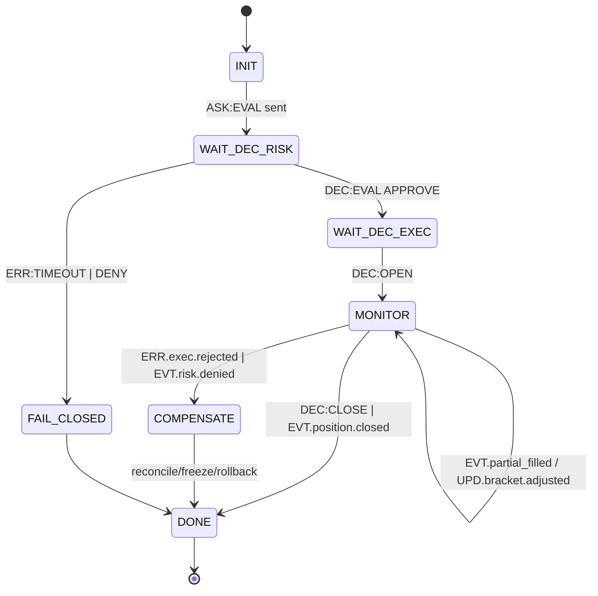

# docs/ROADMAP_DELTA_EMPTY_BRANCH.md

## QuantumTraderX V4.0 → vFoundation FSM Federation (Empty-Branch Delta Plan)

### 0) Мета й умови

Міграція в новій порожній гілці шляхом поетапного витягування системних папок, їх обгортання у vFoundation і підключення до федеративної FSM без ламальних змін (**additive-only**).

**Ключові інваріанти**: contract-first • additive-only • fail-closed • safety-вето першим • ідемпотентність per `rid`/`policy.idempotent_key` • TTL-профілі • data-by-reference • підписи **Ed25519** для high-risk `DEC/CMD` • WORM-audit (WAL hash-chain + daily Merkle) • `/replay` відтворює 1:1.

**SLO**: p95(hot) ≤ 50 мс (загальний ≤100 мс) • state-drift < 1% • WHY-coverage ≥ 95% • timeout_rate ≤ 1% • coverage(FSM) ≥ 90% • RTO ≤ 5 хв • RPO ≤ 1 хв.

---

### 1) Порядок під’єднання систем (логіка та обґрунтування)

Критерії пріоритизації: **Risk Dictatorship → мінімальний blast-radius → залежності → спостережність**.

| Черга | Система (домен)                                 | Чому зараз                                                                           | Залежить від               |
| ----: | ----------------------------------------------- | ------------------------------------------------------------------------------------ | -------------------------- |
| **1** | **execution_position** (Order/Position/Bracket) | Найбільший ризик і ефект: контроль життєвого циклу позицій, OCO/TP-SL, partial fills | Router/Contracts, словники |
| **2** | **risk_strategy** (Safety→Sizing)               | Вето/сайзинг мають передувати будь-якому `OPEN/CLOSE` (мовчання=DENY)                | 1                          |
| **3** | **analyzer/strategy** (Signal/Regime)           | Стандартний `ASK:EVAL` (Signal Encoding v1) стабілізує входи                         | 1–2                        |
| **4** | **xai_audit**                                   | `/debug/{rid}`, why_chain, panic-bundle — потрібні від P2                            | 1–3                        |
| **5** | **data_monitoring** (klines/features/cache)     | Підживлює analyzer/risk; легко мокати by-ref                                         | 3                          |
| **6** | **reward_alysha** (cold-path)                   | Не впливає на p95; під’єднується подіями                                             | 3–5                        |
| **7** | **rl_core** (PPO/LSTM, promote/rollback)        | Тільки через governance; холодний шлях                                               | 6                          |

> Уже після кроків 1–4 маємо керований гарячий шлях з DR/Obs; далі — безпечне під’єднання data/learn.

---

### 2) Кількість FSM на систему (v1, мінімально достатньо)

| Домен              | FSM-одиниці v1                              | Призначення                                               | Примітки                                      |
| ------------------ | ------------------------------------------- | --------------------------------------------------------- | --------------------------------------------- |
| execution_position | **3**: OrderFSM, PositionFSM, BracketFSM    | Ордери/часткові філи; агрегований стан позиції; OCO/TP-SL | Execution = головний ризик → 3 FSM виправдано |
| risk_strategy      | **2**: SafetyFSM, SizingFSM                 | Вето (APPROVE/DENY) та окремо сайзинг/плече               | Розділяємо KPI                                |
| analyzer/strategy  | **2**: SignalFSM, RegimeFSM                 | Енкодинг сигналів; режими ринку                           | Чистий вхід `ASK:EVAL`                        |
| xai_audit          | **1**: AuditFSM                             | why_chain, аудит, panic-bundle                            | Легка                                         |
| data_monitoring    | **2**: StreamSupervisorFSM, FeatureCacheFSM | WS-конекшени/ретраї; кеш                                  | Контроль стабільності                         |
| reward_alysha      | **1**: RewardFSM                            | Звіти/підказки політик (cold)                             | Асинхронно                                    |
| rl_core            | **3**: TrainFSM, EvalFSM, PromoteFSM        | тренування; валідація; промо/ролбек                       | Через governance                              |
| **Разом**          | **14 FSM**                                  |                                                           | Почни з 8 FSM (домени 1–4), розширюй          |

> Спрощена стартова опція: execution=2 (Position+Bracket), risk=1 (Safety+Sizing). Рекомендовано базовий план (14) для прозорості ризик-метрик.

---

### 3) Центральний шар (огляд) — OrchestratorFSM + MetaFSM

* **OrchestratorFSM (TRADE Coordinator)**: координує життєвий цикл `rid` у гарячому шляху (EVAL→OPEN→MONITOR→CLOSE/COMPENSATE), застосовує глобальні політики TTL/CB/idempotency, агрегує **why_chain**, ініціює компенсації/заморозки.
* **MetaFSM (Registry/Governance)**: реєстрація доменів/версій схем, health/readiness, schema-canary, freeze при mismatch, співпраця з DR `/replay`.

---

### 4) Плейбук «папка-за-папкою» (повторний для кожної системи)

1. **Contracts First** → оновити `dictionaries/domain/<system>.yaml` → згенерувати `schemas/*.json` (Draft 2020-12), CI: schema-lint + additive-only diff.
2. **ACL-Adapter** → нормалізує legacy DTO у події; примушує TTL та ідемпотентність; усі потоки через **Safety** (жодних обходів).
3. **FSM-обгортка** → мінімальний набір FSM згідно таблиці; WHY (≤80) у кожному `DEC/ERR`.
4. **Shadow-mode** → dual-read, zero-write; порівняння з legacy; **state-drift < 1%**.
5. **Canary → Cutover** → single-writer (флаг/lease), 10–20% → 100%; DR: WAL+snapshot+replay ок; rollback-важіль.
6. **Документи/XAI/DR** → записи у `JOURNAL.md`, ADR для адаптера/катоверу, оновлення `docs/Operations.md`, WHY-coverage ≥95%, panic-bundle.

---

### 5) Гейти якості (на кожний імпорт системи)

* **Якість:** coverage(FSM) ≥ 90%; contract/consumer-driven тести зелені.
* **Продуктивність:** p95(hot) ≤ 50 мс; timeout_rate ≤ 1%; черга під контролем.
* **Безпека:** Ed25519 підписи на high-risk `DEC/CMD`; redaction; RBAC/ABAC.
* **DR:** WAL hash-chain + Merkle; snapshot+replay 1:1.
* **Governance:** additive-only, schema-canary, freeze при mismatch.

---

### 6) Спринт-план (P0→P3) з порожньої гілки

**P0 (Дні 1–2):** імпорт vFoundation ядра; підняти OrchestratorFSM/MetaFSM (порожні хендлери + health); зафіксувати Global Dictionary; згенерувати schemas; WAL round‑trip; CI зелений.

**P1 (Дні 3–6):** імпорт `execution_position` + ACL + 3 FSM; імпорт `risk_strategy` + 2 FSM; зв’язати через Орchestrator; **Shadow-mode**.

**Gate P1:** shadow ≥95%; WHY-coverage ≥95% (hot 100%); WAL-replay ок.

**P2 (Дні 7–10):** імпорт `analyzer/strategy` (Signal/Regime) та `xai_audit`; **Canary 10–20%**, single-writer, monitor p95/timeout.

**Gate P2:** p95(hot) ≤ 50 мс; state-drift < 1%; timeout ≤ 1%; DR-replay ок.

**P3 (Дні 11–15):** імпорт `data_monitoring` (2 FSM), `reward_alysha` (1 FSM), `rl_core` (3 FSM, лише PromoteFSM через governance); дашборд/алерти; PRR чек-листи.

---

### 7) RACI

| Роль           | Відповідальність                                |
| -------------- | ----------------------------------------------- |
| Lead Architect | Інваріанти, межі доменів, Go/No-Go              |
| Gemini Agent   | Схеми/моки/тести, FSM handlers, CI інтеграції   |
| Ops/SRE        | CI, метрики, алерти, DR тести, panic-bundle     |
| Security       | KMS/keys/Ed25519, RBAC/ABAC, redaction          |
| Quant/Risk     | Параметри safety/сайзингу, chaos-кейси hot-path |

---

### 8) Негайні дії

1. Додати записи для Orchestrator/MetaFSM у `dictionaries/global_v2_2.yaml`; згенерувати `schemas/*`.
2. Імпортувати папку `execution_position` → ACL → 3 FSM → Shadow-mode.
3. Паралельно підготувати `risk_strategy` → підключити після shadow‑верифікації.
4. Увімкнути `/debug/{rid}` і why_chain з P1.

---

