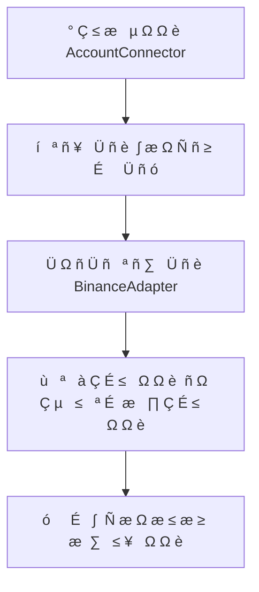
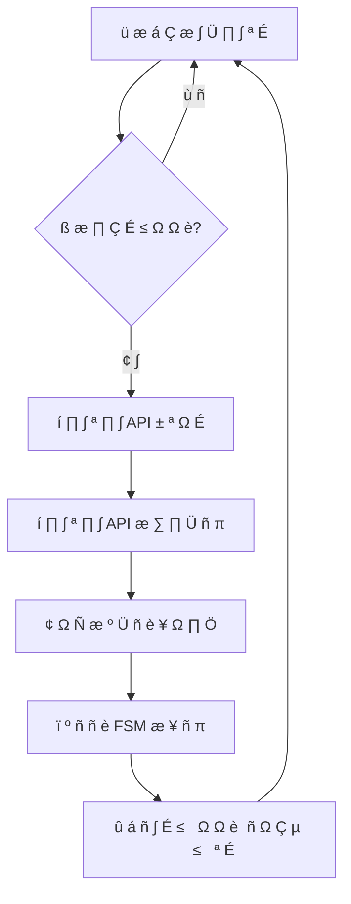
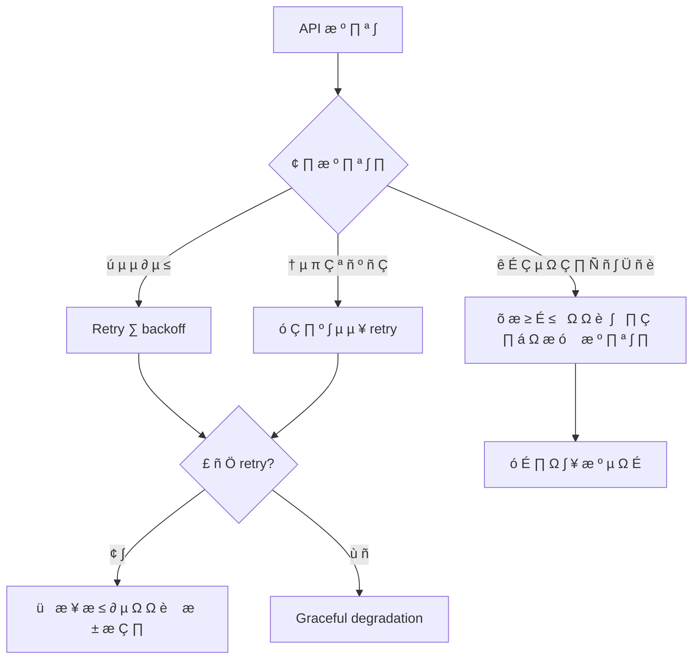
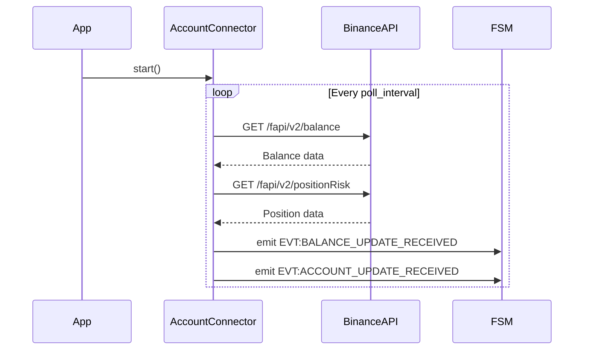

#  ê   Ö ñ Ç µ ∫ Ç É   Ω      Ö µ º    ¥ æ º µ Ω É Account Balance

##  ó   ≥   ª å Ω        Ö ñ Ç µ ∫ Ç É    

 î æ º µ Ω `account_balance`    µ   ª ñ ∑ É î      Ç Ç µ   Ω **Observer**  ¥ ª è  º æ Ω ñ Ç æ   ∏ Ω ≥ É    Ç   Ω É      Ö É Ω ∫ É Binance Futures.  ê   Ö ñ Ç µ ∫ Ç É        æ ± É ¥ æ ≤   Ω    Ω        ∏ Ω Ü ∏     Ö  Ω   ¥ ñ π Ω æ   Ç ñ,      ∏ Ω Ö   æ Ω Ω æ   Ç ñ  Ç   graceful degradation.

```
‚îå‚î ‚î ‚î ‚î ‚î ‚î ‚î ‚î ‚î ‚î ‚î ‚î ‚î ‚î ‚î ‚î ‚î ‚îê    ‚îå‚î ‚î ‚î ‚î ‚î ‚î ‚î ‚î ‚î ‚î ‚î ‚î ‚î ‚î ‚î ‚î ‚î ‚î ‚îê    ‚îå‚î ‚î ‚î ‚î ‚î ‚î ‚î ‚î ‚î ‚î ‚î ‚î ‚î ‚î ‚î ‚î ‚î ‚îê
│   Binance API   │◄┠┠►│  AccountConnector │◄┠┠►│   FSM Events    │
│   (External)    │    │   (Core Logic)   │    │   (Internal)    │
‚îî‚î ‚î ‚î ‚î ‚î ‚î ‚î ‚î ‚î ‚î ‚î ‚î ‚î ‚î ‚î ‚î ‚î ‚îò    ‚îî‚î ‚î ‚î ‚î ‚î ‚î ‚î ‚î ‚î ‚î ‚î ‚î ‚î ‚î ‚î ‚î ‚î ‚î ‚îò    ‚îî‚î ‚î ‚î ‚î ‚î ‚î ‚î ‚î ‚î ‚î ‚î ‚î ‚î ‚î ‚î ‚î ‚î ‚îò
                              │
                              ▼
                       ‚îå‚î ‚î ‚î ‚î ‚î ‚î ‚î ‚î ‚î ‚î ‚î ‚î ‚î ‚î ‚î ‚î ‚î ‚î ‚îê
                       │  Error Handling  │
                       │  & Recovery      │
                       ‚îî‚î ‚î ‚î ‚î ‚î ‚î ‚î ‚î ‚î ‚î ‚î ‚î ‚î ‚î ‚î ‚î ‚î ‚î ‚îò
```

##  ö æ º   æ Ω µ Ω Ç ∏      Ö ñ Ç µ ∫ Ç É   ∏

### 1. AccountConnector ( ì æ ª æ ≤ Ω ∏ π  ∫ ª    )

** í ñ ¥   æ ≤ ñ ¥   ª å Ω ñ   Ç å:**
-  £       ≤ ª ñ Ω Ω è  ∂ ∏ Ç Ç î ≤ ∏ º  Ü ∏ ∫ ª æ º  ¥ æ º µ Ω É
-  ö æ æ   ¥ ∏ Ω   Ü ñ è API  ≤ ∏ ∫ ª ∏ ∫ ñ ≤
-  ¢     Ω   Ñ æ   º   Ü ñ è  ¥   Ω ∏ Ö  ≤    æ ¥ ñ ó FSM

** ö ª é á æ ≤ ñ  º µ Ç æ ¥ ∏:**
- `start()` -  Ü Ω ñ Ü ñ   ª ñ ∑   Ü ñ è  Ç    ∑     É   ∫  º æ Ω ñ Ç æ   ∏ Ω ≥ É
- `stop()` - Graceful shutdown
- `_monitor_loop()` -  û   Ω æ ≤ Ω ∏ π  Ü ∏ ∫ ª  º æ Ω ñ Ç æ   ∏ Ω ≥ É
- `_fetch_and_emit_account_data()` -  û Ç   ∏ º   Ω Ω è  Ç    µ º ñ   ñ è  ¥   Ω ∏ Ö

### 2. BinanceAdapter ( ó æ ≤ Ω ñ à Ω è  ∑   ª µ ∂ Ω ñ   Ç å)

** † æ ª å:**  ê ¥     Ç µ    ¥ ª è  ≤ ∑   î º æ ¥ ñ ó  ∑ Binance Futures API

** í ∏ ∫ æ   ∏   Ç æ ≤ É ≤   Ω ñ  µ Ω ¥   æ ñ Ω Ç ∏:**
- `GET /fapi/v2/balance` -  ë   ª   Ω      ∫ Ç ∏ ≤ ñ ≤
- `GET /fapi/v2/positionRisk` -  Ü Ω Ñ æ   º   Ü ñ è      æ    æ ∑ ∏ Ü ñ ó

### 3. FSM Event System ( í Ω É Ç   ñ à Ω è  ∫ æ º É Ω ñ ∫   Ü ñ è)

** ì µ Ω µ   æ ≤   Ω ñ    æ ¥ ñ ó:**
- `EVT:BALANCE_UPDATE_RECEIVED`
- `EVT:ACCOUNT_UPDATE_RECEIVED`

##  † æ ± æ á ñ      æ Ü µ   ∏

###  ü   æ Ü µ    ñ Ω ñ Ü ñ   ª ñ ∑   Ü ñ ó



###  û   Ω æ ≤ Ω ∏ π  Ü ∏ ∫ ª  º æ Ω ñ Ç æ   ∏ Ω ≥ É



###  û ±   æ ± ∫      æ º ∏ ª æ ∫



##  ° Ç   É ∫ Ç É   ∏  ¥   Ω ∏ Ö

### Balance Data Structure
```python
@dataclass
class BalanceData:
    assets: List[AssetBalance]
    update_time: datetime

@dataclass
class AssetBalance:
    asset: str
    balance: Decimal
    cross_un_pnl: Decimal
    cross_wallet_balance: Decimal
    update_time: int
```

### Position Data Structure
```python
@dataclass
class PositionData:
    symbol: str
    position_amt: Decimal
    entry_price: Decimal
    unrealized_profit: Decimal
    leverage: int
    margin_type: str
    mark_price: Decimal
    liquidation_price: Decimal
```

##  ö æ Ω Ñ ñ ≥ É     Ü ñ è  Ç            º µ Ç   ∏

###  † µ ∂ ∏ º ∏    æ ± æ Ç ∏

#### Live Mode
```
 ö æ Ω Ñ ñ ≥ É     Ü ñ è: trading_mode = "live"
API: https://fapi.binance.com
 ö ª é á ñ: BINANCE_LIVE_API_KEY/SECRET
```

#### Testnet Mode
```
 ö æ Ω Ñ ñ ≥ É     Ü ñ è: trading_mode = "testnet"
API: https://testnet.binancefuture.com
 ö ª é á ñ: BINANCE_TESTNET_API_KEY/SECRET
```

#### Hybrid Mode
```
 ö æ Ω Ñ ñ ≥ É     Ü ñ è: trading_mode = "hybrid_live_data_testnet_exec"
 í ∏ ± ñ   API:  ê ≤ Ç æ º   Ç ∏ á Ω ∏ π  ∑   ª µ ∂ Ω æ  ≤ ñ ¥  ¥ æ º µ Ω É
```

###  ü       º µ Ç   ∏  º æ Ω ñ Ç æ   ∏ Ω ≥ É

```yaml
account_balance:
  poll_interval: 30          #  Ü Ω Ç µ   ≤   ª  æ   ∏ Ç É ≤   Ω Ω è (   µ ∫ É Ω ¥ ∏)
  retry_attempts: 3          #  ö ñ ª å ∫ ñ   Ç å    æ ≤ Ç æ   ñ ≤      ∏    æ º ∏ ª Ü ñ
  backoff_multiplier: 2.0    #  ú Ω æ ∂ Ω ∏ ∫  ¥ ª è  µ ∫     æ Ω µ Ω Ü ñ   ª å Ω æ ≥ æ backoff
  timeout: 10               #  ¢   π º   É Ç API  ≤ ∏ ∫ ª ∏ ∫ ñ ≤ (   µ ∫ É Ω ¥ ∏)
  max_concurrent_requests: 2 #  ú   ∫   ∏ º   ª å Ω    ∫ ñ ª å ∫ ñ   Ç å          ª µ ª å Ω ∏ Ö  ∑     ∏ Ç ñ ≤
```

##  ü   æ ¥ É ∫ Ç ∏ ≤ Ω ñ   Ç å  Ç   SLA

###  ¶ ñ ª å æ ≤ ñ  º µ Ç   ∏ ∫ ∏
- ** î æ   Ç É   Ω ñ   Ç å:** 99.9% ( ¥ æ ∑ ≤ æ ª µ Ω ñ 8.76  ≥ æ ¥ ∏ Ω      æ   Ç æ é  Ω    º ñ   è Ü å)
- ** ° ≤ ñ ∂ ñ   Ç å  ¥   Ω ∏ Ö:** < 35    µ ∫ É Ω ¥ (poll_interval +  æ ±   æ ± ∫  )
- ** ß      ≤ ñ ¥   æ ≤ ñ ¥ ñ API:** < 2    µ ∫ É Ω ¥ ∏ median
- ** û ±   æ ± ∫      æ º ∏ ª æ ∫:** 100% ( ∂ æ ¥ Ω      æ º ∏ ª ∫    Ω µ    æ ≤ ∏ Ω Ω        ∏ ∑ ≤ µ   Ç ∏  ¥ æ crash)

###  ú æ Ω ñ Ç æ   ∏ Ω ≥      æ ¥ É ∫ Ç ∏ ≤ Ω æ   Ç ñ
- Response time API  ≤ ∏ ∫ ª ∏ ∫ ñ ≤
-  ß     Ç æ Ç    É     ñ à Ω ∏ Ö  æ Ω æ ≤ ª µ Ω å
-  † æ ∑ º ñ   payload    æ ¥ ñ π
-  í ∏ ∫ æ   ∏   Ç   Ω Ω è      º' è Ç ñ  Ç   CPU

##  ë µ ∑   µ ∫    Ç    Ω   ¥ ñ π Ω ñ   Ç å

###  ó   Ö ∏   Ç  ¥   Ω ∏ Ö
- ** ® ∏ Ñ   É ≤   Ω Ω è:** HTTPS  ¥ ª è  ≤   ñ Ö API  ≤ ∏ ∫ ª ∏ ∫ ñ ≤
- ** ê É Ç µ Ω Ç ∏ Ñ ñ ∫   Ü ñ è:** HMAC-SHA256 signatures
- ** ° µ ∫   µ Ç ∏:**  ó ± µ   µ ∂ µ Ω Ω è  ≤  ∑   Ö ∏ â µ Ω ∏ Ö  ∑ º ñ Ω Ω ∏ Ö    µ   µ ¥ æ ≤ ∏ â  
- ** ê É ¥ ∏ Ç:**  õ æ ≥ É ≤   Ω Ω è  ≤   ñ Ö  æ   µ     Ü ñ π  ± µ ∑ sensitive data

###  ° Ç     Ç µ ≥ ñ ó  ≤ ñ ¥ Ω æ ≤ ª µ Ω Ω è
1. **Transient failures:**  ê ≤ Ç æ º   Ç ∏ á Ω ∏ π retry  ∑ backoff
2. **Persistent failures:** Graceful degradation  ∑  æ   Ç   Ω Ω ñ º ∏  ¥   Ω ∏ º ∏
3. **Data corruption:**  í   ª ñ ¥   Ü ñ è  Ç    Ñ ñ ª å Ç     Ü ñ è  Ω µ ∫ æ   µ ∫ Ç Ω ∏ Ö  ¥   Ω ∏ Ö
4. **Rate limiting:** Adaptive delays  Ç   queuing

##  ¢ µ   Ç É ≤   Ω Ω è      Ö ñ Ç µ ∫ Ç É   ∏

###  Ü Ω Ç µ ≥     Ü ñ π Ω ñ  Ç µ   Ç ∏
- **API Integration:**  ú æ ∫ É ≤   Ω Ω è Binance API  ¥ ª è  Ç µ   Ç É ≤   Ω Ω è  Ç     Ω   Ñ æ   º   Ü ñ ó
- **FSM Integration:**  í   ª ñ ¥   Ü ñ è  µ º ñ   ñ ó    æ ¥ ñ π  Ç    ó Ö      æ ∂ ∏ ≤   Ω Ω è
- **Error Scenarios:**  ° ∏ º É ª è Ü ñ è  º µ   µ ∂ µ ≤ ∏ Ö    æ º ∏ ª æ ∫  Ç   API failures

### Performance Testing
- **Load Testing:**  ° ∏ º É ª è Ü ñ è  ≤ ∏   æ ∫ æ ó  á     Ç æ Ç ∏  æ Ω æ ≤ ª µ Ω å
- **Stress Testing:**  ü µ   µ ≤ ñ   ∫      æ ≤ µ ¥ ñ Ω ∫ ∏      ∏ API degradation
- **Memory Leak Testing:**  î æ ≤ ≥ æ Ç   ∏ ≤   ª ñ  Ç µ   Ç ∏  Ω    ≤ ∏ Ç ñ ∫      º' è Ç ñ

##  † æ ∑ à ∏   µ Ω Ω è  Ç    µ ≤ æ ª é Ü ñ è

###  ú æ ∂ ª ∏ ≤ ñ    æ ∫     â µ Ω Ω è
- **WebSocket Integration:**  ü µ   µ Ö ñ ¥  ∑ REST  Ω   WS  ¥ ª è real-time updates
- **Multi-Exchange Support:**  ê ±   Ç     ∫ Ü ñ è  ¥ ª è    ñ ¥ Ç   ∏ º ∫ ∏  ñ Ω à ∏ Ö  ± ñ   ∂
- **Caching Layer:** Redis  ¥ ª è  ∫ µ à É ≤   Ω Ω è  á     Ç ∏ Ö  ∑     ∏ Ç ñ ≤
- **Batch Processing:**  ì   É   É ≤   Ω Ω è  ∑     ∏ Ç ñ ≤  ¥ ª è  æ   Ç ∏ º ñ ∑   Ü ñ ó API calls

###  ú ñ ≥     Ü ñ π Ω ñ    Ç     Ç µ ≥ ñ ó
- **Blue-Green:**  ü       ª µ ª å Ω ∏ π  ∑     É   ∫    Ç     æ ó  Ç    Ω æ ≤ æ ó  ≤ µ     ñ π
- **Canary:**  ü æ   Ç ñ π Ω µ    æ ∑ ≥ æ   Ç   Ω Ω è  ∑    æ   Ç É   æ ≤ ∏ º  ∑ ± ñ ª å à µ Ω Ω è º  Ç     Ñ ñ ∫ É
- **Feature Flags:**  í ∫ ª é á µ Ω Ω è  Ω æ ≤ ∏ Ö  Ñ É Ω ∫ Ü ñ π  á µ   µ ∑  ∫ æ Ω Ñ ñ ≥ É     Ü ñ é

##  î ñ   ≥     º ∏    æ   ª ñ ¥ æ ≤ Ω æ   Ç ñ

###  ù æ   º   ª å Ω ∏ π    æ Ç ñ ∫    æ ± æ Ç ∏


###  ü æ Ç ñ ∫  æ ±   æ ± ∫ ∏    æ º ∏ ª æ ∫
```mermaid
sequenceDiagram
    participant AccountConnector
    participant BinanceAPI
    participant Logger
    participant FSM

    AccountConnector->>BinanceAPI: GET /balance
    BinanceAPI-->>AccountConnector: 500 Internal Error
    AccountConnector->>Logger: Log error
    AccountConnector->>AccountConnector: Retry with backoff
    Note over AccountConnector: After max retries
    AccountConnector->>FSM: Emit with last known data
    AccountConnector->>Logger: Warning about stale data
```</content>
<parameter name="filePath">c:\Users\job11\Music\Olimp_v1\docs\domains\account_balance\architecture.md