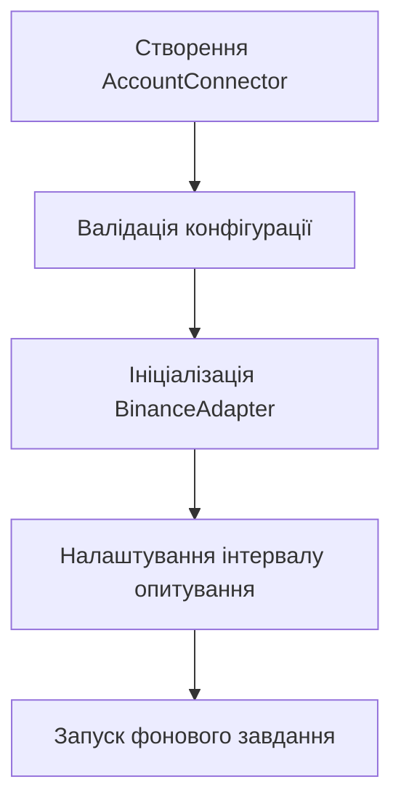
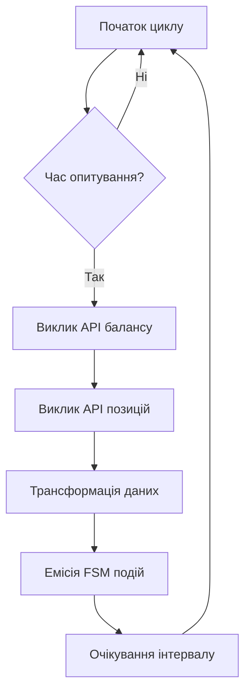
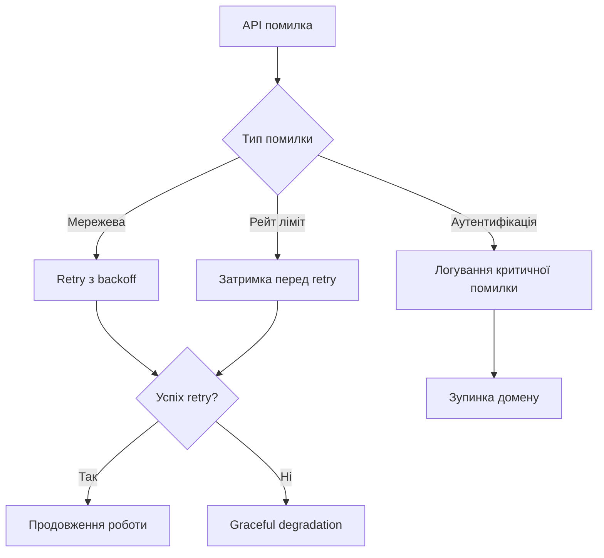
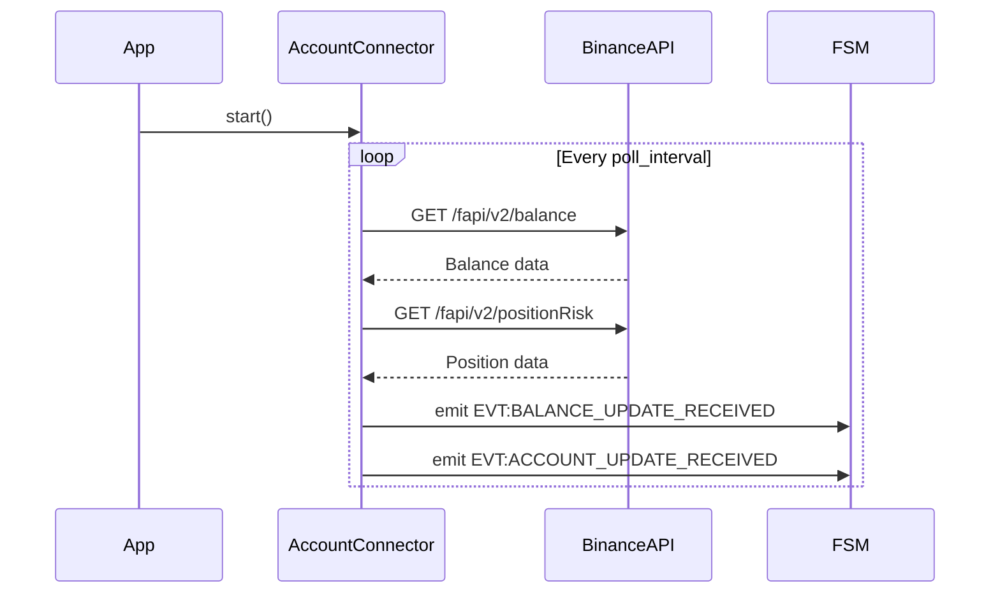

# Архітектурна схема домену Account Balance

## Загальна архітектура

Домен `account_balance` реалізує паттерн **Observer** для моніторингу стану рахунку Binance Futures. Архітектура побудована на принципах надійності, асинхронності та graceful degradation.

```
┌─────────────────┐    ┌──────────────────┐    ┌─────────────────┐
│   Binance API   │◄──►│  AccountConnector │◄──►│   FSM Events    │
│   (External)    │    │   (Core Logic)   │    │   (Internal)    │
└─────────────────┘    └──────────────────┘    └─────────────────┘
                              │
                              ▼
                       ┌──────────────────┐
                       │  Error Handling  │
                       │  & Recovery      │
                       └──────────────────┘
```

## Компоненти архітектури

### 1. AccountConnector (Головний клас)

**Відповідальність:**
- Управління життєвим циклом домену
- Координація API викликів
- Трансформація даних в події FSM

**Ключові методи:**
- `start()` - Ініціалізація та запуск моніторингу
- `stop()` - Graceful shutdown
- `_monitor_loop()` - Основний цикл моніторингу
- `_fetch_and_emit_account_data()` - Отримання та емісія даних

### 2. BinanceAdapter (Зовнішня залежність)

**Роль:** Адаптер для взаємодії з Binance Futures API

**Використовувані ендпоінти:**
- `GET /fapi/v2/balance` - Баланс активів
- `GET /fapi/v2/positionRisk` - Інформація про позиції

### 3. FSM Event System (Внутрішня комунікація)

**Генеровані події:**
- `EVT:BALANCE_UPDATE_RECEIVED`
- `EVT:ACCOUNT_UPDATE_RECEIVED`

## Робочі процеси

### Процес ініціалізації



### Основний цикл моніторингу



### Обробка помилок



## Структури даних

### Balance Data Structure
```python
@dataclass
class BalanceData:
    assets: List[AssetBalance]
    update_time: datetime

@dataclass
class AssetBalance:
    asset: str
    balance: Decimal
    cross_un_pnl: Decimal
    cross_wallet_balance: Decimal
    update_time: int
```

### Position Data Structure
```python
@dataclass
class PositionData:
    symbol: str
    position_amt: Decimal
    entry_price: Decimal
    unrealized_profit: Decimal
    leverage: int
    margin_type: str
    mark_price: Decimal
    liquidation_price: Decimal
```

## Конфігурація та параметри

### Режими роботи

#### Live Mode
```
Конфігурація: trading_mode = "live"
API: https://fapi.binance.com
Ключі: BINANCE_LIVE_API_KEY/SECRET
```

#### Testnet Mode
```
Конфігурація: trading_mode = "testnet"
API: https://testnet.binancefuture.com
Ключі: BINANCE_TESTNET_API_KEY/SECRET
```

#### Hybrid Mode
```
Конфігурація: trading_mode = "hybrid_live_data_testnet_exec"
Вибір API: Автоматичний залежно від домену
```

### Параметри моніторингу

```yaml
account_balance:
  poll_interval: 30          # Інтервал опитування (секунди)
  retry_attempts: 3          # Кількість повторів при помилці
  backoff_multiplier: 2.0    # Множник для експоненціального backoff
  timeout: 10               # Таймаут API викликів (секунди)
  max_concurrent_requests: 2 # Максимальна кількість паралельних запитів
```

## Продуктивність та SLA

### Цільові метрики
- **Доступність:** 99.9% (дозволені 8.76 годин простою на місяць)
- **Свіжість даних:** < 35 секунд (poll_interval + обробка)
- **Час відповіді API:** < 2 секунди median
- **Обробка помилок:** 100% (жодна помилка не повинна призвести до crash)

### Моніторинг продуктивності
- Response time API викликів
- Частота успішних оновлень
- Розмір payload подій
- Використання пам'яті та CPU

## Безпека та надійність

### Захист даних
- **Шифрування:** HTTPS для всіх API викликів
- **Аутентифікація:** HMAC-SHA256 signatures
- **Секрети:** Збереження в захищених змінних середовища
- **Аудит:** Логування всіх операцій без sensitive data

### Стратегії відновлення
1. **Transient failures:** Автоматичний retry з backoff
2. **Persistent failures:** Graceful degradation з останніми даними
3. **Data corruption:** Валідація та фільтрація некоректних даних
4. **Rate limiting:** Adaptive delays та queuing

## Тестування архітектури

### Інтеграційні тести
- **API Integration:** Мокування Binance API для тестування трансформації
- **FSM Integration:** Валідація емісії подій та їх споживання
- **Error Scenarios:** Симуляція мережевих помилок та API failures

### Performance Testing
- **Load Testing:** Симуляція високої частоти оновлень
- **Stress Testing:** Перевірка поведінки при API degradation
- **Memory Leak Testing:** Довготривалі тести на витік пам'яті

## Розширення та еволюція

### Можливі покращення
- **WebSocket Integration:** Перехід з REST на WS для real-time updates
- **Multi-Exchange Support:** Абстракція для підтримки інших бірж
- **Caching Layer:** Redis для кешування частих запитів
- **Batch Processing:** Групування запитів для оптимізації API calls

### Міграційні стратегії
- **Blue-Green:** Паралельний запуск старої та нової версій
- **Canary:** Постійне розгортання з поступовим збільшенням трафіку
- **Feature Flags:** Включення нових функцій через конфігурацію

## Діаграми послідовності

### Нормальний потік роботи


### Потік обробки помилок
```mermaid
sequenceDiagram
    participant AccountConnector
    participant BinanceAPI
    participant Logger
    participant FSM

    AccountConnector->>BinanceAPI: GET /balance
    BinanceAPI-->>AccountConnector: 500 Internal Error
    AccountConnector->>Logger: Log error
    AccountConnector->>AccountConnector: Retry with backoff
    Note over AccountConnector: After max retries
    AccountConnector->>FSM: Emit with last known data
    AccountConnector->>Logger: Warning about stale data
```</content>
<parameter name="filePath">c:\Users\job11\Music\Olimp_v1\docs\domains\account_balance\architecture.md