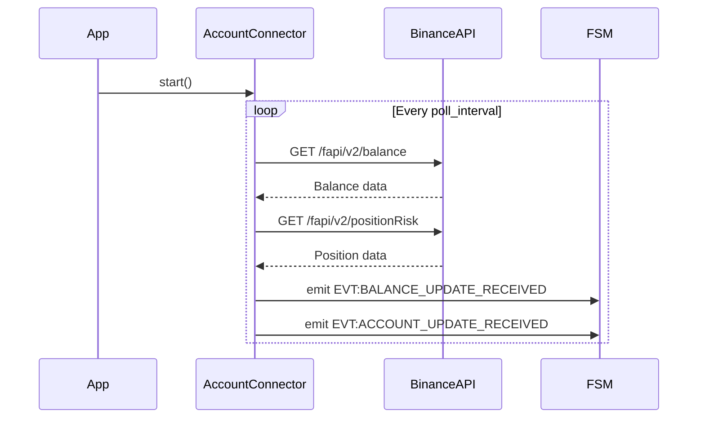

# –ê—Ä—Ö—ñ—Ç–µ–∫—Ç—É—Ä–Ω–∞ — —Ö–µ–º–∞ –¥–æ–º–µ–Ω—É Account Balance

## –ó–∞–≥–∞–ª—å–Ω–∞ –∞—Ä—Ö—ñ—Ç–µ–∫—Ç—É—Ä–∞

–î–æ–º–µ–Ω `account_balance` —Ä–µ–∞–ª—ñ–∑—É—î –ø–∞—Ç—Ç–µ—Ä–Ω **Observer** –¥–ª—è –º–æ–Ω—ñ—Ç–æ—Ä–∏–Ω–≥—É — —Ç–∞–Ω—É —Ä–∞—Ö—É–Ω–∫—É Binance Futures. –ê—Ä—Ö—ñ—Ç–µ–∫—Ç—É—Ä–∞ –ø–æ–±—É–¥–æ–≤–∞–Ω–∞ –Ω–∞ –ø—Ä–∏–Ω—Ü–∏–ø–∞—Ö –Ω–∞–¥—ñ–π–Ω–æ— —Ç—ñ, –∞— –∏–Ω—Ö—Ä–æ–Ω–Ω–æ— —Ç—ñ —Ç–∞ graceful degradation.

```
┌─────────────────┐    ┌──────────────────┐    ┌─────────────────┐
│   Binance API   │◄──►│  AccountConnector │◄──►│   FSM Events    │
│   (External)    │    │   (Core Logic)   │    │   (Internal)    │
└─────────────────┘    └──────────────────┘    └─────────────────┘
                              │
                              ▼
                       ┌──────────────────┐
                       │  Error Handling  │
                       │  & Recovery      │
                       └──────────────────┘
```

## –ö–æ–º–ø–æ–Ω–µ–Ω—Ç–∏ –∞—Ä—Ö—ñ—Ç–µ–∫—Ç—É—Ä–∏

### 1. AccountConnector (–ì–æ–ª–æ–≤–Ω–∏–π –∫–ª–∞— )

**–í—ñ–¥–ø–æ–≤—ñ–¥–∞–ª—å–Ω—ñ— —Ç—å:**
- –£–ø—Ä–∞–≤–ª—ñ–Ω–Ω—è –∂–∏—Ç—Ç—î–≤–∏–º —Ü–∏–∫–ª–æ–º –¥–æ–º–µ–Ω—É
- –ö–æ–æ—Ä–¥–∏–Ω–∞—Ü—ñ—è API –≤–∏–∫–ª–∏–∫—ñ–≤
- –¢—Ä–∞–Ω— —Ñ–æ—Ä–º–∞—Ü—ñ—è –¥–∞–Ω–∏—Ö –≤ –ø–æ–¥—ñ—ó FSM

**–ö–ª—é—á–æ–≤—ñ –º–µ—Ç–æ–¥–∏:**
- `start()` - –Ü–Ω—ñ—Ü—ñ–∞–ª—ñ–∑–∞—Ü—ñ—è —Ç–∞ –∑–∞–ø—É— –∫ –º–æ–Ω—ñ—Ç–æ—Ä–∏–Ω–≥—É
- `stop()` - Graceful shutdown
- `_monitor_loop()` - –û— –Ω–æ–≤–Ω–∏–π —Ü–∏–∫–ª –º–æ–Ω—ñ—Ç–æ—Ä–∏–Ω–≥—É
- `_fetch_and_emit_account_data()` - –û—Ç—Ä–∏–º–∞–Ω–Ω—è —Ç–∞ –µ–º—ñ— —ñ—è –¥–∞–Ω–∏—Ö

### 2. BinanceAdapter (–ó–æ–≤–Ω—ñ—à–Ω—è –∑–∞–ª–µ–∂–Ω—ñ— —Ç—å)

**–†–æ–ª—å:** –ê–¥–∞–ø—Ç–µ—Ä –¥–ª—è –≤–∑–∞—î–º–æ–¥—ñ—ó –∑ Binance Futures API

**–í–∏–∫–æ—Ä–∏— —Ç–æ–≤—É–≤–∞–Ω—ñ –µ–Ω–¥–ø–æ—ñ–Ω—Ç–∏:**
- `GET /fapi/v2/balance` - –ë–∞–ª–∞–Ω—  –∞–∫—Ç–∏–≤—ñ–≤
- `GET /fapi/v2/positionRisk` - –Ü–Ω—Ñ–æ—Ä–º–∞—Ü—ñ—è –ø—Ä–æ –ø–æ–∑–∏—Ü—ñ—ó

### 3. FSM Event System (–í–Ω—É—Ç—Ä—ñ—à–Ω—è –∫–æ–º—É–Ω—ñ–∫–∞—Ü—ñ—è)

**–ì–µ–Ω–µ—Ä–æ–≤–∞–Ω—ñ –ø–æ–¥—ñ—ó:**
- `EVT:BALANCE_UPDATE_RECEIVED`
- `EVT:ACCOUNT_UPDATE_RECEIVED`

## –†–æ–±–æ—á—ñ –ø—Ä–æ—Ü–µ— –∏

### –ü—Ä–æ—Ü–µ—  —ñ–Ω—ñ—Ü—ñ–∞–ª—ñ–∑–∞—Ü—ñ—ó



### –û— –Ω–æ–≤–Ω–∏–π —Ü–∏–∫–ª –º–æ–Ω—ñ—Ç–æ—Ä–∏–Ω–≥—É



### –û–±—Ä–æ–±–∫–∞ –ø–æ–º–∏–ª–æ–∫



## –°—Ç—Ä—É–∫—Ç—É—Ä–∏ –¥–∞–Ω–∏—Ö

### Balance Data Structure
```python
@dataclass
class BalanceData:
    assets: List[AssetBalance]
    update_time: datetime

@dataclass
class AssetBalance:
    asset: str
    balance: Decimal
    cross_un_pnl: Decimal
    cross_wallet_balance: Decimal
    update_time: int
```

### Position Data Structure
```python
@dataclass
class PositionData:
    symbol: str
    position_amt: Decimal
    entry_price: Decimal
    unrealized_profit: Decimal
    leverage: int
    margin_type: str
    mark_price: Decimal
    liquidation_price: Decimal
```

## –ö–æ–Ω—Ñ—ñ–≥—É—Ä–∞—Ü—ñ—è —Ç–∞ –ø–∞—Ä–∞–º–µ—Ç—Ä–∏

### –†–µ–∂–∏–º–∏ —Ä–æ–±–æ—Ç–∏

#### Live Mode
```
–ö–æ–Ω—Ñ—ñ–≥—É—Ä–∞—Ü—ñ—è: trading_mode = "live"
API: https://fapi.binance.com
–ö–ª—é—á—ñ: BINANCE_LIVE_API_KEY/SECRET
```

#### Testnet Mode
```
–ö–æ–Ω—Ñ—ñ–≥—É—Ä–∞—Ü—ñ—è: trading_mode = "testnet"
API: https://testnet.binancefuture.com
–ö–ª—é—á—ñ: BINANCE_TESTNET_API_KEY/SECRET
```

#### Hybrid Mode
```
–ö–æ–Ω—Ñ—ñ–≥—É—Ä–∞—Ü—ñ—è: trading_mode = "hybrid_live_data_testnet_exec"
–í–∏–±—ñ—Ä API: –ê–≤—Ç–æ–º–∞—Ç–∏—á–Ω–∏–π –∑–∞–ª–µ–∂–Ω–æ –≤—ñ–¥ –¥–æ–º–µ–Ω—É
```

### –ü–∞—Ä–∞–º–µ—Ç—Ä–∏ –º–æ–Ω—ñ—Ç–æ—Ä–∏–Ω–≥—É

```yaml
account_balance:
  poll_interval: 30          # –Ü–Ω—Ç–µ—Ä–≤–∞–ª –æ–ø–∏—Ç—É–≤–∞–Ω–Ω—è (— –µ–∫—É–Ω–¥–∏)
  retry_attempts: 3          # –ö—ñ–ª—å–∫—ñ— —Ç—å –ø–æ–≤—Ç–æ—Ä—ñ–≤ –ø—Ä–∏ –ø–æ–º–∏–ª—Ü—ñ
  backoff_multiplier: 2.0    # –ú–Ω–æ–∂–Ω–∏–∫ –¥–ª—è –µ–∫— –ø–æ–Ω–µ–Ω—Ü—ñ–∞–ª—å–Ω–æ–≥–æ backoff
  timeout: 10               # –¢–∞–π–º–∞—É—Ç API –≤–∏–∫–ª–∏–∫—ñ–≤ (— –µ–∫—É–Ω–¥–∏)
  max_concurrent_requests: 2 # –ú–∞–∫— –∏–º–∞–ª—å–Ω–∞ –∫—ñ–ª—å–∫—ñ— —Ç—å –ø–∞—Ä–∞–ª–µ–ª—å–Ω–∏—Ö –∑–∞–ø–∏—Ç—ñ–≤
```

## –ü—Ä–æ–¥—É–∫—Ç–∏–≤–Ω—ñ— —Ç—å —Ç–∞ SLA

### –¶—ñ–ª—å–æ–≤—ñ –º–µ—Ç—Ä–∏–∫–∏
- **–î–æ— —Ç—É–ø–Ω—ñ— —Ç—å:** 99.9% (–¥–æ–∑–≤–æ–ª–µ–Ω—ñ 8.76 –≥–æ–¥–∏–Ω –ø—Ä–æ— —Ç–æ—é –Ω–∞ –º—ñ— —è—Ü—å)
- **–°–≤—ñ–∂—ñ— —Ç—å –¥–∞–Ω–∏—Ö:** < 35 — –µ–∫—É–Ω–¥ (poll_interval + –æ–±—Ä–æ–±–∫–∞)
- **–ß–∞—  –≤—ñ–¥–ø–æ–≤—ñ–¥—ñ API:** < 2 — –µ–∫—É–Ω–¥–∏ median
- **–û–±—Ä–æ–±–∫–∞ –ø–æ–º–∏–ª–æ–∫:** 100% (–∂–æ–¥–Ω–∞ –ø–æ–º–∏–ª–∫–∞ –Ω–µ –ø–æ–≤–∏–Ω–Ω–∞ –ø—Ä–∏–∑–≤–µ— —Ç–∏ –¥–æ crash)

### –ú–æ–Ω—ñ—Ç–æ—Ä–∏–Ω–≥ –ø—Ä–æ–¥—É–∫—Ç–∏–≤–Ω–æ— —Ç—ñ
- Response time API –≤–∏–∫–ª–∏–∫—ñ–≤
- –ß–∞— —Ç–æ—Ç–∞ —É— –ø—ñ—à–Ω–∏—Ö –æ–Ω–æ–≤–ª–µ–Ω—å
- –†–æ–∑–º—ñ—Ä payload –ø–æ–¥—ñ–π
- –í–∏–∫–æ—Ä–∏— —Ç–∞–Ω–Ω—è –ø–∞–º'—è—Ç—ñ —Ç–∞ CPU

## –ë–µ–∑–ø–µ–∫–∞ —Ç–∞ –Ω–∞–¥—ñ–π–Ω—ñ— —Ç—å

### –ó–∞—Ö–∏— —Ç –¥–∞–Ω–∏—Ö
- **–®–∏—Ñ—Ä—É–≤–∞–Ω–Ω—è:** HTTPS –¥–ª—è –≤— —ñ—Ö API –≤–∏–∫–ª–∏–∫—ñ–≤
- **–ê—É—Ç–µ–Ω—Ç–∏—Ñ—ñ–∫–∞—Ü—ñ—è:** HMAC-SHA256 signatures
- **–°–µ–∫—Ä–µ—Ç–∏:** –ó–±–µ—Ä–µ–∂–µ–Ω–Ω—è –≤ –∑–∞—Ö–∏—â–µ–Ω–∏—Ö –∑–º—ñ–Ω–Ω–∏—Ö — –µ—Ä–µ–¥–æ–≤–∏—â–∞
- **–ê—É–¥–∏—Ç:** –õ–æ–≥—É–≤–∞–Ω–Ω—è –≤— —ñ—Ö –æ–ø–µ—Ä–∞—Ü—ñ–π –±–µ–∑ sensitive data

### –°—Ç—Ä–∞—Ç–µ–≥—ñ—ó –≤—ñ–¥–Ω–æ–≤–ª–µ–Ω–Ω—è
1. **Transient failures:** –ê–≤—Ç–æ–º–∞—Ç–∏—á–Ω–∏–π retry –∑ backoff
2. **Persistent failures:** Graceful degradation –∑ –æ— —Ç–∞–Ω–Ω—ñ–º–∏ –¥–∞–Ω–∏–º–∏
3. **Data corruption:** –í–∞–ª—ñ–¥–∞—Ü—ñ—è —Ç–∞ —Ñ—ñ–ª—å—Ç—Ä–∞—Ü—ñ—è –Ω–µ–∫–æ—Ä–µ–∫—Ç–Ω–∏—Ö –¥–∞–Ω–∏—Ö
4. **Rate limiting:** Adaptive delays —Ç–∞ queuing

## –¢–µ— —Ç—É–≤–∞–Ω–Ω—è –∞—Ä—Ö—ñ—Ç–µ–∫—Ç—É—Ä–∏

### –Ü–Ω—Ç–µ–≥—Ä–∞—Ü—ñ–π–Ω—ñ —Ç–µ— —Ç–∏
- **API Integration:** –ú–æ–∫—É–≤–∞–Ω–Ω—è Binance API –¥–ª—è —Ç–µ— —Ç—É–≤–∞–Ω–Ω—è —Ç—Ä–∞–Ω— —Ñ–æ—Ä–º–∞—Ü—ñ—ó
- **FSM Integration:** –í–∞–ª—ñ–¥–∞—Ü—ñ—è –µ–º—ñ— —ñ—ó –ø–æ–¥—ñ–π —Ç–∞ —ó—Ö — –ø–æ–∂–∏–≤–∞–Ω–Ω—è
- **Error Scenarios:** –°–∏–º—É–ª—è—Ü—ñ—è –º–µ—Ä–µ–∂–µ–≤–∏—Ö –ø–æ–º–∏–ª–æ–∫ —Ç–∞ API failures

### Performance Testing
- **Load Testing:** –°–∏–º—É–ª—è—Ü—ñ—è –≤–∏— –æ–∫–æ—ó —á–∞— —Ç–æ—Ç–∏ –æ–Ω–æ–≤–ª–µ–Ω—å
- **Stress Testing:** –ü–µ—Ä–µ–≤—ñ—Ä–∫–∞ –ø–æ–≤–µ–¥—ñ–Ω–∫–∏ –ø—Ä–∏ API degradation
- **Memory Leak Testing:** –î–æ–≤–≥–æ—Ç—Ä–∏–≤–∞–ª—ñ —Ç–µ— —Ç–∏ –Ω–∞ –≤–∏—Ç—ñ–∫ –ø–∞–º'—è—Ç—ñ

## –†–æ–∑—à–∏—Ä–µ–Ω–Ω—è —Ç–∞ –µ–≤–æ–ª—é—Ü—ñ—è

### –ú–æ–∂–ª–∏–≤—ñ –ø–æ–∫—Ä–∞—â–µ–Ω–Ω—è
- **WebSocket Integration:** –ü–µ—Ä–µ—Ö—ñ–¥ –∑ REST –Ω–∞ WS –¥–ª—è real-time updates
- **Multi-Exchange Support:** –ê–±— —Ç—Ä–∞–∫—Ü—ñ—è –¥–ª—è –ø—ñ–¥—Ç—Ä–∏–º–∫–∏ —ñ–Ω—à–∏—Ö –±—ñ—Ä–∂
- **Caching Layer:** Redis –¥–ª—è –∫–µ—à—É–≤–∞–Ω–Ω—è —á–∞— —Ç–∏—Ö –∑–∞–ø–∏—Ç—ñ–≤
- **Batch Processing:** –ì—Ä—É–ø—É–≤–∞–Ω–Ω—è –∑–∞–ø–∏—Ç—ñ–≤ –¥–ª—è –æ–ø—Ç–∏–º—ñ–∑–∞—Ü—ñ—ó API calls

### –ú—ñ–≥—Ä–∞—Ü—ñ–π–Ω—ñ — —Ç—Ä–∞—Ç–µ–≥—ñ—ó
- **Blue-Green:** –ü–∞—Ä–∞–ª–µ–ª—å–Ω–∏–π –∑–∞–ø—É— –∫ — —Ç–∞—Ä–æ—ó —Ç–∞ –Ω–æ–≤–æ—ó –≤–µ—Ä— —ñ–π
- **Canary:** –ü–æ— —Ç—ñ–π–Ω–µ —Ä–æ–∑–≥–æ—Ä—Ç–∞–Ω–Ω—è –∑ –ø–æ— —Ç—É–ø–æ–≤–∏–º –∑–±—ñ–ª—å—à–µ–Ω–Ω—è–º —Ç—Ä–∞—Ñ—ñ–∫—É
- **Feature Flags:** –í–∫–ª—é—á–µ–Ω–Ω—è –Ω–æ–≤–∏—Ö —Ñ—É–Ω–∫—Ü—ñ–π —á–µ—Ä–µ–∑ –∫–æ–Ω—Ñ—ñ–≥—É—Ä–∞—Ü—ñ—é

## –î—ñ–∞–≥—Ä–∞–º–∏ –ø–æ— –ª—ñ–¥–æ–≤–Ω–æ— —Ç—ñ

### –ù–æ—Ä–º–∞–ª—å–Ω–∏–π –ø–æ—Ç—ñ–∫ —Ä–æ–±–æ—Ç–∏


### –ü–æ—Ç—ñ–∫ –æ–±—Ä–æ–±–∫–∏ –ø–æ–º–∏–ª–æ–∫
```mermaid
sequenceDiagram
    participant AccountConnector
    participant BinanceAPI
    participant Logger
    participant FSM

    AccountConnector->>BinanceAPI: GET /balance
    BinanceAPI-->>AccountConnector: 500 Internal Error
    AccountConnector->>Logger: Log error
    AccountConnector->>AccountConnector: Retry with backoff
    Note over AccountConnector: After max retries
    AccountConnector->>FSM: Emit with last known data
    AccountConnector->>Logger: Warning about stale data
```</content>
<parameter name="filePath">c:\Users\job11\Music\Olimp_v1\docs\domains\account_balance\architecture.md