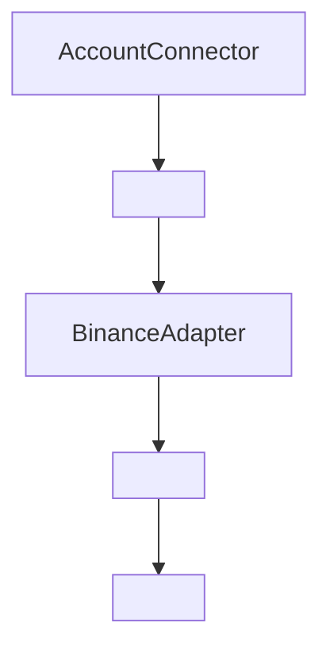
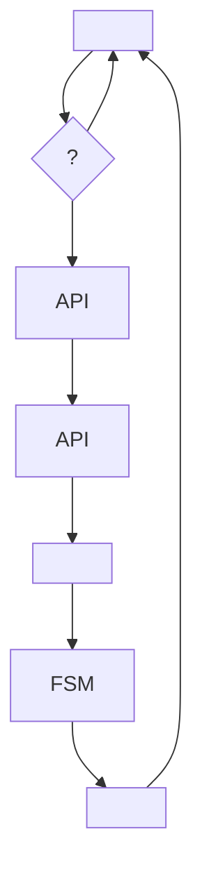
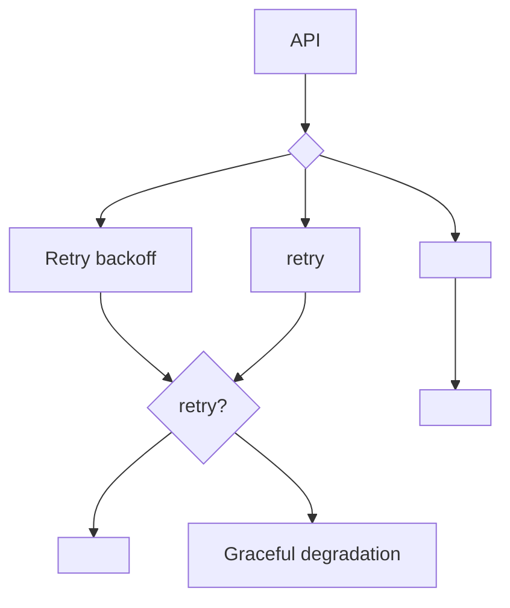
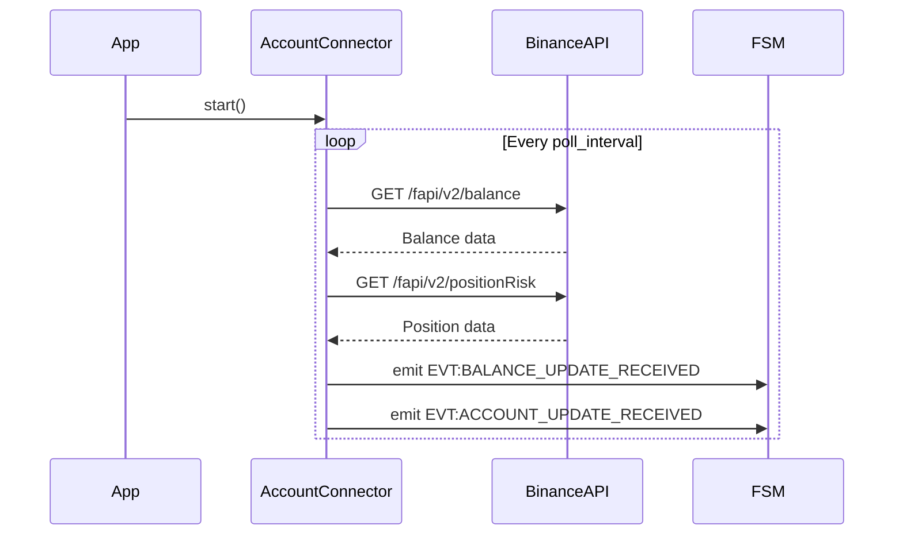

#                                                  Account Balance

##                                        

           `account_balance`                                 **Observer**                                                         Binance Futures.                                                                                         ,                                 graceful degradation.

```
                                                                                                                                                                                      
      Binance API                       AccountConnector                      FSM Events       
      (External)                 (Core Logic)                (Internal)       
                                                                                                                                                                                      
                                 
                                 
                                                                                   
                            Error Handling     
                            & Recovery         
                                                                                   
```

##                                            

### 1. AccountConnector (                         )

**                                :**
-                                                                
-                        API                 
-                                                     FSM

**                           :**
- `start()` -                                                                    
- `stop()` - Graceful shutdown
- `_monitor_loop()` -                                                 
- `_fetch_and_emit_account_data()` -                                                

### 2. BinanceAdapter (                                     )

**        :**                                             Binance Futures API

**                                                 :**
- `GET /fapi/v2/balance` -                            
- `GET /fapi/v2/positionRisk` -                                           

### 3. FSM Event System (                                         )

**                               :**
- `EVT:BALANCE_UPDATE_RECEIVED`
- `EVT:ACCOUNT_UPDATE_RECEIVED`

##                            

###                                        



###                                                 



###                              



##                              

### Balance Data Structure
```python
@dataclass
class BalanceData:
    assets: List[AssetBalance]
    update_time: datetime

@dataclass
class AssetBalance:
    asset: str
    balance: Decimal
    cross_un_pnl: Decimal
    cross_wallet_balance: Decimal
    update_time: int
```

### Position Data Structure
```python
@dataclass
class PositionData:
    symbol: str
    position_amt: Decimal
    entry_price: Decimal
    unrealized_profit: Decimal
    leverage: int
    margin_type: str
    mark_price: Decimal
    liquidation_price: Decimal
```

##                                                 

###                          

#### Live Mode
```
                        : trading_mode = "live"
API: https://fapi.binance.com
          : BINANCE_LIVE_API_KEY/SECRET
```

#### Testnet Mode
```
                        : trading_mode = "testnet"
API: https://testnet.binancefuture.com
          : BINANCE_TESTNET_API_KEY/SECRET
```

#### Hybrid Mode
```
                        : trading_mode = "hybrid_live_data_testnet_exec"
           API:                                                            
```

###                                          

```yaml
account_balance:
  poll_interval: 30          #                                       (              )
  retry_attempts: 3          #                                                          
  backoff_multiplier: 2.0    #                                                          backoff
  timeout: 10               #                API                  (              )
  max_concurrent_requests: 2 #                                                                                
```

##                                   SLA

###                              
- **                      :** 99.9% (                   8.76                                            )
- **                           :** < 35              (poll_interval +               )
- **                          API:** < 2                median
- **                             :** 100% (                                                                      crash)

###                                                  
- Response time API                 
-                                                 
-              payload           
-                                '            CPU

##                                         

###                        
- **                    :** HTTPS                 API                 
- **                            :** HMAC-SHA256 signatures
- **              :**                                                                               
- **          :**                                                     sensitive data

###                                          
1. **Transient failures:**                          retry    backoff
2. **Persistent failures:** Graceful degradation                                   
3. **Data corruption:**                                                                               
4. **Rate limiting:** Adaptive delays      queuing

##                                            

###                                    
- **API Integration:**                    Binance API                                                       
- **FSM Integration:**                                                                          
- **Error Scenarios:**                                                           API failures

### Performance Testing
- **Load Testing:**                                                                  
- **Stress Testing:**                                              API degradation
- **Memory Leak Testing:**                                                           '      

##                                           

###                                    
- **WebSocket Integration:**                   REST      WS        real-time updates
- **Multi-Exchange Support:**                                                                   
- **Caching Layer:** Redis                                                      
- **Batch Processing:**                                                                   API calls

###                                        
- **Blue-Green:**                                                                              
- **Canary:**                                                                                                      
- **Feature Flags:**                                                                                 

##                                            

###                                             


###                                         
```mermaid
sequenceDiagram
    participant AccountConnector
    participant BinanceAPI
    participant Logger
    participant FSM

    AccountConnector->>BinanceAPI: GET /balance
    BinanceAPI-->>AccountConnector: 500 Internal Error
    AccountConnector->>Logger: Log error
    AccountConnector->>AccountConnector: Retry with backoff
    Note over AccountConnector: After max retries
    AccountConnector->>FSM: Emit with last known data
    AccountConnector->>Logger: Warning about stale data
```</content>
<parameter name="filePath">c:\Users\job11\Music\Olimp_v1\docs\domains\account_balance\architecture.md