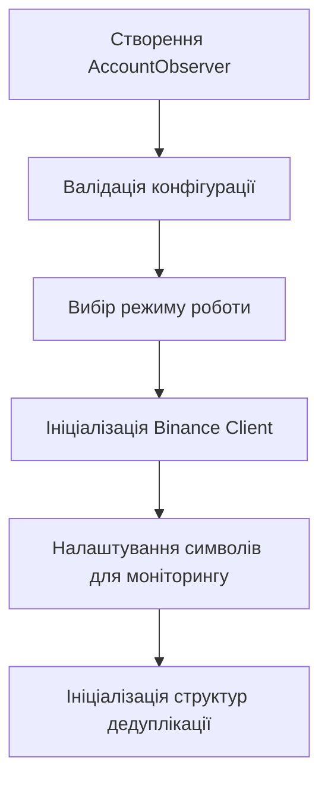
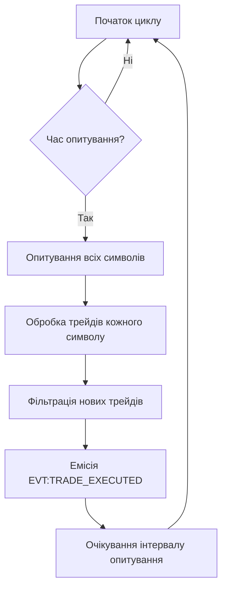
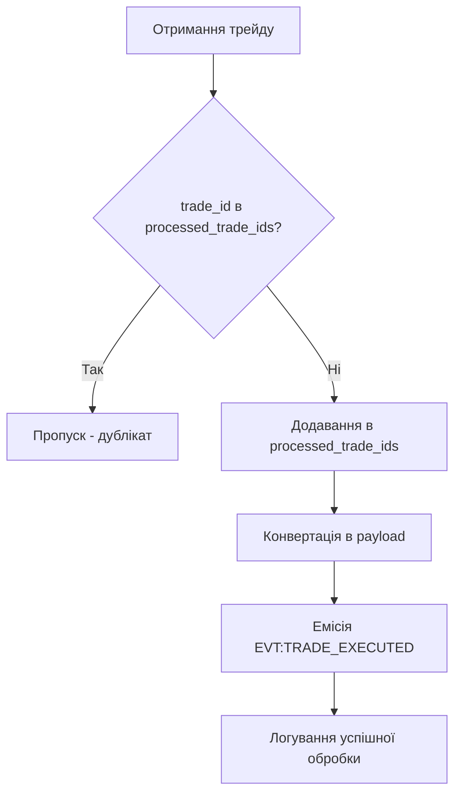
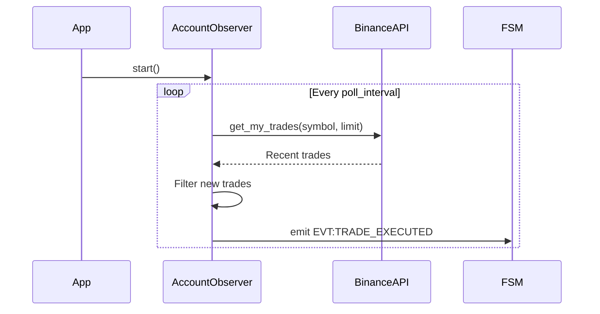

# Архітектурна схема домену Account Observer

## Загальна архітектура

Домен `account_observer` реалізує паттерн **Observer** для пасивного моніторингу торгової активності на Binance Futures. Архітектура побудована на принципах надійності, дедуплікації та асинхронної обробки.

```
┌─────────────────┐    ┌──────────────────┐    ┌─────────────────┐
│   Binance API   │◄──►│  AccountObserver │◄──►│   FSM Events    │
│   (Read-Only)   │    │   (Core Logic)   │    │   (Internal)    │
└─────────────────┘    └──────────────────┘    └─────────────────┘
                              │
                              ▼
                       ┌──────────────────┐
                       │  Deduplication   │
                       │   & Caching      │
                       └──────────────────┘
```

## Компоненти архітектури

### 1. AccountObserver (Головний клас)

**Відповідальність:**
- Управління життєвим циклом домену
- Координація API викликів для моніторингу трейдів
- Дедуплікація оброблених трейдів
- Емісія подій про нові торгові операції

**Ключові методи:**
- `__init__()` - Ініціалізація з конфігурацією та Binance клієнтом
- `start()` - Запуск фонового моніторингу
- `stop()` - Graceful shutdown
- `_poll_loop()` - Основний цикл опитування
- `_poll_trades()` - Отримання трейдів з API
- `_process_trades()` - Обробка та фільтрація трейдів
- `_trade_to_payload()` - Конвертація в payload події

### 2. Binance Client (Зовнішня залежність)

**Роль:** Клієнт для взаємодії з Binance Futures API (read-only)

**Використовувані методи:**
- `get_my_trades(symbol, limit)` - Отримання останніх трейдів для символу

### 3. Deduplication System (Внутрішня логіка)

**Механізм дедуплікації:**
- `processed_trade_ids: Set[int]` - множина оброблених ID трейдів
- Перевірка наявності trade_id перед обробкою
- Додавання в множину після успішної обробки

## Робочі процеси

### Процес ініціалізації



### Основний цикл моніторингу



### Обробка окремого трейду



## Структури даних

### Trade Data Structure (від Binance API)
```python
@dataclass
class BinanceTrade:
    symbol: str          # Торгова пара
    id: int             # Унікальний ID трейду
    orderId: int        # ID ордера
    price: str          # Ціна виконання
    qty: str            # Кількість
    quoteQty: str       # Загальна вартість
    commission: str     # Комісія
    commissionAsset: str # Актив комісії
    time: int           # Час виконання (ms)
    isBuyer: bool       # Напрямок (купівля/продаж)
    isMaker: bool       # Maker/Taker
    isBestMatch: bool   # Найкраще співпадання
```

### Event Payload Structure
```python
@dataclass
class TradeExecutedPayload:
    symbol: str         # Торгова пара
    side: str          # 'buy' або 'sell'
    price: str         # Ціна як рядок для точності
    quantity: str      # Кількість (від'ємна для продажу)
    ts: int            # Timestamp в мілісекундах
    fees: str          # Комісія як рядок
    venue: str         # 'binance'
```

## Конфігурація та параметри

### Режими роботи

#### Live Mode
```
Конфігурація: trading_mode = "live"
API: Binance Live (mainnet)
Ключі: BINANCE_LIVE_API_KEY/SECRET
Символи: Реальні торгові пари
```

#### Testnet Mode
```
Конфігурація: trading_mode = "testnet"
API: Binance Testnet
Ключі: BINANCE_TESTNET_API_KEY/SECRET
Символи: Тестові торгові пари
```

#### Hybrid Mode
```
Конфігурація: trading_mode = "hybrid_*"
Автоматичний вибір залежно від контексту
```

### Параметри моніторингу

```yaml
account_observer:
  poll_interval: 5        # Інтервал опитування (секунди)
  symbols:                # Список символів для моніторингу
    - BTCUSDT
    - ETHUSDT
    - BNBUSDT
  trade_limit: 50        # Кількість трейдів для отримання за раз
```

## Продуктивність та SLA

### Цільові метрики
- **Свіжість даних:** < 35 секунд (poll_interval + обробка)
- **Дедуплікація:** 100% (жодних дублікатів подій)
- **Доступність:** 99.5% (допустимі 3.65 години простою на місяць)
- **Час відповіді API:** < 5 секунд median

### Моніторинг продуктивності
- Кількість опитувань за хвилину
- Розмір відповідей API
- Час обробки трейдів
- Використання пам'яті для кешу ID

## Безпека та надійність

### Захист даних
- **Read-only ключі:** Тільки для читання, без можливості торгівлі
- **Мінімальні дозволи:** Доступ тільки до власних трейдів
- **HTTPS:** Всі API виклики через захищений протокол

### Стратегії відновлення
1. **API помилки:** Продовження з іншими символами
2. **Мережеві проблеми:** Повтор при наступному циклі
3. **Парсинг помилки:** Логування та пропуск проблемних трейдів
4. **Memory leaks:** Обмеження розміру кешу processed_trade_ids

## Тестування архітектури

### Інтеграційні тести
- **API Integration:** Мокування Binance API для тестування отримання трейдів
- **FSM Integration:** Валідація емісії подій та їх споживання
- **Deduplication:** Тестування логіки уникнення дублікатів

### Performance Testing
- **Load Testing:** Симуляція великої кількості трейдів
- **Memory Testing:** Перевірка витіків пам'яті при довготривалій роботі
- **Concurrency Testing:** Перевірка потокобезпечності

## Розширення та еволюція

### Можливі покращення
- **WebSocket Integration:** Перехід з polling на real-time updates
- **Multi-Exchange Support:** Підтримка інших бірж
- **Advanced Filtering:** Фільтрація трейдів за часом, символом, розміром
- **Batch Processing:** Групова обробка трейдів для оптимізації

### Міграційні стратегії
- **Gradual Rollout:** Постійне розгортання з моніторингом дедуплікації
- **A/B Testing:** Порівняння старих та нових версій
- **Feature Flags:** Включення нових функцій через конфігурацію

## Діаграми послідовності

### Нормальний потік роботи


### Потік обробки дублікатів
```mermaid
sequenceDiagram
    participant AccountObserver
    participant Cache
    participant FSM

    AccountObserver->>Cache: Check trade_id
    Cache-->>AccountObserver: Not processed
    AccountObserver->>Cache: Add trade_id
    AccountObserver->>FSM: emit EVT:TRADE_EXECUTED
    Note over Cache: Trade marked as processed
```</content>
<parameter name="filePath">c:\Users\job11\Music\Olimp_v1\docs\domains\account_observer\architecture.md